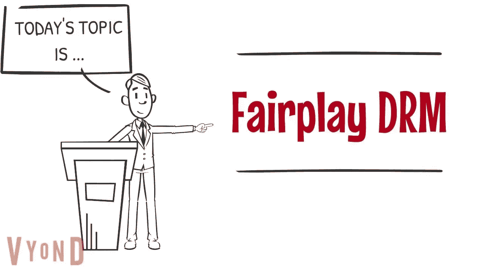
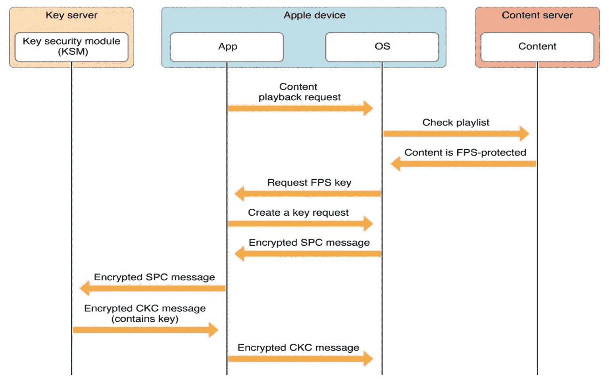

# 使用 AVFoundation 和 AVPlayer 播放 Azure Media Services Fairplay HLS 流

> 原文：<https://blog.devgenius.io/playing-azure-media-services-fairplay-hls-stream-using-avfoundation-and-avplayer-5bdefe36cd56?source=collection_archive---------7----------------------->



Credits，[https://www . vdocipher . com/blog/fair play-DRM-IOs-safari-html 5/](https://www.vdocipher.com/blog/fairplay-drm-ios-safari-html5/)

你好，这是一个使用 AVFoundation 和 AVPlayer 播放 Azure Media Services Fairplay HLS 流的简单而最小的代码示例。

首先，我们应该先快速了解一下公平竞赛。

Fairplay 是苹果公司使用的 DRM 方案，旨在加密 HLS (HTTP 直播流)流。现在，开始着手研究它在媒体播放器上到底是如何工作的，因为我们需要对这个过程有一个清晰的理解。

# 所以，分步骤打破它:

**步骤 1** :应用程序(iOS)代码将为本地播放器提供一个音频或视频流(基本上我们在这里给出了 AVPlayer 的清单 URL)。

**步骤 2** :如果流受到保护，本地播放器将读取清单 URL 并返回到应用程序。(这里，将在应用程序代码中调用实现的 AVAssetResourceLoaderDelegate 协议方法)

**步骤 3** :现在，应用程序代码将使用公平播放应用程序证书数据和内容 ID 向操作系统请求服务器回放上下文(SPC)。

**步骤 4** :生成的 SPC 上传到密钥服务器模块(KSM)服务器。

**步骤 5** :如果 SPC 是正确的，那么 KSM 将以内容密钥上下文(CKC)进行响应。该接收到的 CKC 然后被发送回本地播放器以解密和播放视频或音频流。



公平竞争的 DRM 流程图。资料来源:apple.com

以上步骤几乎都是为了在苹果设备上播放 Fairplay HLS 流。现在我们将看到我们将如何确切地执行这些步骤。

完成此过程所需物品的快速列表:

1.HLS 流的清单 URL。

2.内容提供商的公平竞争申请证书。

3.内容标识符。

4.密钥服务器模块或 DRM 服务器 URL 或 LA URL。

## **需要注意的一点是，Fairplay HLS 流媒体只能在真实的 Apple 设备上运行，而不能在模拟器上运行。**

上面的一些示例数据，如清单或流 URL、KSM 或 LA URL，可以在 Microsoft doc 下面找到

[https://docs . Microsoft . com/en-us/azure/media-services/previous/hybrid-design-DRM-syb system](https://docs.microsoft.com/en-us/azure/media-services/previous/hybrid-design-drm-sybsystem)

在下面的例子中，为了更好地理解，我将使用来自上述来源的样本数据。

# **让我们开始建造**

**第一步:设置 AVPlayer。**

这里我们将为 AVPlayer 提供一个清单 URL。

```
let streamingURL = URL(string:“ ht[tps://willzhanmswest.streaming.mediaservices.windows.net/1efbd6bb-1e66-4e53-88c3-f7e5657a9bbd/RussianWaltz.ism/manifest(format=m3u8-aapl)](https://willzhanmswest.streaming.mediaservices.windows.net/1efbd6bb-1e66-4e53-88c3-f7e5657a9bbd/RussianWaltz.ism/manifest(format=m3u8-aapl))“)!
let fpPlayerAsset = AVURLAsset(url: streamingURL)
let fpPlayerItem = AVPlayerItem(asset: fpPlayerAsset)
let fpPlayer = AVPlayer(playerItem: fpPlayerItem)fpPlayer.play()
```

第二步:采用 AVAssetResourceLoaderDelegate 协议。

这里我们将采用 AVAssetResourceLoaderDelegate 协议并实现该方法

```
func resourceLoader(_ resourceLoader: AVAssetResourceLoader, shouldWaitForLoadingOfRequestedResource loadingRequest: AVAssetResourceLoadingRequest) -> Bool
```

一旦 AVPlayer 试图播放加密流，就会触发此方法。在这种方法中，我们将进一步努力。

**步骤 3:获取服务器回放上下文(SPC)**

在这一步中，我们将使用 Fairplay 应用程序证书和内容 ID 获取 SPC。

为了简单起见，我从 app bundle 加载 Fairplay 应用程序证书，但是最好建议从安全服务器加载证书。

就内容 ID 而言，它是从 KSM/LA URL(" https://【willzhanmswest.keydelivery.mediaservices.windows.net/fair play/？kid = ba 7 e 8 FB 0-ee22-4291-9654-6222 AC 611 BD 8 "，此示例 URL 取自上述 Microsoft docs 示例)。对于我们的案例，即 Azure Media Services，它是上述 URL 的粗体部分，对于其他案例，它可能会有所不同。

**第四步:将 SPC 上传到 CKC 服务器，并将 CKC 发送回 AVPlayer。**

现在，在获得 SPC 之后，我们需要将它发送到 CKC 服务器(DRM 服务器)以取回 CKC，这将允许 AVPlayer 最终解密该流并播放它。这里，CKC 的 URL 与上面描述的洛杉矶的 URL 相同。以下代码片段从 Azure 媒体服务 CKC 服务器获取 CKC(基于[https://docs . Microsoft . com/en-us/Azure/Media-services/previous/Media-services-protect-HLS-with-offline-fair play](https://docs.microsoft.com/en-us/azure/media-services/previous/media-services-protect-hls-with-offline-fairplay)中提供的代码片段)。

这里需要注意的一件重要事情是，你还需要在“授权”头字段中发送 JWT，这是一个非常重要的部分，在弄清楚这一点之前，我花了至少一天的时间。

如果一切顺利，我相信如果你遵循正确的，你会得到 CKC，我们可以发送回 AVPlayer 开始播放。

请检查此 [**区**](https://gist.github.com/jatinmishra/7cb0e8be239758cb6422e74817a671bb) ，以获得完整的代码。

感谢 Jelle Vandebeeck 的这篇文章，它对我帮助很大。😊

[https://ICA PPS . com/blog/how-integrate-basic-HLS-stream-fair play](https://icapps.com/blog/how-integrate-basic-hls-stream-fairplay)

也请查看他的帖子。

感谢阅读！！！


由 [Kelly Sikkema](https://unsplash.com/@kellysikkema?utm_source=medium&utm_medium=referral) 在 [Unsplash](https://unsplash.com?utm_source=medium&utm_medium=referral) 上拍摄的照片