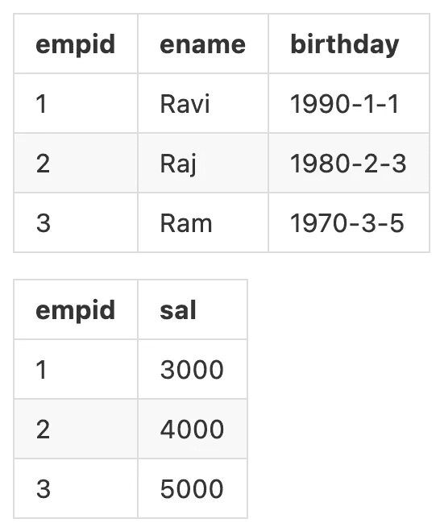
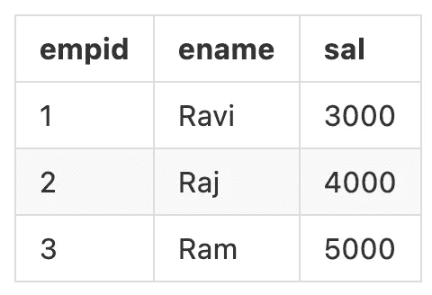
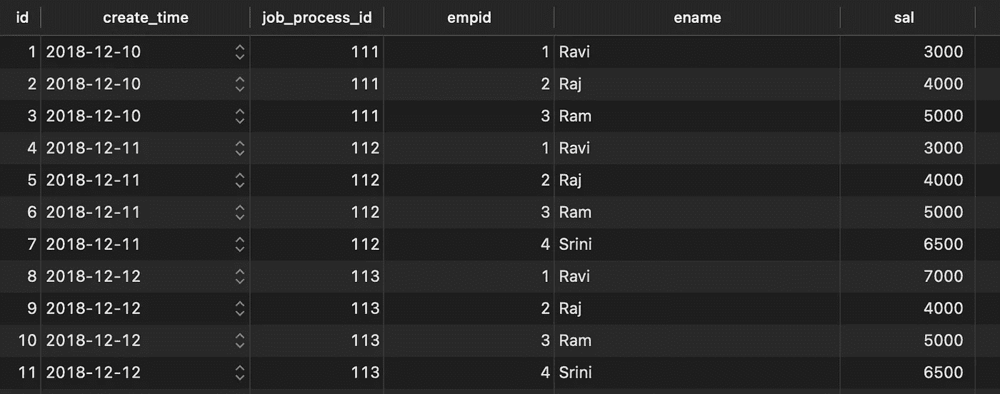
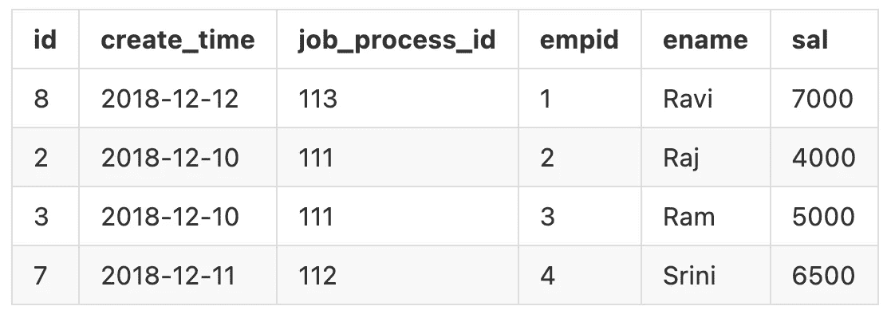
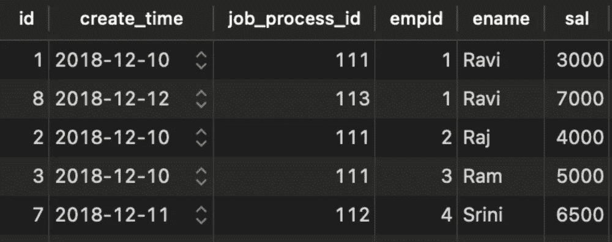
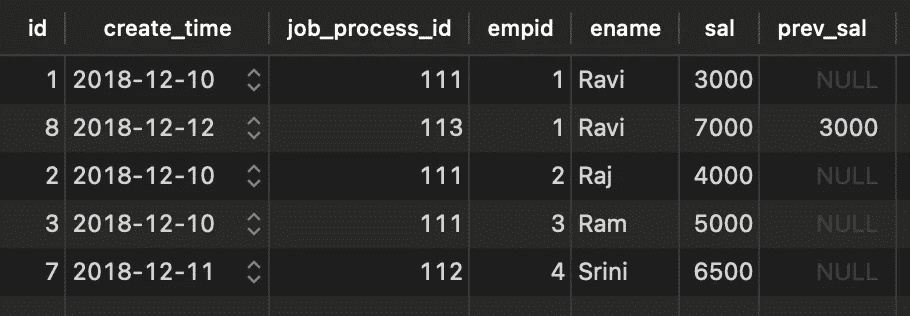

# 在 Postgres 中播放窗口函数

> 原文：<https://blog.devgenius.io/playing-window-function-in-postgres-1eb7bb781f8e?source=collection_archive---------12----------------------->

## 演示 SQL 窗口函数的一些常见做法


照片由 [R 莫](https://unsplash.com/@mooo3721)在 [Unsplash](https://unsplash.com/photos/w-_iZqdviAo) 上拍摄

做 ETL 的时候，我们总是一批一批的往数据库里写数据，里面包含了每一批的快照。这些快照基本上都是历史数据，可能包含大量的重复，那么我们如何在这些批次中找到我们需要的数据呢？

本文将用一个简单的场景来描述我们常用的一些处理方法，主要是[窗口函数](https://www.postgresql.org/docs/current/tutorial-window.html)。

# 用户场景

假设一家公司使用 BPM 系统来管理员工变动和工资变动，那么一个简单的 BPM 系统通常会有两个表，分别包含员工的详细信息和每个人的工资，如下所示。



当使用关系数据库时，我们通常将数据规范化，也就是说，我们根据需求维度来规划表，并且只保留必要的字段，这些字段通过外键相互关联。

但是在数据分析上下文中，我们经常需要一个事实表，这意味着所有的东西都聚集在一起。用于工资分析的事实表示例如下。



聚合中的常见做法是批处理 ETL，每次都从雇员详细信息表和薪金表中提取所需的列，并保存下来供以后分析，如薪金增长趋势。ETL 聚合后的事实表如下。



这是一个以天为单位进行批处理的 ETL，每天都会对两个表进行汇总，所以会有`job_process_id`进行批处理和`create_time`进行数据创建。

下面是示例中使用的 SQL。

```
CREATE TABLE "public"."cdc_test" (
	"id" serial NOT NULL,
	"create_time" DATE NOT NULL,
	"job_process_id" INT NOT NULL,
	"empid" INT NOT NULL,
	"ename" VARCHAR(100) NOT NULL,
	"sal" INT NOT NULL,
	PRIMARY KEY ("id")
);

INSERT INTO "public"."cdc_test" ("id", "create_time", "job_process_id", "empid", "ename", "sal") VALUES
(1, '2018-12-10', 111, 1, 'Ravi', 3000),
(2, '2018-12-10', 111, 2, 'Raj', 4000),
(3, '2018-12-10', 111, 3, 'Ram', 5000),
(4, '2018-12-11', 112, 1, 'Ravi', 3000),
(5, '2018-12-11', 112, 2, 'Raj', 4000),
(6, '2018-12-11', 112, 3, 'Ram', 5000),
(7, '2018-12-11', 112, 4, 'Srini', 6500),
(8, '2018-12-12', 113, 1, 'Ravi', 7000),
(9, '2018-12-12', 113, 2, 'Raj', 4000),
(10, '2018-12-12', 113, 3, 'Ram', 5000),
(11, '2018-12-12', 113, 4, 'Srini', 6500);
```

在这个例子中，有两个状态变化。

1.  Srini 于 2018 年 12 月 11 日上船。
2.  Ravi 在 2018-12-12 获得加薪。

# 获取最新状态

从上图可以看出，ETL 生成的事实表会包含大量重复数据，如果我们需要了解当前状态并排除重复，怎么办？这就是窗口功能发挥作用的地方。

```
SELECT
  t.*
FROM (
  SELECT
    cdc_test.*,
    (ROW_NUMBER() OVER (PARTITION BY empid,
      ename ORDER BY create_time DESC)) AS seqnum
  FROM
    cdc_test) t
WHERE
  t.seqnum = 1;
```

通过使用`PARTITION BY`锁定固定列`(empid, ename)`，并将时间逆序排序，我们可以知道第一个将是最新的状态。

结果如下。



# 获取每个薪金的变化

有了最新状态，我们通常还是想了解每一次薪资变动。我们仍然可以通过窗口功能来实现我们的目标。

```
SELECT
  t.*
FROM (
  SELECT
    cdc_test.*,
    (ROW_NUMBER() OVER (PARTITION BY empid,
      ename,
      sal ORDER BY create_time)) AS seqnum
  FROM
    cdc_test) t
WHERE
  t.seqnum = 1
```

这一次，我们用`PARTITION BY`来锁定的目标是`(empid, ename, sal)`，因为我们要把相同的三列视为同一个组，那么一旦`sal`发生变化就会创建一个新的组。



从结果中，我们可以看到 Ravi 得到了一次加薪，从 3000 到 7000。

# 获取每个薪金的变化并包括加薪前的结果

在上面两个例子中，我们只使用了`ROW_NUMBER()`，但实际上在窗口函数中还有很多其他函数可用。

这一次，我们不仅希望得到工资变动情况，还希望查询结果包含加薪前的列，因此可以使用`LAG()`。

```
SELECT
  t.*
FROM (
  SELECT
    cdc_test.*,
    (LAG(sal) OVER (PARTITION BY empid,
      ename ORDER BY create_time)) AS prev_sal
  FROM
    cdc_test) t
WHERE
  prev_sal IS NULL
  OR prev_sal <> sal;
```

与上面类似，只是使用了另一个窗口函数，并且改变了`WHERE`子句。



现在我们可以看到一个新的列。

# 参考

[](https://stackoverflow.com/questions/53729837/how-to-select-only-incremental-records-in-big-query) [## 如何在大查询中只选择增量记录

### 我有一个数据在我的数据库中，如下，我期待的结果一样，有人可以请帮我如何写…

stackoverflow.com](https://stackoverflow.com/questions/53729837/how-to-select-only-incremental-records-in-big-query)