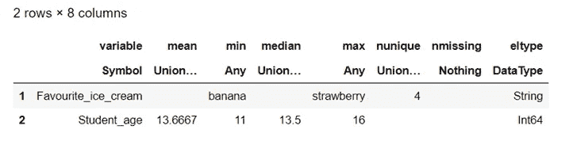

# 使用数据框架. jl 第一部分

> 原文：<https://blog.devgenius.io/playing-with-dataframes-jl-part-i-44fd01b985d5?source=collection_archive---------7----------------------->


考特尼·库克在 [Unsplash](https://unsplash.com/s/photos/ice-cream?utm_source=unsplash&utm_medium=referral&utm_content=creditCopyText) 上的照片

**简介**

本文旨在展示 Julia 中的 [DataFrames.jl](https://dataframes.juliadata.org/stable/#DataFrames.jl) 包为您带来的一些可能性(一些关于 DataFrames 的重要知识)。当然还有更多。为此，我将准备第二部分(也许还有第三部分)。

**关于 DataFrames.jl 包**

DataFrames.jl 提供了一组在 Julia 中处理表格式数据的工具，类似于 Python 中的 pandas。从长远来看，这一方案显然是我们分析的一部分。

**内容**

*   包的安装和使用
*   创建数据框架(4 种方式)
*   打印数据帧的第一/最后一行
*   获取描述符
*   获取特定列的描述符
*   获取每列中的唯一值
*   获取变量(列)名
*   获取列类型(双向)
*   获取数据帧的大小
*   获取列的大小(三种方式)
*   获取行的大小(3 种方式)
*   更改显示的默认行数
*   更改显示的默认列数
*   遍历每一列
*   遍历每行
*   打印特定列(双向)
*   以符号形式获取列名
*   清空数据框
*   选择特定的行/列
*   查看特定的行/列
*   替换列的值
*   替换特定值
*   插入列
*   删除列
*   删除具有首选特征的列中的特定行

**包装安装和使用**

```
#Installation
using Pkg
Pkd.add("DataFrames")#Use 
using DataFrames
```

我们已经准备好使用 DataFrames.jl 包了！

**创建一个数据框架(4 种方式)**

🔹第一种方式

```
#Creating a simple dataframe
DataFrame(A = 1:5, B = 10:14, C = 2)
```


答:输入从 1 到 5 的数字(1，2，3，4，5)。

b:把数字从 10 放到 14 (10，11，12，13，14)。

c:在该列(所有行)中填入数字 2。

Attention❗️A、b 和 c 必须在相同的维度上。

🔹第二条路

```
DataFrame((names = ["Maria", "Nick", "Laura"], age = [25, 28, 22]))
```


🔹第三种方式

```
DataFrame([(names = "Maria", age = 25), (names = "Nick", age = 28),(names = "Laura", age = 22)])
```


🔹第四种方式

```
df = DataFrame(
Favourite_ice_cream = ["banana", "pistachio", "chocolate", "strawberry", "chocolate", "chocolate"],
Student_age = [15, 13, 14, 16, 13, 11],
Student_name = ["Nick", "Maria", "Jo", "Lola", "Maria", "John"],
Gender = ["Male", "Female", "Female", "Female", "Female", "Male"])
```


我把这个数据帧命名为 df，这样我们就可以玩它了。

**打印数据帧的第一/最后一行**

```
#Print the first two rows
first(df,2)
```


```
#Print the last two rows
last(df,2)
```


**获取描述符**

```
#Get the descriptives
describe(df)
```


✏️Note:它对分类变量没有任何意义。

**获取特定列的描述符**

```
#Get the descriptives for specific columns
describe(df, cols=1:2)
```



例如，我选择了第 1 列和第 2 列(Favourite _ ice _ cream 和 Student_age)。

**获取每列的唯一值**

```
#Print the unique values in each column
[unique(c) for c in eachcol(df)]
```


唯一值是我们的数据帧的值，不管它们在我们的数据帧中出现的频率如何。例如，值“巧克力”在我们的数据帧中出现了三次，但是值是相同的，即“巧克力”。

**获取变量(列)名**

```
names(df)
```


**获取列类型**

🔹第一种方式

```
[eltype(col) for col = eachcol(df)]
```


🔹第二条路

```
eltype.(eachcol(df))
```

**获取数据帧的大小**

```
size(df)
```


我们的数据帧有 6 行 4 列。

**获取列的大小(3 种方式)**

🔹第一种方式

```
size(df)[2]
```

🔹第二条路

```
size(df, 2)
```

🔹第三种方式

```
ncol(df)
```

**获取行的大小(3 种方式)**

🔹第一种方式

```
size(df)[1]
```

🔹第二条路

```
size(df, 1)
```

🔹第三种方式

```
nrow(df)
```

**改变显示的默认行数**

```
#Change the default number of rows/lines shown
ENV["LINES"] = 2
```


我选了两个，不过你可以随便选。在我们的例子中，输出只显示了前两行和所有的列。

**更改显示的默认列数**

```
#Change the default number of columns shown
ENV["COLUMNS"] = 100
```

如果需要，输入一个较大的数字，尤其是在大数据帧中(例如 5000x12)，以获得无遗漏的所有列。

在我们的例子中，输出显示了我们所有的列。

**遍历每一列**

```
#Iterates over each column
for c in eachcol(df)
    println("I love chocolate!")
end
```

对于我们数据框的每一列(4 次)，打印“我爱巧克力”。


**遍历每一行**

```
#Iterates over each row
for r in eachrow(df)
    println("I love chocolate!")
end
```


对于我们的数据帧的每一行(6 次)，打印“我爱巧克力”。

**打印特定列(2 种方式)**

🔹第一种方式

```
df.Student_name
```

我选择希望看到 Student_name 列。


🔹第二条路

```
df[!, :Gender]
```

我选择我想看性别栏。


**获取列名作为符号**

```
propertynames(df)
```


**清空数据框**

```
empty!(df)
```


**选择特定的行/列**

我只想要两列:性别和学生姓名。

在这两列中，我只需要从 1 到 3 的行。

```
df[1:3, [:Gender, :Student_name]]
```


我不选择列(我想要所有的列)，但我只选择前三行。

```
df[1:3, :]
```


同样，我不关心列(我想要所有的列)，但我只想要第一、第三和第五行。

```
df[[1, 3, 5], :]
```


现在，我只想要性别和 Favourite _ ice _ cream 这两列，但我不关心行(我想要所有的行)。

```
df[:, [:Gender, :Favourite_ice_cream]]
```


我想将性别列作为数据框对象，将同一列作为向量。

```
#returns data frame object 
df[!, [:Gender]]
```


```
#returns a vector
df[!, :Gender]
```


❗️Pay 注意到了这种差异。

我需要第二列第三行的值。

```
df[3, 2]
```


我不在乎列数，但我只想要第六行。

```
df[6, :]
```


选择从学生年龄开始到性别结束的列。

```
df[:, Between(:Student_age, :Gender)]
```


**查看特定行/列**

查看从第一列到第三列的所有行。

```
view(df, :, 1:3)
```


查看前三列的前两行。

```
view(df, 1:2, 1:3)
```


**替换一列的值**

🔹第一种方式

首先，我用我想要的名字创建一个六元素向量。

然后，我用新值替换现有的列(我希望我的列的名称保持不变)。

```
new_names = ["Steve",
"Elizabeth",
"Julia",
"Steve",
"Eric",
"Martha"]df.Student_name = new_names
```


🔹第二条路

它与上面的方法相同，但是这里不需要创建新的向量。

```
df[!, :Gender] = ["male", "female", "female", "transgender", "female", "other"]#or
df[:, :Gender] .= ["male", "female", "female", "transgender", "female", "other"]
```


**替换特定值**

在第二行中，我想对从 1 到 3 的列应用更改。

```
df[2, 1:3] = ["caramel", 33, "Helen"]
```


在 Favourite _ ice _ cream 列中，我想更改前两种冰淇淋口味(前两个值)。

```
df[1:2, :Favourite_ice_cream] = ["watermelon", "vanilla"]
```


在“学生年龄”列中，用 23 替换 2 到 5 之间的值。

```
df.Student_age[2:5] .= 23
```

**插入列**

插入名为 Fav_food 的新的第五列，并用 Pizza 填充所有值。

```
insertcols!(df, 5, :Fav_food => "Pizza")
```


**删除栏目**

现在，我想删除上面创建的列。

```
df[:, Not(:Fav_food)]
```

**删除具有首选特征的列中的特定行**

我想从名称中有“G”的列中删除第六行。

```
df[Not(6), r"G"]
```


**结论**

我们看到了 DataFrames.jl 包中的一些选项。

我将带着第二部分回来。

敬请期待！

感谢您的阅读！🤗