# 玩弄数据框架. jl 第二部分

> 原文：<https://blog.devgenius.io/playing-with-dataframes-jl-part-ii-260748a49dc6?source=collection_archive---------2----------------------->


考特尼·库克在 [Unsplash](https://unsplash.com/s/photos/ice-cream?utm_source=unsplash&utm_medium=referral&utm_content=creditCopyText) 上的照片

**简介**

本文旨在展示 Julia 中的 [DataFrames.jl](https://dataframes.juliadata.org/stable/#DataFrames.jl) 包为您带来的一些可能性(一些关于 DataFrames 的重要知识)。当然还有更多。你可以在这里找到第一部分。

**内容**

*   逐列创建数据帧
*   逐行创建数据帧
*   创建数据框架的另一种方法(带有趣的练习🍧)
*   获取值的特定子集
*   基于条件选择行
*   逐行转换列
*   使用现有列的转换创建新列
*   将函数应用于列
*   排序列
*   更改特定索引
*   替换特定索引
*   删除缺少的值
*   连接

**不要忘记使用您想要的包(在我们的例子中是:DataFrames)**

```
using DataFrames
```

**逐列创建数据帧**

让我们创建一个空的数据帧

```
df1=DataFrame()
```

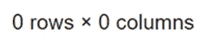

创建第一列

```
df1.Favourite_ice_cream = ["banana","pistachio","chocolate","strawberry","chocolate","chocolate","mint","caramel","vanilla","vanilla"]
```


创建第二列

```
df1.Student_name = ["Nick","Maria","Jo","Lola","Maria","John","Helen","Mike","Steve","Harry"]
```

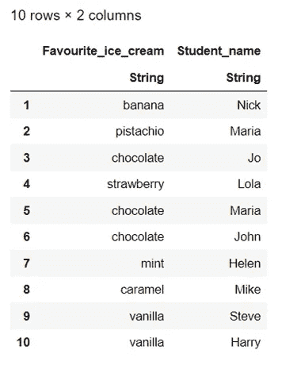

准备好了。

**逐行创建数据帧**

我们将创建一个包含空列的数据帧。

```
df2 = DataFrame(Favourite_ice_cream = String[], Student_age = Int[])
```

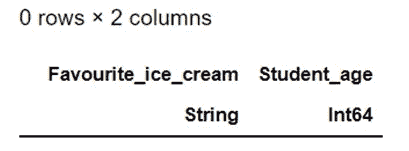

现在，让我们一行一行地填。

```
push!(df2, ("banana", 15))
```

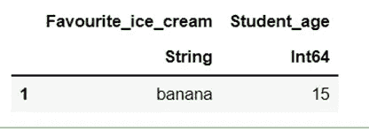

我们还可以添加行，如下所示:

```
push!(df2, Dict(:Favourite_ice_cream => "pistachio", :Student_age => 13)) #Attention needs => not =
```

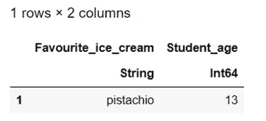

**创建数据框架的另一种方法**

我想创建以下列(变量):

*   我每天吃的开心果冰淇淋(持续 20 天)。

列名:开心果

*   我每天吃的香蕉冰淇淋(持续 20 天)。

列名:BananaPD

*   我每天吃的柠檬冰淇淋(持续 20 天)。

列名:LemonPD

🍧开心果冰淇淋的一些信息

我每天吃的开心果冰淇淋最少是 1 勺。

我每天最多吃 39 勺开心果冰淇淋。

每天都是从上一个多吃两个(从 1 开始，以 39 结尾)。

🍧香蕉冰淇淋的一些信息

连续两天，我吃同样数量的冰淇淋勺。

从 1 开始，以 10 结束。

🍧柠檬冰淇淋的一些信息

每天我都会多吃一勺前一天的柠檬冰淇淋。

从 1 开始，以 20 结束。

请考虑一下如何创建这个数据框架。

当你准备好了，阅读解决方案。

解决方案:

```
df3 = DataFrame(PistachioPD = 1:2:39, BananaPD = repeat(1:10, inner = 2), LemonPD = 1:20)
```

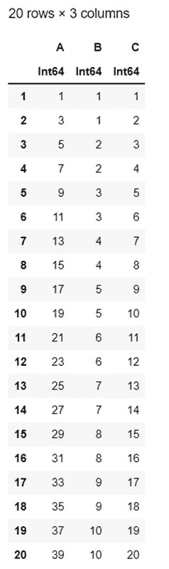

从现在开始，我们将使用下面的数据框架:

```
df = DataFrame(
Favourite_ice_cream = ["banana","pistachio","chocolate","strawberry","chocolate","chocolate","mint","caramel","vanilla","vanilla"],
Age = [23,28,35,33,23,25,20,32,32,17],
Name = ["Nick","Maria","Jo","Lola","Maria","John","Helen","Mike","Steve","Harry"],
Gender = ["Male","Female","Female","Female","Female","Male","Tansgender","Male","Male","Male"],
Height = [1.88,1.73,missing,1.68,1.79,1.58,1.70,missing,1.90,"None"],
Daily_expenses = [125.6,58.7,13.2,45.8,12,6.7,87.4,55.6,63.8,34.7])
```

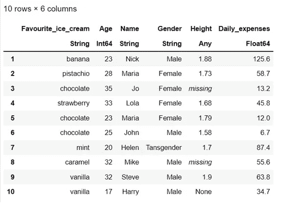

**获取特定的值子集**

我想得到我的数据框架的一个子集，其中只有我选择的年龄的人参与。在这种情况下，我想要 17 岁、23 岁或 33 岁的人的信息。

```
df[in.(df.Age, Ref([17,23,33])), :]
```

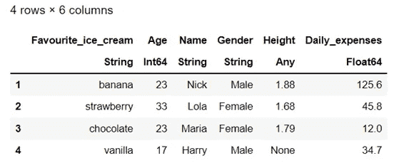

**根据条件选择行**

我想在我的数据框架中研究 23 岁以上的人。

```
df[df.Age .> 23, :]
```

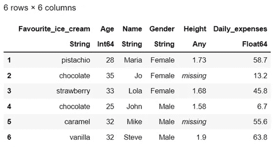

现在，我想要的是那些超过 25 岁，但是日常开销在 30 美元到 46 美元之间的人。

```
df[(df.Age .> 25) .& (30 .< df.Daily_expenses .< 46), :]
```

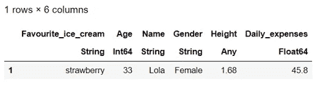

**逐行变换列**

我想得到所有日常开销的平方根。

```
select(df, :Daily_expenses => ByRow(sqrt))
```

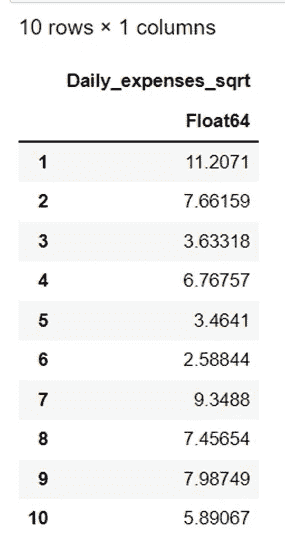

**用现有列的转换创建一个新列**

让我们创建一个名为 x 的数据帧，它包含来自现有数据帧的列“Age”和“Daily_expenses”。

```
x = select(df, :Age, :Daily_expenses)
```

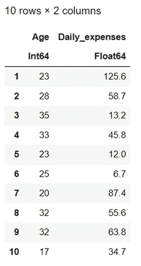

我想创建一个新列，在同一行中包含 Age 和 Daily_expenses 的总和。

举个例子，

23+125.6

28+58.7

等等。

```
transform(x, All() => +)
```

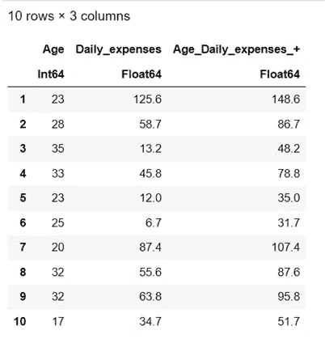

**对列应用函数**

假设我们想要合计所有的日常开支。

```
combine(df, :Daily_expenses .=> sum)
```

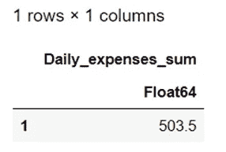

**对列进行排序**

是时候对年龄变量进行排序了。从最小年龄到最大年龄。

```
sort!(df, :Age)
```

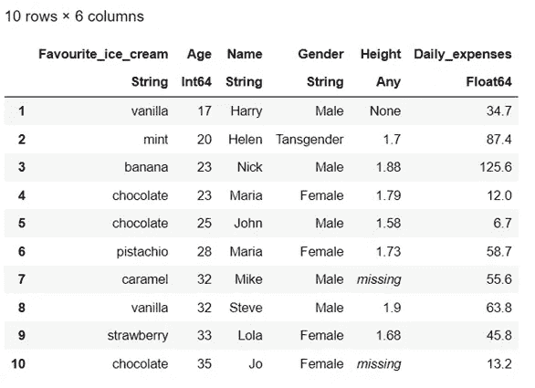

这将自动应用于我们的数据框架。所以，从现在开始，我们要处理已排序的年龄变量。

**改变具体指标**

我想用值 12 来更改年龄列的第二行。

```
df.Age[2] = 12
```

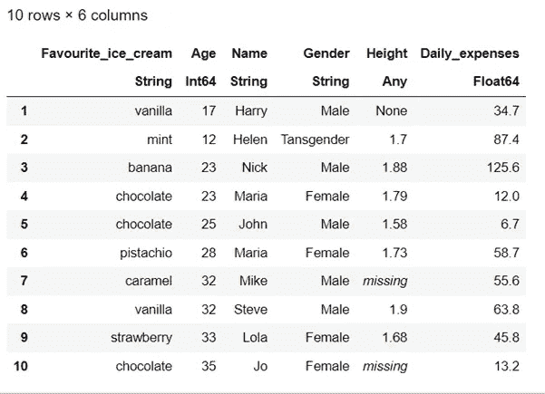

**更换特定指标**

让我们用 JoJo 这个名字代替 Jo 这个名字。

```
replace!(df.Name, "Jo" => "JoJo")
```

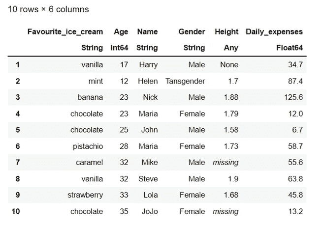

这将自动应用于我们的数据框架。

从现在开始，我们将在列名的最后一行使用 JoJo 这个名称。

我还想用 missing 替换“None”值。

```
replace!(df.Height, "None" => missing)
```

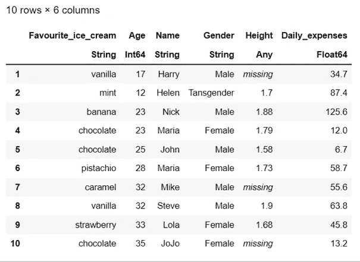

**删除缺失值**

删除所有丢失的值！

```
dropmissing(df, :Height)
```

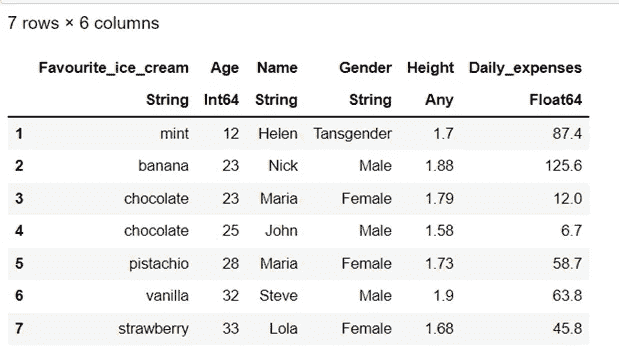

但是如果你像下面这样写(df ),你会得到缺少值的数据帧。

```
df
```

如果您希望更改(dropmissing)自动应用到我们已有的数据帧，请输入**！**在 dropmissing 的语法中。

```
dropmissing!(df, :Height)
```

**加入**

最后但同样重要的是，让我们使用连接。

我将创建两个相互独立的数据帧。

首先:

```
IceCream = DataFrame(ID=[1, 2], FavIceCream=["mint", "banana"])
```

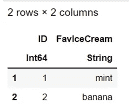

第二:

```
Names = DataFrame(ID=[1, 2], Name=["Helen", "Nick"])
```

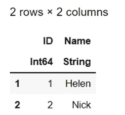

让我们加入他们。

```
innerjoin(IceCream, Names, on = :ID)
```

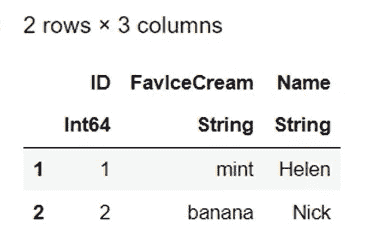

我会再创造一个。

第三:

```
Names = DataFrame(ID=[1, 4], Name=["Helen", "John"])
```

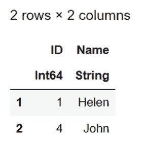

我们将调查以下各项之间的差异:

左连接()

rightjoin()

外部联接()

内部联接()

半连接()

反联接()

交叉连接()

```
#leftjoin()
leftjoin(IceCream, Names, on = :ID)
```

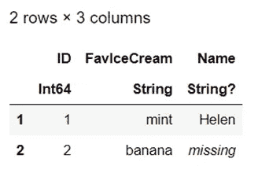

包含左参数(冰淇淋)的行和值。我们不关心该值是否存在于正确的参数(名称)中。正如我们在创建的第三个数据帧(名称)中看到的，我们只有 ID = 1 和 ID = 4 的名称。

```
#rightjoin()
rightjoin(IceCream, Names, on = :ID)
```


包含右参数的行和值(名称)。我们不关心这个值是否存在于左边的参数(冰淇淋)中。正如我们在创建的第一个数据帧(冰淇淋)中看到的，我们只有 ID = 1 和 ID = 2 的值。

```
#outerjoin()
outerjoin(IceCream, Names, on = :ID)
```

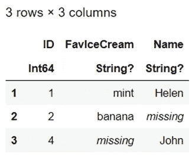

包含两个参数(数据帧)值的行，即使它们缺失。

```
#innerjoin()
innerjoin(IceCream, Names, on = :ID)
```

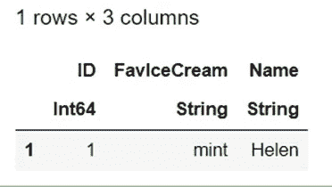

包含两个参数(数据帧)值的行，前提是它们存在。

```
#semijoin()
semijoin(IceCream, Names, on = :ID)
```

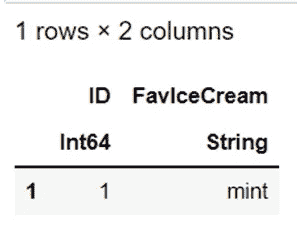

类似于 inner join，但是输出只包含 left (IceCream)参数。

```
#antijoin()
antijoin(IceCream, Names, on = :ID)
```

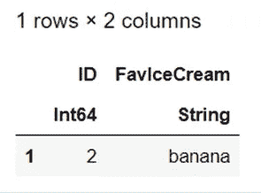

包含存在于左侧(冰淇淋)而非右侧(名称)参数中的值行。例如，我们有冰淇淋(来自左边的论证),但是我们不知道吃冰淇淋的人的名字。和上面一样(半连接)，输出被限制在左边参数的列(冰淇淋)。

```
#crossjoin()
crossjoin(IceCream, Names, makeunique = true)
```

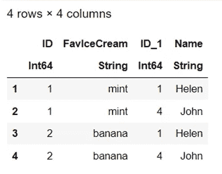

左参数中的每一行都与右参数中的所有行成对(*行*的笛卡尔积)。

**结论**

本文是 DataFrames.jl 的第二部分，也是最后一部分。

感谢您的阅读！🤗