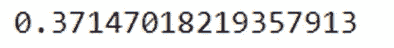

# 玩分布游戏. jl 正态分布

> 原文：<https://blog.devgenius.io/playing-with-distributions-jl-normal-distribution-eb7f1dbd56a3?source=collection_archive---------3----------------------->


克劳迪奥·波吉奥在 [Unsplash](https://unsplash.com/t/arts-culture?utm_source=unsplash&utm_medium=referral&utm_content=creditCopyText) 上拍摄的照片

**简介**

本文旨在展示使用 Julia 中的 [Distributions.jl](https://juliastats.org/Distributions.jl/stable/) 包的一些可能性(一些关于发行版的重要知识)。当然还有更多。我们将重点关注*单变量正态分布*。

**关于 Distributions.jl 包**

jl 提供了大量概率分布和相关函数的集合。简而言之，这个包为您提供了创建发行版和了解它所需的一切。

**内容**

*   包的安装和使用
*   设置随机种子
*   创建正态分布
*   从您创建的正态分布中获取一个样本
*   🎁额外收获:获得一张你的正态分布的 GIF 直方图
*   最适合
*   最小观察值
*   最大观察值
*   定位参数
*   尺度参数
*   分布参数
*   极值
*   差异
*   中位数
*   方式
*   歪斜
*   峭度
*   中间黑洞检查
*   轻音支票
*   扁平格子
*   概率密度函数的 L2 范数的平方
*   x 处的概率密度
*   x 处的累积概率
*   在 x 处评估的互补累积函数
*   截尾正态分布

**包装安装和使用**

```
#Installation
using Pkg
Pkd.add("Distributions")#Use 
using Distributions
```

我们准备好使用 Distributions.jl 包了！

**设置随机种子**

```
using Random
Random.seed!(18) #my lucky number 
```

**创建正态分布**

是时候创建我们的正态分布了。我选择了一个均值为 345，标准差为 128 的正态分布。当然，你可以选择任何你想要的。也设置随机种子 18，以获得相同的第一个样本。

我把它命名为“nd”。

```
nd = Normal(345,128)
```

从你创建的正态分布中获取一个样本

我们准备从我们创建的发行版中获取一个样本。

我选择获取 1000 个观测值的样本，命名为“x”。

```
x = rand(nd, 1000)
```


🎁**奖励:获得一张你的正态分布的 GIF 直方图**

```
using Plots, ColorSchemesanim = @animate for i=1:100
    p = rand(Normal(345,128),1000)
    histogram(p, fillcolor=range(HSV(0,1,1), stop=HSV(-360,1,1), length=90))
end
gif(anim, fps = 6)
```

fps:GIF 中每秒的帧数。

在这里选择颜色。


**最适合**

哪个正态分布最好地描述了我们的 x？

```
y = fit(Normal,x)
```


估计值(341.6，126.9)接近我们选择生成 x 的(345，128)的真实值。如果我们重新采样，我们可能会得到更好的估计值。

**最小观察值**

```
minimum(x)
```


我们样本的最小观测值是-47.68。

**最大观察值**

```
maximum(x)
```


我们样本的最大观测值是 751.74。

**位置参数**

正态分布的位置参数是平均值。因此，我们期望得到 y 分布的平均值。

```
location(y)
```


正确！

**刻度参数**

正态分布的比例参数是标准差。因此，我们期望得到 y 分布的标准差。

```
scale(y)
```


**分布参数**

我们期望得到正态分布的参数，均值(μ)和标准差(σ)。

```
params(y)
```


**极值**

现在，我们需要得到 x 的极值。最小的(最小值)和最大的(最大值)，被称为极值。

我们期望得到这个:(-47.68，751.74)。我们在上面找到了这些值。

```
extrema(x)
```


**差异**

我们了解


```
#Variance of x
var(x)
```


```
#Variance of y
var(y)
```


**中值，模式**

呈正态分布


```
median(y)
mode(y)
```

我们选择得到 y，因为我们有上面的平均值和标准差的精确值，所以我们可以理解我们得到了什么。你也可以试着得到 x 的中位数和众数。


**偏斜度**

完美正态分布的偏斜度为零。

让我们看看 x 和 y 的偏斜度。

```
skewness(x)
```


```
skewness(y)
```


这是一个合乎逻辑的结果。我们的 y 是最佳正态分布拟合(对于我们选择的参数)，而 x 是估计值。

**峰度**

完美正态分布的峰度为零。

让我们看看 x 和 y 的峰度。

```
kurtosis(x)
```


```
kurtosis(y)
```


**黑洞检查**

中峰度分布(如正态分布)的峰度为零。我们的分布是正态的，所以是中熵的。

```
ismesokurtic(y)
```


**轻音检查**

尖峰分布是峰度大于 3 的统计分布。

```
isleptokurtic(y)
```


**鸭嘴形检查**

平峰分布具有负峰度。

```
isplatykurtic(y)
```


**概率密度函数的 L2 范数的平方**

L2 范数是最流行的范数，也称为欧几里德范数。

从一点到另一点是最短的距离。

较小的距离值意味着它们彼此接近，意味着更有可能相似。

```
pdfsquaredL2norm(y)
```


**x 处的概率密度**

例如，我们想得到 500 的概率密度。

因为我们的分布是连续的，每一次得到特定“点”的概率都很小。这里我们有 y。


```
pdf(y,500)
```


**x 处的累积概率**

这里我们有 y。


假设我们想得到在 300 以下“挑选”一个“点”的概率。

```
cdf(y,300)
```



现在，假设我们想得到在 1000 以下“选择”一个“点”的概率。

```
cdf(y,1000)
```


**在 x 处评估的互补累积函数**


```
ccdf(y,300)
```


**截尾正态分布**

假设你有一条面包，但你想吃其中的一片。

*   从面包的左端到中心
*   从面包的一个特定点到另一个特定点
*   从面包的特定点到面包的右端
*   等等。


```
r = TruncatedNormal(mean(y), var(y), 500, 600)
```


我选了上限 600，下限 500。

我还为我们的截断分布选择了 y 分布的均值和标准差。

让我们从截断分布中抽取一个样本。

```
t = rand(r,100)
```


**结论**

我们看到了 Distributions.jl 包中的一些选项。

我们选择了一个特定的分布来研究(正态分布),但它太多了，也非常有趣。

我会带着另一个发行版回来。

敬请期待！

感谢您的阅读！🤗