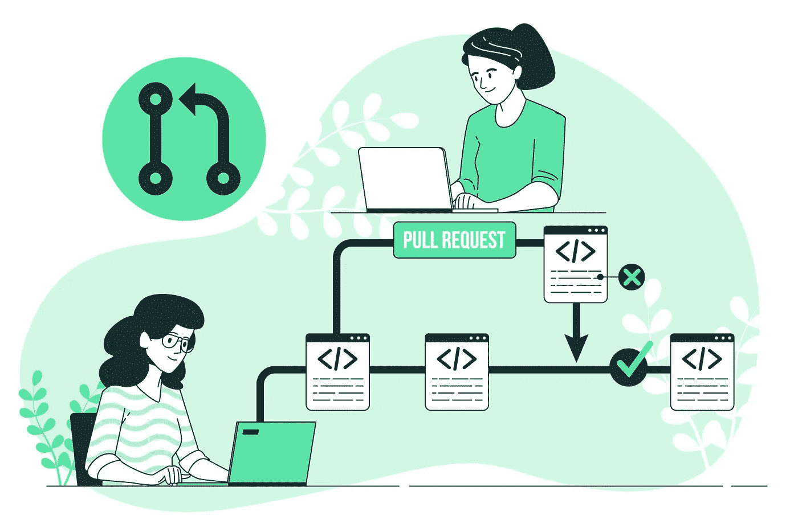
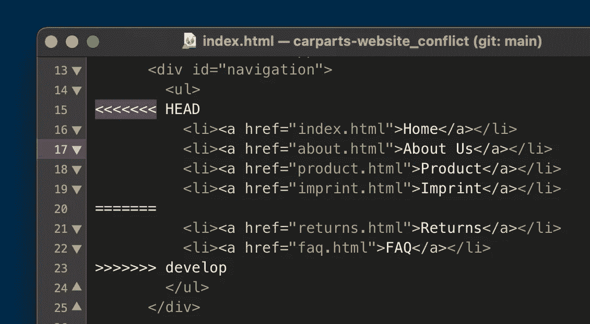

# 请写小一点的拉取请求！

> 原文：<https://blog.devgenius.io/please-write-smaller-pull-requests-5988da5e8e5f?source=collection_archive---------5----------------------->

一个卑微的软件工程师绝望的恳求

做拉式请求评审是作为团队一员的程序员的一个重要部分。及时给出评审有助于团队快速合作，给出好的评审有助于保持代码库的高质量。

然而，如果我说我欣然接受了评论的机会，那我就是在撒谎。他们要求你切换到其他人的工作中，试着思考他们错过的东西，边缘案例和风格改进。这是一项耗费脑力的工作。

这也是为什么当我打开一个 PR 去回顾，看到“30 个更改的文件”的时候特别沮丧。这篇文章解释了为什么我认为大型 PRs 是一个坏主意，以及一些避免创建它们的策略。

# 为什么你应该写更小的 PRs？

首先，让我证明我的仇恨。以下是为什么您应该在您的拉取请求中只进行少量更改的原因:

## 获得更多更好的反馈

我肯定会更快地审阅发给我的小的 pr。当只做了一个小的改变时，我也发现更容易把所有事情都记在脑子里，并思考正在做的事情。不仅仅是我；当我的 PRs 较小时，对我的 PRs 的审核总是更及时，质量也更好。

## 少改变，少破坏

在积极的开发过程中，错误总是会出现，但是当你做较小的改变时，会有更好的改变，你的评论会发现哪里出了问题。当一个 bug 不存在时，较小的 PRs 也意味着更容易缩小导致该行为的原因。

## 可怕的合并冲突

合并冲突是一个很难解决的问题，可能会导致引入 bug。如果你的公关在范围上更受限制，你就不太可能与另一个开发者的变更发生冲突。

我们都讨厌合并冲突——避免它们

## 不要浪费时间

通常公关审查是你第一次得到另一双眼睛对你解决问题的方法。快速准备好解决方案的一部分是验证您的方法不会被拒绝的好方法。

有几次，我花了一周的大部分时间在一个可交付的产品上，只是为了得到一个评论，解释为什么它不能工作/可以做得更好，并且不得不重写我的大部分代码。

# 如何写更小的 PRs

“可是我不能！”我听到你哭泣。"这个交付需要这么多代码，我的公关需要这么大！"。仅仅因为一个特性、bug 修复或交付需要大量代码，并不意味着你需要在一个大的 PR 中完成所有的工作。

## 代码计划

我以前在处理一项需要大量工作的任务时使用的一个策略是写一个代码计划，列出我计划做的事情，并展示给我的队友。这些计划通常包括接口定义、类大纲和实现细节的大致轮廓。这允许我在没有所有代码的情况下获得对整个解决方案的意见。

## '尚未实施'

大多数编程语言都有一种特定类型的异常，叫做“NotImplementedException”。当您编写一个必须满足特定接口的类时，您通常可以使用 IDE 中的快捷方式来添加所有必需的方法，方法体只引发此异常。现在，您的实现将会编译并拥有所需的接口，而您实际上不必添加任何逻辑代码。

当我需要向代码库添加一个复杂的类时，我通常会遵循这种模式，逐步填充方法，以易于理解的步骤进行。

## 复制并不总是坏事

有时你可能会发现自己在做一项任务，用别的东西替换系统中的某个东西。网站页面，界面实现，你替换什么都无所谓。作为程序员，我们被教导要避免重复，所以诱惑是一下子用 B 替换 A。然而，让 A 和 B 共存并逐渐壮大 B 直到它与 A 持平可能更好。

如果 A 和 B 是代码，你可以在编写过程中逐渐用对 B 的调用替换对 A 的调用。如果 A 和 B 是 UI 组件，你可以使用一个特性标志来“打开”B，同时保持 A 为默认值。

# 不要只是相信我

持续集成的概念被描述为"**一种 DevOps 软件开发实践，在这种实践中，开发人员定期将他们的代码变更合并到一个中央存储库中，之后运行自动化构建和测试**。

这里的定期可以指一天多次！对于大多数工作来说，这对于完成工作项来说太频繁了。相反，这里概述的策略是用来让开发人员保持高效的。

在互联网上，你可以找到许多备受尊敬的工程师，他们提倡将 CI 作为团队保持敏捷、编写健壮代码和快速构建东西的一种方式。如果你想了解更多，这里有几个链接:

如果你喜欢这篇文章，你可能会喜欢我的另一篇文章[我们应该每天部署吗？](https://medium.com/p/6acca8405880)

你可能也会喜欢我的抖音[joetalkscouting](https://www.tiktok.com/@joetalkscomputing)。