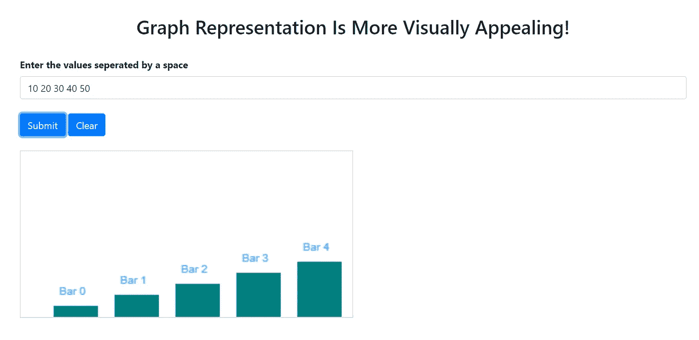

# 使用 JavaScript 和 HTML 画布绘制条形图

> 原文：<https://blog.devgenius.io/plotting-a-bar-chart-using-javascript-and-html-canvas-db082eac28aa?source=collection_archive---------1----------------------->

## 图形表示更具视觉吸引力！

照片由 [Isaac Smith](https://unsplash.com/@isaacmsmith?utm_source=medium&utm_medium=referral) 在 [Unsplash](https://unsplash.com?utm_source=medium&utm_medium=referral) 上拍摄

# 目标

从小时候起，我就懂得了一件事“ ***数字胜于雄辩*** ”。到目前为止，每个人都喜欢听/看真实的数据。因此，为了支持上面的陈述，让我们理解使用 HTML 和 JavaScript 函数以条形图的形式绘制数据的艺术。在进一步讨论之前，让我们跳到实现。

# 履行

## 图书馆

显然，为了让应用程序响应迅速，我不得不使用传说中的[引导程序](https://getbootstrap.com/docs/4.0/getting-started/introduction/)。确保在 HTML 文件的`head`部分包含下面两行代码。

## 超文本标记语言

对于这个应用程序，我使用了 Bootstrap `container`及其`input`表单。类似地，对被按下的提交和清除按钮使用了`onclick`事件。使用`canvas`渲染 2D 形状和位图图像。

## Java Script 语言

**复位功能**

点击`reset`功能，输入以及画布上呈现的图形将被清除。

**绘制功能**

以下是`draw`功能执行的步骤:

1.  **接受输入并相应地将它们存储为一个数组——例如**，如果输入是以`10 20 30 40 50`的形式输入的，那么它将被转换为`[“10”, “20”, “30”, “40”, “50”]`。
2.  定义`canvas`元素及其`width`、`X`和基础。
3.  使用函数`fillRect()`根据输入值填充矩形(条形)。
4.  添加文本以在每个条形的顶部显示条形编号。用于该任务的`fillText()`。

# 完整代码

下面是应用程序的完整代码。

# 结果

当您在默认浏览器中执行或打开`.html`文件时，您将得到以下结果提示。

**使用 JavaScript 绘制条形图**

# 扩展功能

*   ***输入字段*** 已经插入了默认值，单击提交按钮将绘制出`10 20 30 40 50`值的条形图。
*   多亏了引导库， ***网页*** 和画布都能响应。
*   ***清除按钮*** 将清除输入域和画布。
*   无需在输入字段中用 ***逗号*** 分隔输入值。两个数字之间必须有一个空格。
*   画布是可定制的，这意味着您可以为图形添加更多颜色，并添加标签以使其更易于理解。天空是这里的极限😀。

# 结论

通过完成上面的教程，您将使用 JavaScript 根据您的输入显示一个动态条形图。有几种方法可以改进这个实现，比如将它集成到数据库中，甚至添加其他图形选项，等等。有一个房间充满了改善这一点的机会，如果你有，请告诉我。在那之前，下次见。快乐编码。