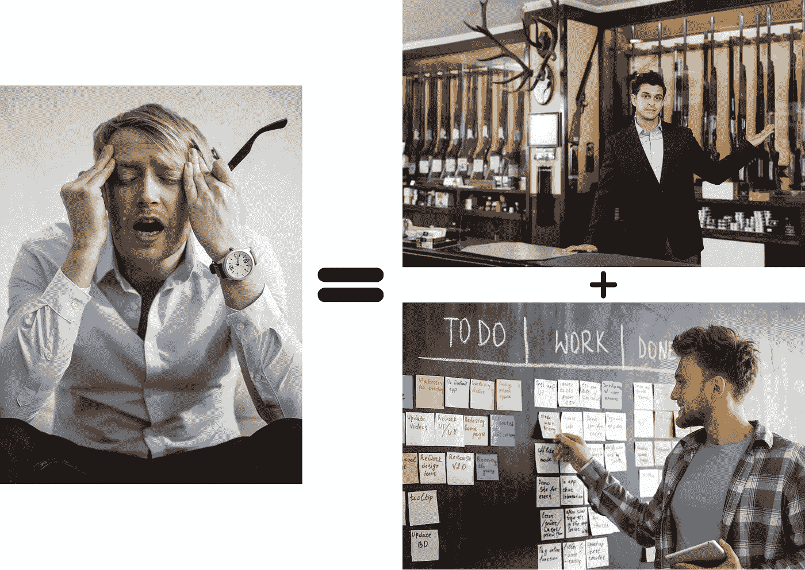

# PM = PO + SM

> 原文：<https://blog.devgenius.io/pm-po-sm-f0ea1a55dbce?source=collection_archive---------12----------------------->

# 最鼓舞人心的时刻

> 自从你加入我们团队以来，这些冲刺是我经历过的最顺利的一次。

没有什么比来自同事的真诚赞扬更有价值。上次我们举行 sprint 回顾会时，我们比较了采用 Scrum 前后的差异。有一些反馈需要处理。

*   信息的同步变得更快
*   每次冲刺的范围都变得更加清晰
*   雇佣了 Scrum 大师后，产品负责人的压力消除了。

嗯，当[每日 scrum](https://uragilecoach.medium.com/%E7%B5%A6%E6%88%91%E6%BB%BE-daily-scrum-808d6eea64e7) 在同一时间同一地点举行时，消息同步可以加快。它帮助成员明确其他人的状态，并检查他们所做的是否符合 sprint 目标。另外，[冲刺计划](https://uragilecoach.medium.com/%E8%A1%9D%E5%88%BA%E8%A8%88%E7%95%AB%E9%80%99%E7%A2%BC%E4%BA%8B%E5%85%92-e898667e6204)描述了他们将要交付的增量的范围，这也让他们专注于他们所做的事情。

令我惊讶的是，为什么我减轻了产品负责人的压力？这是第三点引起了我的兴趣，以咨询的原因。在我看来，有一个 Scrum 大师指导成员遵守 Scrum 原则是非常正常的。

我在参加现在的团队之前就已经听说了这些条件。无休止的延迟、不透明的消息传递和老式的项目管理方法变得更加难以适应多变的环境。因此，当我得到提供我的第一个任务是改善目前的状况。

我所做的非常简单，指导团队采用 [Scrum](https://uragilecoach.medium.com/%E9%80%B2%E5%85%A5%E7%9A%84%E8%B5%B7%E9%BB%9E-%E4%BB%80%E9%BA%BC%E6%98%AF%E6%95%8F%E6%8D%B7%E7%AE%A1%E7%90%86-4c38954e3699) ，将[吉拉](https://www.atlassian.com/software/jira)作为我们的在线管理系统，并帮助我们的产品负责人澄清项目的概况。开始我们的第一次冲刺。

# 传统项目管理的衰落

根据我的观察，一个产品/项目经理基本上负责从涉众那里获取需求，安排发布计划和剖析行动细节。因此，这个角色无疑是协调团队工作的团队的中心。

换句话说，产品/项目的顺利程度取决于他如何控制进度和分配资源。如果他遭遇了意想不到的混乱，一个团队也会如此。当一个团队还很小的时候，这个问题可能就不大了。然而，随着团队规模的增长或业务规模的扩大，它逐渐从内部显现出来，因为它越来越难以应对不断变化的市场。雇佣更多的产品/项目经理或工程师可能会在短期内缓解混乱，但不太可能持续很长时间。最可能的原因是，其他人可能只是派生出管理模式，而没有解决核心的根本原因。

这是一个合适的管理框架，关系到精简成员的合作，以释放团队的协作力量。在我看来，有许多敏捷方法，如 [Scrum](https://uragilecoach.medium.com/%E9%80%B2%E5%85%A5%E7%9A%84%E8%B5%B7%E9%BB%9E-%E4%BB%80%E9%BA%BC%E6%98%AF%E6%95%8F%E6%8D%B7%E7%AE%A1%E7%90%86-4c38954e3699) 、[看板](https://uragilecoach.medium.com/%E7%99%BB%E5%A0%82%E5%85%A5%E5%AE%A4-%E5%88%9D%E5%8F%A9kanban%E7%9A%84%E5%A4%A7%E9%96%80-9fdbbb5f951)、Scrumban 或精益原则，旨在进一步全局优化团队工作的效果，更不用说像 TDD、BDD、DDD 这样的实践，反之亦然。

传统的项目管理腐蚀了久而久之。

# 不是公式，而是趋势

回到标题，我为什么评论“PM = PO + SM”？有些人可能会问为什么 Scrum 团队中没有产品/项目经理。确切的原因是，产品/项目经理的工作被分散到了产品负责人和 scrum master 两个人身上。在不久的将来，我们将面临一个多变的环境，因此专业技能很重要，不仅对于工程师，对于那些组织团队合作的人也是如此。

产品负责人应该专注于阐明需求，与利益相关者一起描绘史诗，管理产品积压和阐明故事的内容以生成 sprint 目标。另一方面，scrum master 负责指导成员在每个事件中遵循原则，为成员消除障碍，扮演部门间谈判者的角色。

不同的角色承担特定的责任，但他们的目标是相同的。

不幸的是，台湾有许多人将这些管理框架视为时髦词汇，但不知道如何根据那些基本但关键的原则释放团队的能力，这甚至比培养一名需要几年时间的天才工程师更容易。

# 蔻驰杂音

还有很多管理框架是我这辈子没经历过的。但是我知道一个优秀的产品不仅仅是由工程师的合作制造出来的，还需要有效的管理方法的帮助。我不确定我是否能看完它们。这是我永无止境的进步之路。

—

如果你认可我与你分享的价值，请做如下:
1。**鼓掌**文章
2。**订阅**我最新内容
3。**在其他平台关注**我了解更多信息
-IG:[@ ur _ Agile _ coach](https://www.instagram.com/ur_agile_coach/)
-播客(中文):[敏捷火箭](https://player.soundon.fm/p/7f7dc3df-d738-405c-8cf9-02157a92ec61)
- Youtube: [你的敏捷蔻驰](https://www.youtube.com/channel/UCzD0wQmD1n4MuTKk-JocACA)
- LinkedIn: [吴宗祥](https://www.linkedin.com/in/tsung-hsiang-wu-8542409b/)

如果您需要咨询或其他形式的合作，请发送邮件至:【urscrummaster@gmail.com】