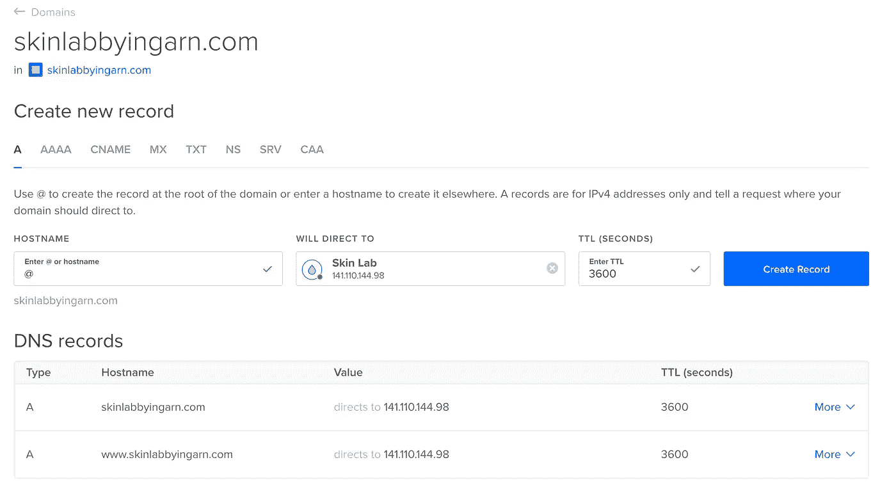

# 指向数字海洋液滴的 GoDaddy 域

> 原文：<https://blog.devgenius.io/point-godaddy-domain-to-digitalocean-droplet-c7d24f423cad?source=collection_archive---------2----------------------->

在上一篇文章中，我写了如何将 Laravel 应用程序部署到 DigitalOcean。现在，我们必须将域名指向 Droplet，这样人们就不必键入 IP 地址。

 [## 将 Laravel 应用程序部署到数字海洋的快速方法

### 虽然您可以用数百种不同的方式部署 Laravel 应用程序，但我想分享一种快速部署的方法…

blog.devgenius.io](/quick-way-to-deploy-a-laravel-app-to-digitalocean-d212f088bcc5) 

## 数字海洋

一旦你登录到你的[数字海洋账户](https://www.digitalocean.com/)，点击左边工具条中的**网络**标签。在下图中，它是倒数第三个链接。

选择**负载平衡器**选项卡后，您将进入网络屏幕。您需要点击 **Domains** 选项卡，进入 Domains 部分。

输入您的域名。在我的例子中，我将进入[skinlabbyingarn.com](https://skinlabbyingarn.com/)。点击**添加域名**按钮。您将被重定向到一个屏幕，在这里您可以添加两条**和一条**记录。第一个是域名本身，第二个将是你的域名，前面有 **www** 。

在**主机名**文本框中，输入 **@** 符号，在**下拉菜单下选择您的 droplet，将 **TTL** 留在 **3600** 处。再次重复该过程，但这次在主机名中添加 **www** 。您将在文本字段下看到修改后的域。**

每次点击**创建记录**按钮。您将看到您的记录出现在 **DNS 记录**部分。

这就是数字海洋的配置。其他一切都将在 GoDaddy 处理。

## GoDaddy

登录 GoDaddy，点击左侧工具条中的域选项卡。

你会在你的域名旁边看到**管理 DNS** 按钮；点击它。向下滚动到**名称服务器**部分，点击**更改**按钮添加您的名称服务器。您需要添加以下名称服务器:

*   ns1.digitalocean.com
*   ns2.digitalocean.com
*   ns3.digitalocean.com

在屏幕的底部是一个小的文本链接，上面写着:**输入我自己的域名服务器(高级)**。那就是你要点击的那个。

添加您的名称服务器并点击**保存**按钮。

仅此而已。是时候等待了。可能需要一天的时间来传播一切。耐心点，检查你的域名。它很快就会运行起来。

迪诺·卡伊奇目前是 [LSBio(生命周期生物科学公司)](https://www.lsbio.com/)、[绝对抗体](https://absoluteantibody.com/)、 [Kerafast](https://www.kerafast.com/) 、[珠穆朗玛生物](https://everestbiotech.com/)、[北欧 MUbio](https://www.nordicmubio.com/) 和 [Exalpha](https://www.exalpha.com/) 的 IT 主管。他还担任我的自动系统的首席执行官。他有十多年的软件工程经验。他拥有计算机科学学士学位，辅修生物学。他的背景包括创建企业级电子商务应用程序、执行基于研究的软件开发，以及通过写作促进知识的传播。

你可以在 [LinkedIn](https://www.linkedin.com/in/dinocajic/) 上联系他，在 [Instagram](https://instagram.com/think.dino) 上关注他，或者[订阅他的媒体出版物](https://dinocajic.medium.com/subscribe)。

[*阅读迪诺·卡吉克(以及媒体上成千上万其他作家)的每一个故事。你的会员费直接支持迪诺·卡吉克和你阅读的其他作家。你也可以在媒体上看到所有的故事。*](https://dinocajic.medium.com/membership)