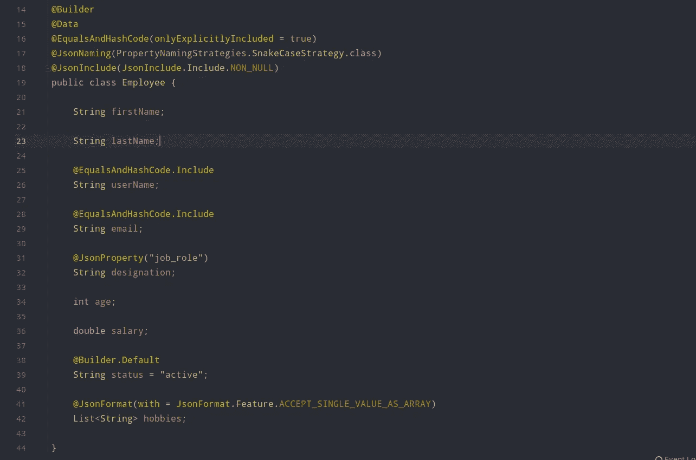

# 爪哇和龙目岛的 POJOs

> 原文：<https://blog.devgenius.io/pojos-in-java-with-lombok-307944323b8?source=collection_archive---------0----------------------->

让我们用更好的方式来玩 POJOs



龙目岛在行动

嗨，开发者们！我非常兴奋地告诉你，这是我第一篇关于媒体的技术文章！作为一个很好的开始，我想写一些对我们这些开发者真正有帮助的东西。这一切都是为了让我们的生活更轻松，让现实世界中的应用程序代码更少。使用 Lombok 库和我一起玩 POJO 类吧！

所以让我们征服吧！！！

# 什么是龙目岛？

这是龙目岛的创造者对它的定义。

> java 库，自动插入到你的编辑器和构建工具中，增加你的 java 的味道。

因此，简单地说，这是一个可以用来使我们的事情变得更简单的库，而不是从头开始实现预期的功能。暂时记住这件事。你以后会意识到这个事实的。

# 如何申请 POJOs？

# 装置

所以，根据你的项目的构建插件，Lombok 必须被安装到你的项目中。可以是 Maven/Sbt，也可以是其他。所以，我会给你 maven 依赖，因为它是 Java 项目中最常用的构建工具。

```
<dependency>
    <groupId>org.projectlombok</groupId>
    <artifactId>lombok</artifactId>
    <version>1.18.20</version>
    <scope>provided</scope>
</dependency>
```

## 使用

首先，我会把这个部分分成多个部分。那我们就可以一个一个讨论清楚了。

***龙目岛在波若斯有什么不同？***

让我深入研究一下。所以通常，当我们创建一个 POJO(或 DTO)时，我们指定一些字段和它们的访问方法，以便在我们插入它的地方操作它。然后我们基于这个类做很多事情，比如创建新的实例，存储对象，将它们转换成 JSON 等等。我们使用的所有这些操作都是某种相同的样板，我们重复它。例如，我们在类中显式定义 getters 和 setters，以实现封装。

如果我说当我们使用龙目语时，我们不必这样做，你认为怎么样？听起来是不是很棒？？？

这就是龙目岛有多疯狂！让我们一步一步的开始了解吧。

# Getters、Setters 和 ToString 方法

所以，这是使用 Lombok 最简单也是最重要的一步。当我们创建一个 POJO 并将 Lombok 插入其中时，我们只需 ***将字段及其类型*** 放入类中！甚至没有访问字段的修饰符。默认情况下，Lombok 将它们视为私有字段。

在这种情况下，我们有 3 种方法来实现封装。

1.  **数据标注**

我们必须将 **"@Data"** 注释放在类定义的顶部。因此，它将负责每个字段的 Getters 和 Setters，ToString 方法，Hashcode 方法，Equals 方法。

```
@Data
public class Employee {
    String userName;
    String email;
}
```

现在，userName 的 getterss 和 setterss 为 *getUserName()* ，email 的 getter 和 setter 为 *getEmail()* 。您必须等到文章的构造函数部分完成后再尝试。

**2。Getter 和 Setter 注释**

假设您只需要 Getters 或 Setters。那么你可以用 **"@Getter"** 或者 **"@Setter"** 来代替" @Data "。很简单！但是这里我们没有像在“@Data”注释中那样得到任何其他方法。

```
@Getter
public class Employee {
    String userName;
    String email;
}
```

**3。数值注释**

当您需要维护不可变对象时，可以使用这种注释。简单地说，没有设定者。您不能修改这些字段。

```
@Value
public class Employee {
    String userName;
    String email;
}
```

# 构造器

我们需要构造函数来创建新对象。所以，我们必须告诉 Lombok 我们需要这些构造函数。这里我们给出了 3 个选择。

1.  **无 rgs 构造器**

这和 Java 默认构造函数一样！当我们使用它时，我们可以创建一个没有参数值的对象。

```
@NoArgsConstructor
public class Employee {
    String userName;
    String email;
}
```

例如:雇员 emp =新雇员()；

尝试创建一个新的对象！现在您可以看到如何访问 getters 和 setters 了…

**2。AllArgsConstructor**

当我们放置这个注释时，我们有机会通过提供所有字段作为参数来创建一个对象。

```
@NoArgsConstructor
@AllArgsConstructor
public class Employee {
    String userName;
    String email;
}
```

**3。RequiredArgsConstructor**

这个注释还帮助我们用一些强制参数来构造函数。但是我们必须使用另一个名为 **"@NonNull"** 的注释告诉 Lombok 那些强制字段是什么。那么 Lombok 将按照我们在 POJO 类中定义的顺序来考虑它们。假设用户名和电子邮件是强制性的。所以我们可以这样修改这个类。

```
@Data
@NoArgsConstructor
@AllArgsConstructor
@RequiredArgsConstructor
public class Employee {
    @NonNull String userName;
    @NonNull String email;
    double salary;
}
```

现在我们可以用三种构造函数创建对象。

```
Employee employee1 = new Employee();
Employee employee2 = new Employee("sailtha", "salitha@gmail.com");
Employee employee3 = new Employee("sailtha", "salitha@gmail.com", 50500.50);
```

# 显式 Equals 和 Hashcode

这是我们在 Java 中操作对象时发现的一个非常棘手的情况。通常，根据 Java 内存模型在堆空间中创建对象。只有它们的引用被保存在堆栈内存中。因此，假设您将 Employee 对象存储在这样一个映射中:Map <id employee="">。所以你必须确定一件事！</id>

> 如何区分员工对象？协议是什么？

否则，由于在不知情的情况下一次又一次地创建同一个雇员，您将在堆上遇到内存问题！令人惊讶的是，堆空间会被太多的对象填满。

为了克服这个问题，我们必须在 Java 中覆盖从最父类 Object 提供的 **equals()** 和 **hashcode()** 方法。在那里，我们可以选择一些字段来创建一个独特的员工。Lombok 提供了一个很棒的方法来做到这一点。

```
@EqualsAndHashCode(onlyExplicitlyIncluded = true)
```

当我们将这个注释放在类定义的顶部时，我们就可以标记所需的字段了。**记住，注释内的条件[onlyExplicitlyIncluded = true]将限制 POJO 使用注释文件区分对象，如下图**。

```
@EqualsAndHashCode.Include
```

现在每当你用相同的用户名和电子邮件创建对象时，它们将被指向同一个对象 ***，避免一次又一次地创建新对象*** 。

```
@Data
@EqualsAndHashCode(onlyExplicitlyIncluded = true)
@NoArgsConstructor
@AllArgsConstructor
@RequiredArgsConstructor
public class Employee {

    String firstName;

    String lastName;

    @EqualsAndHashCode.Include
    @NonNull String userName;

    @EqualsAndHashCode.Include
    @NonNull String email; int age; double salary;
}
```

有各种方法可以试试这个家伙！由于文章已经有点冗长，我就不一一解释了。:)

# 使用生成器设计模式

这是我至今在龙目岛发现的最不可思议的特征。您可能已经了解了生成器设计模式。简单来说 ***它允许我们创建我们想要的对象，并且实体与构造函数*** 不紧密耦合。假设我们的雇员对象有 30 个属性/字段。所以很难通过提供所有这些来创建一个对象。在大多数情况下，我们也不需要某些属性，因为有些属性对于员工来说是可选的。不像我们以传统方式实现嵌套的构建器类，Lombok 只为我们提供了**一个注释来实现整个构建器模式**！这不是很好吗？

但是我们必须注意一些事情:

*   如果使用 **"@Builder"** 注释，不要定义构造函数注释。因为现在对象创建是完全松散耦合的。
*   如果您用 **"@NonNull"** 注释字段，那么您**不能在不提供标有" @NonNull "的对象的情况下使用 builder 创建**对象。它会抛出一个异常！因此，您必须取消空检查。
*   当需要通过 JSON 格式反序列化对象时，使用 **"@Jacksonized"** 注释。当你把 Lombok 和 JSON 库一起使用的时候会很有帮助，比如**“Jackson”**。
*   如果我们没有使用“@Builder”注释为任何参数设置值，Lombok 会将其值视为“NULL”。

```
@Jacksonized
@Builder
@Data
@EqualsAndHashCode(onlyExplicitlyIncluded = true)
public class Employee {

    String firstName;

    String lastName;

    @EqualsAndHashCode.Include
    String userName;

    @EqualsAndHashCode.Include
    String email;

    int age;

    double salary;}
```

那么，如何在旅途中创建对象呢？看看下面的例子！

```
Employee employee1 = Employee.*builder*()
        .userName("salitha")
        .age(28)
        .email("salitha@gmail.com")
        .designation("SE")
        .build();

Employee employee2 = Employee.*builder*()
        .userName("salitha")
        .email("salitha@gmail.com")
        .build();

Employee employee3 = Employee.*builder*()
        .firstName("salitha")
        .lastName("chathuranga")
        .salary(50000)
        .build();
```

您可以看到对象创建的差异。在第一种情况下，所有未定义的字段(如 firstName，lastName)将为 NULL。同样，它也适用于其他情况。

# 为字段设置默认值

假设您想要*创建一个状态始终为“活动”的员工。*简单来说，所有员工都必须有，不用明确设置。正如您现在所知道的， **Builder 默认将这个属性值视为 NULL，因为我们不会在创建对象**时设置它。这就是我们要使用构建器**默认**机制的地方。我们只需要如下注释该字段。

```
@Builder.Default
String status = "active";
```

因此，随着这一变化，雇员类将如下所示:

```
@Builder
@Data
@EqualsAndHashCode(onlyExplicitlyIncluded = true)
public class Employee {

    String firstName;

    String lastName;

    @EqualsAndHashCode.Include
    String userName;

    @EqualsAndHashCode.Include
    String email;

    int age;

    double salary;

    @Builder.Default
    String status = "active";}
```

现在，您可以创建一个对象并打印以查看员工的状态！应该是这样的…

> 雇员(名=空，姓=空，用户名=萨利塔，email=salitha@gmail.com，职务=SE，年龄=28，薪金=0.0，状态=活跃)

现在，您可以根据需要创建员工了！

我希望你能从这篇文章中获得一些知识。我只是想让你知道我们如何在许多方面利用龙目岛图书馆。我必须告诉你:当我们将**杰克森**和**龙目**图书馆连接在一起时，可以实现更多有趣的事情！POJO 和 JSON 之间的序列化和去序列化非常容易。下次见面时我会带着它。

在那之前，再见！注意安全！！！