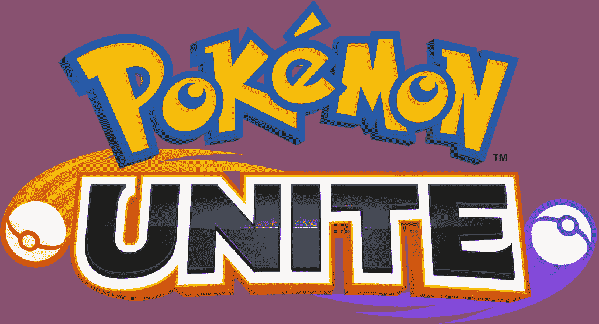
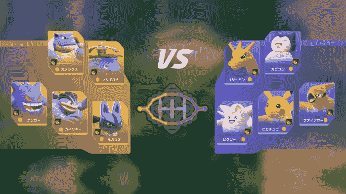
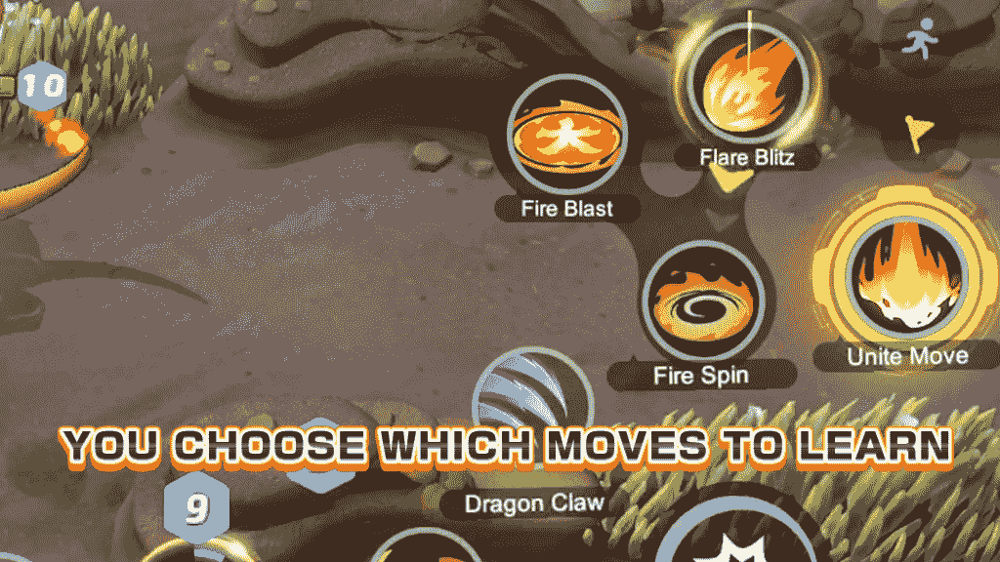
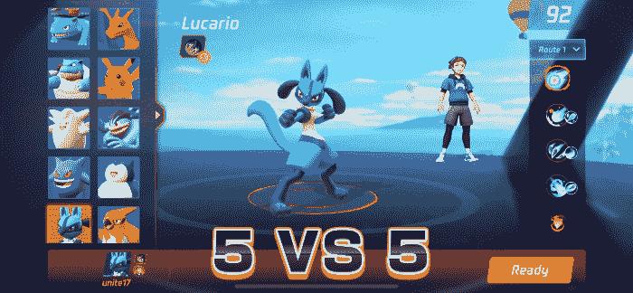

# 神奇宝贝宣布联合任天堂 Switch 和智能设备。

> 原文：<https://blog.devgenius.io/pok%C3%A9mon-unite-announced-for-nintendo-switch-and-smart-devices-900037884ed7?source=collection_archive---------46----------------------->

今天，神奇宝贝公司举行了神奇宝贝展示，展示了为任天堂 Switch 和智能设备开发的多人在线战斗竞技场(MOBA)游戏 **Pokemon Unite** 。这款游戏由腾讯的 Timi 工作室团队开发，该团队是广受欢迎的智能设备竞技场 Valor a MOBA 和任天堂 Switch 的开发商；使*神奇宝贝联合*成为去年[宣布的发展伙伴关系的成果。](https://gametama.wordpress.com/2019/07/22/pokemon-company-working-with-developers-of-arena-of-valor-on-new-game/)

《神奇宝贝联盟》将拥有许多 MOBA 类型的标准功能，两支 5 人队伍将在一张地图上相互竞争，使用独特的技能和能力来确保目标并取得胜利。在口袋妖怪联盟中，玩家每人挑选一个口袋妖怪来玩，在整个比赛中，他们战斗并抓住野生口袋妖怪来获得经验点，以升级并学习新动作，甚至进化。击败野生神奇宝贝也有助于实现游戏目标。

在*神奇宝贝联合*的水平系统有一个定制的扭曲。玩家可以在升级时选择他们学习的招式，比如选择更多的近距离近战攻击，或者选择更多的远程攻击。这样，两个使用完全相同的神奇宝贝的玩家可以有完全不同的动作，这取决于玩家在比赛中选择如何升级。

腾讯在《英雄竞技场》上的经验再次显现，因为该游戏将免费开始，并将在移动设备版本和任天堂 Switch 版本之间进行交叉游戏。目前还没有公布神奇宝贝的最终首发名单。到目前为止，预告片中有 10 个神奇宝贝，分别是 Venusaur、Charizard、Blastoise、Pikachu、cle 寓言、怪力、耿鬼、卡比兽、Lucario 和烈箭隼。发布时可能会有更多可用的角色。免费启动模式表明，这款游戏将有一个类似于其他 MOBA 游戏的盈利模式。玩家可以购买神奇宝贝的化妆品皮肤，并可以选择购买或研磨游戏中新角色的皮肤。

Pokémon Unite 的发布日期尚未公布，发布会承诺将在未来发布更多细节。

*原载于 2020 年 6 月 24 日 http://gametama.wordpress.com***。**