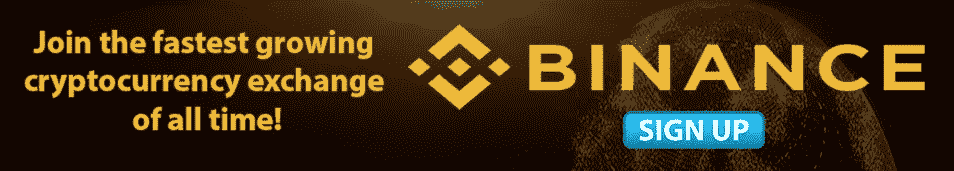
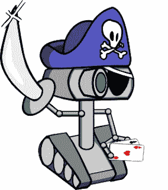
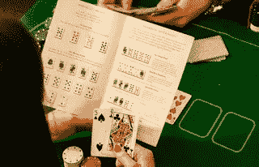
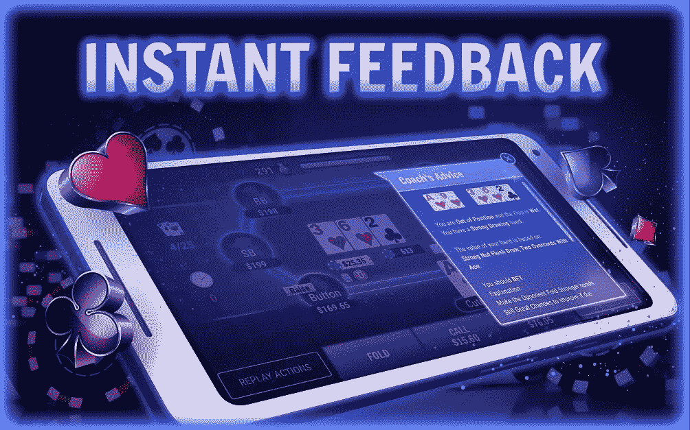

# 扑克机器人和博弈论优化

> 原文：<https://blog.devgenius.io/poker-bots-and-game-theory-optimal-7a9fdcdfcf0a?source=collection_archive---------3----------------------->

大家好！
我是[扑克斗士](https://www.poker-fighter.com/)——一款人工智能扑克训练软件的 CTO 兼开发者。在这篇文章中，我将解释一些关于扑克机器人的基础知识，它们是如何工作的，它们的策略背后的理论是什么，以及它们如何与设计扑克训练软件相关联。

## 扑克机器人

设计扑克斗士的大脑是一项非常类似于制造扑克机器人的任务。PokerBot 是一种无需人工干预就能玩扑克的计算机程序。就像在可以玩“对抗计算机”的象棋中，有足够聪明的计算机程序可以自己玩扑克。

扑克不是一个“已解决”的游戏。[博弈论专家](https://en.wikipedia.org/wiki/Game_theory)仍然没有发现创造一个不可战胜的扑克机器人的最佳策略。像西洋双陆棋这样的其他游戏已经解决了，今天的计算机程序可以告诉你在任何地点什么是最佳的移动。

十年前我发现了扑克。由于我好胜的性格，我立即开始阅读指导扑克的材料:书籍、文章、教程视频、扑克论坛等。我对游戏有着真正的热情，结合我作为软件工程师的技能，很快我就发现自己在设计自己的扑克机器人。有大量关于德州扑克扑克的学术信息。常青藤联盟大学每年都会举办扑克机器人之间的扑克锦标赛。当年，当我创建自己的 bot 时，我在这一领域进行了深入的研究，并查阅了大量开源 PokerBot 项目的代码。比较流行的例子有: [OpenHoldemBot](https://github.com/OpenHoldem/openholdembot) 和 PokerPirateBot。

海盗机器人来了！啊哈。

## 博弈论最优

当博弈论者试图解决一个游戏时，他们试图设计一个不可利用的策略。用扑克术语来说，博弈论最优(GTO)意味着找到一种策略，让你的对手无法利用你的任何决定。[此链接](https://tipsterfutbol.wordpress.com/2013/11/20/optimal-3-bet4-bet5-bet-strategies-in-nlhe-6-max-part-3/)举例说明了翻牌前加注、再加注、再再加注以及对每种加注的相应反应。

GTO 策略的最大问题是**根据定义**——GTO 策略从来都不是适应性策略。它从不适应对手的游戏。其背后的原因是，如果你根据你对对手的观察改变你的策略，对手可能会利用你，在你适应他之前改变他自己的策略。

但是扑克专家总是告诉我们，扑克的关键是适应你的对手，那么这两个相互冲突的概念是怎么加起来的呢？答案在于我们是在和人类比赛，而不是和复杂的计算机程序比赛。对人类应用**适应性策略**，即使理论上是可利用的，也将是大多数牌桌上最有利可图的策略。从扑克中获利全在于牌桌的选择。你不需要成为世界第一，你只需要和比你差的选手比赛。我们可以让博弈论者在他们的象牙塔里继续研究不可利用的策略，而我们在赌场里应用我们的适应性策略。

这手牌可以玩吗？

## 扑克斗士的策略

Poker-Fighter 旨在教授一种击败高达 0.25 美元至 0.50 美元的在线扑克游戏和高达 1 美元至 3 美元的现场赌场扑克游戏的策略。在这些赌注下玩的玩家的一个关键特征是他们使用一种非常容易被利用的策略，他们不会试图利用其他玩家的漏洞。此外，由于多年的经验和与这类玩家交手过的数百万手牌，我们对他们的倾向和思维过程有了更多的了解。在没有任何玩家信息的情况下，我可以假设他:

*   用太多手牌在翻牌前跟注。
*   用一手好牌在翻牌前再加注。
*   很少在翻牌圈加注，以此来虚张声势。
*   在所有赌博街被动地玩。
*   还有更多。

这些可怕的可利用行为是扑克斗士策略的沃土。我们设计了扑克引擎来优化利用这些漏洞。欢迎您亲自尝试，并获得免费的专家对您的游戏的反馈。

我这手牌打得好吗？

希望你喜欢你的阅读！

Guy Sela，
创始人兼首席技术官@ [扑克斗士](https://www.poker-fighter.com/)

