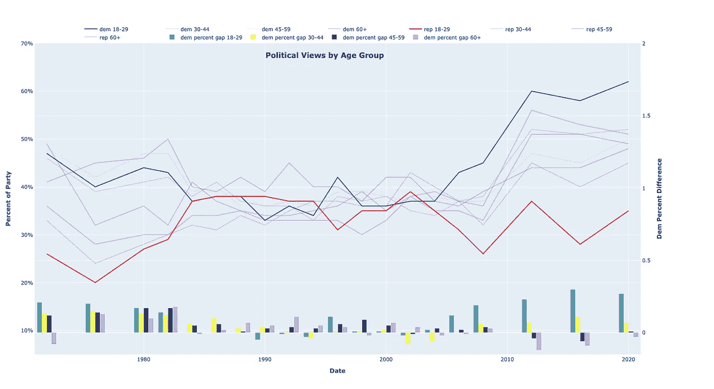

# Python 和 Plotly 按年龄组划分的每次选举的政治观点

> 原文：<https://blog.devgenius.io/political-views-by-age-group-per-election-f9f175f8b8ba?source=collection_archive---------4----------------------->



按年龄组分列的政治观点，以及每年左倾与右倾的百分比差异

# 这些数据从何而来？

这些数据的来源有几个地方。我无法找到包含这些数据的完整列表的网站/来源，所以我从几个来源提取并编辑了这些数据:

*   [https://www . Washington post . com/WP-SRV/politics/interactives/independents/data-year-by-year . html](https://www.washingtonpost.com/wp-srv/politics/interactives/independents/data-year-by-year.html)
*   [https://www . statista . com/statistics/1184426/presidential-election-exit-polls-share-votes-age-us/](https://www.statista.com/statistics/1184426/presidential-election-exit-polls-share-votes-age-us/)
*   [https://www . pewresearch . org/politics/2018/08/09/an-examination-of-the-2016-electromises-based-on-validated-voters/](https://www.pewresearch.org/politics/2018/08/09/an-examination-of-the-2016-electorate-based-on-validated-voters/)
*   [https://www . statista . com/statistics/245884/2012 年投票率-按年龄统计的投票率/](https://www.statista.com/statistics/245884/voter-turnout-of-the-exit-polls-of-the-2012-elections-by-age/)
*   [https://www . pewresearch . org/2008/11/13/young-voters-in-the-2008-election/](https://www.pewresearch.org/2008/11/13/young-voters-in-the-2008-election/)

# 这段代码在哪里？

英寸我的。 [Github](https://github.com/maxwellbade/political_views) 。

# 从这张图表中可以看出什么？

*   越来越多 18-29 岁的人投票给民主党
*   从 80 年代中期到 2004 年，人们的投票相当中立
*   这些年来，保守党内 18-29 岁的人没有太大变化
*   你越老，越保守
*   2016 年见证了 18-29 岁的民主党和共和党选民之间最大的**百分比差异**
*   我们已经看到 18-29 岁的民主党和共和党选民之间的巨大差异；**每次选举的平均百分比差异为 25%**
*   在任何一年中，只有少数年龄组投票给多数党共和党人；在这些人中，大部分是 60 岁以上的人
*   自 20 世纪 70 年代以来，45-59 岁年龄组的共和党投票率稳步上升；然而，2020 年，这一年龄组的民主党投票略高于共和党投票

# 等等，密码在哪里？

好吧，好吧。复制并粘贴。我用的是阿纳康达的 [jupyter 笔记本。如果你需要的话，代码被注释了一些细节。基本上:](https://www.anaconda.com/products/individual)

*   从 github 链接下载
*   下载并安装 jupyter 笔记本
*   在下载 github 包的地方打开 jupyter 和 cd
*   复制下面这些废话，然后点击 shift+enter
*   您可能需要在 jupyter 笔记本中安装 plotly: run: `!pip install plotly`
*   就是这样——下面的代码将生成上面的图像

```
#import plotly, pandas, numpy
import plotly.graph_objects as go
import pandas as pd
from datetime import datetime
from plotly.subplots import make_subplots
import numpy as np#create dfs based on sheets within one excel file
xls = pd.ExcelFile('/Users/mdawg/Downloads/political_ages.xlsx')
df1 = pd.read_excel(xls, 'Sheet1')
df2 = pd.read_excel(xls, 'Sheet2')
df3 = pd.read_excel(xls, 'Sheet3')
df4 = pd.read_excel(xls, 'Sheet4')#add color column if you want to change negative values to red
#change the first color parameter to red or whatever color for negative values
#i chose not to use this for now
df1["Color"] = np.where(df1["dem percent gap"]<0, 'darkcyan', 'darkcyan')
df2["Color"] = np.where(df2["dem percent gap"]<0, 'yellow', 'yellow')
df3["Color"] = np.where(df3["dem percent gap"]<0, 'black', 'black')
df4["Color"] = np.where(df4["dem percent gap"]<0, 'mediumpurple', 'mediumpurple')# Create figure with secondary y-axis
fig = make_subplots(specs=[[{"secondary_y": True}]])#create lines/traces for democrat columns
fig.add_trace(go.Scatter(x=df1['year'], y=df1['dem'],
                    mode='lines',
                    name='dem 18-29',
                    line=dict(color="Blue", width=2),))
fig.add_trace(go.Scatter(x=df2['year'], y=df2['dem'],
                    mode='lines',
                    name='dem 30-44',
                    opacity=.2,
                    line=dict(color="slateblue", width=2),))
fig.add_trace(go.Scatter(x=df3['year'], y=df3['dem'],
                    mode='lines',
                    name='dem 45-59',
                    opacity=.2,
                    line=dict(color="skyblue", width=2),))
fig.add_trace(go.Scatter(x=df4['year'], y=df4['dem'],
                    mode='lines',
                    name='dem 60+',
                    opacity=.2,
                    line=dict(color="darkblue", width=2),))#create lines/traces for republican columns
fig.add_trace(go.Scatter(x=df1['year'], y=df1['rep'],
                    mode='lines',
                    name='rep 18-29',
                    line=dict(color="Red", width=2),))
fig.add_trace(go.Scatter(x=df2['year'], y=df2['rep'],
                    mode='lines',
                    name='rep 30-44',
                    opacity=.2,
                    line=dict(color="mediumvioletred", width=2),))
fig.add_trace(go.Scatter(x=df3['year'], y=df3['rep'],
                    mode='lines',
                    name='rep 45-59',
                    opacity=.2,
                    line=dict(color="maroon", width=2),))
fig.add_trace(go.Scatter(x=df4['year'], y=df4['rep'],
                    mode='lines',
                    name='rep 60+',
                    opacity=.2, 
                    line=dict(color="darkRed", width=2),))#create lines/traces for dem percent gap columns
fig.add_trace(go.Bar(x=df1['year'], y=df1['dem percent gap']
                    , opacity=.7
                    , marker_color=df1['Color']
                    , text=df1['dem percent gap']
                    , textposition='outside'
                    , name='dem percent gap 18-29',),secondary_y=True)
#                     bar=dict(color="green", width=1),),secondary_y=True)
fig.add_trace(go.Bar(x=df2['year'], y=df2['dem percent gap']
                    , opacity=.7
                    , marker_color=df2['Color']
#                     , text=df2['dem percent gap']
                    , name='dem percent gap 30-44',),secondary_y=True)
#                     bar=dict(color="teal", width=1),),secondary_y=True)
fig.add_trace(go.Bar(x=df3['year'], y=df3['dem percent gap']
                    , opacity=.7
                    , marker_color=df3['Color']
#                     , text=df3['dem percent gap']
                    , name='dem percent gap 45-59',),secondary_y=True)
#                     bar=dict(color="limegreen", width=1),),secondary_y=True)
fig.add_trace(go.Bar(x=df4['year'], y=df4['dem percent gap']
                    , opacity=.7
                    , marker_color=df4['Color']
#                     , text=df4['dem percent gap']
                    , name='dem percent gap 60+',),secondary_y=True)
#                     bar=dict(color="darkgreen", width=1),),secondary_y=True)#update layout
fig.update_layout(title="<b>Political Views by Age Group</b>"
                 , height = 900
                 , width = 1650
                 , xaxis_title='<b>Date</b>'
                 , yaxis_title='Percentage'
                 , template = "plotly" #['ggplot2', 'seaborn', 'simple_white', 'plotly', 'plotly_white', 'plotly_dark']
                 )fig.update_traces(texttemplate = "%{percent}")#update x and y axes
fig.update_yaxes(title_text="<b>Dem Percent Difference</b>"
                , range=[-.15,2]
#                 , tickformat = "%"
                , secondary_y=True
                )
fig.update_yaxes(title_text="<b>Percent of Party</b>"
                , range=[0.05,.7]
                , tickformat = "%"
                , secondary_y=False
                )#update legend
fig.update_layout(
    legend=dict(
        orientation="h",
        yanchor="bottom",
        y=1,
        xanchor="right",
        x=.9)
    , title={
        'y':.865,
        'x':0.455,
        'xanchor': 'center',
        'yanchor': 'top'}
)#print it
fig.show()
```

# 结论

这不是一篇详尽的文章。它没有给出那么多信息。但是，在我看来，人们可以重用的代码越多越好。看到趋势走向也很好。显然，共和党人需要在年轻群体中加强他们的游戏。也许找更保守的教授？只是一个想法。

马克斯