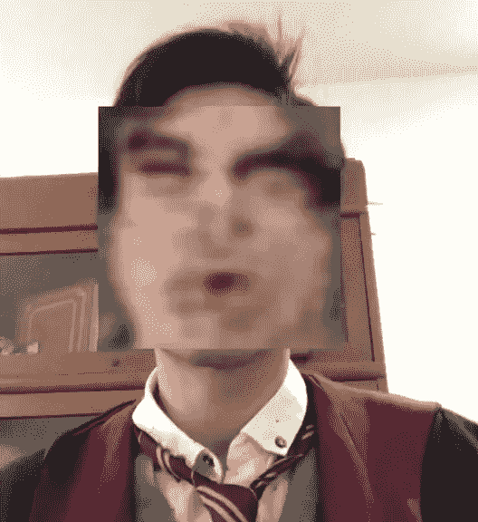
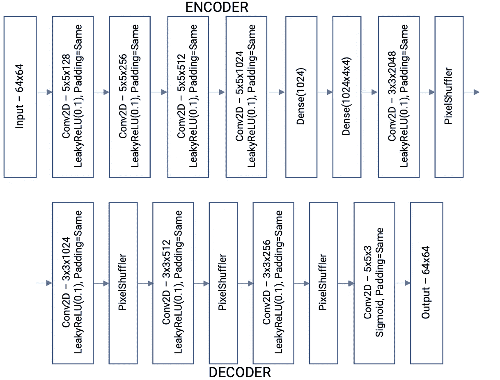
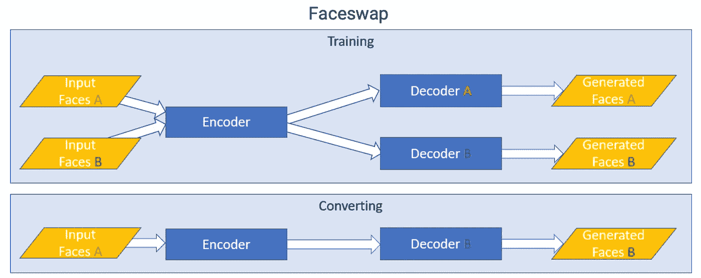
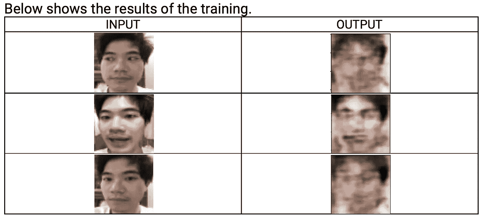
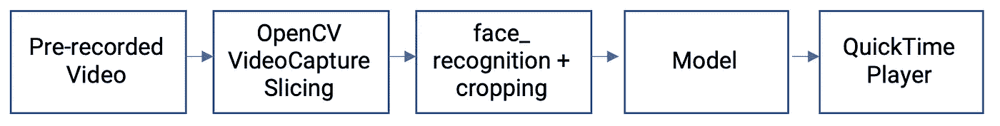

# Polyjuice！我的第一个 ML 项目

> 原文：<https://blog.devgenius.io/polyjuice-my-first-ml-project-76a72783a261?source=collection_archive---------8----------------------->

Faceswap 应用程序。

顾名思义，我的确是个陶工头。所以对于所有得到参考的人来说，无论你属于哪个宫位，都+5 分。

这个项目的主要动机是在一家专注于机器学习的公司的实习应用程序中使用它。

可惜我没有通过最后一关的筛选。你可能想知道为什么我仍然选择分享这个项目，如果它没有好的结果。嗯，即使这个项目没有得到 100 分；我学到的经验和技巧在未来的项目中仍然有用。**因为**，**这条路并不止于此。**

**那么，我的项目是做什么的？**

这个项目的目的是在一个持续大约 10 秒钟的视频中把我的脸和丹尼尔·雷德克里夫的脸互换。这就是为什么我选择把它命名为“Polyjuice”；有什么更好的名字能让我的脸和那个活着的男孩的脸互换呢？

**视频看起来怎么样？**

给你！视频链接:[https://www.youtube.com/watch?v=ESai9lKWcl0](https://www.youtube.com/watch?v=ESai9lKWcl0)尽情嘲笑我创造的怪物吧。我知道我做到了。

那么…这篇文章的前言到此为止，现在让我们进入实质性的部分。

# 数据收集

在最初的测试没有产生足够好的结果之后，这个项目实际上经历了一个重大的改变。

这个项目的第一个版本试图把我的脸换成哈利波特的脸，当时我还戴着眼镜。我戴眼镜的脸和哈利波特戴眼镜的脸。

然而，该模型不能很好地概括，观察到的结果很差。为了简单起见，我决定把我不戴眼镜的脸换成丹尼尔·雷德克里夫的脸。

**我的脸:1318 张图片**

收集我自己的面孔很容易。我只需要使用手机上的自拍相机，就可以轻松地收集到 1318 张照片。

**丹尼尔·雷德克里夫的脸:1045 张图片**

对于我的目标的脸，我收集了大约 1045 张丹尼尔·雷德克里夫的照片。我所做的是裁剪电影中他没有戴眼镜的场景的照片。我认为应该有更好的方法来收集照片，但这是我想到的。

后来，我将这些图片的尺寸调整为 64x64，这样它们就能适合我选择的型号。

# 型号选择

faceswap 技术背后的一般原理是具有一个编码器和两个解码器 A 和 b。编码器的目标是学习权重以产生输入图像的压缩版本(潜在矩阵);而解码器对于每个面部的目标是在给定潜在矩阵的情况下重建输入面部。

换脸的时候，我想把我的脸(A 面)换成丹尼尔·雷德克里夫的脸。为此，我将我的脸输入到公共编码器中，并使用解码器 B 来生成脸 A(我的)和脸 B(丹尼尔的)的组合。发生这种情况是因为解码器 B 太习惯于生成丹尼尔的。这就是为什么当它看到类似于一张脸的东西(潜在矩阵)时，它会试图重新生成同一张脸，但具有丹尼尔的特征。

当谈到制作自己的模型来创建 faceswap 视频时，我不是太了解，所以我在互联网上查看了多个模型。我看到了这个帖子:

 [## 进入 Cageverse——用自动编码器进行深度伪造:在 Keras 和 Tensorflow 中的实现

### 把尼古拉斯·凯奇带到重案组

medium.com](https://medium.com/gradientcrescent/deepfaking-nicolas-cage-into-the-mcu-using-autoencoders-an-implementation-in-keras-and-tensorflow-ab47792a042f) 

我必须选择一个能够在没有 GPU 的机器上很好地训练和运行的模型。这么说吧，我有这个项目的最低要求。后来，我震惊地发现数据集训练需要大约 3~4 个小时，而且在项目提交之前我没有多少时间了。

在运行他的模型时，我遇到了一个名为 PixelShuffler 的函数的问题。谢天谢地，你可以在这个 github repo 里找到函数:[https://gist . github . com/t-AE/6e 1016 cc 188104d 123676 ccef 3264981](https://gist.github.com/t-ae/6e1016cc188104d123676ccef3264981)

当我运行这个模块时，实际上出现了一个错误。这和 *normalize_data_format* 有关。在 *keras.utils，*中找不到该函数，因为它在 *keras.backend.common.* 中

修好那部分后，模型运行良好。

# 培训和测试

forum.faceswap.dev/download/file.php?id = 141 & sid = f 617 aa 20026 ad 3 fdba 1 afce 5b 2963 f 43

要训练 faceswap 模型，您必须实例化 1x 编码器和 2x 解码器。如上图所示，为了训练，两面都使用一个编码器作为“公共编码器”

训练的目标如下:
编码器应该能够在给定人脸 A 或人脸 B 的情况下，将输入图像编码成有意义的潜在矩阵(图像的压缩版本)。
解码器 A 应该能够从潜在矩阵中重新生成一张脸 A。
解码器 B 应该能够从潜在矩阵中重新生成 a 面 B。

训练过程如下:
[1]用解码器 A 训练用于 A 面的编码器。
[2]用解码器 B 训练用于 B 面的相同编码器(权重来自[1])

用于训练的参数有:
时期:100
批量:32
无序=真
验证分割= 0.25
Adam 优化器(Ir=5e-5，beta_1=0.5，beta_2=0.999，loss="mean_absolute_error ")

所以最初为了训练，我认为迭代次数应该在 50 左右。在 Iryna Korshunova 等人的论文中，我震惊地发现了使用卷积神经网络的快速面部交换。他们的迭代次数达到 10，000 次。我不得不妥协；由于时间有限，没有可用的 GPU，我只能拥有 100 个纪元。

左边是我的脸。右边是换脸的照片

# 生成视频

视频生成框图

**预先录制视频:** 我实际上花了大约 30 分钟拍摄了大约 10 秒钟我看着镜头检查我换脸后的样子。

**OpenCV VideoCapture 切片:** 对视频进行切片，我用的是 OpenCV 的 VideoCapture.read()。我实际上遇到了一个问题，因为我使用的 iPhone 嵌入了元数据，导致我的照片被旋转。幸运的是，由于笔记本电脑上安装了苹果的操作系统，解决这个问题不成问题。

**Model:** 由于我的模型的输入是一个 64x64 像素的图像，所以我必须将图像调整为 64x64 像素。只有这样，我才能将它输入到我的模型中。然而，我的模型，到目前为止，已经把我的脸变成了更邪恶的东西，而不是哈利波特的脸。

**QuickTime Player:** OS Catalina 提供了一个名为 QuickTime Player 的应用程序，我用它将我的帧拼接成视频形式的成品。

# Github 回购

为了运行代码，我使用了 Python 3 . 7 . 6[https://github.com/tdchua/tim_potter_faceswap](https://github.com/tdchua/tim_potter_faceswap)

# 结束语

当我开始写这篇文章时，已经是 3 月 31 日凌晨 2:09 了。首先，我要感谢思维机器让我有机会申请他们的实习项目。我要感谢我的小妹妹和我的 Chynna，她们在数据收集和视频编辑方面帮助了我。

这是我自己完成的第一个机器学习项目，这的确是一次相当不错的经历。数据收集相当困难，也是流程中最耗时的部分。在这项任务中，我花了最多的时间收集我和哈利戴眼镜和不戴眼镜的照片。在项目的某个部分，我错误地处理了我的数据，最终删除了其中很大一部分；所以我不得不花费时间来恢复丢失的图像。我建议在处理数据时要格外小心。

我还了解到，如果你白天工作，晚上想放松一下，那就很难管理好你的时间。不过，完成这个项目也很有趣。它教会了我创建一个 ML 项目的许多方面，从数据收集，模型选择，当然，还有研究。我不认为代码在第一次尝试时会运行。我不得不花几分钟到几个小时的时间试着调试，并且不放弃。

型号选择是我不太熟悉的地方。仅仅理解这个概念是不够的，因为您必须选择一个足够强大的模型来满足您的项目需求。您不能简单地将 MNIST 自动编码器用于 Faceswapping 之类的应用。即使你选择了合适的模型，如果你拥有的计算机不能足够快地训练它，它也没有任何意义。此外，在培训期间，在接受培训前仔细检查你的代码是非常重要的。由于数据路径不正确，您可能会浪费大量时间。

总而言之，我发现这个项目相当具有挑战性和吸引力。即使我的模型没有达到我的期望，我仍然认为这是我未来项目的一次很好的学习经历。我希望你能允许我进一步磨练我的技能，并参与思考机器的项目开发。谢谢您们。