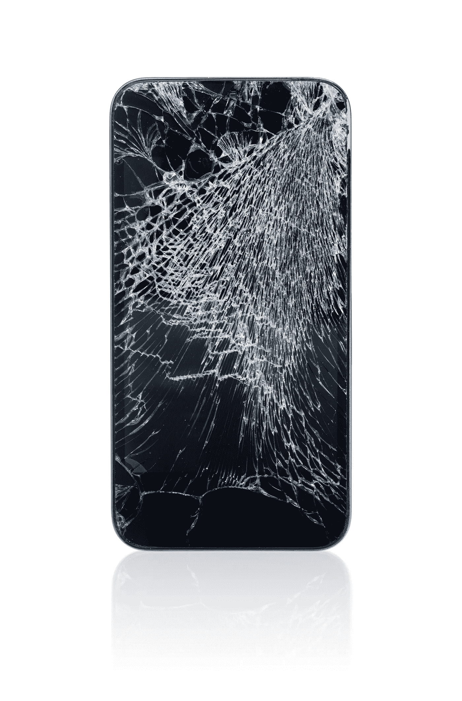

# 爆米花质量保证测试

> 原文：<https://blog.devgenius.io/popcorn-testing-66295e6d5f39?source=collection_archive---------22----------------------->

我妻子叫我爆米花丈夫。几个月来，我也被称为爆米花爸爸。

这是因为我散发出一股美丽可口的黄油味，混合着烟熏烤玉米味吗？

嗯，是的，这是真的。

但也是因为我有足够的耐心，就像一摊热黄油中的玉米粒一样。(这是一个有趣的句子，说 10 次真的很快)

我很不耐烦。我知道，我也没有耐心说。

可能有人会称之为 ADHD、ADD、HD、DVD、PHD……没关系。

重要的是，我没有多少耐心。

这是我在 QA 工作期间的一大财富。

为什么？

因为如果我有 20 秒的耐心第一次浏览一个应用程序，以确定它的可用性，它的不同功能和特性，这是用户决定是否要在它身上投资更多时间(或金钱)的两倍多的时间。

没错。用户对一款应用的第一印象不会超过几秒钟。

之后，被动积极(或完全主动积极)卸载。

引用妮莎·罗森菲尔德 2016 年 5 月发表在 Appsflyer 上的一篇文章:

“从设备中删除应用程序是一个相当激进的举动，显然表明有问题。了解用户卸载应用程序的原因、时间和对象对于防止用户流失极其重要。在一个免费增值占主导地位的领域，确保持续使用对成功绝对至关重要。没有它，货币化几乎是不可能的。”

查看完整文章[此处](https://www.appsflyer.com/blog/new-data-shows-uninstalls-remain-significant-pain-apps/)

是的，卸载一个应用程序是一个侵略性的举动，而且我们大多数人都至少感受过几次。

这篇文章是 4 年前写的。你最好相信我的话，从那以后，用户的期望提高了一英里，对糟糕的可用性失去了耐心。

如果你比我更有耐心，不要惊慌。有耐心是可以的，但这并不意味着你不能做好你的质量保证工作。

这是我建议你做的:

复制不耐烦。

设置一个 20 秒的计时器，当它响起时，注意你使用这个应用程序的感受。

是愉快的感觉，还是沮丧的感觉？

此时，您是否更愿意:

A.将你的手机砸向墙壁(我建议不要使用你公司的测试设备进行测试)

或者

B.继续探索应用程序？

TIK 托克 TIK 托克 TIK 托克 TIK

砸碎手机

跟踪卸载是一个非常好的现实检查。我强烈建议你尝试说服你的客户跟踪卸载。是的，这可能会伤害你公司的自尊。最重要的是，这可能会伤害你的 UX 团队的自尊(这很有趣，所以带点零食去享受吧！)

Sop 概括今天的短文:

在测试你的应用/软件之前，你需要回答第一个问题:

那款应用的用户需要多久才能……流行！

PS:如果想了解更多 2020 年卸载统计数据，谷歌一下。我开始做，想写几个数字，但是就是没有耐心全部写下来。我桌上有一堆电话要砸。

砸的开心！

***Raphael Reiter****在 Appsfactory 担任质量顾问。在此之前，他是一名对应用心理学和可用性充满热情的 iOS 开发人员。*