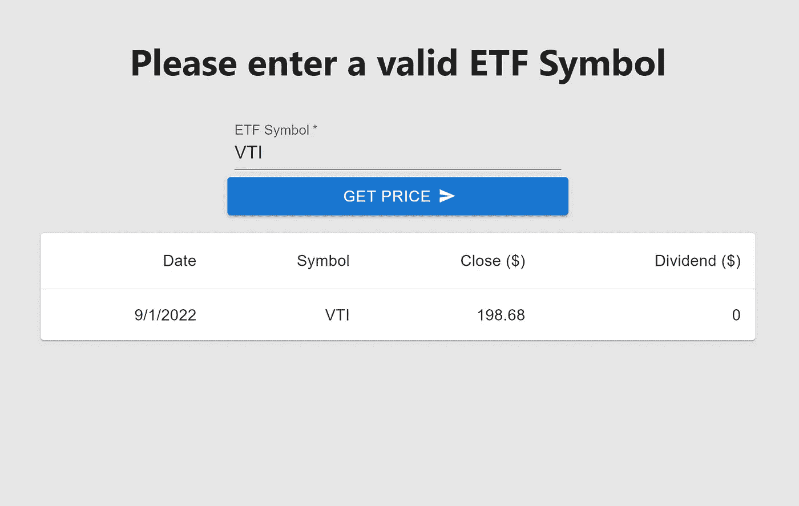

# 投资组合共享— ETF 跟踪系统(代理服务器)

> 原文：<https://blog.devgenius.io/portfolio-sharing-etf-tracker-proxy-server-afcc89508dea?source=collection_archive---------10----------------------->

## 查看我在[我的技术文章](https://yumingchang1991.medium.com/technical-article-structure-on-medium-954850e1ef4d)中的所有其他帖子

ETF 追踪器截图，现在是最低可行的产品

[*ETF 追踪器*](https://yumingchang1991.github.io/proxy-frontend/) 是我跟踪一个投资组合表现的副业项目。它利用部署在 AWS EC2 上的转发代理服务器来管理从客户端到第三方 API 服务器的流量，在本例中是 [*Marketstack*](https://marketstack.com/documentation) 。

# 为什么选择代理服务器

## **1。更好的用户体验**

缓存路由减少了与 Marketstack API 通信的需求，从而增加了服务器响应时间。

## 2.更好地控制预算

如果你没有意识到这一点，提供及时的股票价格是一项受控且昂贵的业务。当您要求数据更加实时时，成本会更高。这也是彭博的数据中心总是被全球一些主要交易机构包围的原因之一——为了获得最及时的数据，以便他们能够在信息方面占据优势。

我使用免费层的 Marketstack API 服务，这意味着每月有 100 个 API 调用的限制来获得收盘价。

向代理服务器添加缓存减少了与 Marketstack 通信的需要。这样做，降低了从我们的代理服务器到 Marketstack API 服务器的命中率；因此，使我们的每月预算更可控。

当然，限制我的代理服务器的命中率也有帮助。

## 3.更好的安全性

它不会从前端向第三方服务公开访问令牌。

换句话说，用户无法窃取访问令牌并使用我的配额来享受 Marketstack 服务。

# 什么是技术堆栈

## 后端

*   带有 TypeScript 的 Node.js
*   节点文件系统和流
*   MongoDB 地图集
*   AWS 弹性豆茎和代码管道
*   API 缓存
*   速率极限

## 前端

*   React.js with TypeScript
*   带有类型脚本的 MUI
*   Chart.js

# ETF 跟踪者的路线图

开发这个项目的计划更加敏捷。首先交付最小可行产品，然后频繁更新。

正在开发的特性可以在 [*ETF 追踪器*](https://yumingchang1991.github.io/proxy-frontend/) 的特性部分找到。

预计最终产品将能够

1.  跟踪 ETF 投资组合的表现，这意味着使用 MongoDB 来存储初始购买成本
    *(使用数据库来存储初始成本而不是来自 Marketstack 的请求历史数据的原因是，我希望减少调用 Marketstack API 的需要，这样就不太可能超过每月配额)*
2.  ***【已完成】*** 记住一个用户的 portfolio，表示一个简单的用户管理系统
    *(由于前端和后端不在同一个域，认证将由 JSON Web Token 完成)*
3.  可视化所选投资组合的表现，初始支出、当前市值和损益一目了然。
    *(将使用 chart.js 或 D3 可视化数据)*
4.  将当前投资组合导出为 csv 文件
    *(ETF 往往只是用户总资产的一部分。他们可能希望原始数据离线，以便与他们的总资产管理文件集成)*
5.  ***【已完成】*** 管理员用户可以导入 csv 文件来管理系统接受哪些符号

# 改善用户体验的功能

作为一名前产品经理，我很容易列出一系列可以将用户体验提升到更高水平的功能。

有一本关于网络 UX 的好书，作者是史蒂夫·克鲁格，如果你对这个话题感兴趣的话。

我采取的第一步是专注于防错设计。尽可能多地识别可能破坏用户流的方式。

用户流的爆发时刻是我们的用户开始思考的时候。这是我设计一个防错程序的出发点。

1.  当用户输入无效的 ETF 符号时，它不会破坏服务器
2.  来自用户输入的 ETF 符号将总是被转换成大写，因为它在第三方 API 中是区分大小写的
3.  键入时自动符号建议

*更多待补充……*

# 我克服的最困难的挑战

截至 2022 年 9 月 3 日，大约在项目开始后 2 周，最大的挑战是正确设置环境。

我期望的是，当一个新的提交被推送到 GitHub Repo 时，它会自动将 TypeScript 编译成 JavaScript，并将这些编译的 JavaScript 部署到 AWS EC2。所以作为一名开发人员，我只需要专注于编写 TypeScript。

我想出了一个方法来完成这一点，然后写一个关于媒体的教程。*(有兴趣的话我写的文章是* [*3 步部署 TypeScript 到 AWS 弹性豆茎带连续交付*](/3-steps-to-deploy-typescript-to-aws-elastic-beanstalk-with-continuous-delivery-611bc7ecf15c) *)*

这是我第一次使用 AWS 服务，并建立一个 YML 文件来管理 CI/CD 流程。事实证明，AWS 官方文档非常有用，但同时也很容易丢失。

我的应对策略是回答以下问题:

1.  什么是常见的 AWS 服务
2.  这些服务是如何相互连接的
3.  什么服务可以满足我的要求
4.  如何使用这些服务(阅读 AWS 文档的时间)
5.  开始写一个简单的服务器，测试我的理解

最终的解决方案是利用代码管道监听我的 repo 上的新提交并编译 TypeScript 然后，通过 Elastic Beanstalk 将 JavaScript 服务器部署到 EC2 实例。

配置可以在 [*后端 GitHub Repo*](https://github.com/yumingchang1991/proxy-backend) *的`buildspec.yml`中找到。*

# 相关链接

*   [*ETF 追踪器*](https://yumingchang1991.github.io/proxy-frontend/)
*   [*后端 GitHub Repo*](https://github.com/yumingchang1991/proxy-backend) ，连接 AWS
*   [*前端 GitHub Repo*](https://github.com/yumingchang1991/proxy-frontend) ，部署到 GitHub 页面
*   [*部署 TypeScript 到 AWS 弹性豆茎的 3 个步骤*](/3-steps-to-deploy-typescript-to-aws-elastic-beanstalk-with-continuous-delivery-611bc7ecf15c)