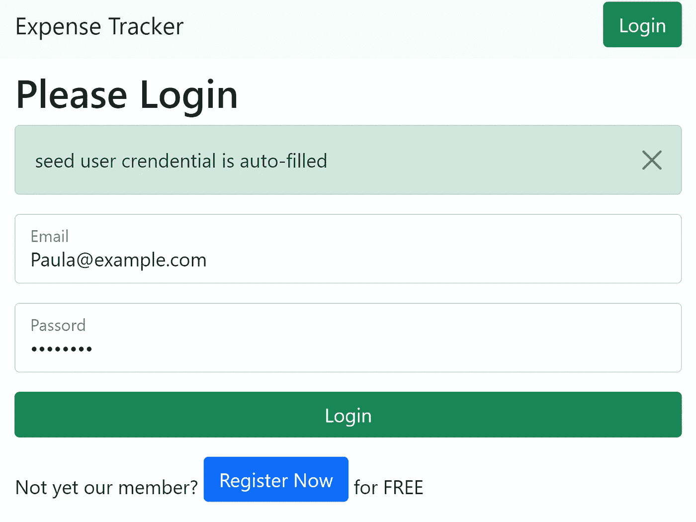
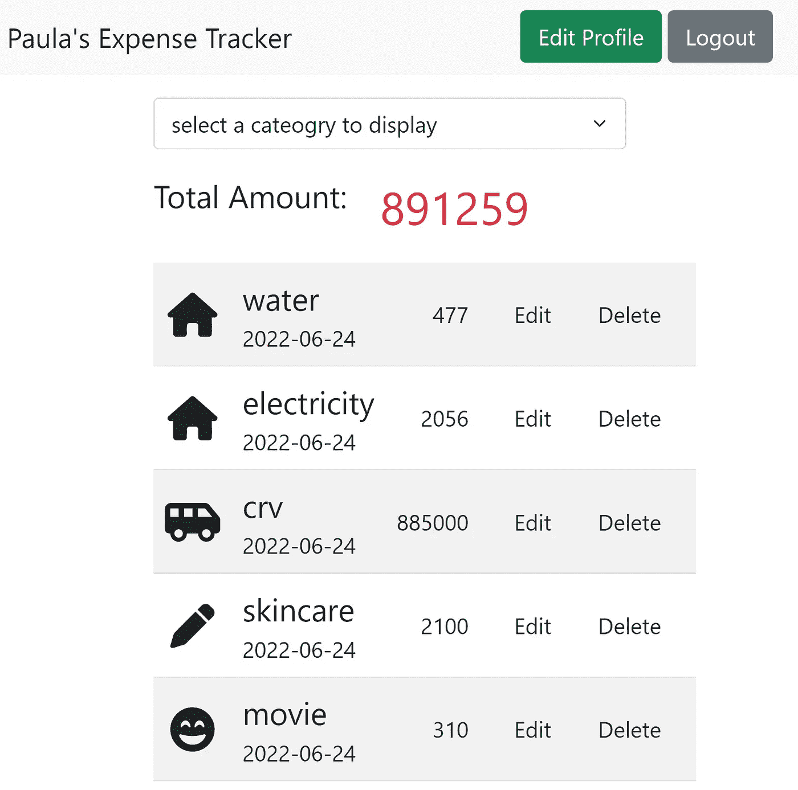

# 投资组合共享—费用跟踪

> 原文：<https://blog.devgenius.io/portfolio-sharing-expense-tracker-ce4c54c1a91d?source=collection_archive---------12----------------------->

## 查看我在[我的技术文章](https://yumingchang1991.medium.com/technical-article-structure-on-medium-954850e1ef4d)中的所有其他帖子

我很自豪也很兴奋，同时也很害怕与大家分享我在[投资组合](https://yumingchang1991.github.io/personal-portfolio/)中的第一个全栈项目。

*   骄傲兴奋，因为今天我终于产生了足够的信心，相信自己有资格成为一名网络开发人员
*   害怕是因为当我看着这个项目时，我可以发现很多改进它的机会
*   此外，当然还有我不知道但想学的知识。所以也许你可以在评论中与我分享你的想法，成为我的阳光！

# 费用跟踪器和 GitHub Repo

大约 3 年来，我一直在记录我的所有支出。对我来说，想象一个用户想要这样一个工具是小菜一碟；因此，费用追踪似乎是一个很好的起点。

登录页面的屏幕截图

费用页面的屏幕截图

*   这是部署在 Heroku 上的[费用追踪器](https://dry-plateau-72468.herokuapp.com/)的链接
*   这是我的 GitHub 回购

## 放弃

1.  这个项目是活动的，这意味着随着时间的推移，它很可能会发生变化
2.  只要 Heroku link 在我的投资组合中，它就会保持活动状态。如果你发现它不再可访问，这意味着我用其他项目取代它。更多最新项目，请访问[我的作品集](https://yumingchang1991.github.io/personal-portfolio/)
    **目前已被撤下，因为 Heroku 自 2022 年 11 月**起不再提供免费计划

# 使用的技术和开发过程

这个项目的技术结构非常简单:

*   首先， **Express** 用于快速创建服务器和设置路由
*   其次，**mongose**用于建立模式并与 MongoDB Atlas 交互
*   第三，**手柄**用于启用服务器端渲染，**引导**用于使界面更漂亮，**手柄助手功能**用于改善用户体验(我们都很忙，所以不要让我打一个东西)
*   然后，包含 **Passport** 创建用户系统；bcrypt 用于保护私人数据
*   然后，导入 **connect-flash** ，根据不同的用户行为显示警告信息
*   然后，创建**播种器**向数据库提供测试文件
*   最后，可重用函数**被重构**以增加可读性

# 自我访谈反思

## 我觉得最熟悉的技术是什么？

我越来越习惯使用 Express 框架来设置 web 服务器。我可以生动地想象一个请求如何从客户机传到服务器，按照我写的顺序通过中间件，然后将响应发送回客户机。

通过查看这个请求-响应过程，我更加理解为什么中间件被放置在某个位置，以及即使在呈现时我没有发送任何上下文对象，handlebars 如何读取一些属性。*(提示:handlebars 正在读取响应以进行渲染)*后者可以帮助我设计一个更好的视图模板。

## 那最起码的呢？

起初，我认为 connect-flash 以一种神秘的方式工作。我不确定 flash 消息如何通过不同的模块传递。我被这个方法弄糊涂了。

我后来才知道，钥匙其实是在`flash()`前面的`request`物体。Express 中间件只是给请求/响应对象添加副作用的功能。通过看到这个事实，它帮助我更好地理解请求/响应周期。

([这是我的一分钟解释快速中间件的帖子](https://yumingchang1991.medium.com/express-middleware-explained-in-one-minute-671af8d5a3b9)，如果你对它感兴趣的话)

## 道路上有什么障碍？我如何克服它们？

我只列举几个障碍:

*   将 Mongo 文档中的日期类型格式化为 YYYY-MM-DD，以便数据可以在主页中按预期呈现，并作为编辑记录时的默认值。
    我看了 MongoDB 和 Mongoose 文档，了解了`aggregation()`。然而，它与典型的猫鼬`Model.find()`或`Model.create`有些不同。如果我想使用`aggregation`，我需要将当前基于承诺的链接重写到 async/await 中，以获得其返回的结果。我认为重构太费力了，所以只需写一个简单的帮助函数来返回想要的日期字符串。
*   我希望在编辑现有文档时，所有的信息都预先填写在表格中。痛点是`select`和`option`。需要根据其输入动态选择其中一个选项。
    我查看了把手文档，发现我们可以将`{{#if}}`与自定义助手结合起来，在视图模板中创建更复杂的条件。它非常有效。
*   有一个简单的客户端 JavaScript 通过`express.static()`提供。我试了几次，但是客户端没有从服务器收到任何要执行的脚本。嗯，这是初学者的错误。我忘了在 html 文件中添加`<script>`。我只是在几次尝试失败后突然想起这件事。

## 在所有这些障碍中，我最喜欢哪一个？

`aggregation`让我真正感到兴奋的是，数据在返回之前是如何在数据库中处理的；然而，它没有在这个项目中使用。

因此，我会说最愉快的是车把定制助手。因为它扩展了我以更大的灵活性进行渲染的能力。我感觉越来越好了。

## 还有其他外卖吗？

我发现在一个路径中直接使用渲染不会改变显示 URL，但是会让用户留在原来的路径中。这可能会引起一些不必要的混乱。

例如，`GET /users/register`会呈现一个注册表单。提交表单时，将路线定义为`POST /users`更符合逻辑。然而，我们总是希望在服务器端执行某种形式的表单数据验证，当出现错误时，我们会将用户重定向回注册表单，将他们以前的输入作为默认值。如果我们将路径设计为`POST /users/register`，那么我们可以直接在`POST`路径中呈现注册页面，并非常容易地将用户输入传递给它。

如果我们把它设计成`POST /users`，那么如果我们直接渲染注册页面，用户 URL 就停留在`/users`而不是`/users/register`。使用`POST /users`的主要缺点是我们需要找出另一种方法将用户输入传递给`GET /users/register`。

没什么大不了的，使用`POST /users/register`只是节省了一些开发痛苦，而没有放弃太多的路径可读性。

# 下一步

以下是我计划完善这个项目:

1.  制作不同的视图，按月和按类别，并使用聚合使计算发生在数据库中
2.  实施忘记密码和更改密码
3.  重构当前代码
4.  制作一个按钮来切换内容显示语言