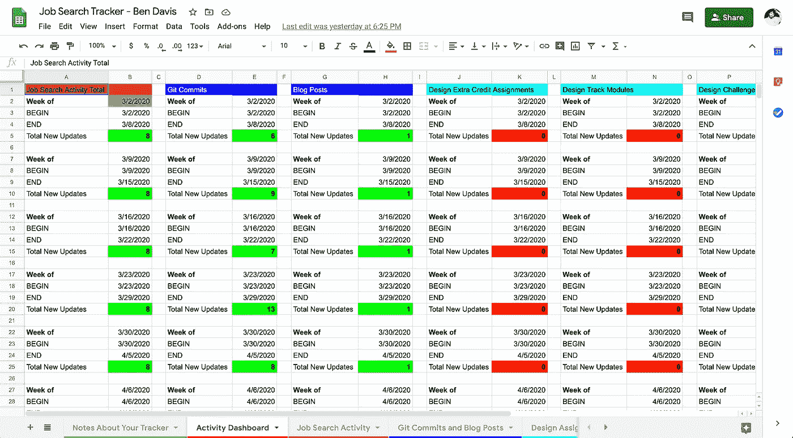
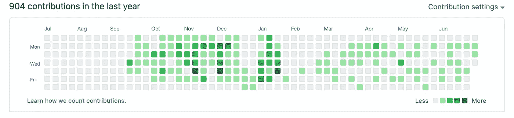
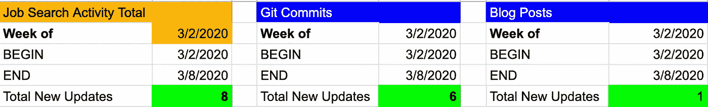
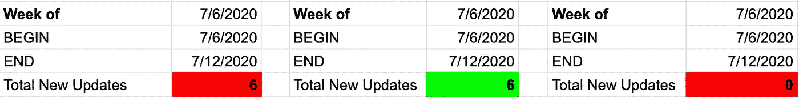

# 训练营结束后的求职过程

> 原文：<https://blog.devgenius.io/post-bootcamp-job-search-process-563e06b9fbbc?source=collection_archive---------30----------------------->

## 熨斗学校软件工程训练营毕业后的要求

在 [Unsplash](https://unsplash.com?utm_source=medium&utm_medium=referral) 上[猎人赛跑](https://unsplash.com/@huntersrace?utm_source=medium&utm_medium=referral)的照片

到目前为止，我的求职还没有涉及太多的着装。我于 1 月从熨斗学校软件工程训练营毕业，并于 3 月 2 日正式开始找工作。到了月底，由于冠状病毒疫情，所有面对面的活动，从聚会到面试，都被取消了。无论如何，大部分求职过程都是在线的，但现在完全是在线的。为了有资格获得熨斗学校的退款保证，我遵循了该计划规定的某些准则。

 [## 学习编码、数据科学、UX/用户界面设计和网络安全分析

### 因为熨斗学校致力于帮助你在你的学习领域获得工作机会，某些项目…

flatironschool.com](https://flatironschool.com/career-services-commitment/) 

我很感激我被迫遵循这个过程，因为这个结构让我在这段时间保持活跃和理智。计划条件的更多细节可以在上面的链接中找到，但我将概述软件工程师的主要目标，我每周都努力完成这些目标，以保持有资格获得退款保证，更重要的是最终获得一份可以增长我技能的工作。

退款保证的指导方针并不是熨斗学校提供的唯一职业支持。他们给我指派了一名职业顾问，自从我开始找工作以来，我每周都和他见面。她指导过我的面试，审阅过我的简历，并为我提供了大量有效求职的建议。我们可以很容易地用“求职跟踪器”谷歌电子表格查看我一周的求职活动，我可以在那里记录我的每周活动。对我来说，这是一个简单的方法，可以让我看到自己的进展，记录下我在求职过程中的完成情况，以防我在六个月后需要申请学费退款。

从上面的求职跟踪电子表格截图中，你可能会发现，Flatiron School 的软件工程师求职流程主要有三个方面:求职活动(网络)、git 提交和博客帖子。

## 求职活动(网络)

作为求职过程的一部分，我每周至少联系 8 个人。该计划为哪些人可以算作 8 个每周联系人之一提供了指导。具体细节可在以下 pdf 中找到:

[https://assets . ctfassets . net/hkpf 2 qd 2 vxgx/6 VJ 2 po 8y 7v 9 lqvczch 0 C2 r/a 344287 f 721321 a 270 a 9 a 6 e 33 fcd db 83/UPDATED _ JOB _ TRACKER _ CSC _ CONTACT _ GUIDELINES _ _ 1 _。pdf](https://assets.ctfassets.net/hkpf2qd2vxgx/6Vj2PO8Y7v9lQVCzch0C2R/a344287f721321a270a9a6e33fcddb83/UPDATED_JOB_TRACKER_CSC_CONTACT_GUIDELINES__1_.pdf)

底线是合格的联系人必须为未来的雇主工作。这不包括外部招聘人员。为了让一个雇主被算作**未来的**雇主，必须有一个相关的招聘启事。职务公告的链接是职务搜索活动电子表格中需要填写的字段之一。其他一些必填字段包括公司名称、联系人姓名和职务、日期、行动(外展、面试……)、联系方式(当面联系、电子邮件……)和职位。

如果没有激励，我就不会联系这么多的人/公司。LinkedIn 在这方面帮了大忙。我不仅能在他们的求职板上找到机会，还能很容易地找到在我申请的公司工作的联系人。如果你能和公司里的某个人建立沟通渠道，那么你的职位候选人资格会更强。单凭一份申请很难引起注意。

## Git 提交

求职过程每周至少需要 5 次 git 提交。5 git commits 是一个很大的数字，因为它很容易获得，并确保软件工程师求职者不会一周不编码。通常情况下，我每周会推送 5 次以上的 git 提交，因为我尽量让我的提交小而具体。

除了通过编码来提高你的技能，定期提交给 Github 也表明你致力于编程。我在我的简历、电子邮件签名和 LinkedIn 联系信息中包含了我的 Github 个人资料的链接，所以我确保“保持 Github 绿色”，正如我的职业顾问喜欢提醒我的那样。

你能猜到我在训练营的几个月吗？

## 博客帖子

我每周写一篇文章，并把链接贴到求职追踪电子表格上。不撒谎。如果没有熨斗学校的激励，我可能不会这样做，但我很高兴我这样做了。一旦求职结束，我打算继续写关于编程的博客。我可能不会像现在这样每周写一篇，但我会写的。

关于编程的写作展示了我在这方面的知识，以及我用简单易懂的方式交流复杂话题的能力。这也让我坚持编码和学习，因为我不能一周又一周地写同样的概念。

如果我一周至少联系了 8 个人，提交了至少 5 个 git，发表了一篇博客文章，并在我的求职跟踪电子表格中输入了所有信息，我会很满意地看到这一周的三个绿色方框。

如果我在这些领域中的任何一个落后了，这个方框就是红色的，我知道在周末之前我还有工作要做。

本周需要 2 个联系人和 1 篇博客文章

虽然将红盒子变成绿盒子是一条漫长的道路，但熨斗学校的求职过程让我保持了组织性和积极性。我建议任何软件工程师求职者对完成类似的周目标负责，即使没有学费退款。