# Postgres 索引

> 原文：<https://blog.devgenius.io/postgres-indexing-874063f697ed?source=collection_archive---------8----------------------->

让我们从为什么索引开始，然后我们将讨论什么是索引。

当我们在 Postgres 上存储表时，它们被存储在 Postgres 堆中。它们实际上是作为物理文件存储在数据库中的。当我们从一个文件中获取记录时，它们是从一页(或多页)开始顺序搜索的。在 Postgres 中默认情况下，页面大小为 8KB。因此，随着记录数量的增加，将会创建更多的页面，因此搜索/获取数据将会变得更慢。

同样**当我们在表中存储数据时，它们(元组)是不排序的。**你知道为什么吗？

这样做的原因是，每当我们删除一些行时，就会创建一个空间，当存储新行时，它们可以存储在该空间中。

对于演示，让我们创建销售表:

```
**create** **table** sales (order_id **INT** **primary** **key**,region **VARCHAR** **not** **null**,country **VARCHAR** **not** **null**,item **VARCHAR** **not** **null**,sales_channel **VARCHAR** **not** **null**)
```

为了测试，我在同一个表中上传了 10 万行。

```
**select** ctid, * **from** SALES **limit** 10;
```

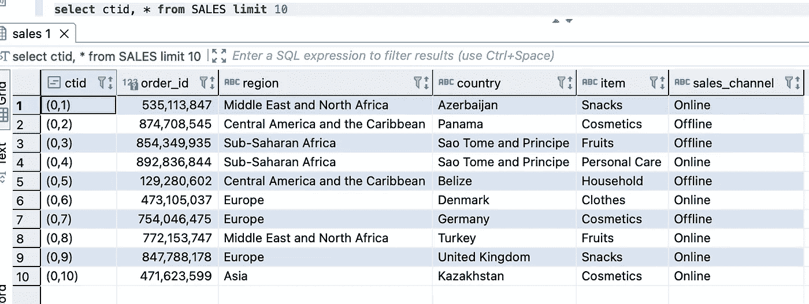

在上面的屏幕截图中，我们可以看到 ctid 列——该列表示该页上记录的页码和偏移量。

(0，1) ->第 0 页和该页中的第一条记录

对于我们的销售表，大小= 7808 KB

对于主键索引大小= 2776 KB

```
**select** pg_size_pretty (pg_relation_size('sales')), pg_size_pretty (pg_indexes_size('sales'));
```

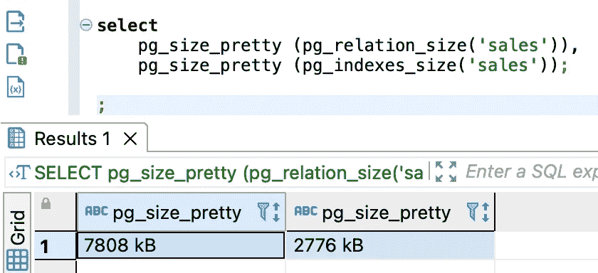

现在尝试使用 order_id(索引列)查找记录，让我们看看解释分析如何给出结果:

```
**explain** **analyze** **select** order_id  **from** sales **where** order_id = 399401366;
```

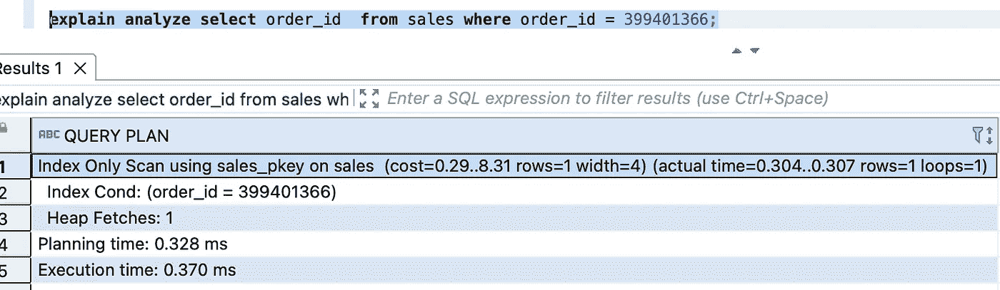

我们可以看到只有一次索引扫描，总执行时间只有 0.370 毫秒。

**注意**:在上面的查询中，我们正在获取 order_id(这似乎不相关，因为我们已经有了 order_id)。因此，如果我们添加其他列，如 region 和 country，它将增加执行时间，因为它将进行索引表扫描以及表扫描，但与不可索引的搜索参数相比，执行时间仍然会少得多。

现在，尝试使用非索引列获取数据，并查看结果:

```
**explain** **analyze** **select** region, order_id  **from** sales **where** country = 'Guinea-Bissau';
```

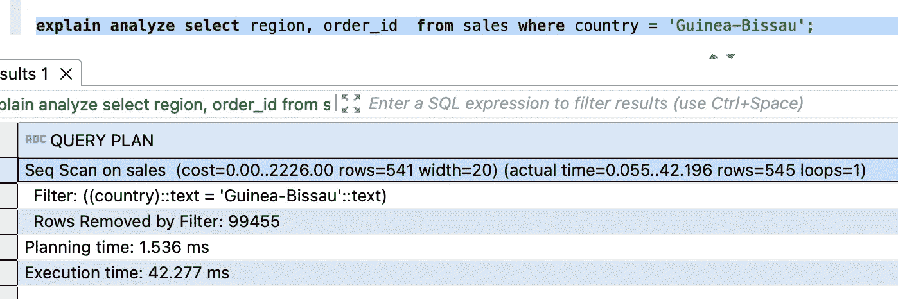

我们可以看到它花费了 42.277 毫秒，但随着记录数量的增加，它将继续增加。

# 那么，优化查询速度的解决方案是什么呢？

# 指数

索引为我们提供了一种通过减少磁盘搜索来优化搜索的方法。与常规表一样，索引是 Postgres 堆上的物理存储。

**索引如何优化查询？**

使用索引列，我们可以从索引存储的数据中获取页面信息，最终我们可以直接从相应的页面获取数据，从而减少了执行时间和比较次数。基本上，我们正在消除全表扫描。

索引作为键值对存储在存储中

(键)= >(页面，偏移量)

现在让我们为 country 列添加一个索引，并检查它是否真的减少了执行时间。

```
**create** **index** **on** sales(country);
```

**案例 1** :以索引列为搜索条件进行搜索

```
**explain** **analyze** **select** region, order_id  **from** sales **where** country = 'Guinea-Bissau';
```

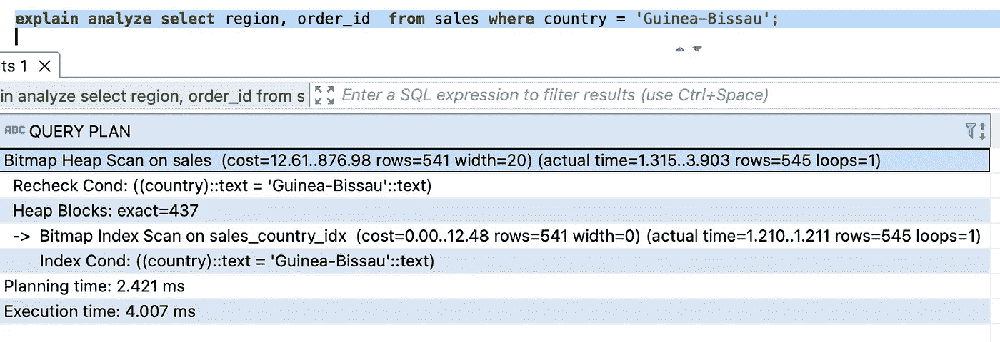

现在，通过在 country 列上应用索引，我们能够将执行时间减少大约 38 毫秒(42 -4)

在上面的截图中，我们可以看到 Postgres 使用索引扫描和国家列来获取确切的页面，然后进行堆扫描来选择特定的记录。

**案例 2:** 使用索引和非索引列进行搜索

```
**explain** **analyze** **select** region, order_id  **from** sales **where** country = 'Guinea-Bissau' **and** item = 'Meat';
```

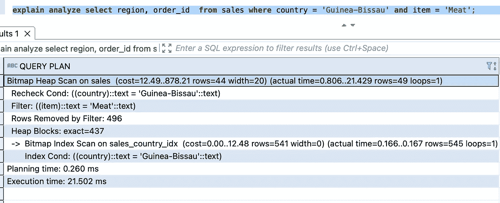

在这种情况下，我们可以看到，首先使用索引国家列获取页面，然后在该页面上应用 item = 'meta '过滤器，然后获取所需的字段。我们还可以看到，使用过滤器查询已经删除了 496 行来获取最终数据。

**案例 3:** 使用一个索引列和一个复合索引列进行搜索(组合多个索引)

```
**create** **index** **on** sales(sales_channel, item);**explain** **analyze** **select** region **from** sales **where** country = 'Guinea-Bissau' **and** sales_channel = 'Offline' **and** item = 'Meat' ;
```

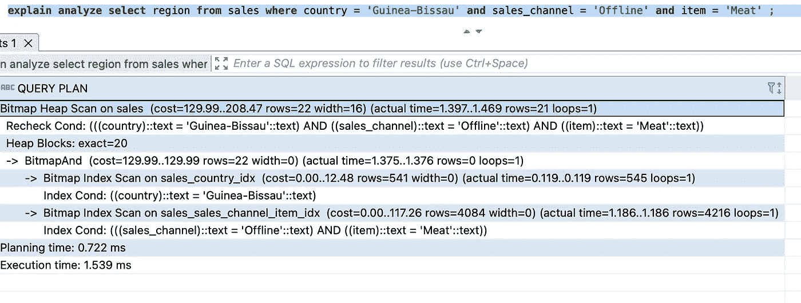

在这里，我们可以看到对 sales_channel_item 索引进行了索引扫描，对 sales_country 索引也进行了索引扫描，并且使用了**位图和**来组合结果。

**情况 4:** 使用两个索引列进行搜索(单独索引—情况 3 的子情况)

**子案例 1:**

```
**create** **index** **on** sales(country);**create** **index** **on** sales(region);**explain** **analyze** **select** region, order_id  **from** sales **where** country = 'Guinea-Bissau' **and** region = 'Asia';
```

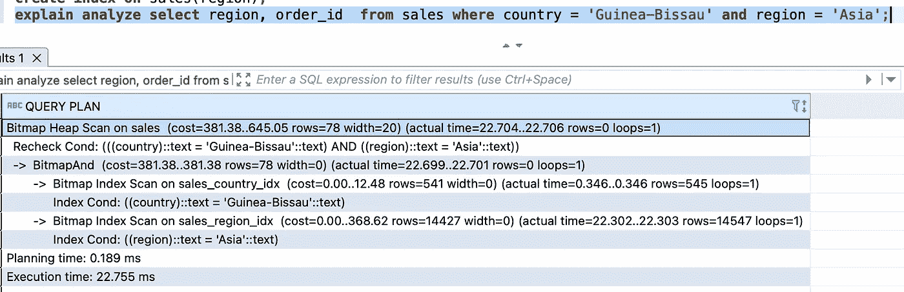

在这种情况下，我们可以看到使用来自两个索引扫描子集的数据获取的结果的位图和。

**子情况 2:**

**在这种情况下，在多个列上创建单独的索引，在第一列上进行索引扫描(根据 create table ),在其他列上进行另一个顺序扫描。**

```
**create** **index** **on** sales(item);
**create** **index** **on** sales(sales_channel);OR**create** **index** **on** sales(sales_channel);
**create** **index** **on** sales(item);
```

现在用 sales_channel 和 item 过滤器分析查询计划。

```
**explain** **analyze** **select** region **from** sales **where** sales_channel = 'Offline' **and** item = 'Meat';
```

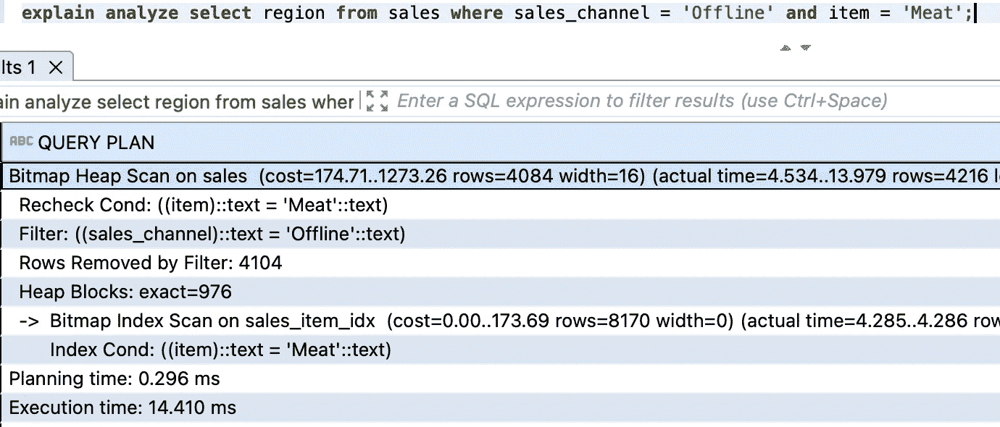

在这种情况下，我们可以对 sales_item 进行索引扫描，但过滤器应用于 sales_channel(这里没有索引扫描)

**原因:** Postgres 内部检查索引是否有助于优化查询。如果索引没有帮助，那么 Postgres 运行顺序扫描并忽略索引。

**案例 6:** 创建一个复合索引，尝试只使用一个字段进行搜索。

```
**create** **index** **on** sales(sales_channel, item);
```

现在只使用 sales_channel 作为搜索参数来获取查询。

```
**explain** **analyze** **select** region **from** sales **where** item = 'Meat';
```

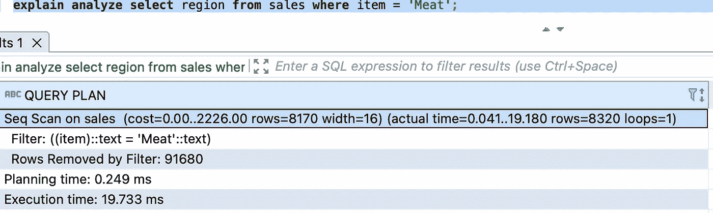

现在，使用 sales_channel 字段再试一次。

```
**explain** **analyze** **select** region **from** sales **where** sales_channel = 'Offline';
```

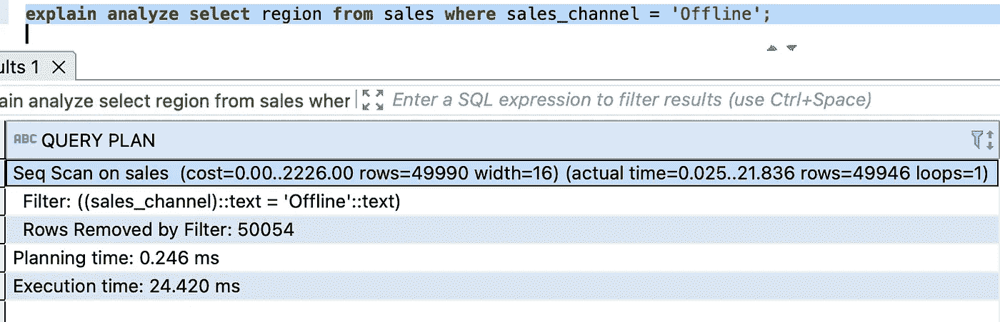

*******:现在再次检查不存在的 sales_channel 的不同值*********

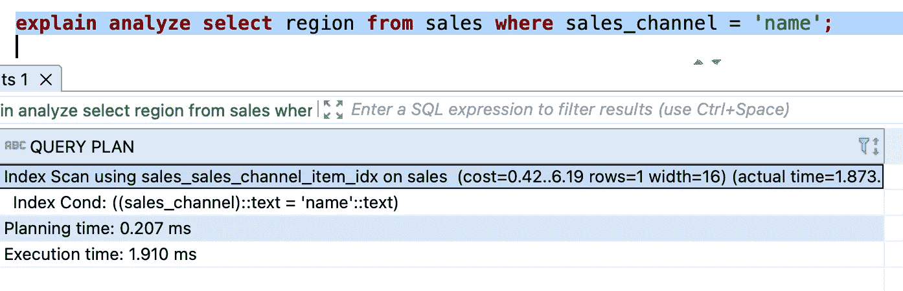

从上面的场景中，我们可以再次看到 Postgres 在内部决定是否需要索引扫描来以最佳方式提供结果，或者我们是否需要进行顺序扫描来获得最佳结果。

**注意:**多列 B 树索引可以与涉及索引列的任何子集的查询条件一起使用，但是当前导(最左边)列有约束时，索引是最有效的。

# **综合指数:**

当我们有一个包含搜索字段组合的搜索查询时，复合索引将比单列索引快得多。

```
**create** **index** **on** sales(country, region);
 **explain** **analyze** **select** * **from** sales **where** region = 'Europe' **and** country = 'Malta';
```

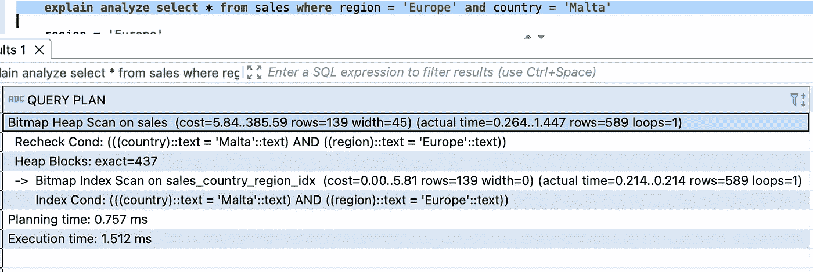

# **部分指标:**

有些情况下，你可能不想索引整个数据，而只想索引一个块服务器，这就是我们的目的。

让我们举一个例子，我们有一个表，其中列出了数据库中所有用户的状态(活动/非活动)。现在在查询中，我们只需要活动用户，所以我们应该只索引状态为活动的用户。

```
**create** **index** **on** sales(country) **where** sales_channel = 'Offline';
```

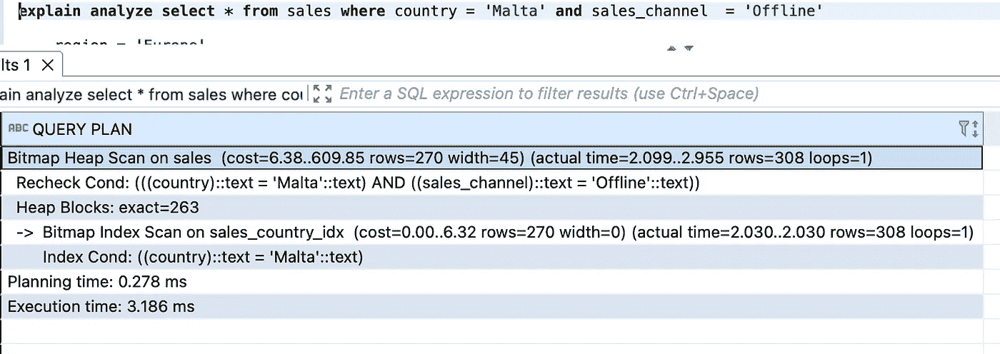

现在，通过 sales_channel = 'Online '检查一下，没有索引会有所帮助。

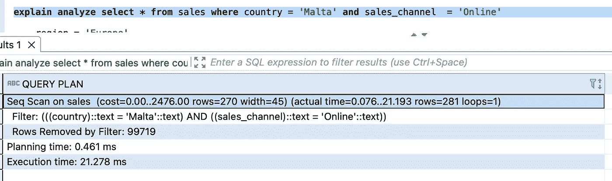

部分索引通过减小索引的大小(不索引不需要的数据)帮助很大。

# 表达式的索引:

```
**create** **index** **on** sales(region);**explain** **analyze** **select** region **from** sales **where** region = 'asia';
```

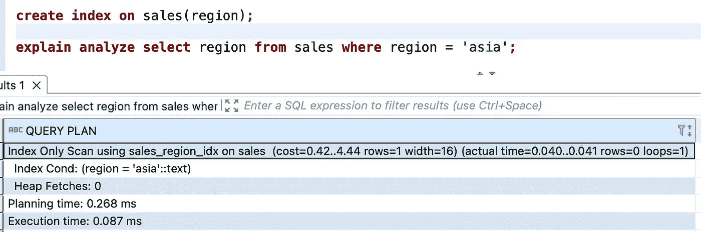

正如我们在上面的截图中看到的，索引工作正常。

当通过添加一些字符串函数来检查该区域时，这是否同样有效:

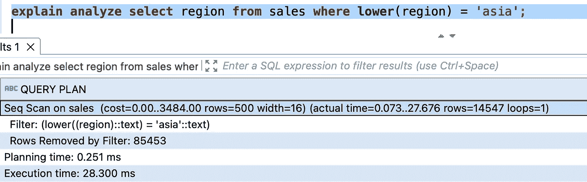

当我们对它应用一些字符串函数时，索引不起作用。

这个怎么解决？解决方案是索引上的**表达式**

```
**create** **index** **on** sales(**lower**(region));**explain** **analyze** **select** region **from** sales **where** **lower**(region) = 'asia';
```

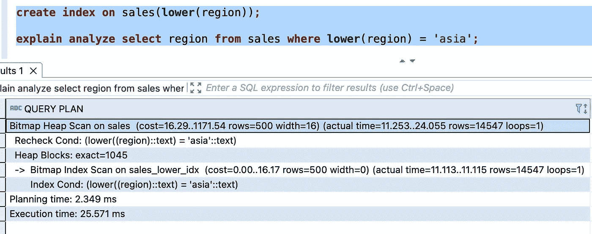

# Postgres 索引:

1.  B 树
2.  混杂
3.  布林(本博客未涉及)
4.  要点(本博客未涉及)
5.  SP-GIST(本博客未涉及)

**B 树指数:**

自我平衡的二叉查找树。

支持:

1.  小于(
2.  Less than equal to (≤)
3.  Equal(=)
4.  Greater than equal to (≥)
5.  Greater than (>)
6.  在...之间
7.  在…里
8.  IsNull
9.  Isnotnull

当我们在 Postgres 表中的任何列上创建索引时，默认情况下会创建 B 树索引。

```
**create** **index** **on** sales(country)
```

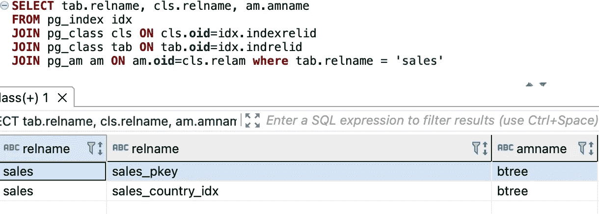

```
**create** **index** **on** sales **using** BTREE(item)
```

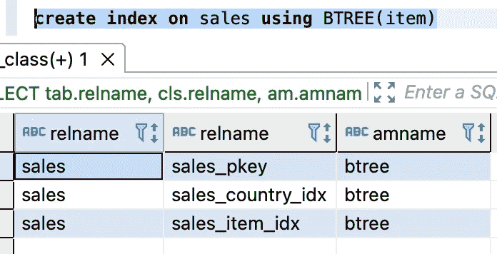

b 树索引包含 ctid 值，该值将指向页面和该页面上的元组序列。

**注意**:使用 B-Tree like 只能处理“值%”，而不能处理“%值%和“%值”

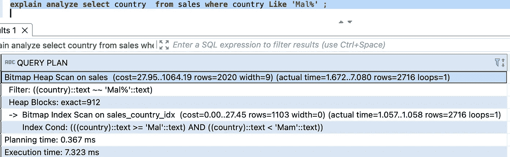

**Pg 应用的步进**

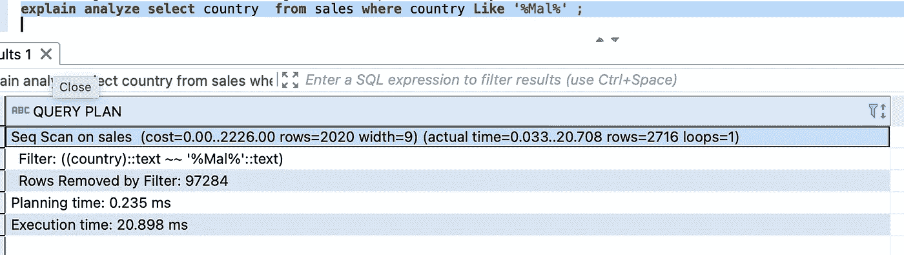

**Pg 未应用步进**

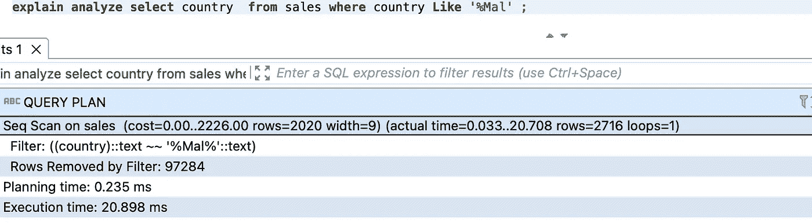

**Pg 未应用步进**

**杜松子酒指数:**

广义倒排索引。主要用于复合值

1.  数组
2.  Json
3.  hstore
4.  ts 向量
5.  范围类型

为每个可能的值创建索引条目。用于文本搜索。构建需要时间，但性能高效。适用于所有可能的模式。

支持的操作:

1.  <@ @>
2.  &&
3.  ?&
4.  ?|
5.  @>
6.  @@
7.  @@@
8.  用 pg_trgm (trigm) — %，，，<，>，like，ilike，~，~*

pg_trgm —创建一个三元组世界，即以字符长度 3 分割文本，这将有助于更好的全文搜索。

就大小而言，它比 b 树索引重得多。

**注意:**默认情况下，Indexes 不支持 substr、lower、upper 等 Postgres 函数。

参考:【https://www.postgresql.org/docs/10/indexes.html 

从这里了解更多:[https://medium . com/@ rish abh 171192/indexes-in-relational-databases-detailed-ba 5926121 c 38](https://medium.com/@rishabh171192/indexes-in-relational-databases-detailed-ba5926121c38)