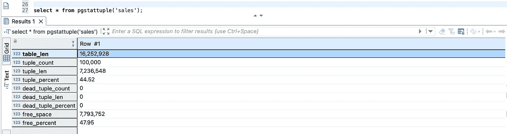
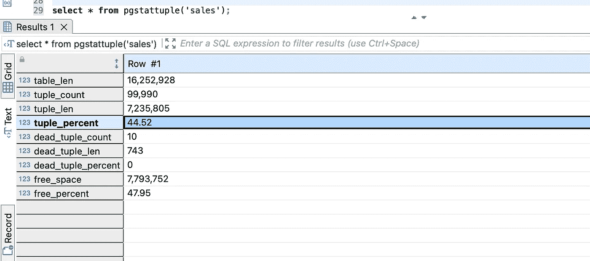
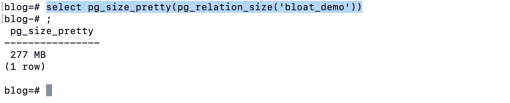
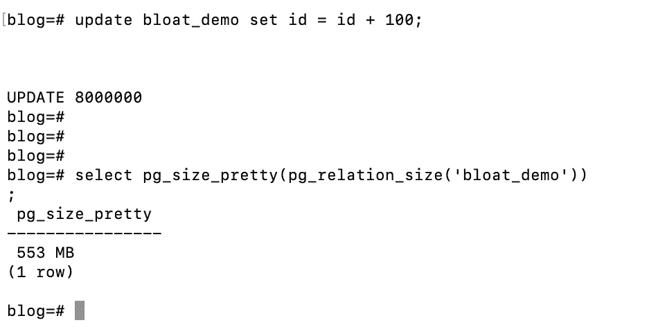
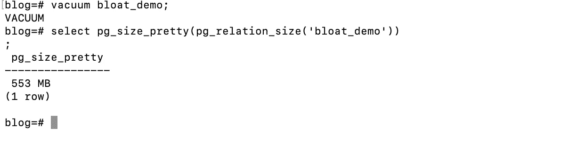
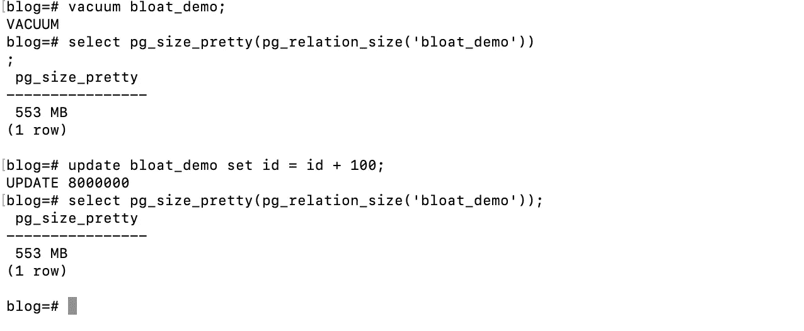
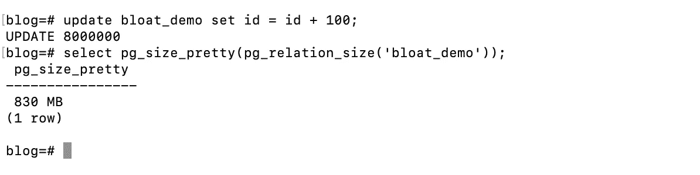
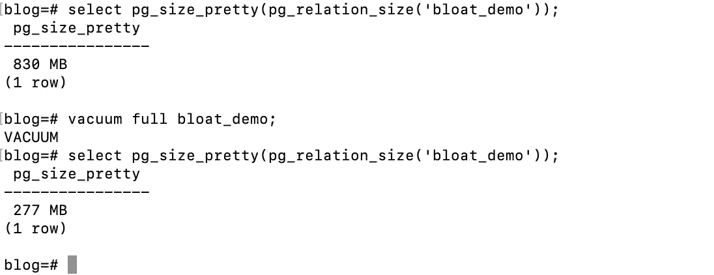

# Postgres 存储优化

> 原文：<https://blog.devgenius.io/postgres-storage-optimization-905978c9fd38?source=collection_archive---------9----------------------->

如何优化 Postgres 数据库的存储，最终帮助优化有助于整体数据库性能的查询？

大多数时候，当存储空间似乎已满时，我们会继续向 Postgres 堆中添加存储空间，因为添加存储空间很便宜。

**这是应对不断增长的存储需求的正确方法吗？或者我们可以在不增加存储的情况下从容应对，这样有助于降低成本并优化性能。**

首先，了解存储持续增长的原因。几个值得注意的潜力:

1.  未使用的索引
2.  膨胀

让我们详细讨论这两个问题。

## 未使用的索引:

1.  索引是在创建表的过程中创建的，从未被使用过。
2.  索引是用错误的索引类型(b 树、哈希、gin)创建的，我们用不支持的运算符查询了那些列。
3.  我们最初创建并使用索引，但是过了一段时间后，我们停止使用它，它就成为一个未使用索引的候选。

**查询查找未使用的索引:**

```
**select**relname,indexrelname,idx_scan,idx_tup_read,idx_tup_fetch,pg_size_pretty(pg_relation_size(indexrelname::**regclass**)) **as** **size****from**pg_stat_all_indexes**where**schemaname = 'public'**and** indexrelname **not** **like** 'pg_toast_%'**and** idx_scan = 0**and** idx_tup_read = 0**and** idx_tup_fetch = 0**and** indexrelname != 'SequelizeData_pkey'**order** **by**pg_relation_size(indexrelname::**regclass**) **desc**;
```

idx_scan =索引扫描的次数

大小=索引占用的总存储量

idx_tup_read =索引扫描返回的索引条目数

idx_tup_fetch =简单索引扫描返回的活动表行数

**我们不能删除所有未使用的索引，因为它们可能会在以后使用，或者 postgres 可能会显示一些错误的统计数据。**

**注意:**建议定期重置索引统计，以便更好地查看已使用的索引。要重置，我们首先需要找到表的对象标识符 id (oid ),然后进行重置。

```
**SELECT** **oid** **FROM** pg_class c **WHERE** relname = ‘test’; // test is table name**SELECT** pg_stat_reset_single_table_counters(oid_fetched); // Reset to get new stats regularly
```

## **膨胀:**

Postgres 使用 MVCC(多版本并发控制)最终为更新/插入创建一个新行。这有助于并发事务，较旧的事务可以访问较旧版本的数据(因为它们需要被完成)，但同时，它也在系统中添加了大量陈旧的存储。因此，一次只有一个版本的行是活动的，所有其他的都是死的(陈旧的)行。

**膨胀也存在于索引中。**假设您更新了表中的一个元组(行),并且为该表索引了 3 列。现在为更新部分创建了一个新的元组(如果我们更新所有这些列的数据)，将在所有三个索引中创建一个相应的新条目，早期的引用将被标记为陈旧。

**注意:** Postgres 使用热(仅堆元组)优化，其中假设表有 3 个索引列，现在在更新时我们只更新一个索引列，因此在这种情况下，2 个旧索引数据的引用将从旧元组更改为新元组的引用，并且只为索引更新列创建新索引数据。

只有当行(元组)的创建速率大于元组被清理的速率时，才会在数据库中产生膨胀。此外，Autovaccum(后台进程)会删除文件中的记录，但 stoarge 仍未清除，我们需要进行碎片整理。

更多的膨胀会导致更多的 I/O，最终降低查询性能。

查看膨胀的一个简单方法是:

```
**CREATE** **EXTENSION** pgstattuple;**select** * **from** pgstattuple(‘sales’); // sales is table name.
```



现在，我将更新/删除一些行并查看结果。我们可以看到死亡夫妇计数和相应的长度。



从上面的讨论中我们知道，膨胀是在以下情况下产生的:

1.  桌子
2.  指数

表膨胀和索引膨胀可以很容易地通过某个了不起的人给出的查询得到。简单的复制和运行，我们将得到所有的数据

Git 链接:[https://github . com/io guix/pg SQL-bloat-estimation/blob/master/table/table _ bloat . SQL](https://github.com/ioguix/pgsql-bloat-estimation/blob/master/table/table_bloat.sql)

## 表格膨胀演示:

```
psql blog; **// blog is db name**create table bloat_demo (id int) with (autovacuum_enabled = off);insert into bloat_demo select * from generate_series(1, 8000000);select pg_size_pretty(pg_relation_size('bloat_demo'));
```



现在更新所有的行并检查表格的大小；(我们将看到表格的大小现在将增加一倍)

```
update bloat_demo set id = id + 100;select pg_size_pretty(pg_relation_size('bloat_demo'));
```



现在，在 bloat _ demo 表上运行 Vacuum，看看是否清除了额外的存储空间。



有趣的是，没有一个存储空间是用吸尘器清理的。

原因—如上所述，vacuum 将从表中删除失效的(陈旧的)行，但不会回收这些存储，因为数据文件仍然包含这些存储。Vacuum 通过在存储文件(删除的行)中释放存储空间来提供可重用的存储空间。

现在检查我们的理论是否正确，真空自由空间是否可以使用。要验证这一点，请再次运行 update 命令，看看表是否占用了额外的空间。

我们可以从下面的截图中看到，由于 update 命令使用了 vacuum 提供给我们的文件中的空间，所以表没有占用额外的空间。



现在我们已经使用了真空空间，让我们再次更新，看看额外的空间是否被表占用。

由于创建了新的 800 万行，并且所有早期的行都被标记为死行，因此表额外占用了 277MB。



# 解决索引膨胀问题的方法:

1.  删除现有索引，然后重新创建。它会以最好的方式处理事情，但是一些间歇性的查询会受到影响。
2.  重新索引已经创建的索引—这将消除膨胀的空间，但会使索引挂起(不可操作)，直到重新索引完全完成，最终使数据库在重建时效率低下。我们可以通过并发执行来优化重建索引的方式，这不会影响查询。

```
Reindex index sales; ---> Reindex index concurrently sales;
```

上面的并发重新索引将在数据库中创建一个后缀为(_ccnew)的新索引，并跟踪所有的表更改。当一个新索引完全创建后，旧索引将被删除，表开始使用新创建的索引。

**兼做索引的弊端:**

如果出现意外情况，并且重建过程需要停止或由于某些问题而停止，那么系统中将存在间歇性索引级别，并且会占用额外的空间。这些无效索引需要手动删除。

```
**Query to find Invalid Indexes:****SELECT**c.relname **as** index_name,pg_size_pretty(pg_relation_size(c.**oid**))**FROM**pg_index i**JOIN** pg_class c **ON** i.indexrelid = c.**oid****WHERE**c.relname **LIKE**  '%_ccnew'**AND** **NOT** indisvalid;
```

# 解决表格膨胀的方法:

1.  **Vacuum Full :** 这将回收 float 和 stale 元组使用的所有空间，但反过来会产生许多问题，如表的锁定(挂起)，最终使它不是一个生产使用的解决方案。我们唯一可以使用它的时间是允许我们进行维护的应用程序停机时间。

```
VACCUM FULL bloat_demo;
```



我们可以从表的大小中看到，553 MB 是可用的，因为真空已满。

2. **Pg Repack:** 这是一个生产就绪的解决方案，有助于在不停机的情况下清除膨胀和陈旧的数据。此扩展需要首先创建(安装),因为它仅在安装期间可用。

```
**CREATE** EXTENSION pg_repack;
```

**Pg _ re pack 如何工作？**

它创建了一个新表，就像我们在重建索引中看到的那样，并将旧表中的所有数据复制到一个新表中，然后重建索引。完全复制完成后，新表充当主表，旧表被删除。

```
pg_repack -k --table sales_info sales;sales_info = table name
sales = database name
```

**pg _ repack 的缺点:**

1.  在创建新表的过程中，由于相同的表被复制到存储器中，因此需要进行双重存储，因此我们需要在开始重新打包表之前检查存储器的可用性。
2.  如果重新包装过程在中间停止，那么我们需要手动删除间歇表。

## Pg_repack 仍然是消除膨胀的最佳解决方案。

**参考文献:**

[https://www.youtube.com/watch?v=qcInj-XW1Vc](https://www.youtube.com/watch?v=qcInj-XW1Vc&t=302s)