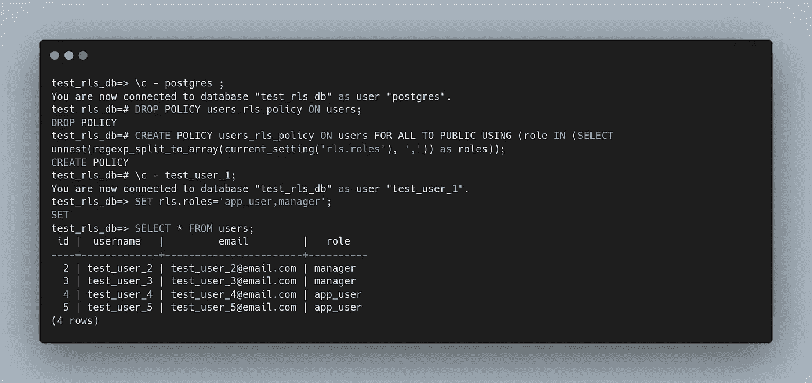

# PostgreSQL 行级安全性及其他…

> 原文：<https://blog.devgenius.io/postgresql-row-level-security-and-more-2c8c108f9856?source=collection_archive---------4----------------------->

在本文中，我们将了解作为 PostgreSQL 数据库功能的表级安全性的一部分的行级安全性，以及更多内容，因为本文将是基于实际场景的实践经验，这些场景适用于在应用程序设计中实现可扩展的基于多租户的体系结构，从而确保数据库端的数据隔离，而不是完全依赖于应用程序代码。

我们将使用 docker 演示本文档的内容，因此我们将在 PostgreSQL docker 容器中工作，如果您不熟悉 docker，则基本上可以通过在本地计算机中安装 PostgreSQL 数据库服务器来继续。所以，让我们进入主题。

首先，让我们来看一下本次讲座中要介绍的内容:

**与码头工人的先决步骤**

1.  拉 PostgreSQL 映像
2.  执行到 docker 容器中
3.  通过登录数据库服务器检查连接

**实施行级安全**

1.  登录数据库服务器
2.  创建数据库
3.  使用已创建的数据库
4.  CREATE 表
5.  INSERT 数据
6.  创造用户
7.  授予用户权限
8.  为表的 RLS 创建策略
9.  为该表启用 RLS
10.  更改当前用户等

所以，让我们开始先决条件的步骤。

首先，我们来看看码头工人是否在工作。将 run 命令检查到您命令行终端中。

```
$ docker psCONTAINER ID   IMAGE     COMMAND   CREATED   STATUS    PORTS   NAMES
```

，它将返回正在运行的容器列表，具体取决于它可以返回空列表的计算机，如果您有一个正在运行的现有容器，则不返回空列表。现在，是时候拉最新的形象和运行作为一个码头集装箱。所以，要做这个跑步——

```
$ docker run -e POSTGRES_PASSWORD=mysecretpassword -e POSTGRES_USER=postgres --name postgres_db postgres:14.1-alpine
```

它将在本地拉取映像(当前最新版本是 14.1)，因此拉取需要几秒钟，并且将作为容器运行。由于它不是作为守护程序容器运行的，您需要打开另一个终端与该容器交互。一旦准备好，你可以通过打开另一个码头运行 ***码头工人 ps*** ，然后你会发现一个名为 **postgres_db** 的正在运行的码头工人集装箱。

因此，让我们执行到容器中，与 PostgreSQL 数据库服务器交互。奔跑

```
$ docker exec -it postgres_db /bin/bash
```

所以如果你能在码头看到*重击*，那你就在集装箱里了。好的，然后通过运行来检查连接

```
$ psql -U postgres
```

所以，如果你能看到下面的输出，那么到目前为止一切都很好。

您也可以通过运行下面的 SQL 来检查当前用户

```
postgres=# SELECT current_user;
 current_user 
--------------
 postgres
(1 row)
```

**恭喜！**

我们的第一组步骤已经完成，开始探索行级安全性 aks RLS 的后续步骤。

**行级安全**

首先从行级安全性开始，让我们创建一个新的数据库，因为我们希望出于演示目的而执行它。

```
postgres=# CREATE DATABASE test_rls_db;
CREATE DATABASE
postgres=#
```

要检查所有已创建的数据库，可以运行

```
postgres=# \l
```

现在，让我们连接到新创建的数据库 one，对该数据库执行进一步的操作。

```
postgres=# \c test_rls_db;
You are now connected to database "test_rls_db" as user "postgres".
test_rls_db=#
```

让我们创建一个表，并将一些数据放入该表中。

```
test_rls_db=# CREATE TABLE users (  id serial PRIMARY KEY,  username VARCHAR (50) UNIQUE NOT NULL,  email VARCHAR (255) UNIQUE NOT NULL, role VARCHAR (20));CREATE TABLE
```

要检查创建的表，您可以运行

```
test_rls_db=# \dt
         List of relations
 Schema | Name  | Type  |  Owner   
--------+-------+-------+----------
 public | users | table | postgres
(1 row)
```

为了描述表的细节，运行

```
test_rls_db=# \d users;
                                     Table "public.users"
  Column  |          Type          | Collation | Nullable |              Default              
----------+------------------------+-----------+----------+-----------------------------------
 id       | integer                |           | not null | nextval('users_id_seq'::regclass)
 username | character varying(50)  |           | not null | 
 email    | character varying(255) |           | not null | 
 role     | character varying(20)  |           |          | 
Indexes:
    "users_pkey" PRIMARY KEY, btree (id)
    "users_email_key" UNIQUE CONSTRAINT, btree (email)
    "users_username_key" UNIQUE CONSTRAINT, btree (username)test_rls_db=#
```

现在让我们向表中插入一些数据。

```
test_rls_db=# INSERT INTO users (id, username, email, role) VALUES (1, 'test_user_1', 'test_user_1[@email.com](mailto:test.user.1@email.com)', 'admin');
INSERT 0 1
test_rls_db=# INSERT INTO users (id, username, email, role) VALUES (2, 'test_user_2', 'test_user_[2@email.com](mailto:test.user.2@email.com)', 'manager');
INSERT 0 1
test_rls_db=# INSERT INTO users (id, username, email, role) VALUES (3, 'test_user_3', 'test_user_[3@email.com](mailto:test.user.3@email.com)', 'manager');
INSERT 0 1
test_rls_db=# INSERT INTO users (id, username, email, role) VALUES (4, 'test_user_4', 'test_user_[4@email.com](mailto:test.user.4@email.com)', 'app_user');
INSERT 0 1
test_rls_db=# INSERT INTO users (id, username, email, role) VALUES (5, 'test_user_5', 'test_user_[5@email.com](mailto:test.user.5@email.com)', 'app_user');
INSERT 0 1
```

要检查插入的所有数据，运行

```
test_rls_db=# SELECT * FROM users;
 id |  username   |         email         |   role   
----+-------------+-----------------------+----------
  1 | test_user_1 | [test_user_1@email.com](mailto:test_user_1@email.com) | admin
  2 | test_user_2 | [test_user_2@email.com](mailto:test_user_2@email.com) | manager
  3 | test_user_3 | [test_user_3@email.com](mailto:test_user_3@email.com) | manager
  4 | test_user_4 | [test_user_4@email.com](mailto:test_user_4@email.com) | app_user
  5 | test_user_5 | [test_user_5@email.com](mailto:test_user_5@email.com) | app_user
(5 rows)test_rls_db=#
```

事情是这样的，这个当前用户可以看到 *admin、manager 和 app_user* 的所有用户数据，因为当前用户是这个表的所有者，但是我们希望限制这种行为，只有当前用户可以看到他的数据。

要做到这一点，我们需要创建不同的用户，并对他们应用安全性。我们开始吧。

首先，创建与用户名相同的用户。

```
test_rls_db=# CREATE USER test_user_1;
CREATE ROLE
test_rls_db=# CREATE USER test_user_2;
CREATE ROLE
test_rls_db=# CREATE USER test_user_3;
CREATE ROLE
test_rls_db=# CREATE USER test_user_4;
CREATE ROLE
test_rls_db=# CREATE USER test_user_5;
CREATE ROLE
test_rls_db=#
```

让我们把当前用户改为**测试 _ 用户 _1**

```
test_rls_db=# \c - test_user_1 ;
You are now connected to database "test_rls_db" as user "test_user_1".
test_rls_db=>
```

因此，现在尝试对表 user 运行 SELECT 查询。

```
test_rls_db=> SELECT * FROM users;
ERROR:  permission denied for table users
test_rls_db=>
```

因此，您将得到拒绝的许可，因为用户在表上没有**选择**授权。让我们**为表 **users** 中的用户授予 SELECT** 语句。

```
test_rls_db=> \c - postgres;
You are now connected to database "test_rls_db" as user "postgres".
test_rls_db=# GRANT SELECT ON users TO test_user_1;
GRANT
test_rls_db=# \c - test_user_1;
You are now connected to database "test_rls_db" as user "test_user_1".
test_rls_db=> SELECT * FROM users;
 id |  username   |         email         |   role   
----+-------------+-----------------------+----------
  1 | test_user_1 | [test_user_1@email.com](mailto:test_user_1@email.com) | admin
  2 | test_user_2 | [test_user_2@email.com](mailto:test_user_2@email.com) | manager
  3 | test_user_3 | [test_user_3@email.com](mailto:test_user_3@email.com) | manager
  4 | test_user_4 | [test_user_4@email.com](mailto:test_user_4@email.com) | app_user
  5 | test_user_5 | [test_user_5@email.com](mailto:test_user_5@email.com) | app_user
(5 rows)test_rls_db=>
```

现在，您可以看到在授予用户权限后可以看到的所有用户信息，但这不是我们的目标，所以这里需要策略，要实现这一点，我们需要将策略应用到表中。让我们这样做

```
test_rls_db=> \c - postgres;
You are now connected to database "test_rls_db" as user "postgres".
test_rls_db=# CREATE POLICY users_rls_policy ON users FOR ALL TO PUBLIC USING (username=current_user);
CREATE POLICY
test_rls_db=# \c - test_user_1;
You are now connected to database "test_rls_db" as user "test_user_1".
test_rls_db=> SELECT * FROM users;
 id |  username   |         email         |   role   
----+-------------+-----------------------+----------
  1 | test_user_1 | [test_user_1@email.com](mailto:test_user_1@email.com) | admin
  2 | test_user_2 | [test_user_2@email.com](mailto:test_user_2@email.com) | manager
  3 | test_user_3 | [test_user_3@email.com](mailto:test_user_3@email.com) | manager
  4 | test_user_4 | [test_user_4@email.com](mailto:test_user_4@email.com) | app_user
  5 | test_user_5 | [test_user_5@email.com](mailto:test_user_5@email.com) | app_user
(5 rows)test_rls_db=>
```

但是它不能正常工作！:D:是的，因为我们还必须显式地为表启用 RLS。我们也这么做吧

```
test_rls_db=> \c - postgres ;
You are now connected to database "test_rls_db" as user "postgres".
test_rls_db=# ALTER TABLE users ENABLE ROW LEVEL SECURITY;
ALTER TABLE
test_rls_db=# \c - test_user_1;
You are now connected to database "test_rls_db" as user "test_user_1".
test_rls_db=> SELECT * FROM users;
 id |  username   |         email         | role  
----+-------------+-----------------------+-------
  1 | test_user_1 | [test_user_1@email.com](mailto:test_user_1@email.com) | admin
(1 row)test_rls_db=>
```

因此，以同样的方式，您可以为其他用户这样做。我将只为一个用户 **test_user_2** 进行测试，但您可以为所有用户进行测试。

```
test_rls_db=> \c - postgres ;
You are now connected to database "test_rls_db" as user "postgres".
test_rls_db=# GRANT SELECT ON users TO test_user_2;
GRANT
test_rls_db=# \c - test_user_2;
You are now connected to database "test_rls_db" as user "test_user_2".
test_rls_db=> SELECT * FROM users;
 id |  username   |         email         |  role   
----+-------------+-----------------------+---------
  2 | test_user_2 | [test_user_2@email.com](mailto:test_user_2@email.com) | manager
(1 row)test_rls_db=>
```

**恭喜你！**

现在，您已经成功地应用了行级安全性。

但是，如果您知道我们在数据库中为表中的所有用户创建用户，这很难管理，那么在现实生活中，我们也希望通过使用角色来管理它。

让我们开始吧。因此，要做到这一点，我们需要稍微改变我们的策略，以便它可以将角色与某种提供的信息进行比较，在这种情况下，我们将使用 **current_setting** 。

```
test_rls_db=> \c - postgres ;
You are now connected to database "test_rls_db" as user "postgres".
test_rls_db=# DROP POLICY users_rls_policy ON users;
DROP POLICY
test_rls_db=# CREATE POLICY users_rls_policy ON users FOR ALL TO PUBLIC USING (role=current_setting('rls.role'));
CREATE POLICY
test_rls_db=# \c - test_user_1;
You are now connected to database "test_rls_db" as user "test_user_1".
test_rls_db=> SELECT * FROM users;
ERROR:  unrecognized configuration parameter "rls.role"
test_rls_db=> SET rls.role='admin';
SET
test_rls_db=> SELECT * FROM users;
 id |  username   |         email         | role  
----+-------------+-----------------------+-------
  1 | test_user_1 | [test_user_1@email.com](mailto:test_user_1@email.com) | admin
(1 row)test_rls_db=> SET rls.role='manager';
SET
test_rls_db=> SELECT * FROM users;
 id |  username   |         email         |  role   
----+-------------+-----------------------+---------
  2 | test_user_2 | [test_user_2@email.com](mailto:test_user_2@email.com) | manager
  3 | test_user_3 | [test_user_3@email.com](mailto:test_user_3@email.com) | manager
(2 rows)test_rls_db=> SET rls.role='app_user';
SET
test_rls_db=> SELECT * FROM users;
 id |  username   |         email         |   role   
----+-------------+-----------------------+----------
  4 | test_user_4 | [test_user_4@email.com](mailto:test_user_4@email.com) | app_user
  5 | test_user_5 | [test_user_5@email.com](mailto:test_user_5@email.com) | app_user
(2 rows)test_rls_db=>
```

在这里，您可以看到我们使用了**role = current _ setting(' RLS . role ')**，因此在每个查询中，将首先比较当前行的角色与**current _ setting(' RLS . role ')**的值是否相同，并且我们需要在每个会话中设置**的值，否则您将会得到一个异常。**

**附加部分，**

因此，我们可以这样设置和比较，这是一个巨大的好处。但是我们可以有一个案例，我们希望与多个角色一起工作。因此，要做到这一点，我们可以做一些如下。

首先，我们需要再次调整政策，以便我们能够实现它。



**恭喜！**

现在我们可以一次访问多个角色的数据。

接下来，我们还可以结合 SQL 条件，得到预期的输出。

```
test_rls_db=> SELECT * FROM users WHERE username = 'test_user_2';
 id |  username   |         email         |  role   
----+-------------+-----------------------+---------
  2 | test_user_2 | [test_user_2@email.com](mailto:test_user_2@email.com) | manager
(1 row)test_rls_db=> SELECT * FROM users WHERE username = 'test_user_1';
 id | username | email | role 
----+----------+-------+------
(0 rows)test_rls_db=>
```

# 行级安全性能

在结束故事之前，现在让我们进入正题，如果我们仔细观察，我们可以看到 RLS 的含义是在每个查询中添加 WHERE 子句，该子句是由数据库系统本身添加的，而不是从应用程序管理它。其中每一行都必须满足这个条件才能通过策略。当然，这种额外的检查可能会对性能产生一些影响。

**参考文献:**

*   https://www.postgresql.org/docs/9.5/ddl-rowsecurity.html
*   [https://www . enterprise db . com/postgres-tutorials/how-implement-column-and-row-level-security-PostgreSQL？FB clid = iwar 2 hewuo 27 vxpgwhnksodvxfaxzzcw 4a 83 hpynyfzmg 1 mz 1 NQ 5-dv b-DEqg](https://www.enterprisedb.com/postgres-tutorials/how-implement-column-and-row-level-security-postgresql?fbclid=IwAR2Hewuo27VxpGWhNKSoDvXFaXZZcW4a83hPyNYFZmg1mz1nQ5-DvB-DEqg)