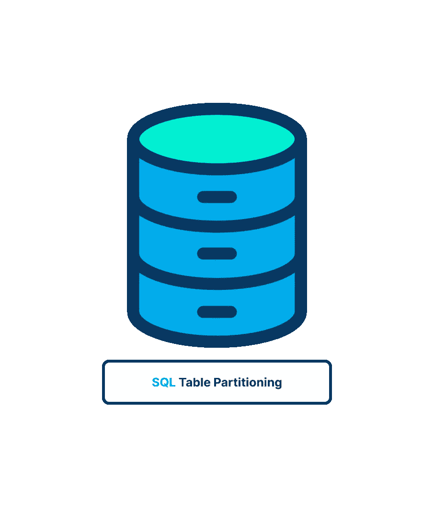
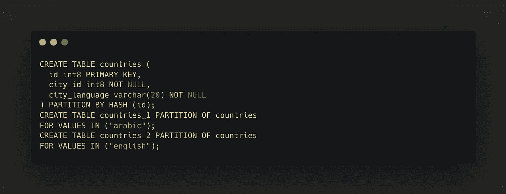
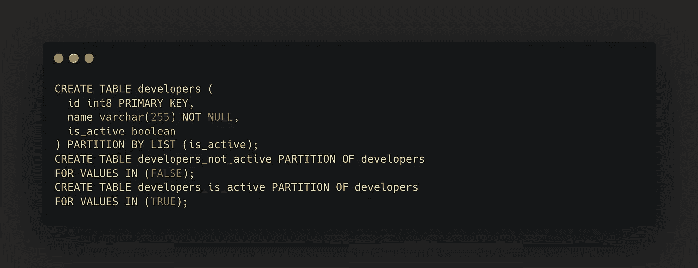
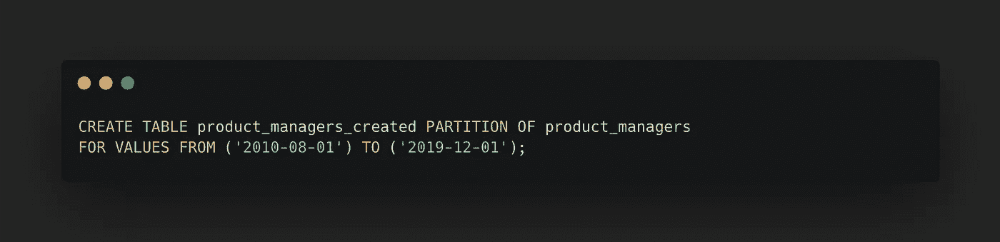

# PostgreSQL 表分区

> 原文：<https://blog.devgenius.io/postgresql-table-partitioning-eddf8261ff71?source=collection_archive---------1----------------------->

🎃我一直想和其他人一起学习，因为我不是数据库专家，所以让我们一起研究这篇文章，了解一下 PostgreSQL ❤️中的表分区！

# 🧐什么是分区？

能力分区是将逻辑上的一个大表分割成更小的物理块。

# 🤓何时使用分区？

当单个表不能提供分区的大部分好处时，这些好处是可以获得的。如果在某个时候，大量数据将被写入单个表，用户需要进行分区。除了数据，可能还有用户必须考虑的其他元素，如数据的更新频率、数据随时间的使用情况、数据范围的粒度等。表拆分可以显著提高速度，并允许您通过适当的规划和考虑所有因素将 PostgreSQL 扩展到更大的数据集。

# ✅分区方法:

## 哈希分区

通过为每个分区提供条件值，可以对表进行分区。每个分区都包含这样的行:分区键的哈希值除以指定的模数，得到指定的余数。
替代策略，例如继承和联合，所有视图都可以替代使用。这种方法提供了灵活性，但是缺少内置的声明性分区的一些性能优势。
散列分区允许行在表集合中均匀分布；例如，我们可以为我们的表构建两个分区，并使用哈希和城市语言为每一行选择一个分区:

## 列表分区

表的划分是通过具体列出每个段中存在的键值来完成的。
列表分区允许为分区指定值列表；例如，我们可以将一小部分数据保存在 is_active 分区中

## 范围划分

分配给不同分区的值的范围之间没有重叠。例如，可以按照日期周期或特定业务对象的标识符范围进行划分。每个范围的下限被认为是包含性的，而上限被认为是排他性的。例如，如果一个分区的范围是从 2000 到 2010，而下一个分区的范围是从 2010 到 2020，那么值 2010 属于第二个分区，而不是第一个分区。

按范围分区允许为分区指定值的范围，例如，我们可以将每个月的数据存储在单独的分区中:

# 声明性划分

ostgreSQL 支持在一个表中声明分区。分区表被称为分区表。除了前面讨论的分区机制之外，该声明还提供了用作分区键的列或表达式的列表。
分区表是一个*没有自己的存储*的“**虚拟**表。相反，存储被**分配**给分区，分区是与分区表相关联的标准表。根据分区边界，每个分区保存一个数据子集。根据分区键列的值，放入分区表中的所有行将被路由到适当的分区。如果一行不再满足其原始分区的分区界限，更新其分区键将导致该行被转移到不同的分区。
分区本身可以定义为分区表，从而产生子分区。尽管分区可能有自己的索引、约束和默认值，但所有分区都必须有与其分区父分区相同的列。

不能将普通表转换为分区表，反之亦然。但是，可以添加现有的常规表或分区表作为分区数据库的分区，或者从分区表中删除分区，从而将其转换为独立的表；这可以简化和加快许多维护任务。
分区也可以是外部表，尽管需要非常小心，因为用户有义务确保外部表的内容符合分区规则。此外，还有其他一些限制。

# 💎使用继承进行分区

在中，尽管内置的声明式分区对于大多数常见的用例来说已经足够了，但是在某些情况下，更灵活的方法可能更有优势。使用表继承来完成分区可以实现声明性分区所不具备的各种功能，包括:

*   在声明性分区中，分区必须包含与分区表完全相同的一组列，但是在表继承中，子表可以包含父表中不存在的附加列。
*   表继承允许多重继承。
*   声明性分区只支持范围、列表和散列分区，而表继承允许用户以他们认为合适的方式划分数据。(但是，如果约束排除不能正确地清理子表，查询性能可能会很差。)

# 🙃分区和约束排除

约束排除是一种与分区修剪相关的查询优化技术。它通常用于通过旧的继承方法实现的分区，尽管它也可以用于声明性分区。
约束排除功能类似于分区修剪，除了它使用每个表的约束，而分区修剪使用表的分区边界，这仅出现在声明性分区的情况下。另一个区别是约束排除只在计划时实现；在执行过程中不会尝试删除分区。
约束排除使用约束(这使得它比分区修剪慢)有时可能是一种优势:因为除了它们的内部分区界限之外，约束还可以在声明分区表上定义，所以约束排除可能能够从查询计划中省略额外的分区。
约束排除的默认(也是推荐的)选择是 partition，它只将这种方法应用于可能对继承分区表进行操作的查询。on 设置使规划器分析所有查询中的限制，包括不可能获得任何优势的基本查询。

## 约束排除限制:

*   与也可以在查询执行期间实现的分区修剪相反，约束排除仅在查询规划期间应用。
*   约束排除仅在查询的 WHERE 子句包含常量(或外部提供的参数)时起作用。例如，与非不可变函数(比如 CURRENT TIMESTAMP)的比较是无法优化的，因为规划器无法预测该函数的值在运行时可能属于哪个子表。
*   保持分区约束最小；否则，规划器可能无法证明不需要访问子表。如前面的示例所示，对列表分区使用基本的相等条件，对范围分区使用简单的范围测试。
*   分区限制应该只使用 B 树可索引运算符将分区列与常量进行比较，因为分区键中只允许 B 树可索引列。
*   在约束排除期间，将检查父表的所有子表的所有约束，因此大量的子表可能会显著增加查询计划时间。因此，基于遗产继承的分区可以有效地处理大约一百个子表；避免使用成千上万的孩子。

# 😎声明式分区的最佳实践

用来划分数据的一列或多列将是最重要的设计决策之一。按在对已分区表执行的查询的 WHERE 子句中最频繁出现的列或列集合进行分区通常是最佳策略。使用符合分区边界约束的 WHERE 子句可以消除不需要的分区。但是，对主键或唯一约束的需求可能会迫使您做出其他选择。在建立分区方法时，还应该考虑删除不需要的数据。由于可以相对快速地分离整个分区，所以设计分区策略使得所有要同时删除的数据驻留在单个分区上可能是有利的。

选择表应该划分成的分区的目标数量是另一个重要的考虑因素。分区不足可能会导致索引过大，数据局部性较差，从而导致缓存命中率较低。然而，表的过度分区也可能产生问题。太多的分区会导致查询规划持续时间更长，并且会增加查询规划和执行期间的内存使用，这将在下面更详细地描述。在决定如何对桌子进行分区时，考虑未来的调整也很重要。

子分区对于预计会比其他分区增长得更大的分区非常有用。使用分区键中有许多列的范围分区作为替代方法。两者都很容易导致过多的分区，因此建议适度。

在查询规划和执行期间，考虑分区的开销是至关重要的。通常，查询规划器可以相对容易地管理多达几千个分区的分区层次结构，假设常见查询允许规划器删除除少数分区之外的所有分区。当规划器进行分区修剪并且剩余更多分区时，规划时间变得更长，内存消耗增加。担心大量分区的另一个原因是，服务器的内存使用可能会随着时间的推移而大幅增加，尤其是在多个会话访问大量分区的情况下。这是因为每个分区的元数据必须加载到与之交互的每个会话的本地内存中。

# 🥳分区的优势:

*   当表中大多数频繁访问的行位于单个分区或有限数量的分区中时，在某些情况下查询速度可以大大提高。
*   分区有效地替换了索引的上层树，增加了频繁访问的索引部分适合内存的可能性。
*   当查询或更改到达单个分区的很大一部分时，可以通过对该分区进行顺序扫描而不是索引来提高性能，这需要在整个数据库中进行随机访问读取。
*   如果在分区设计过程中考虑到使用模式，添加或删除分区可以方便大容量装载和删除。
*   使用 DROP TABLE 或 ALTER TABLE DETACH PARTITION 删除单个分区比大容量删除快得多。此外，这些过程完全消除了批量删除带来的真空成本。
*   很少访问的数据可以移动到更便宜、更慢的存储介质上。

# 🥺分区表的限制:

*   若要在已分区表上构造 unique 或 primary key 约束，分区键不能包含任何表达式或函数调用，并且所有分区键列都必须包含在约束的列中。因此，分区结构必须确保分区之间没有重复。
*   不可能定义跨越整个已分区表的排除约束。这种限制只能单独放在每个叶分区上。这个问题再次出现是因为无法应用跨分区限制。
    INSERT 上的 BEFORE ROW 触发器不能改变新行的目标分区。
*   临时和永久关系不能在同一个分区树中共存。因此，如果分区表是永久的，那么它的分区也必须是永久的，反之亦然，如果分区表是临时的。
*   使用临时关系时，所有分区树成员必须来自同一个会话。

有关表分区的更多信息，请查看官方 postgresql 表分区文档[https://www . PostgreSQL . org/docs/current/DDL-partitioning . html](https://www.postgresql.org/docs/current/ddl-partitioning.html)

> 我希望你发现这篇文章有用和有趣的❤️