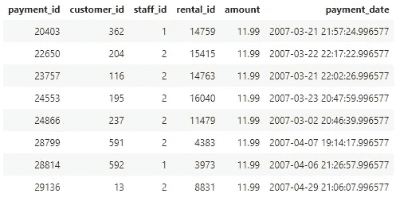
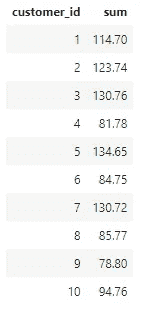
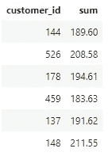
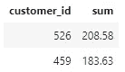

# PostgreSQL—HAVING 和 WHERE 之间的区别

> 原文：<https://blog.devgenius.io/postgresql-the-difference-between-having-vs-where-94348933afe9?source=collection_archive---------15----------------------->


# 动机

这个 Jupyter 笔记本是我的 PostgreSQL 系列的第四个，之前的博客文章可以在这里找到。这篇文章的目的是解释 PostgreSQL 中 HAVING 和 WHERE 语句之间的区别。本指南使用了一个名为“dvdrental”的示例数据库，这是一个用于学习 PostgreSQL 的常见资源，可以从[这里](https://www.postgresqltutorial.com/postgresql-sample-database/)下载。

**这个 Jupyter 笔记本也驻留在我的 GitHub 上——可以从** [**这里**](https://github.com/ConanMercer/PostgreSQL/blob/master/postgresSQL_HavingWhere.ipynb) 查看

# 在哪里

`WHERE`语句是过滤数据的最基本的方法之一。在下面的例子中，使用`WHERE`语句从支付表中查询具体金额。这将筛选出金额列中小于 11 欧元的任何值。换句话说，返回的是金额大于 11 欧元的任何行。

```
**SELECT** *****
**FROM** payment
**WHERE** amount **>** 11;
```



# 拥有

`HAVING`语句只能在聚合函数中使用。聚合函数是指将多行的值组合在一起形成一个汇总值。聚合函数的一个很好的例子是`GROUP BY`语句，它根据特定的标准对一组行的值进行分组。`HAVING`和`WHERE`的区别在于`HAVING`适用于`GROUP BY`运算的结果，`WHERE`适用于数据被`GROUP BY`分组之前。

以下示例返回每个客户 id 的总消费金额:

```
**SELECT** customer_id, **sum**(amount) 
**FROM** payment
**GROUP** **BY** customer_id
**LIMIT** 10;
```



然而，一个更现实的问题可能会问，哪些顾客花了超过 170 欧元？在按 customer_id 对数据进行分组后，可以在这里使用`HAVING`语句，以过滤掉总支出少于 170 欧元的任何行。

```
**SELECT** customer_id, **sum**(amount) 
**FROM** payment
**GROUP** **BY** customer_id
**HAVING** **sum**(amount) **>** 170;
```



# 哪里和拥有的区别

主要区别在于`HAVING`语句只能在聚合函数之后使用，而`WHERE`语句可以在非聚合数据上使用。

简而言之，`HAVING`总是放在`WHERE`和`GROUP BY`子句之后。

这方面的一个例子如下:

```
**SELECT** customer_id, **sum**(amount) 
**FROM** payment
**WHERE** customer_id **>** 400
**GROUP** **BY** customer_id
**HAVING** **sum**(amount) **>** 170;
```



# 结论

这篇文章解释了 PostgreSQL 中 HAVING 和 WHERE 语句之间的重要区别。将来我会写更多关于 PostgreSQL 的文章，重点是数据科学，以及收集特定信息用于进一步数据分析的技术。