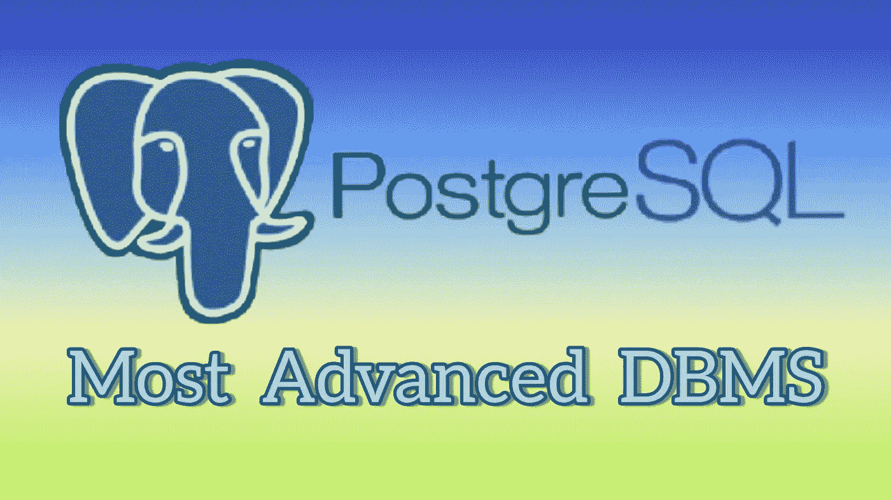
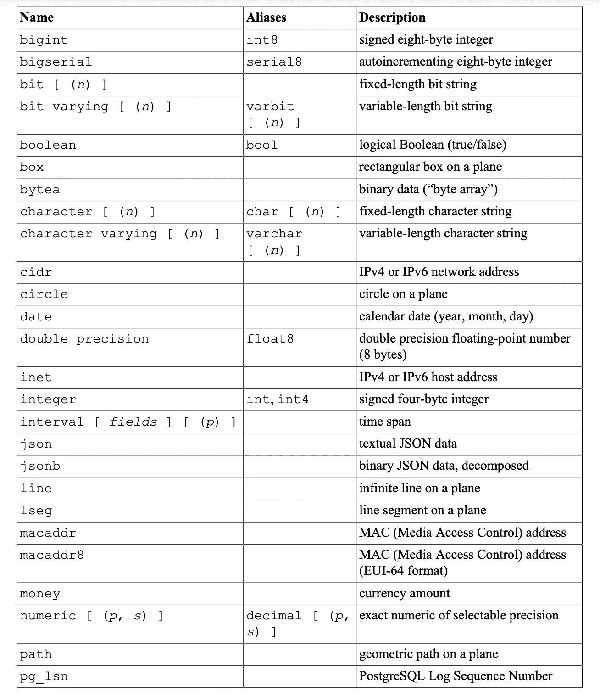
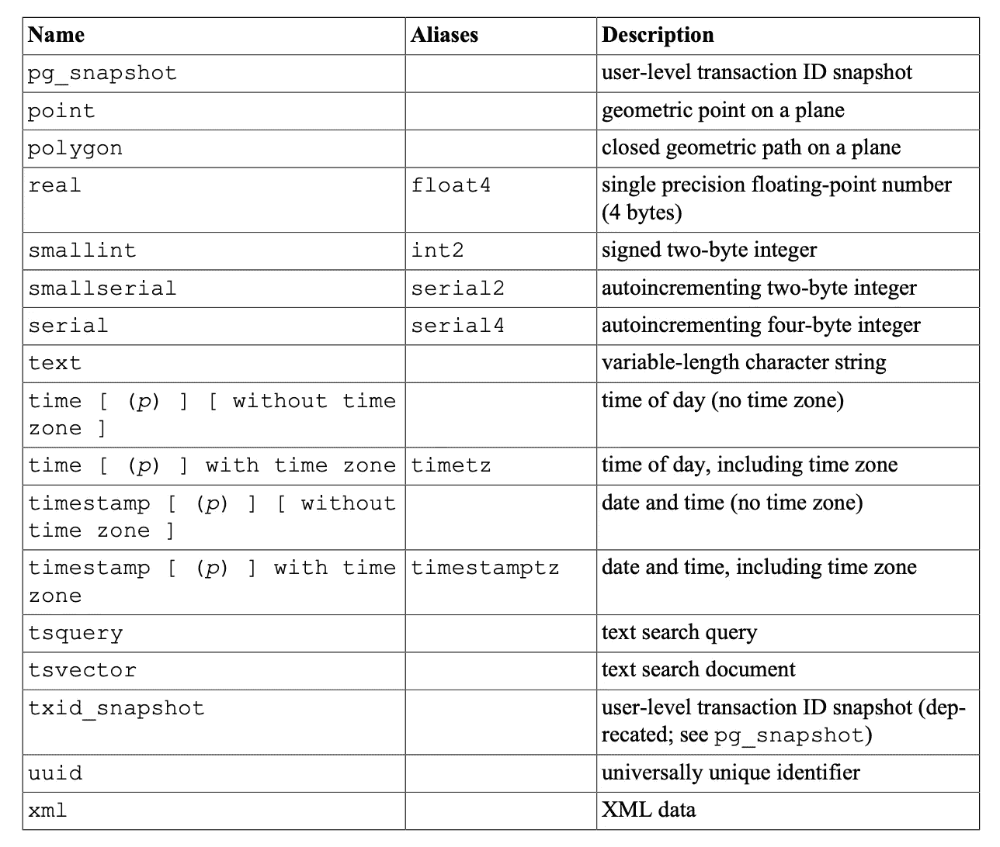

# PostgreSQL——迄今为止最先进的数据库管理系统？

> 原文：<https://blog.devgenius.io/postgresql-the-most-advanced-dbms-to-date-422f53eb2b95?source=collection_archive---------24----------------------->

欢迎来到另一个博客，在这个博客中，我们将深入了解 PostgreSQL 的基础知识，并理解为什么它是目前必不可少的工具。



PostgreSQL——迄今为止最先进的数据库管理系统？

**PostgreSQL** 是一个对象关系数据库管理系统(ORDBMS)。ORDBMS 指的是在数据库模式和查询语言中直接支持对象、类和继承的那些。例如，如果我们想在定义一个表时创建一个 IS-A 关系，我们可以使用 INHERITS，因为每个雇员都是一个人。

```
CREATE TABLE person (
  firstName text,
  lastName text,
  gender  text
);

CREATE TABLE employee (
  employeeId text UNIQUE NOT NULL
) INHERITS (person);
```

PostgreSQL 遵循所有 SQL 标准，是目前世界上最先进的开源数据库。它不仅为用户提供了一组丰富的原生数据类型，而且用户可以使用 [**创建类型**](https://www.postgresql.org/docs/current/sql-createtype.html) **创建新类型。**

下面列出了 PostgreSQL 支持的内置通用数据类型**和**



参考—[https://www.postgresql.org/docs](https://www.postgresql.org/docs)



参考—[https://www.postgresql.org/docs](https://www.postgresql.org/docs)

PostgreSQL 运行在所有主要的操作系统上，并且符合 [**ACID**](https://www.geeksforgeeks.org/acid-properties-in-dbms/) 。首先，应该熟悉 SQL 语法、模式和基本的 CRUD 操作(查询、数据定义和数据操作)。

以下是使 PostgreSQL 成为最先进的数据库的主要亮点

1.  支持**基本索引** (B 树、多列、表达式、部分)和**高级索引** (GiST、SP-Gist、KNN Gist、GIN、BRIN、覆盖索引、Bloom 过滤器)，这使得**读/写**操作比传统 DBMS 快得多**。**
2.  **因为它是一个基于对象的关系数据库管理系统，所以它支持表继承，扩展数据类型等。**
3.  **使用多版本模型—**(多版本并发控制)维护**数据的一致性**。这意味着在查询数据库时，每个事务看到的是一段时间以前的数据快照(一个*数据库版本*),而不管底层数据的当前状态。这防止事务查看可能由相同数据行上的(其他)并发事务更新导致的不一致数据，为每个数据库会话提供**事务隔离**。因此，它确保数据不会冲突，读操作不会阻塞写操作，反之亦然。https://www.postgresql.org/docs/****
4.  ****支持主要的**编程语言**(如 C/C++、JavaScript、Java、Python、R、Go、。Net 等)给了开发人员额外的权力。****
5.  ****允许**时间点******
6.  ****拥有开源许可，这意味着它没有许可成本，可以免费使用。****

****当我们将其与其他基于 SQL 的语言进行比较时，PostgreSQL 名列榜首，因为它具有许多高级特性，并且最适合于****

*   ******地理空间数据库—** PostgreSQL 支持地理对象，可用作基于位置的服务和地理信息系统(GIS)的地理空间数据存储。为了实现这一点，我们需要使用 [**PostGIS**](https://postgis.net/) 扩展。****
*   ******大型数据库—** 对于大型数据集，PostgreSQL 由于读/写操作更快而性能更好。****

****以上是使用 PostgreSQL 的一些关键亮点。希望你喜欢这篇关于 PostgreSQL 的初学者友好的文章。可能在下一部分中，我们将开始使用 PostgreSQL 进行设置和基本的 CRUD 操作。****

****请阅读我在 React Native 上的其他博客****

1.  ****所有关于 React Native 的初学者:优点、缺点和未来****
2.  ****[反应本地新架构—旧与新](https://javascript.plainenglish.io/react-native-new-architecture-old-vs-new-d0130f42bc79?source=your_stories_page-------------------------------------)****
3.  ****[最佳编码实践— React 本地版 2022](https://javascript.plainenglish.io/best-coding-practices-react-native-edition-2022-da833c8161de?source=your_stories_page-------------------------------------)****

****感谢阅读！！****