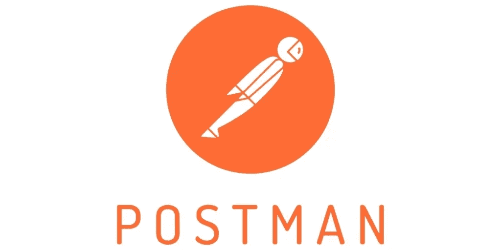

# 邮递员:多个 API 测试场景类别

> 原文：<https://blog.devgenius.io/postman-multiple-api-test-scenario-categories-e1fb799d242e?source=collection_archive---------2----------------------->

所以你没有意识到的是，我们通常会超越自己，试图以标准的基本测试来测试，这最终会成为一个基本的积极的测试场景。

但是你需要明白当你测试一个 API 的时候，你需要知道如何在 API 的每个方面测试它。这将在下面的要点中显示。

# 1.基本阳性测试

*   因此，在这里，我们试图测试我们放置 HTTP 请求并发送它的快乐流/路径
*   状态代码应始终用于
*   获取请求:200
*   员额请求:201
*   删除请求:200、202 或 204
*   有效负载响应应该显示模式验证，如
*   字段名称
*   字段类型
*   字段值

## 然后验证状态

*   获取请求，并验证**没有状态变化。**这意味着无论发送多少次请求，状态都不会改变。
*   对于发布、删除、修补、上传操作
*   确保通过以下方式在系统中正确执行操作:
*   执行适当的 GET 请求并检查响应

## 验证标题

*   验证是否包含预期的标头。在我们的例子中是这样的:
*   僵尸网络(空间 ID)
*   x CSRF 令牌
*   以及执行测试所需的任何其他标题(如您认为合适的)

# 2.具有可选参数的扩展阳性测试

*   此类别与类别 1 最相似，但不同之处在于，此类别将包括端点的可选参数，如

## 过滤器

*   最适合具有搜索过滤器的模块，如联系人、消息
*   确保根据指定值过滤响应

## 分类

*   最适用于包含表格的模块，如联系人字段、摘录、文件、结束语
*   指定要排序的字段，并测试升序和降序选项。确保根据选定的字段和排序方向对响应进行排序。

## 限制

*   确保数据集大小受到指定限制的约束。

## 跳跃

*   确保跳过从数据集开始的指定数量的结果

*关于过滤&分类*的进一步文件

[https://blog . postman . com/filtering-and-sorting-APIs-using-the-postman-API/](https://blog.postman.com/filtering-and-sorting-apis-using-the-postman-api/)

# 3.有效输入的负测试

*   因此，在这一类别中，我们编写的测试是阴性的，这意味着它们将是**失败的**测试，例如(使用有效输入)
*   试图用已经存在的名称创建资源
*   试图删除不存在的资源
*   试图用非法的有效数据更新资源
*   试图非法操作
*   阴性测试如下
*   验证 HTTP 状态代码不是 2XX
*   验证是否收到错误响应
*   验证错误格式是否符合规范。例如，错误是有效的 JSON 对象或普通字符串
*   验证是否有清晰的描述性错误消息/描述字段
*   验证此错误情况下的错误描述是否正确，是否符合规范

# 4.输入无效时的阴性测试

*   因此，在这一类别中，我们正在编写阴性测试，这意味着它们将通过**阴性测试的**测试，例如(使用无效输入)
*   授权令牌丢失或无效
*   缺少必需的参数
*   端点参数的值无效，例如:
*   路径或查询参数中的 UUID 无效
*   模型无效的负载(违反模式)
*   模型不完整的有效负载(缺少字段或必需的嵌套实体)
*   嵌套实体字段中的值无效
*   HTTP 头中的值无效
*   端点不支持的方法

# 5.破坏性测试

*   因此，在这一类别中，我们故意试图让 API 失败，以检查其健壮性，这意味着它们将会通过**的**测试
*   请求中的内容格式不正确
*   有效负载或 HTTP 头中的内容类型错误
*   满足于错误的结构
*   溢出参数值
*   尝试创建标题超过 200 个字符的用户配置
*   试图让用户使用长度为 1000 个字符的无效 UUID
*   溢出负载——请求体中有巨大的 JSON
*   这更像是破坏一个 API 的方法，就像我们在做测试时发现如何得到一个 bug 一样

## 用于验证

*   状态码、有效载荷、报头都会像第三类一样失败

# 参考

这是对 [Rest API 测试策略](https://www.sisense.com/blog/rest-api-testing-strategy-what-exactly-should-you-test/)的总结。

目前，我正在研究 API 自动化，所以每当我学到新的东西时，我都会与你分享我所获得的知识和成果。

> 测试一个产品是一个学习的过程，但是这个学习过程中最好的事情是当你学习并分享/教育你所学到的东西给其他人，帮助你达到最终的理解。