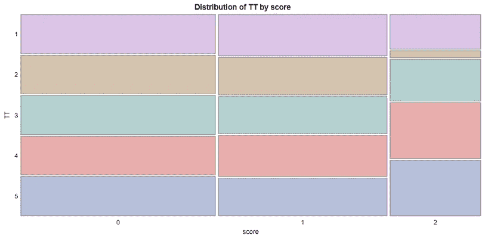
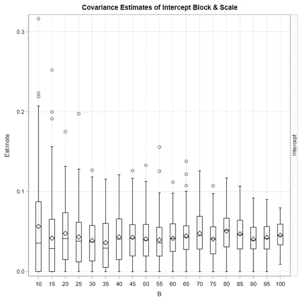
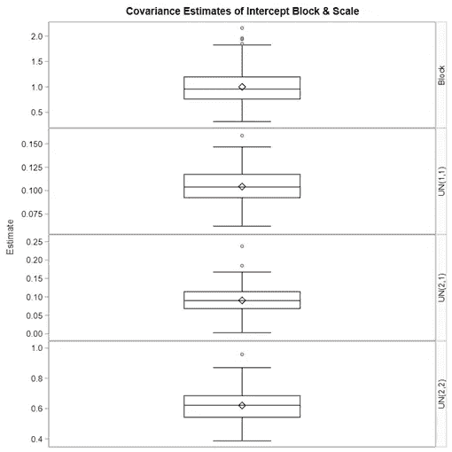
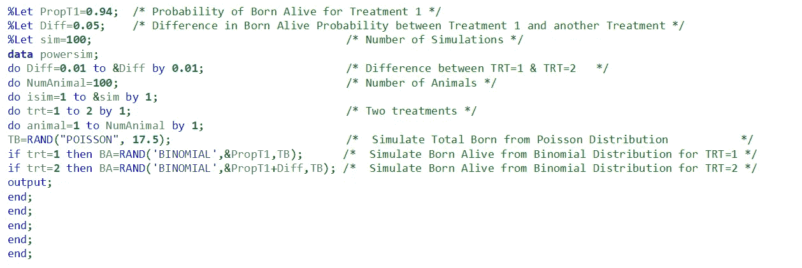
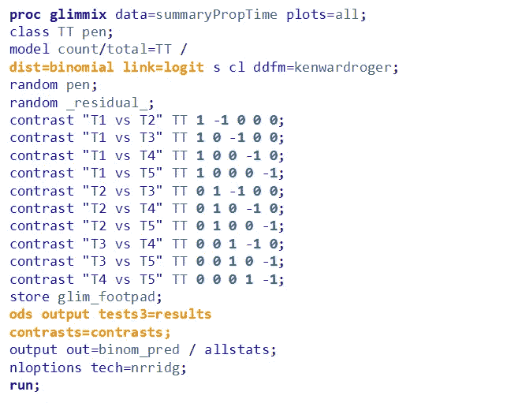

# SAS 中分类数据的功效分析。

> 原文：<https://blog.devgenius.io/power-analysis-for-categorical-data-in-sas-multinomial-ordinal-binary-binomial-beta-poisson-9398888491da?source=collection_archive---------1----------------------->

## 多项式、序数、二进制、二项式、贝塔、泊松、负二项式、贝塔二项式和正态分布示例。

一项研究的能力反映了一项测试发现一种效应的能力，如果这种效应确实存在的话。这意味着“功效”是一项研究**将**检测到一个**效应的**概率**，如果该效应确实存在的话。**更大的能量意味着假阴性或**II 型错误**的概率下降。

所以，如果我们说我们有 86%的能力，这意味着在 86/100 的试验中，我们会发现这个效应，如果它真的存在的话。然而，只有当我们进行完全相同的测试，并且我们预先指定了将要进行的测试的数量时，这个数字才成立。

没怀孕时怀孕(I 型错误)，怀孕时没怀孕(也是 I 型错误)。(它们都有不同的零假设)

解释 I 型和 II 型误差的 2*2 矩阵。

影响功率的参数，以及如何影响功率。

幂的计算取决于分布，对于离散变量和连续变量，分布是不同的。

W 我现在要做的是使用我在 [**PROC GLIMMIX** 帖子中使用的关于分析顺序数据](https://medium.com/@marc.jacobs012/generalized-linear-mixed-models-in-sas-distributions-link-functions-scales-overdisperion-and-4b1c767bb89a)的相同示例。这意味着我将展示对[多项、序数](https://medium.com/@marc.jacobs012/analyzing-ordinal-data-in-sas-fe9d9d35a449)、[二元、二项式、贝塔](https://medium.com/@marc.jacobs012/analyzing-ordinal-data-in-sas-using-the-binary-binomial-and-beta-distribution-8efe5fe5af66)、[泊松、负二项式](https://medium.com/@marc.jacobs012/analyzing-ordinal-data-in-sas-poisson-and-negative-binomial-distribution-5f46b039aaeb)、正态和[贝塔二项式分布](https://medium.com/@marc.jacobs012/sample-size-calculation-using-the-beta-binomial-distribution-7adca91035a9)的幂计算。我还将展示如何对死亡率数据、对数转换数据和具有非结构化方差-协方差矩阵的数据进行研究。

让我们从多项式开始。

预测概率来自具有一般 logit 链接的多项分布。

运行多项式模型的代码

和 add hoc 代码来估计用于治疗的类型 III 测试的功率。[这是一个事后的功率计算，最好用来看一眼](https://medium.com/@marc.jacobs012/inference-estimates-p-values-and-confidence-limits-a-frequentist-approach-acdd45d94bd5)。仅此而已。更好的是模拟数据。

和使用 t 分布代替正态分布的功效。

模拟多项式模型。

看到单个模拟的结果。

运行模拟程序。

看到结果。这里，功效等于显著测试的数量/测试总数。

以及模拟的结果——每个分数每个处理的显著差异的数量。因为这是一个具有一般 logit 链接的多项式，所以每个分数的差异是分开的。

总之，当分析腹泻评分时，多项式模型是最直接的，因为它假设评分是互斥的，并分析每个评分类别的治疗效果。参考分数影响结果。

使用多项式模型估计功率可以通过两种方式进行:

1.  通过使用**PROC glim mix**+non-profiling 请求特别功率分析。
2.  通过模拟多项式数据，然后使用**PROC glim mix**——最灵活的方式。

现在，让我们看看如何使用多项式分布和累积 logit 函数重复上述示例。这将创建一个真正的序数模型。本质上，上面的模拟和我现在要展示的之间的区别仅仅在于我分析数据的方式

分析数据的代码，以及寻找不同治疗之间差异的事后能力。如您所见，分数不再起作用，因为序数模型假设比例，这意味着分数 1 和 2 之间的差异与 0 和 1 相同。

更好的方法是模拟数据，为此，您需要一个表格来填写比例。

代码与常规 logit 链接模型完全相同。

每次治疗的模拟评分频率。

和基于单个模拟的事后功率。

以及在全部数量的模拟后每次治疗的功率。

因此，顺序模型是多项式模型，但假设数字有一个自然的顺序。序数模型的功效可以以与多项式模型完全相同的方式进行估计和/或模拟。这里，再次，模拟方法提供了最大的自由和最大的优势，然而也是最复杂和最费时的行为。

现在，我将继续二项式的例子。下面您可以看到用于分析二项式数据、运行事后功效测试以及模拟二项式数据以进行模拟功效分析的代码(这应该是您的首选工作方式)。

用于分析和事后计算每个治疗比较的二项式功效的代码。

结果。

如果我**临时**改变方差会发生什么？

使用二项式分布模拟功耗分析的代码。

和功率图来估计随机化完全区组设计中所需的区组数。

检测显著差异的能力，作为治疗比较的块数的函数。

另一种方法是模拟数据，一种随机完全区组设计的方法。

我将获得的数据集

该图显示了我如何建立模拟，以及跨处理和区块的方差。

测试模拟可行性的单一模拟分析。不要看残差，它们不是正态和同质的。最好看看预测的比例。

以及全仿真的分析。

和功率曲线。

总之，如果你想分析一个二元除法，你需要确定你是想把它作为一个**比例**还是作为一个**比率**来分析:

1.  比例=相同两个指标的比率±腹泻/粪便总量
2.  比率=两个不同指标的比率±腹泻/测得的总天数

二项式数据的功效计算遵循与序数/多项式功效计算相同的方法:

1.  使用 **PROC GLIMMIX** 可轻松进行后期处理。
2.  完全模拟更自由，但耗时更长，也更复杂。

下面你会看到使用 Beta 分布的例子。如你所见，程序总是一样的。我分析数据，进行事后功效计算，然后进行全面模拟，查看功效占被认为显著的治疗差异的百分比。

使用 Beta 分布的数据分析和事后功率计算。

beta 模型的完全模拟。

模拟总体的平均值和标准差

随机效应的协方差估计。[随着样本量的增加，这些将变得更小。](https://medium.com/@marc.jacobs012/randomness-in-mixed-models-8b7affd8a7c4)

以及作为处理比较、块和所使用的估计和(共)方差的函数的β功效图。

总之，贝塔分布是一种连续分布，它处理比例数据的方式与二项式分布不同。使用 beta 分布寻找腹泻分数的功效意味着:

1.  你需要估计比例参数。
2.  你需要找到阿尔法和贝塔。

PROC GLIMMIX 可以提供一个好的开始，但是完整的模拟是最好的。

N ext-up 是泊松回归。泊松有很多共同点，它也是两个值的函数，一个是速率。要创建该比率，您需要包括偏移变量。

偏移量决定了很多。

使用带有偏移变量的泊松分布。

事后功率计算。

泊松的模拟。

模拟数据集。

单一模拟的分析。没有过度分散。

左边是完整的模拟结果，右边是协方差估计。

泊松分布的幂图。

既然我们在处理泊松，我们也应该处理负二项式，因为它们经常被连用。请记住，负二项式是一个混合模型，即伽玛-泊松模型。

负二项式也可以使用偏移量。

模型的结果。

临时权力。

完整的模拟代码。

模拟数据集

块和缩放的协方差估计，左边是块方差，右边是缩放参数。

负二项式的幂图。

泊松与负二项式幂计算。存在相当大的差异，这可能是由于泊松低估了方差，这是其均值-方差关系的结果(均值=泊松中的方差)。

因此，其他两种可用于模拟有序数据(如动物腹泻)的分布是泊松分布和负二项式分布。两者都处理计数数据，但负二项式更容易处理，因为它估计模型内的方差。这个方差估计是功率模拟中的比例参数和关键。此外，我们现在必须有效地模拟两件事:

1.  偏移变量
2.  腹泻的次数

N ext up，一个与 power for[完全不同的结果，它是用来衡量家禽动物产仔质量的产仔数](https://pubmed.ncbi.nlm.nih.gov/28066939/)。此指标是一个顺序指标，但它有如此多的值(0–10，步长为 0.5)，可以分析为来自正态分布。

PROC GLIMMIX 代码示例，用于分析数据和事后功率计算。

使用非结构化方差-协方差矩阵分析重复测量数据的代码，如上所示。

模拟的协方差矩阵。

测试分析——看起来不错。

看起来又好了。

和每个时间点每次治疗比较的实际功率曲线。

从技术上来说，窝卵分数是分类数据。但是，因为有如此多的类别，您可以安全地应用正态分布。这意味着，对于一个[完全随机区组设计](https://medium.com/@marc.jacobs012/building-and-optimizing-randomized-complete-block-designs-using-sas-c973d127d862)，您可以使用正常数据的幂码来模拟产仔数的数据。

下一个例子处理分析木制乳房数据，这是多项式/序数数据，正如你从下面的图中看到的。

每次治疗的评分频率分布。

数据分析和整体事后电源分析。如果你看左边的图，89%的后验权力并不意味着什么。特别是，因为“治疗”实际上是更大曲线的剂量反应部分。

下面是两个模拟场景，每个处理使用相同的比例。

两种不同的模拟场景。

以及最大模拟数据集的功耗计算。

总之，木制乳房数据可以使用顺序或多项式分布进行建模。这里，我们使用了顺序分布。从木制乳房试验中提取能量并模拟新数据的方式与腹泻相同。因此，您可以使用许多其他分布，这取决于您希望如何分析 wooden breast。

下面的例子将处理我将使用负二项式(因为它有两个参数)和对数标度分析的比率。

代码和结果。

事后功率计算。

以及一种使用事后功率计算来改变场景的方法。我在这里做的是改变方差分量和样本大小。这当然只是一种筛选方法，永远无法取代真正的模拟。

左边是来自原始数据的方差-协方差估计，左边是替换值。不要担心没有标准误差。PROC GLIMMIX 将使用接近公式状态下的估计值。

权力的变化

负二项分布是一种有明显吸引力但也容易混淆的分布。让我们看看[维基百科](https://en.wikipedia.org/wiki/Negative_binomial_distribution)上的一些引文:

> **负二项分布**是一种[离散概率分布](https://en.wikipedia.org/wiki/Discrete_probability_distribution)，它模拟了在指定(非随机)数量的失败(表示为 *r* )发生之前，一系列独立且同分布的[伯努利试验](https://en.wikipedia.org/wiki/Bernoulli_trial)中的成功数量

这意味着负二项式可以表示为 NB ( *r，p* )，其中 *r* 是成功之前的失败次数，而 *p* 是成功的几率——r*不能为负，并且 *p* 必须介于 0 和 1 之间。*

由于负二项式是一个混合模型，它也可以表示为伽玛-泊松，然后我们必须谈论形状，规模和速率参数。

> 负二项分布也作为[泊松分布](https://en.wikipedia.org/wiki/Poisson_distribution)(即[复合概率分布](https://en.wikipedia.org/wiki/Compound_probability_distribution))的连续混合出现，其中泊松率的混合分布是[伽马分布](https://en.wikipedia.org/wiki/Gamma_distribution)。也就是说，我们可以将负二项式视为泊松( *λ* )分布，其中 *λ* 本身是一个随机变量，分布为伽玛分布，其形状= *r* ，比例*θ*=*p*/(1-p)或相应的比率*β*=(1-p/*p*

这就是 SAS 处理负二项式的方法。由此，当然可以提取概率值。

负二项式中最棘手的参数是比例参数。负二项有很多种表达方式。

在事后分析中使用封闭公式改变方差-协方差的模型，以及比较处理时的功效估计。

以及通过增加自由度来改变样本大小。

下面，您可以看到一个数据集的创建，从中可以模拟负二项分布。

模拟数据集

模型的测试。

事后权力分析。

就我个人而言，我发现这部分是最棘手的，因为 power for 的结果是一个构建的速率。因此，我无法完全模拟它，而是使用 **PROC GLIMMIX** 进行新的功耗分析。

使用 **PROC GLIMMIX** 您可以:

1.  通过*参数*语句改变差异
2.  通过 *DF* 语句增加样本量

下面，我将向你展示如何模拟一个贝塔二项分布来估计死产小猪的数量。[我在](https://medium.com/@marc.jacobs012/sample-size-calculation-using-the-beta-binomial-distribution-7adca91035a9)之前已经发布过这个，但是在这里会稍微扩展一下。

使用正态和负二项分布分析出生活产数据。尽管残差图不适用于负二项式，但最好选择该分布，因为数据本身是离散的。

模拟代码通过对总出生数使用泊松以及对活产数使用二项式来估计/模拟活产动物。

以及当我模拟 1–5%的差异时的比例差异。这样的话，还是有很大的可变性。

但是，每次治疗仅使用 100 头母猪，当使用早期试验的差异时，我应该能够轻松实现 100%的功率。

然而，研究的问题不是活产婴儿有 3%的差异，而是死产婴儿有 3%的差异。尽管这是一个零和游戏，但当谈到差异时，两者并不是零和的。因此，为了模拟一个场景，其中静产有 3%的差异，我们需要使用静产进行模拟。

让我们使用数据，使用二项式分布。

我们可以通过两种方式包括 sow 变化:包括随机 sow 成分(准二项式)或使用β-二项式分布，其中概率部分来自β。

为了模拟贝塔-二项式，我们需要用贝塔分布来模拟二项式的概率部分。这样，将会有更多的方差，我们使用混合分布来模拟母猪方差。

以上的关键是找到属于某个处理平均值和方差的α和β值

让我们寻找α和β值，并将其与两种治疗的平均值和方差估计值联系起来。

这是我发现的。

在这里，你可以看到均值和方差之间的关系，以及阿尔法和贝塔。

因此，在开始全面模拟之前，我将再次解释一下这个过程:

1.  我想模特仍然出生。
2.  我寻找每次治疗比例的平均值/方差。
3.  我寻找每种治疗各自的α和β值来填充β分布。
4.  我从贝塔分布中抽取样本来填充二项分布。
5.  我从二项分布中抽取样本，使用贝塔分布中的概率和泊松分布中的动物数量。
6.  这样，对于两个处理，以及模拟的比例差异，我可以模拟每个处理的母猪数量需要达到 3%的差异。

我上面解释的代码。

和力量。这一次，使用 100 只动物会让你一无所获。你需要很多动物。

总之，模拟数据来估计死产、活产和总产可能相当困难。生命出生和总出生接近正态分布，但都是计数值。因为我们想估计死胎，我们需要坚持死胎。可以通过以下方式进行模拟:

1 .二项分布→变异被低估

2 .随机 sow 包含→通过随机组件的变化

3 .β-二项式→通过混合分布的变化

下面你可以看到一个二项式分布可以用来计算鸟类死亡率的例子。这里，我使用的是随机完全区组设计。

在比较五种治疗的死亡率概率时，改变块的数量(从而改变样本大小)的代码。

和功率图。

在动物试验中，死亡率通常很低。因此，发现死亡率差异(如果存在的话)的能力非常低。这未必是一件坏事——你不想要死亡。如果你想模拟死亡率，那么使用二项分布。

这是脚垫损伤的模拟。

分析试验并使用事后功率计算的代码。

和完全模拟后的功率图，完全模拟遵循与死亡率模拟相同的设置。

就像模拟腹泻和死亡率一样，可以使用二项式分布来模拟足垫损伤。这使得进行分析非常简单。

最后但同样重要的是，偏好数据是一种有趣的数据类型，因为它们是互斥的。零和，如果你想在一次分析中得到结果，需要一个双矩阵。这其实是矫枉过正。

对数据的分析

和模拟代码。我确信这可以做得更简单，但至少你知道它看起来像什么。为此，我还不得不使用 **SAS / IML** 。

结果呢。

结果呢

可以使用正态分布来分析偏好数据。使用非结构化方差矩阵，once 可以很容易地模拟随时间变化的偏好数据。这里，模拟方法是最简单的。

这是相当多的。我希望你喜欢它！