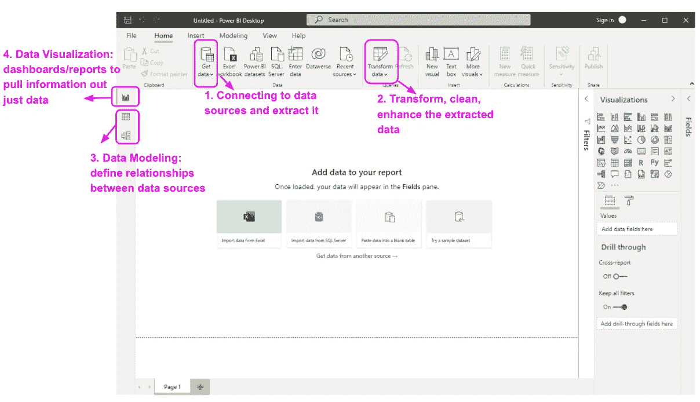
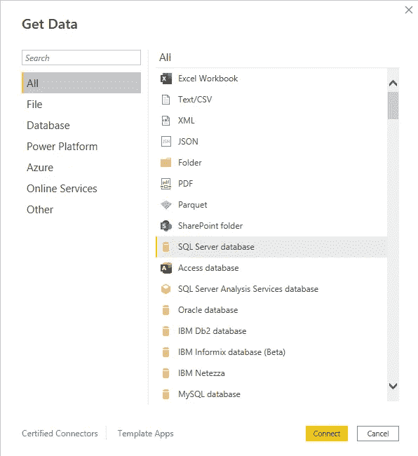
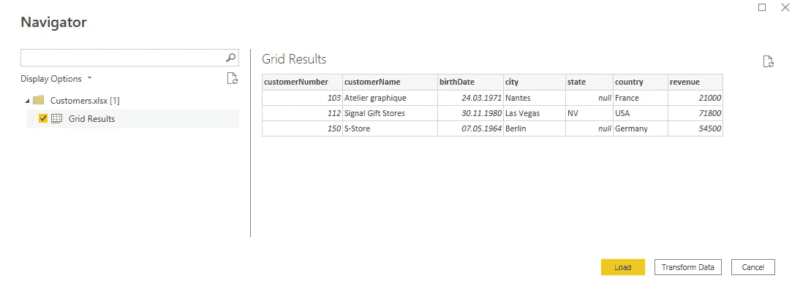
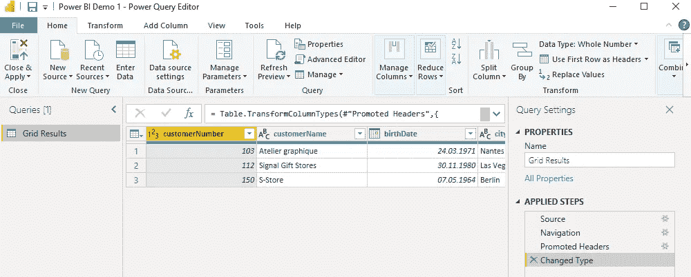
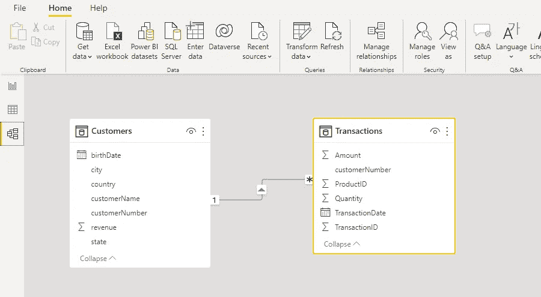
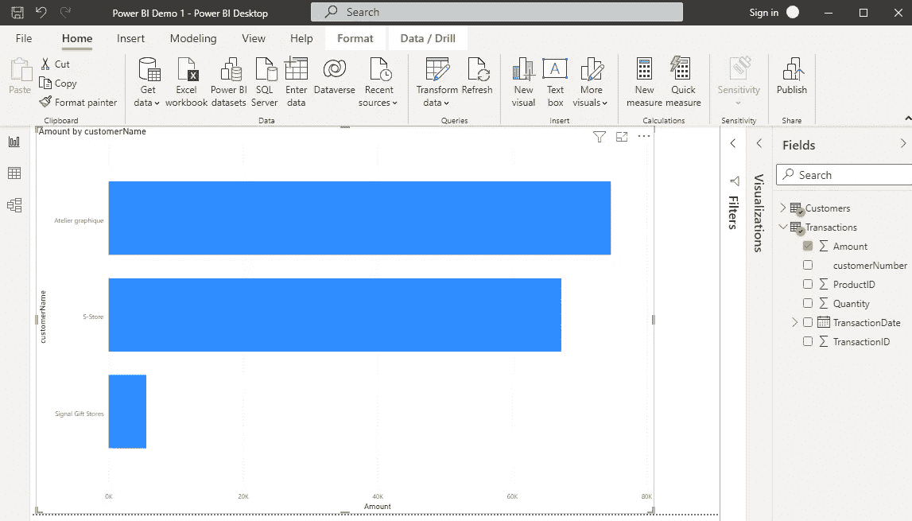

# 通过步骤#1 增强 BI 桌面—概述

> 原文：<https://blog.devgenius.io/power-bi-desktop-by-steps-1-overview-22bf781fd8bf?source=collection_archive---------14----------------------->


[KOBU 机构](https://unsplash.com/@kobuagency?utm_source=medium&utm_medium=referral)在 [Unsplash](https://unsplash.com?utm_source=medium&utm_medium=referral) 上拍摄的照片

如果您对数据感兴趣，出于多种原因，Microsoft Power BI 是必知的工具之一。在本系列中，我想介绍 Power BI Desktop 的基本特性，以简单实用的方式导入、转换和构建对数据的洞察。

```
**·** [**Intro**](#1593) **·** [**What we can do with Power BI Desktop**](#8c31) **·** [**Getting started with Power BI Desktop**](#9578) **∘** [**1\. Get Data**](#c269) **∘** [**2\. Transform Data**](#a13f) **∘** [**3\. Data Modeling**](#a20c) **∘** [**4\. Data Visualization**](#d7ef) **·** [**In a nutshell..**](#c06f)
```

# 介绍

Power BI Desktop 是微软 Power BI 的核心工具，用于实际开发:数据收集、转换、建模、构建报告和仪表板。

当我第一次开始使用它的时候，我发现大量的材料和信息让我无法快速上手和学习。

在这里，我的目标是直奔主题:清楚地解释要点，并快速上手。

# 我们可以用 Power BI 台式机做什么

我们需要它来完成 4 个主要的补充任务:

1.  **连接任何类型的数据**:来自文件、数据库、网络等。结构化与否。

2.**转换数据**:清理 it、添加智能、业务规则、改变格式等。

3.**建模数据**:将多个数据源组合在一个单一的数据模型中，该数据模型具有商业意义，允许洞察(例如，使用客户、销售、产品等 3 个数据源，我们可以构建一个单一的数据模型，旨在提供销售绩效洞察)

4.**可视化数据**:构建数据可视化，从数据中提取实际信息。

# 开始使用 Power BI 台式机

下载、安装并启动 Power BI Desktop 后，让我们看看上面介绍的 4 个主要任务在该工具中的位置



超级商务智能台式机—主

## **1。获取数据**

单击“获取数据”按钮时，您可以连接到许多不同的数据源。



让我们假设我们的源数据在一个 Excel 电子表格中，这样如果您愿意，您可以很容易地演示:一旦您在源列表中选择“Excel Workbook ”,并浏览您的本地源文件，以下窗口允许在 Power BI 和您的文件之间建立连接。

通过单击 Load，源数据被导入到 PowerBI Desktop 数据模型中，以便您可以继续执行后续任务。



## 2.转换数据

点击“转换数据”按钮(参见任务 2。在上图“Power BI Desktop-Main”中，您将看到另一个窗口出现。这是一个名为“Power Query”的非常强大的工具，专门用于构建各种数据操作、重组、增强和清理。



一旦您创建了所有需要的数据处理和转换步骤，通过单击 Close & Apply，您将离开 Power Query，并准备好继续您的下一个任务:数据建模。

## 3.数据建模

实际上，我们的源数据总是存储在多个数据源中，例如数据库表。为了将分析或任何类型的数据处理构建为实际的洞察力，我们需要关联所有数据源，以便 Power BI 知道如何组合源数据:为此，我们使用“模型”按钮。

假设我们导入了两个数据源，一个列出了通过网站进行的销售交易，另一个列出了相应的客户:我们知道每笔销售都是由某个客户进行的，所以我们可以通过两个数据源中存在的客户标识符将它们联系起来。

如果您点击视图“模型”,您可以导入数据源并建立它们之间的关系。



一旦数据模型完成，如果我们在数据可视化中混合来自两个源的数据，以获得客户的交易视图，Power BI 知道如何组合来自两个源的数据。

## 4.数据可视化

要在您刚刚构建的数据模型上构建可视化，请单击“Report”视图，并组合来自不同来源的对象:这里我只显示了销售总额(来自交易数据源)、客户名称(来自客户数据源)。



# 简单地..

在这个故事中，我只是向您概述了 Power BI Desktop 关注的 4 个主要任务，没有详细说明或解释如何完成这些任务。这将是本系列接下来几集的目标。

感谢阅读。

[随时订阅我的**《分享数据知识》**简讯**。**](http://eepurl.com/humfIH)


如果你想订阅《灵媒》,请随意使用我的推荐链接[https://medium.com/@maw-ferrari/membership](https://medium.com/@maw-ferrari/membership):对你来说，费用是一样的，但它间接有助于我的故事。