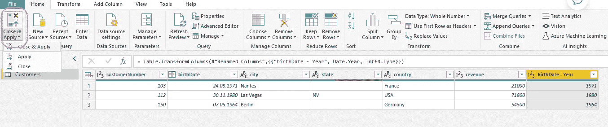

# Power BI Desktop 第 2 步—使用 Power Query 转换数据

> 原文：<https://blog.devgenius.io/power-bi-desktop-by-steps-2-transforming-data-with-power-query-b745e676b585?source=collection_archive---------11----------------------->


[KOBU 机构](https://unsplash.com/@kobuagency?utm_source=medium&utm_medium=referral)在 [Unsplash](https://unsplash.com?utm_source=medium&utm_medium=referral) 上拍摄的照片

如果您对数据感兴趣，出于多种原因，Microsoft Power BI 是必知的工具之一。在本系列中，我想介绍 Power BI Desktop 的基本特性，以简单实用的方式导入、转换和构建对数据的洞察。

```
**·** [**Intro**](#1593) **·** [**Importing data**](#8c31) **·** [**Power Query queries**](#d276) **∘** [**First transformation: column selection**](#311e) **∘** [**The essence of Power BI data transformation: built-in Vs DAX**](#f6fd) **∘** [**Pushing transformations to Data Model**](#9be9) **·** [**In a nutshell..**](#c06f)
```

# 介绍

在我的故事[**Power BI Desktop by steps # 1—Overview**](/power-bi-desktop-by-steps-1-overview-22bf781fd8bf)中对 Power BI 进行了简短概述之后，我想谈谈数据转换。这是大多数数据项目的有趣之处，人类几乎无法替代，因为在这个阶段，我们开始通过简单地清理数据或应用复杂的业务规则来赋予原始数据商业意义。

Power BI 的主要特性之一是可以将任何东西应用到非常简单到复杂的数据转换中。当我们想要生成直接的数据洞察或为其他数据流程提供信息时，这是我们始终需要应用的基本步骤。Power BI 中创建数据转换序列的组件是“Power Query”工具。

本文的目标是通过介绍一种在 Power BI 中创建数据转换的方法来开始使用它。

# 导入数据

在这个故事中，我们将参考下面的数据集，你可以从[这里](https://github.com/MawFerrari/SharedRepo/blob/27b4e8f80093c3c6fb4f737f980bdb2fc83dc066/Customers.csv)下载一个 csv 文件，命名为“Customers.csv”。


让我们从我们的源文件导入源数据，通过点击**获取数据**按钮，浏览您的文件位置，然后点击**加载**来导入它。


然后我们要打开电源查询，通过点击**转换数据**按钮。

# **电力查询查询**

Power Query 将数据源视为查询。在我们的这个例子中我们导入了 Customers.csv，只是创建了一个查询" Customers "


当然，我们可以修改查询或创建新的查询，以添加新的转换、清理数据、应用业务规则，就像您对数据库使用 SQL 一样。

最佳实践:确保您定义的每个查询都有一个清晰易懂的名称(例如 Customers)。如果默认名称不够明确，您可以重命名它。

Power Query 的每个查询都将作为一个不同的表成为我们数据模型的一部分。

## 第一个转换:列选择

我们的第一个转换是从源中删除我们不需要的列。在编写 SQL 查询时，这也是一个最佳实践。

在 Power Query 中，我们可以用几种不同的方式来实现，但这里是我最喜欢的方式:在**主页**功能区下，单击按钮**选择列**


让我们选择除**客户名称**列之外的所有列。

请注意，在右侧显示的应用步骤列表中，有一个步骤“已删除”..列”添加到前面的步骤中。您可以随时删除或修改已经创建的步骤。


## Power BI 数据转换的本质:内置 Vs DAX

我们经常需要基于现有的列来转换数据，以增强信息内容并允许更复杂的分析。

简单的例子:我们希望根据客户的出生年份来分析客户行为，但是我们的数据源上只有客户的出生日期。

我通常喜欢复制现有的原始列，并在新创建的列上进行数据转换。这里我们复制了生日列


这是:


让我们以一种有意义的方式重新命名它:


现在，我们需要转换它的数据。在超级查询中，我们可以通过两种主要方式来完成

*   通过内置的转换
*   由达克斯

现在让我们从最简单的方式开始:内置数据转换，将 DAX 留给我的系列中的其他文章。

只需右键单击我们想要处理的列，我们就可以看到多种潜在的转换。

根据列的数据类型，我们有不同的潜在转换


在这里，我想从数据中提取年份，所以我选择了 Year，我们开始了:我们的 birth date-Year 列不再包含完整的日期，而只包含年份。

还要注意右侧的应用步骤列表:我们有越来越多的步骤，因为我们应用到数据源的每个操作(导入源文件、选择要保留的列、复制生日列、重命名它、提取年份)都被列出，并且可以被编辑或删除。

以便我们可以跟踪所有的转换，这在我们需要总结和记录业务规则时非常有用。


## 将转换推送到数据模型

一旦我们对所有全新的数据转换感到满意，我们希望将它们传播到实际的数据模型，最终将为我们的数据可视化、报告和仪表板提供信息。

我们通过点击**关闭&应用**按钮来实现。简单，但做起来很重要！



现在，当您转到**数据**视图时，您会注意到我们所做的所有转换实际上都是我们数据模型的一部分。

**数据**视图:


**型号**视图:


# 简单地..

在这个故事中，我们讨论了您将在 Power BI 的任何数据项目中使用的两个概念:导入和转换数据。我们只使用了数百种可用的内置转换中的一种，将最强大的“DAX”转换留给了本系列的其他故事。这里的想法只是介绍我们如何将业务逻辑应用于原始数据源。

感谢阅读。

[随时订阅我的**《分享数据知识》**简讯**。**](http://eepurl.com/humfIH)


如果你想订阅《灵媒》,请随意使用我的推荐链接[https://medium.com/@maw-ferrari/membership](https://medium.com/@maw-ferrari/membership):对你来说，费用是一样的，但它间接有助于我的故事。