# 与 Oracle 自主数据库的强大 BI 桌面集成

> 原文：<https://blog.devgenius.io/power-bi-desktop-integration-to-oracle-autonomous-database-6abfa496fe38?source=collection_archive---------6----------------------->

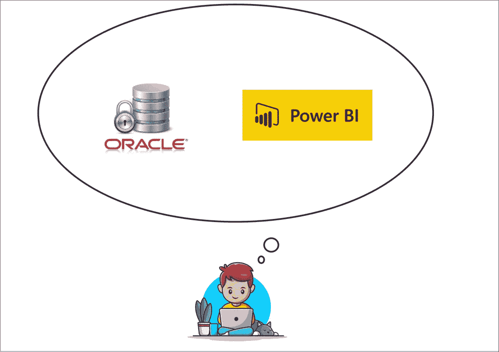

> 上一篇 [**这里**](https://medium.com/p/f1f03d354900) 。
> 
> Github 项目[这里**这里**。](https://github.com/saulotp/Dados-publicos)

本文假设您已经在 Oracle Cloud 上有了一个自治数据库。如果您还没有，请点击此处阅读之前的文章，在这篇文章中，我讲述了如何创建 Oracle 云帐户和自治数据库。您可以在此阅读后续步骤[的完整文档。](https://www.oracle.com/a/ocom/docs/database/microsoft-powerbi-connection-adw.pdf)

> 步骤
> 1 - ODAC (Oracle 数据访问组件)安装
> 2 -将数据库连接到 Power BI
> 3 -使用数据库数据创建简单的仪表板。

# 1 - ODAC (Oracle 数据访问组件)安装

将相应的 Oracle ADB 凭据 zip 文件下载到已经或将要安装 Power BI Desktop 的系统中。这些凭证文件将用于将 Power BI Desktop 连接到 ADB。

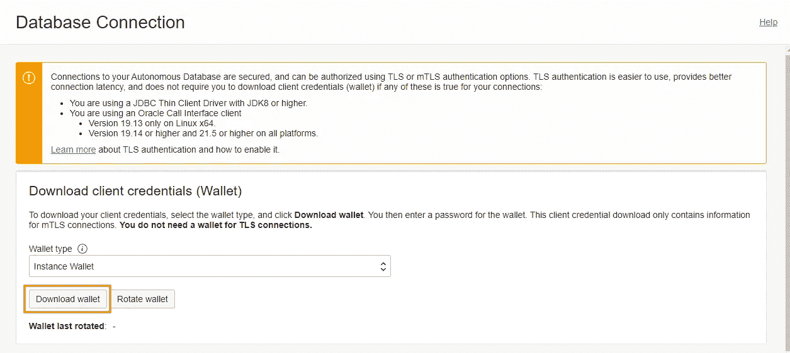

打开 Power BI Desktop 并创建一个项目。

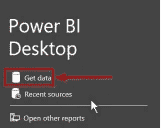

选择数据库> Oracle 数据库>连接，尝试连接到 Oracle 数据库。

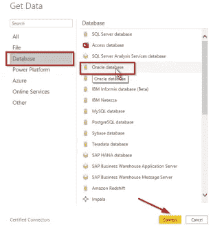

如果错误指示它正在尝试使用 Oracle.DataAccess.dll 程序集，则使用非托管 ODP.NET 设置 Power BI Desktop。如果错误消息称正在尝试使用 Oracle.ManagedDataAccess.dll，则使用托管 ODP.NET。

如果需要使用非托管 ODP.NET，请确定 Power BI 是 32 位还是 64 位。要查看 Power BI Desktop 的位数，请选择文件>帮助>关于。

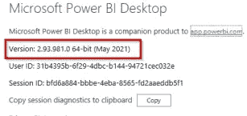

在上图中，我们看到正在使用 64 位 Power BI Desktop。这意味着必须安装和配置 64 位非托管 ODP.NET，以便 Power BI 连接到 ADB。如果使用 32 位 Power BI Desktop，则需要 32 位非托管 ODP.NET。以下说明涵盖了所有情况，无论您使用的是托管还是非托管 ODP.NET，或者您使用的是 32 位还是 64 位 Power BI。

如果您需要托管 ODP.NET 或 64 位非托管 ODP.NET，请从本[网页](https://www.oracle.com/database/technologies/dotnet-odacdeploy-downloads.html)中间的 ODAC Xcopy 部分下载 64 位 ODAC 19.3。如果您需要 32 位非托管 ODP.NET，请从 ODAC Xcopy 部分下载 32 位 ODAC 19c。

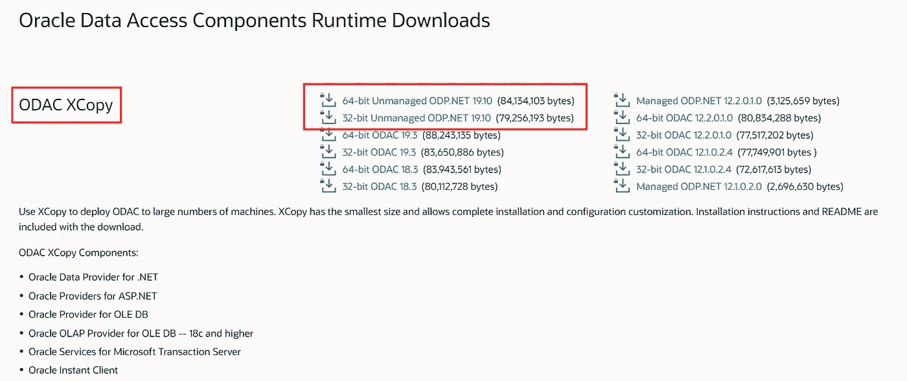

现在，我们将安装 ODP.NET。托管 ODP.NET、32 位非托管 ODP.NET 和 64 位非托管 ODP.NET 的安装说明相同。将下载内容解压缩到临时目录(例如 c:\xcopy64-install 或 c:\xcopy32-install)。

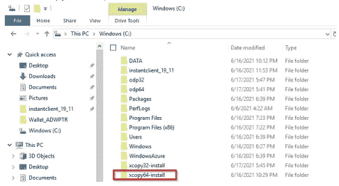

在管理员模式下打开 Windows 命令提示符。导航到暂存目录，然后执行下一个命令来安装 ODP。网络:

```
install.bat odp.net4 <instalation directory>  odp64
```

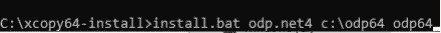

> 注意:输入目录参数的安装位置(例如 c:\odp64 或 c:\odp32)

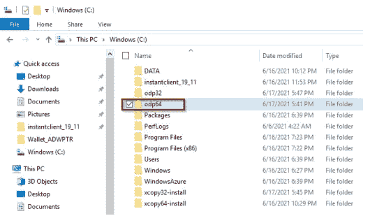

托管 ODP.NET 和非托管 ODP.NET 的配置说明有所不同。在具有管理员权限的同一个命令提示符下，导航到安装子目录\odp.net\bin\4。然后，执行以下命令:

a)配置非托管 ODP。网络:

```
OraProvCfg /action:gac /providerpath:"Oracle.DataAccess.dll"
```

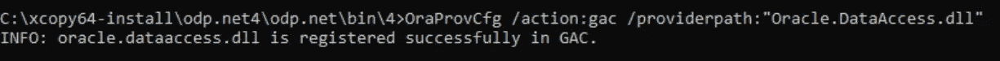

```
OraProvCfg /action:config /product:odp /frameworkversion:v4.0.30319 /providerpath:"Oracle.DataAccess.dll"
```

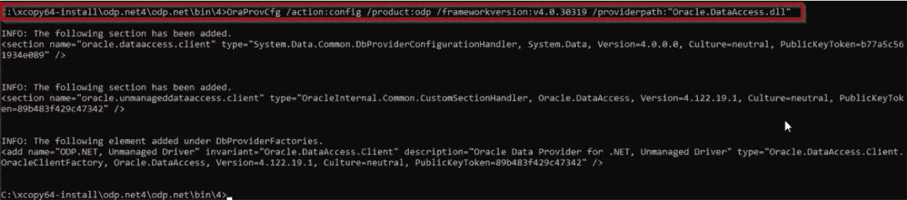

> 注意:请验证您使用的是 Oracle.DataAccess.dll 文件的正确路径。

b)配置被管理的 ODP。网络:

```
OraProvCfg /action:gac /providerpath:"../../managed/common/Oracle.ManagedDataAccess.dll"
```

接下来:

```
OraProvCfg /action:config /product:odpm /frameworkversion:v4.0.30319 /providerpath:"../../managed/common/Oracle.ManagedDataAccess.dll"
```

(仅适用于非托管 ODP.NET)根据 BI 将使用的版本，通过添加 64 位 Oracle 客户端目录(例如 c:\odp64)或 32 位 Oracle 客户端目录(例如 c:\odp32)的路径值来编辑 Windows 环境变量。

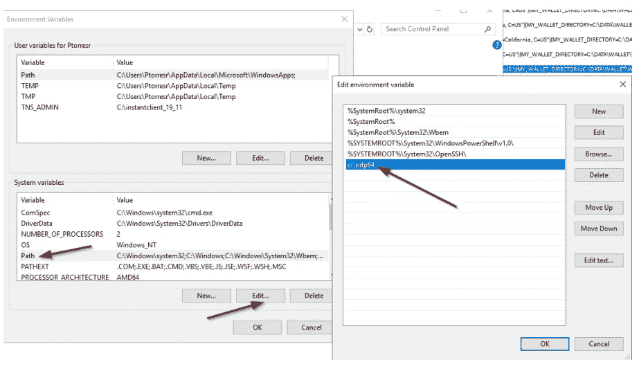

要确保此目录路径设置优先于现有的 Oracle 主目录，请使用“上移”按钮将设置上移至目录顺序中的最高级别。

导航到您在 Windows 计算机上下载 Oracle ADB 身份证明的位置。将内容解压缩到一个目录中。

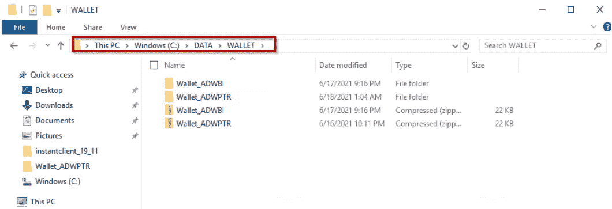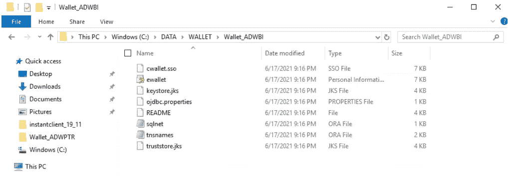

在 Windows 环境变量对话框中，创建 TNS_ADMIN 变量。将其值设置为解压缩 ADB wallet 内容的目录位置。

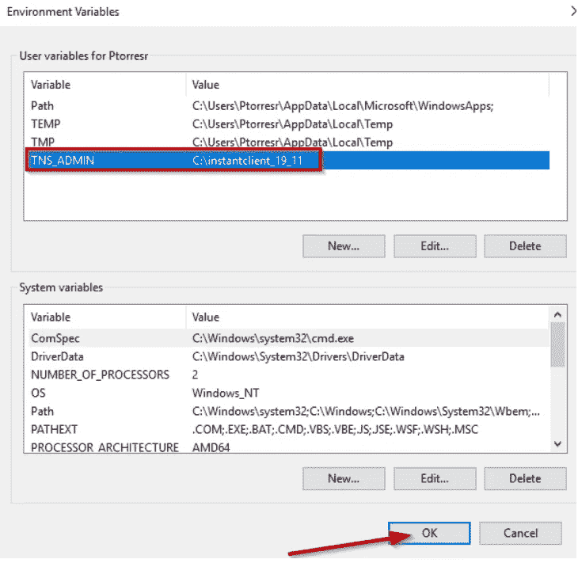

> 注意:tnsnames.ora 网络服务名称将用于连接到 ADB。

如果要连接到一个 ADB 实例，请打开 SQLNET。文本编辑器中 wallet 目录下的 ORA 配置文件。您将看到下面一行:

```
WALLET_LOCATION = (SOURCE = (METHOD = file) (METHOD_DATA = (DIRECTORY="**?/network/admin**")))
```

将目录值设置为机器上的 ADB wallet 目录位置，例如:

```
WALLET_LOCATION = (SOURCE = (METHOD = file) (METHOD_DATA = (DIRECTORY= **C:\DATA\WALLET\Wallet_ADWBI**)))
```

保存文件并继续下一步。

如果从同一台计算机连接到多个 ADB，并且每个 ADB 都有不同的 wallet，请将参数 MY_WALLET_DIRECTORY 添加到连接描述符中，每个描述符的特定 WALLET 位置位于 TNSNAMES.ORA 中。例如:

```
adwptr_high = (description= (retry_count=20)(retry_delay=3)(address=(protocol=tcps)(port=1522)(host=adb.us-phoenix1.oraclecloud.com))(connect_data=(service_name=bk8ui2h_adwptr_high.adwc.oraclecloud.com))(security=(s sl_server_cert_dn="CN=adwc.uscom-east-1.oraclecloud.com, OU=Oracle BMCS US, O=Oracle Corporation, L=Redwood City, ST=California, C=US")(**MY_WALLET_DIRECTORY=C:\DATA\WALLET\Wallet_ADWPTR**))) adwbi_low = (description= (retry_count=20)(retry_delay=3)(address=(protocol=tcps)(port=1522)(host=adb.usphoenix- 8 1.oraclecloud.com))(connect_data=(service_name=bk8uqvi2h_adwbi_low.adb.oraclecloud.com))(security=(ssl _server_cert_dn="CN=adwc.uscom-east-1.oraclecloud.com, OU=Oracle BMCS US, O=Oracle Corporation, L=Redwood City, ST=California, C=US")(**MY_WALLET_DIRECTORY=C:\DATA\WALLET\Wallet_ADWBI**)))
```

打开名称。ORA 文件，以查看可以连接到哪些 ADB 网络服务名。下面你看到三个不同的:adwptr_high，adwptr_low，adwptr_medium。您的 ADB 网络服务名称可能会有所不同。

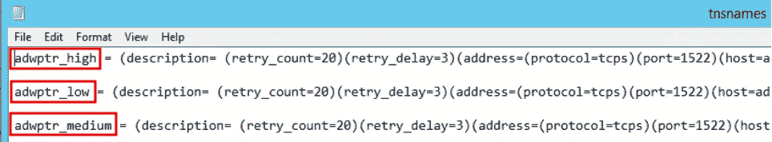

# 2 -将数据库连接到 Power BI

> 步骤
> 1 - ODAC (Oracle 数据访问组件)installation✔
> 2 -将数据库连接到 Power BI
> 3 -使用数据库数据创建一个简单的仪表板。

再次打开 Power BI Desktop，单击“获取数据”，选择“Oracle”，然后使用您的网络服务名之一进行连接。

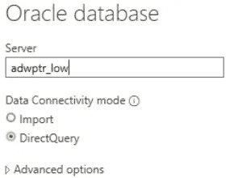

恭喜你！您的 Power BI 桌面实例现在应该连接到 ADB。在 Navigator 中打开创建自己的 Microsoft Power BI 桌面文档所需的数据表格。pbix)并加载数据。

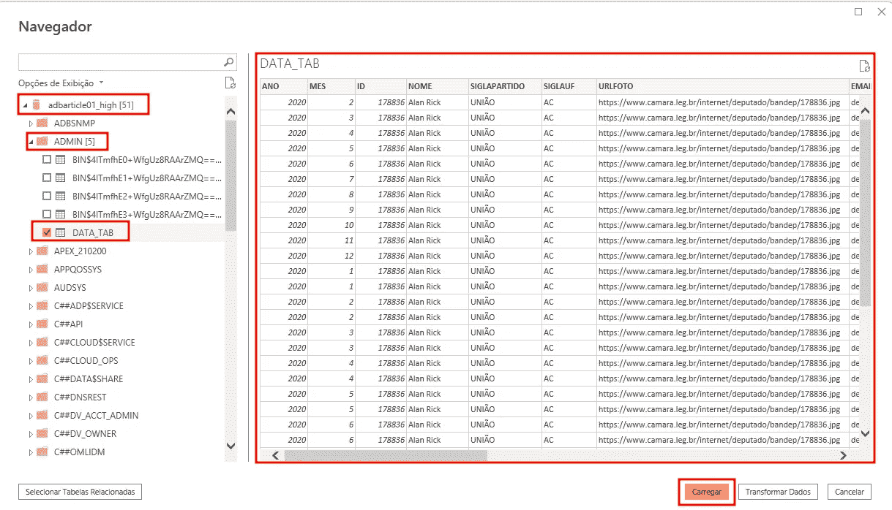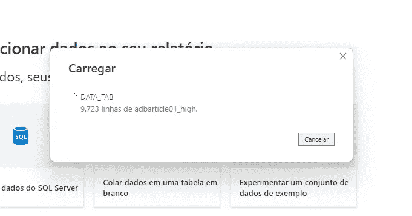

这可能需要更长时间，具体取决于数据集的大小。一旦数据被加载，如果你必须再次打开这个文件会更快。

# 3 -使用数据库数据创建简单的仪表板。

> 步骤
> 1 - ODAC (Oracle 数据访问组件)installation✔
> 2 -将数据库连接到 Power BI✔
> 3 -使用数据库数据创建一个简单的仪表板。

好了，我们的数据准备好了。让我们制作一个仪表板来显示关于它们的一些信息。

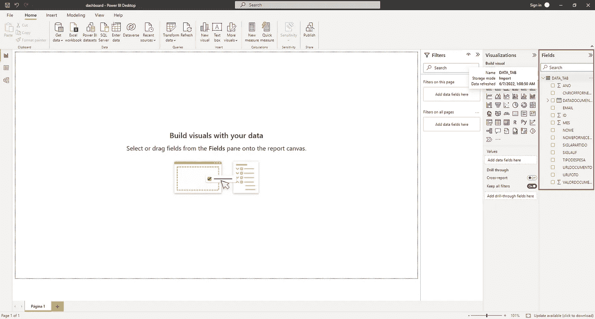

我们的数据在右边，你可以将任何数据拖放到空白处(屏幕中央)。好奇不要害怕，如果出了问题就 ctrl+z。

你可以自由制作你自己的仪表板，创建模板等等。如果你需要一些建议，请按照下面的步骤跟我来:

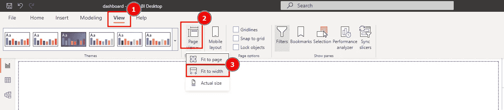

跟随这些点击来改变你的页面视图(我特别喜欢这样的视图)。

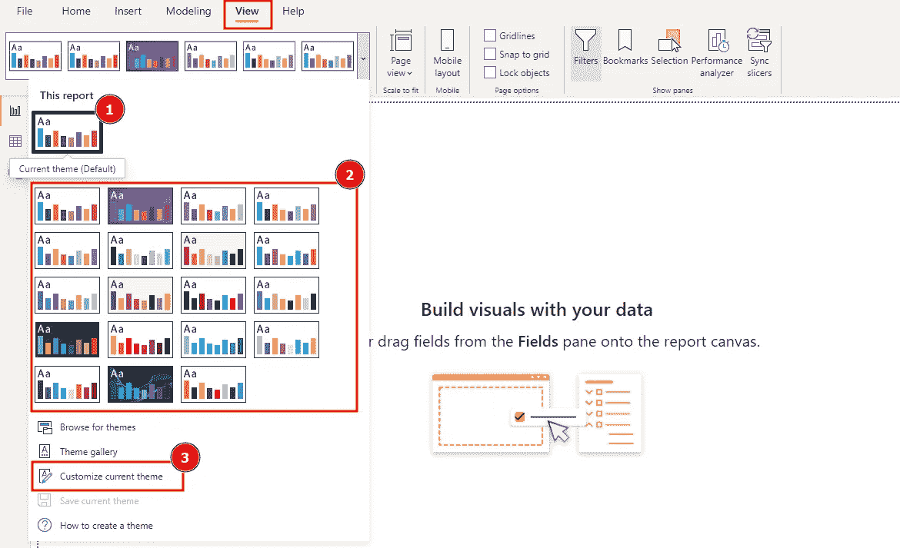

上面的图片向我们展示了如何改变我们的仪表板模板，你可以选择你喜欢的或者定制当前的主题。

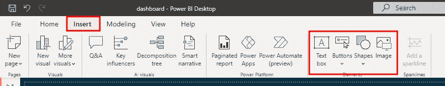

您可以在这里插入一些形状、图像、按钮和文本框。

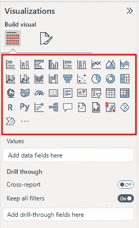

在右侧，有一个“可视化”选项卡。您可以在这里选择图表、表格、卡片等。只要拖放就可以了！

我将展示一个例子，我们如何可以添加一些项目到我们的仪表板，选择如下:
-一张卡片
-一张桌子
-一个切片机

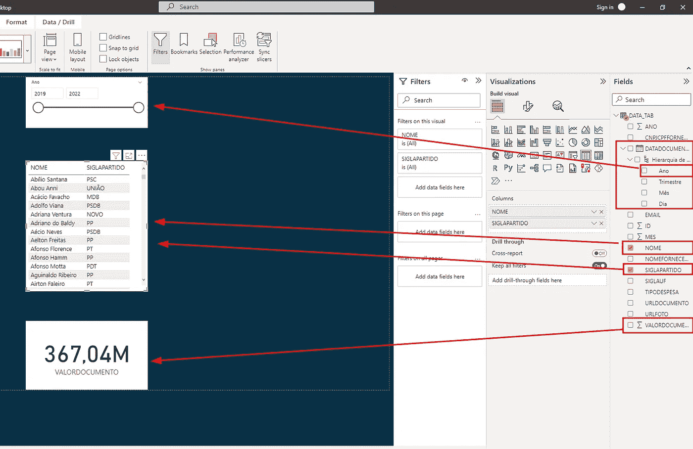

将数据拖放到对象:
-代表姓名和党派到表格
-年份到切片器
-费用值到卡片

现在，当您单击副手姓名时，价值卡将更改为当前期间该副手的唯一价值，在本例中，从 2019 年到 2022 年。之前显示的数值是同期所有副职费用的总和！您可以根据需要更改名称或日期。记住，对你的数据保持好奇。

现在请点击下面的链接:

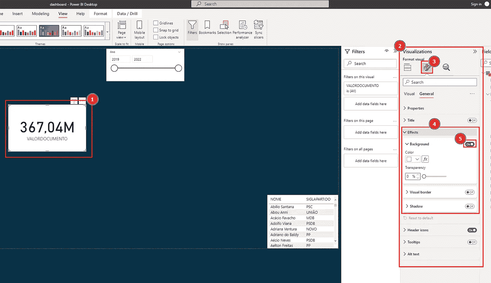

接下来:

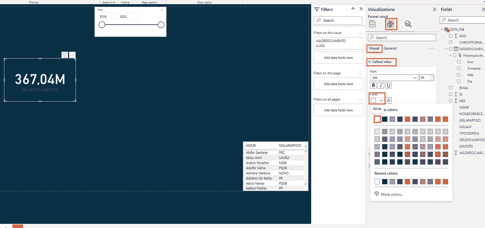

我们关闭了卡片背景，将字体颜色改为白色。只需点击几下，你就可以改变仪表盘上每个元素的视觉效果。在下面的选项卡(视觉和常规)上，您可以更改字体大小、字体颜色、效果、阴影、标题、标签等。

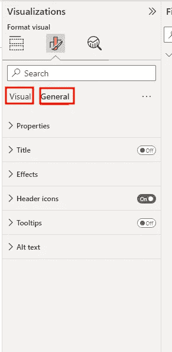

好吧，你可以随意添加项目、表格、形状、图表，以及任何你想在你的仪表盘上展示的东西。用它来练习你的创造力。我将展示我完成的作品，并指出下面的每一项。

我构建了一个两页的仪表板，第一个显示每个政党的开支:

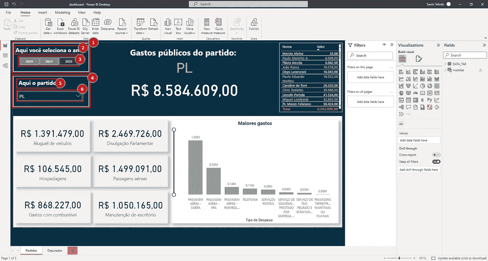

1-矩形形状
一个简单的矩形，我关闭背景色并选择白色边框。

2- Textbox
一个简单的文本框，用葡萄牙语显示“在此选择年份”。

3-切片器
水平方向上以年份作为过滤器的切片器。

4-矩形形状
一个与前面相似的简单矩形形状。

另一个简单的文本框。

6-切片器
带有参与方名称数据的切片器。

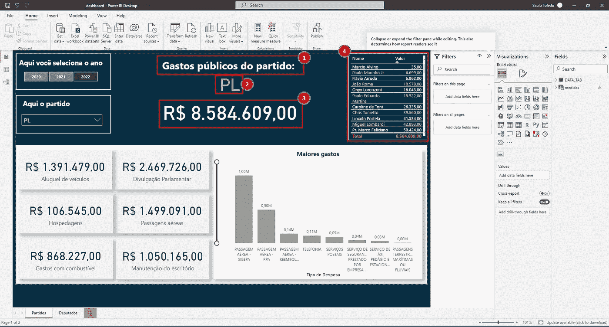

1- Textbox
另一个没有背景色的简单文本框。

2-卡
一张有聚会名称的卡。

3 张卡片
一张带有简单指标和价值费用总和的卡片。

```
total = CALCULATE(SUM(DATA_TAB[VALORDOCUMENTO]))
```

4-表格
一个带有代理名称和值费用的表格。

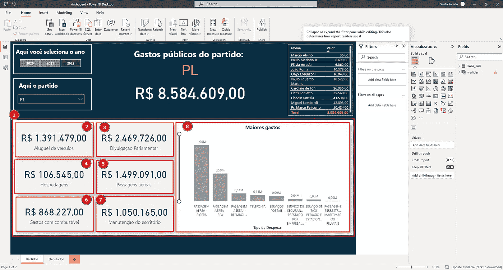

1-矩形形状
这次是另一个白色背景的矩形。

2 张卡
带有关于车辆租赁的指标的卡。

```
vei 1 = CALCULATE(SUM(DATA_TAB[VALORDOCUMENTO]), DATA_TAB[TIPODESPESA] = "LOCAÇÃO OU FRETAMENTO DE VEÍCULOS AUTOMOTORES")vei 2 = CALCULATE(SUM(DATA_TAB[VALORDOCUMENTO]), DATA_TAB[TIPODESPESA] = "LOCAÇÃO OU FRETAMENTO DE EMBARCAÇÕES")vei 3 = CALCULATE(SUM(DATA_TAB[VALORDOCUMENTO]), DATA_TAB[TIPODESPESA] = "LOCAÇÃO OU FRETAMENTO DE AERONAVES")aluguel de veiculos = CALCULATE([vei 1] + [vei 2] + [vei 3])+0
```

3 张卡
带有关于议会促销指标的卡。

```
divulgacao = CALCULATE(SUM(DATA_TAB[VALORDOCUMENTO]), DATA_TAB[TIPODESPESA] = "DIVULGAÇÃO DA ATIVIDADE PARLAMENTAR.")+0
```

4 卡
带住宿费的卡。

```
HOSPEDAGEM = CALCULATE(SUM(DATA_TAB[VALORDOCUMENTO]), DATA_TAB[TIPODESPESA] = "HOSPEDAGEM ,EXCETO DO PARLAMENTAR NO DISTRITO FEDERAL.")+0
```

关于机票费用的 5 卡
卡。

```
pass 1 = CALCULATE(SUM(DATA_TAB[VALORDOCUMENTO]), DATA_TAB[TIPODESPESA] = "PASSAGEM AÉREA - SIGEPA")+0pass 2 = CALCULATE(SUM(DATA_TAB[VALORDOCUMENTO]), DATA_TAB[TIPODESPESA] = "PASSAGEM AÉREA - RPA")+0pass 3 = CALCULATE(SUM(DATA_TAB[VALORDOCUMENTO]), DATA_TAB[TIPODESPESA] = "PASSAGEM AÉREA - REELBOLSO")+0pass 4 = CALCULATE(SUM(DATA_TAB[VALORDOCUMENTO]), DATA_TAB[TIPODESPESA] = "PASSAGENS TERRESTRES, MARÍTIMAS OU FLUVIAIS")+0passagem = [pass 1]+[pass 2]+[pass 3]+[pass 4]+0
```

6 卡
带油费卡。

```
combustivel = CALCULATE(SUM(DATA_TAB[VALORDOCUMENTO]), DATA_TAB[TIPODESPESA] = "COMBUSTÍVEIS E LUBRIFICANTES.")+0
```

7-卡
最后一张有办公维护费用的卡。

```
escritorio = CALCULATE(SUM(DATA_TAB[VALORDOCUMENTO]), DATA_TAB[TIPODESPESA] = "MANUTENÇÃO DE ESCRITÓRIO DE APOIO À ATIVIDADE PARLAMENTAR")+0
```

8- Graphbar
简单条形图形。x 轴:费用类型，Y 轴:值

对于第 2 页，我们有:

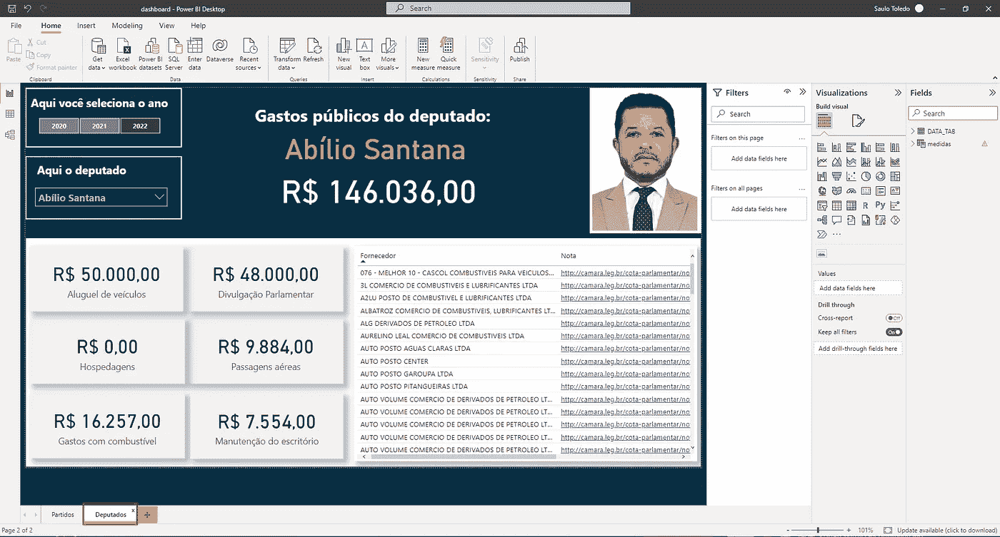

1-简单图片
副手的图片来源于照片 URL 栏。

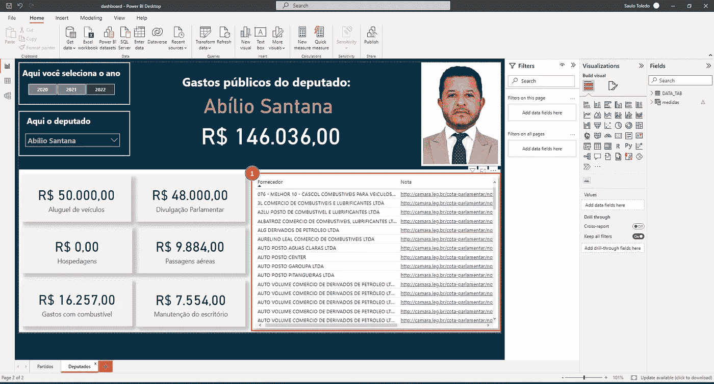

1-表格
最后，我们有一个包含供应商和发票的表格，我们可以点击它来查询费用。

> 步骤
> 1 — ODAC (Oracle 数据访问组件)installation✔
> 2 —将数据库连接到 Power BI✔
> 3 —使用数据库数据创建一个简单的仪表板。✔

仪表板完成！现在，你可以和你的朋友、老板等分享。或者你可以用 Power BI 的工具‘Publish’在网上发布。只需点击，几秒钟后，您的仪表盘将发布在网络上，因此，只需在您的社交页面上共享网页链接，即可获得赞 s2

> 最后的仪表盘可以在 这里进入 [**。**](https://app.powerbi.com/view?r=eyJrIjoiOTg0NWQ1MTctMjZjOS00NTY3LTljMmItYmQ0Y2NlYWFhMmExIiwidCI6ImRlNDk3M2Y0LTU5Y2YtNGRmOC04MjQ4LTAxZjA1Y2ZkYzAwYSJ9)

在下一篇文章中，我们将尝试用 Google 的免费软件 Google Data Studio 构建一个新的仪表板。如果一切顺利，我们将在网上免费发布这个新仪表板[♪┏(・o・)┛♪┗(o)┓♪](https://www.fastemoji.com/%E2%99%AA%E2%94%8F(%E3%83%BBo%EF%BD%A5)%E2%94%9B%E2%99%AA%E2%94%97-(-%EF%BD%A5o%EF%BD%A5)-%E2%94%93%E2%99%AA-Meaning-Emoji-Emoticon-Dance-Party-Ascii-Art-Pvp-Fun-Fun-Fun-Fun-Music-Japanese-Kaomoji-Smileys-22.html)

再见！

> 下一篇文章在这里。(即将推出)
> 
> 上一篇 [**这里**](https://medium.com/p/f1f03d354900) 。
> 
> Github 项目 [**此处**](https://github.com/saulotp/Dados-publicos) 。