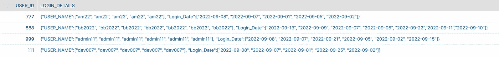
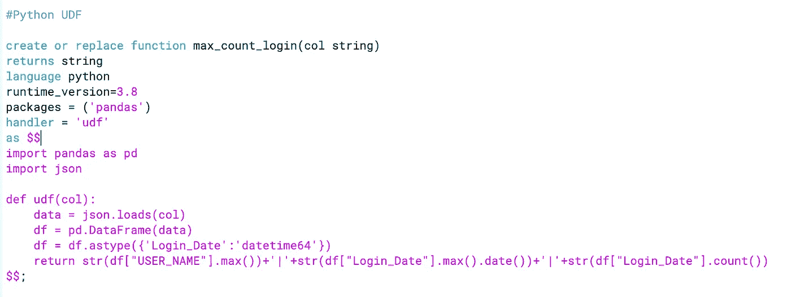
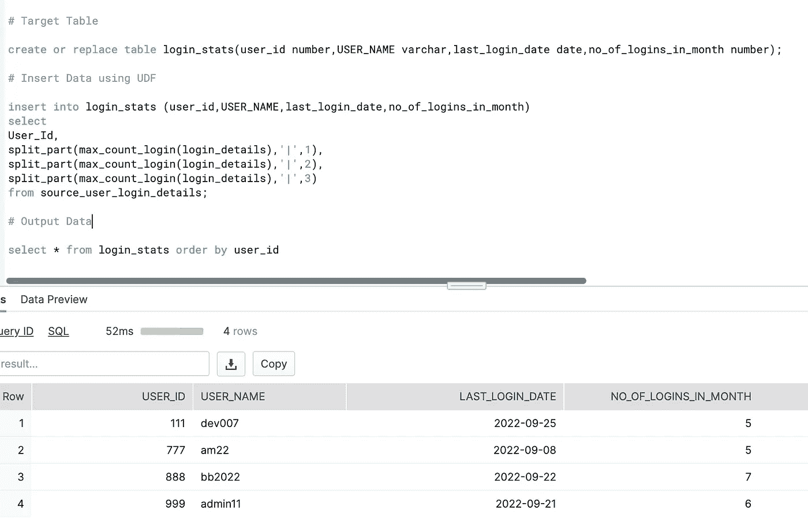

# 雪花中 Python UDF 的威力

> 原文：<https://blog.devgenius.io/power-of-python-udf-in-snowflake-6aac43734359?source=collection_archive---------1----------------------->

*UDF 是用户定义的函数，可由用户构建以解决其非常具体的用例需求，然后像使用任何其他雪花系统定义的函数一样使用 UDF。*

**何时使用:-** 假设你有一些具体的需求，这些需求雪花系统功能并不现成。不用担心，您可以扩展雪花系统，引入您自己的函数，并用您选择的语言编写函数定义。支持的类型如下:-

1.  Java 语言(一种计算机语言，尤用于创建网站)
2.  Java 脚本
3.  计算机编程语言
4.  结构化查询语言

函数的返回类型:-

注意:-函数可以返回标量值(每次调用一个值)，也可以返回表格结果。我们今天将看到如何编写一个标量 Python UDF 并解决我们的问题。

## 蟒蛇 UDF

*   可以从雪花中调用的用户编写的函数
*   接受 0 个或多个参数
*   用 UDF 的名称和参数调用
*   端 UDF 中定义的处理函数执行任务，并将值返回给 SF，然后 SF 返回给客户端
*   目前，支持 Python 版
*   也支持第三方包(与 Anaconda 合作)

**让我们跳到下面的使用案例和问题陈述:-**

***问题陈述:-***

我有一个保存门户用户登录数据的源表。它包含用户 id 和登录详细信息。登录详细信息作为 python 字典或 json 字符串的字符串表示出现在这个表中。要求是分析每个用户的登录细节，并找到:-

1.  上次登录日期
2.  用户一个月登录的天数

源数据如下所示:-

***解:——UDF:——***

为了处理这个问题，我们可以写下面的 UDF 遗嘱

> #将 login_details 列作为 UDF 的输入，并使用 JSON 模块将其反序列化到 Python 字典中
> 
> #将字典转换为熊猫 DF 并处理日期转换
> 
> #然后，只需使用 max()方法获取用户名(用户名对于源中的每个用户都是相同的)，max()获取最新的日期，count()获取日期(源中的日期也是唯一的)以获取用户使用我们熟悉的 pandas 函数登录的天数
> 
> #以单个字符串的形式返回结果(记住标量函数)，但用其他值和管道连接。

**代码:-**

详细信息:-

该函数接受字符串输入，它是源表的一列。它也返回字符串。支持的版本是 3.8。我们使用第三方 pandas 包，它是由 Snowflake 提供的，用于支持 Anaconda。然后，我们导入所需的包，并指定一个名为 udf 的处理函数，该函数实现了实际的逻辑。然后我们以字符串的形式返回输出。

**下一步:-**

*   创建一个目标表 login_stats，我们将把结果存储在表的不同列中
*   使用 UDF 将源用户登录详细信息中的数据插入登录统计信息
*   使用 split_part()将接收到的串联字符串拆分成多个值，并加载到相应的列中

**最后一段代码:-**

## **结论:-**

我们看到了 Python UDF 如何以一种巧妙的方式非常有用地解决各种问题。我不需要担心性能，因为 UDF 代码本身在 SF compute 内部执行，可以提供最佳性能。这一切都要感谢雪花及其对 Python ❤.的支持