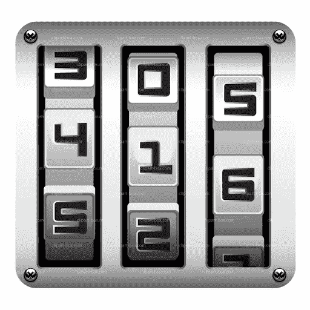
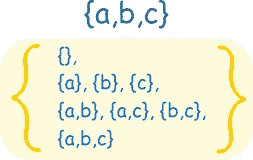
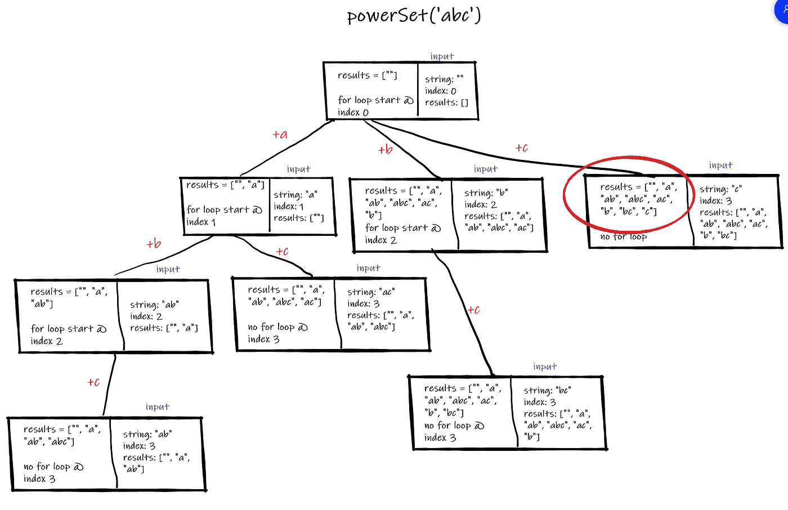
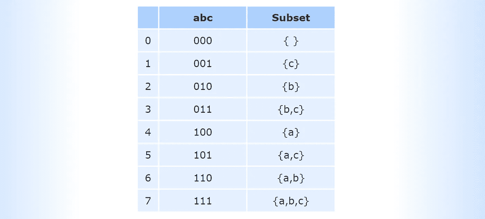
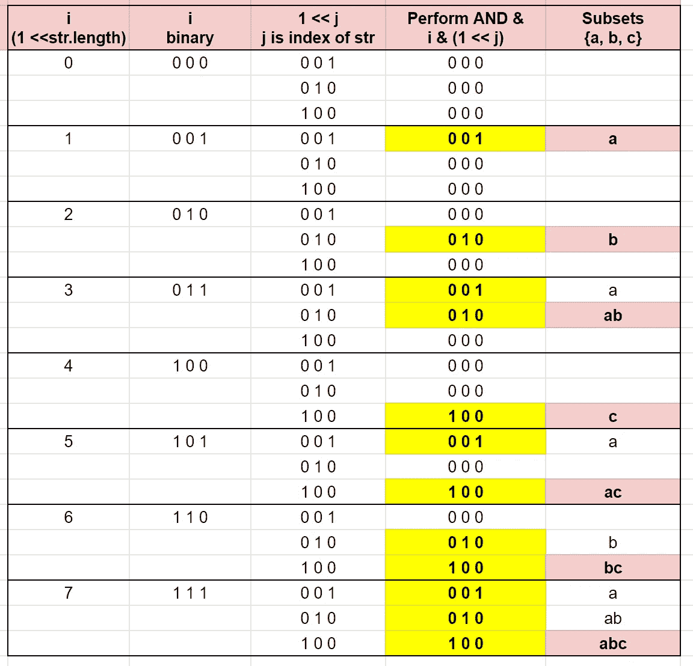

# 递归或位幂集算法

> 原文：<https://blog.devgenius.io/power-set-algorithm-with-recursion-or-bits-cc3ffcfc0daa?source=collection_archive---------2----------------------->



[http://clipart-library.com/clipart/182935.htm](http://clipart-library.com/clipart/182935.htm)

# 什么是动力集？

一个[幂集](https://www.mathsisfun.com/sets/power-set.html)是一个集合的所有子集的集合，包括空集和集合本身。JavaScript 中的一个[集合](https://developer.mozilla.org/en-US/docs/Web/JavaScript/Reference/Global_Objects/Set)是值的集合。集合中的一个值只能出现一次(没有重复的值)；它在该系列中独一无二。对于一个给定的集合，一个幂集，我们可以有不同的方式来选择值，包括选择无或全部。电源集解决方案不得包含重复的子集。

对于集合{a，b，c}，下面列出了这个集合的幂集。



[https://www.mathsisfun.com/sets/power-set.html](https://www.mathsisfun.com/sets/power-set.html)

# 幂集中有多少个子集？

有 n 个元素的集合有 2^n 子集。在我们的例子中，集合{a，b，c}有 3 个元素，因此这个集合应该有 2 = 8 个子集。

让我们考虑一个有 n 个元素的集合{__，__，__，__ … __}。为了创建可能为空的每个子集，我们遍历集合中的每个值，并选择每个值为不存在或存在。因此，每个元素有两个选项，放入或不放入。可能的子集总数为:

2 * 2 *……* 2 = 2 ^ n

因为集合中的每个值可以存在于子集中，也可以不存在，所以可以使用二进制数(位！因为它既可以不存在 **0** 也可以存在 **1** —我喜欢把它想象成打开或关闭一个电灯开关，无论那个值是打开还是关闭)。我们稍后将讨论这个问题。让我们从另一个直观的解决方案开始。

# 递归

想法是一样的，如果集合中有 n 个元素，每个元素有两个选择，要么包含在子集中，要么不包含在子集中。有了这个想法，我们可以形成一个递归的解决方案。

这是一种回溯方法。递归函数有两个参数，一个子集字符串和当前索引。有一个外部结果数组存储创建的每个子集。输入字符串被循环，一个接一个的固定字符被添加到每个子集并递归。这将从前一个子集开始生成所有子集。如果当前索引等于输入的长度或大小，则不需要迭代，递归结束。随着每个子集的创建，结果数组不断更新。



```
var powerSet = function (str) {
  let results = []; let findSubSets = (string, index) => {
    results.push(string);
    for (let i = index; i < str.length; i++) {
      helper(string + str[i], i + 1);
    }
  }; findSubSets("", 0);
  return results;
};powerSet('abc'); // ['', 'a',  'ab', 'abc', 'ac', 'b', 'bc', 'c']
```

这个解决方案的时间复杂度是 O(2^n).

# 用二进制位掩码映射

可以通过生成 0 到 2^n-1 之间的二进制数来找到幂集，其中 n 是给定集合的大小。当序列中有“1”时，这意味着将相应的值放入该子集。

```
a b c
1 1 1  // 'abc'a b c
1 0 1 // 'ac'
```

参见下面的例子，如果有“110”，则用 1 个 **a** ，1 个 **b** 和 0 个 **c** 来替换，从而得到子集{a，b}。对于全零，这对应于一个空集，而全一对应于整个输入集。



[https://www.mathsisfun.com/sets/power-set.html](https://www.mathsisfun.com/sets/power-set.html)

使用逐位运算符，我们可以在二进制级别上进行运算。使用<< zero fill left shift operator, this operator will push in one or more zeros from the right and the left most bits fall off. The following fun with bits will get us the power set size. The power set can be though of counting from 0 unit 2^n-1.

```
1 << str.length // is equivalent to 2^nex. str = 'abc'
1 << str.length
1 << 3 = 8 // 8 in binary is 1000 (3 zeros pushed in from right)
2^n = 2^3 = 8 // Power Set size
```

With the power set size known, we can use the Bitwise AND ( **& )** 运算符。仅当两位都为 1 时，按位 AND 才返回 1。

0 & 0 = 0

0 & 1 = 0

1 & 0 = 0

1 & 1 = 1

按位 AND let 's 映射所有子集并返回幂集。

下表显示了从 0 到 2^n-1 的映射(i =外环)。每个二进制集合都有一个针对字符串 0 到 n 的索引位置的按位 AND 运算(我们的内部循环)。内部循环对于找出当前迭代计数中的每个二进制数字是必要的。如果这个 AND 运算的结果是“1 ”,那么相应的字母将放在它的位置上，并作为一个子集添加。

下表显示了**(I-幂集大小)**外循环和我们的内循环**(j-输入大小)**以及如何计算相应的位操作以确定是否将相应的字母添加到下一个子集中。



```
var powerSet = function (str) {
  const results = []; for (let i = 0; i < 1 << str.length; i++) {
    let subset = "";
    for (let j = 0; j < str.length; j++) {
      if (i & (1 << j)) {
        subset += str[j];
      }
    }
    results.push(subset);
  }
  return results;
};
```

时间复杂度为 O(n * 2^n).这是一个很好的解决方案，因为它简化了思想，并验证了没有解决方案丢失，但时间复杂度比早期的递归解决方案慢。

希望这有助于理解如何用两种不同的方法解决幂集算法！