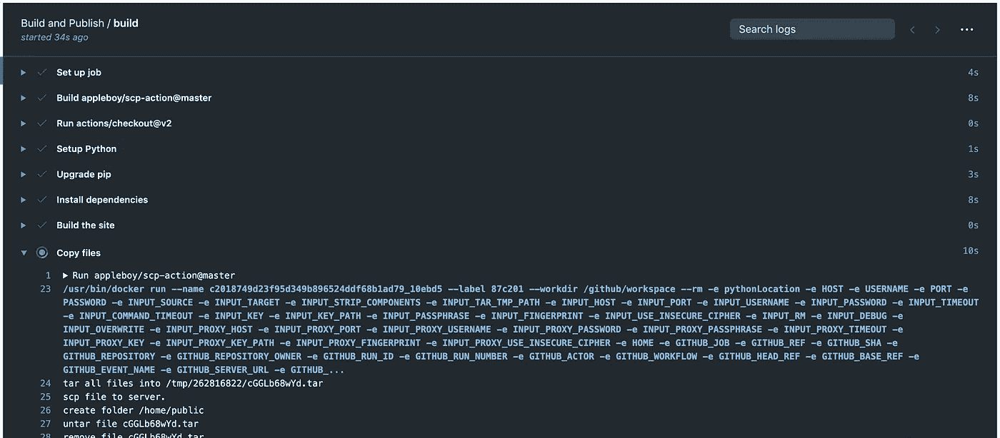
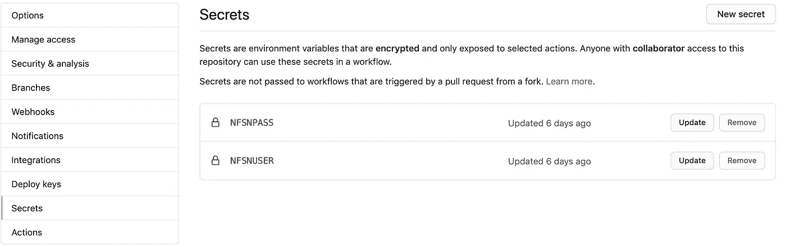

# 使用 GitHub 操作启动您的 repo

> 原文：<https://blog.devgenius.io/power-up-your-repo-with-github-actions-32cd830cd9ee?source=collection_archive---------15----------------------->

[潘卡杰·帕特尔](https://unsplash.com/@pankajpatel?utm_source=medium&utm_medium=referral)在 [Unsplash](https://unsplash.com?utm_source=medium&utm_medium=referral) 上的照片

现代软件工程实践提倡使用增量方法一点一点地构建软件。随着微服务架构和全球分布式团队的发展，软件正在被无缝地全天候开发。这种现象的基础是*持续集成(CI)* 的概念，在这种概念中，团队构建小型的独立功能，并频繁地与`mainline`分支或`trunk`集成。为了使这个持续集成的过程变得容易和顺利，近年来发展了许多工具。最常用的工具有[詹金斯](https://www.jenkins.io/)、 [CircleCI](https://circleci.com/) 、 [TravisCI](https://travis-ci.org/) 等。这已被证明是持续集成的行业标准。

上述 CI 工具的一个常见挑战是与源代码控制管理(SCM)工具(如 GitHub、SubVersion、Mercurial 等)的分离。人们必须在配置管理工具和 CI 工具之间建立连接，以便创建一个由一些自定义规则触发的工作流。这不仅在技术上具有挑战性，而且在财务上也是一种负担，因为我们现在不得不在至少两种不同的工具上花钱。对于 IT 管理员来说，学习和掌握额外的工具也是一个永无止境的挑战。如果 CI 工具被内置到配置管理工具中不是很好吗？这是不可能的——直到现在。随着 GitHub [Actions](https://docs.github.com/en/actions) 的引入，CI 和 SCM 一起解决了前面提到的挑战。

# GitHub 操作

近年来， [Git](https://git-scm.com/) 已经迅速成为各行各业最广泛采用的源代码管理软件，GitHub 是管理 Git 库的事实上的工具。毫不夸张地说，如今几乎所有的大型科技公司都在 GitHub 上有存储库(公共的和私有的)。虽然 GitHub 围绕源代码控制提供了优秀而简单的工具，但是 GitHub Actions 为我们的 GitHub 库内的持续集成带来了熟悉的简单性。是的，不再需要搭建桥梁和跨越不同工具的管道。

GitHub Actions 使用“工作流”的概念提供了对存储库的持续集成支持。工作流是“步骤”的集合，我们可以定义这些步骤来对源代码执行各种操作。这些包括检查代码，运行 CLI 工具，甚至与包括 Azure 在内的第三方操作集成。GitHub Actions 的伟大之处在于，所有工作流都在 GitHub 托管的名为“runners”的机器上运行，这些机器可以是基于 Windows/MacOS/Linux 的机器，甚至可以在任何容器中运行。如果你在 GitHub 上有一个公共库，大部分功能都是免费的*。

# 工作流示例

让我们用一个真实的例子来理解 GitHub 的动作和工作流程。我有一个个人[网站](https://www.rakeshkasibhatla.in/)，我在 GitHub repo 中为其托管源代码(内容、配置、样式)。每次我对我的站点做了更改，我都想通过 SSH 把它们发布到我的托管服务器上。现在，这个过程包括以下步骤:

1.  对内容进行更改。
2.  提交对回购的更改。
3.  使用 [mkdocs](https://www.mkdocs.org/) 构建站点。
4.  使用 SSH 将生成的文件复制到我的托管服务器上。

我想自动化第 3 步和第 4 步，以防止任何手动错误，使它没有麻烦。为了使用 GitHub 动作做到这一点，我所要做的就是在包含我的工作流的目录`.github/workflows`下向我的 repo 添加一个新的 YAML 文件。以下是我的工作流文件的外观:

让我们更深入地研究工作流文件。正如我们所看到的，在高层次上，我的工作流文件包含了一系列在一个明显的部分`steps`下定义的步骤。每一步至少有三个部分——`name`、`uses`和`run`。很明显，`name`是您的步骤的标识符，`uses`定义了我们想要使用的任何第三方动作，`run`定义了要执行的 CLI 命令。既然我们已经定义了步骤，那么我们什么时候运行它们呢？第`on`节对此进行了明确定义。在`on`部分，我们可以定义触发动作的条件。GitHub Actions 允许我们在各种条件下运行这些步骤，如`push`、`pull_request`等。也在特定的分支上。在上面的例子中，工作流被配置为运行`on`到`push`的分支。

GitHub Actions 最强大的功能之一是在 [GitHub 市场](https://github.com/marketplace?type=actions)中提供的第三方操作。市场上有大量有用的操作，我们可以使用`uses`动词将它们插入到我们的工作流程中。在上面的例子中，我使用了用户“appleboy”的 SCP 动作。其他一些流行的操作包括来自 Google Cloud、Ansible、AWS 等。

让我们看看这个工作流程是如何工作的。我对我的网站内容进行更改，然后推送到回购中的`master`分支。推送完成后，我们可以看到提交仍在处理中，如下面的屏幕截图所示:

橙色圆点表示 GitHub 操作正在处理提交

这里刚刚发生的是，我在 repo 中配置的工作流被触发，它开始执行工作流中提到的步骤，如下所示:

工作流正在进行

一旦工作流成功完成，提交现在被应用到`master`分支，工作流中的“工件”(在本例中是站点文件)被使用 SSH 自动复制到托管服务器上。在上面的工作流文件中需要注意的一点是，我使用了使用`{{ secrets.NFSNUSER }}`标记的托管服务器的 SSH 凭证。这是可能的，因为 GitHub 提供了 secrets 功能。使用 secrets，我们现在可以在同一个 repo 中存储敏感信息，如凭证和密钥，从而使它们在工作流中可以访问。下面是我的秘密部分的样子:

我的主机服务器 SSH 凭证的秘密

正如我们在上面的例子中看到的，GitHub Actions 提供了一种非常简单、高效和强大的方式来在同一个 repo 上构建工作流，而没有任何外部工具的麻烦。有了 GitHub Actions，我们现在有了一个可靠的持续集成和部署故事——就在源代码旁边。

现在是时候启动您的回购了！干杯！

*请参考 GitHub Actions 定价[此处](https://github.com/features/actions)。

# 参考

GitHub 动作文档:[https://docs.github.com/en/actions](https://docs.github.com/en/actions)

GitHub 行动市场:[https://github.com/marketplace?type=actions](https://github.com/marketplace?type=actions)