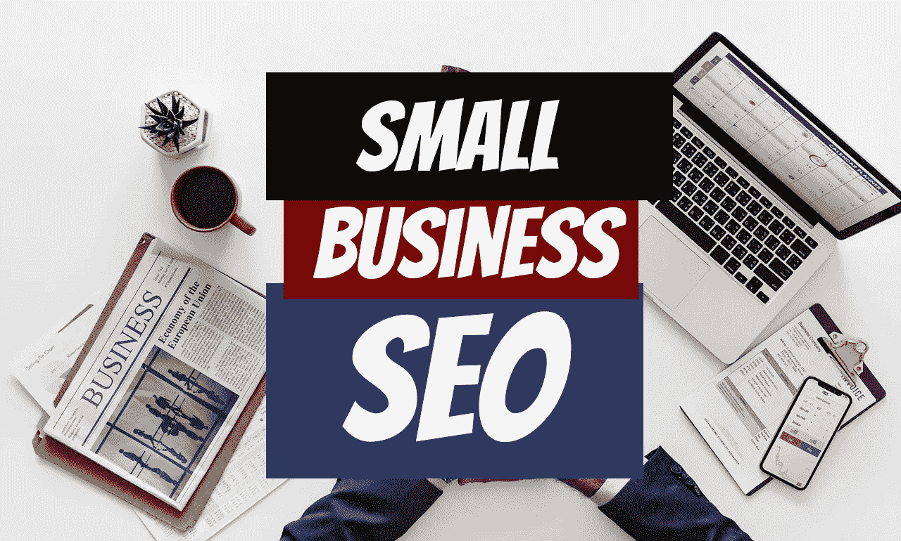

# 小企业 SEO 实用建议

> 原文：<https://blog.devgenius.io/practical-advice-for-small-business-seo-58107938ff86?source=collection_archive---------22----------------------->

在我开始之前，我想让你知道，每个人都对他们的公司感到兴奋，并希望尽快传播这个消息。不幸的是，这没有欺骗，你只需要把工作放进去。的确有“作弊的方法”，但是风险远远大于回报。

不幸的是，广告是一种战略猜谜游戏。有时行得通，有时行不通。

## 我的背景

我通常与一家公司(通常是供应商)密切合作，并将我的时间分配在有机广告和付费广告上。我在汽车零部件售后行业工作；我坚持与同行业的客户合作，因为我确切地知道如何接近他们。在过去的 11 年里，我对这个行业进行了广泛的测试；对于其他行业来说，这是不确定的。我只是想简单地谈一下这个问题，因为我们稍后会回到这个问题上

这就是为什么我总是犹豫要不要接受一个不属于售后汽车零部件行业的客户。当我经营我的售后零件公司时，我会做 A/B 测试。我会尝试一种类型的广告(A ),然后立即尝试另一种与 A 超级接近的广告(B)。无论哪一种胜出，都将成为新的 A，我会尝试另一种广告(B ),再次与 A 非常相似，只是略有不同。目标是击败 A，获得新的基线。

你可以想象，我花了大约 200，000 美元才弄明白一些东西有用，一些没用；那是在一个非常小的配件行业集中的地方。当客户雇佣我时，我需要为他们写文章，行话对我来说很容易，因为我从 2009 年就进入了这个行业。我可以在一两个小时内写出一篇精心构思的文章。对于其他行业，你必须对主题进行研究，这样你才不会看起来像一个彻头彻尾的小丑。你花在写文章上的一到两个小时变成了 4 到 5 个小时(每周 3 天)；你不妨称自己为作家。

事实上，大多数搜索引擎优化公司会要求你写内容，因为它是如此耗时。客户看着他们说，“我这个月刚给了你 10，000 美元，你还想让我写自己的文章？”他们看不到运营 SEO/营销业务的成本。搜索引擎优化专家在[的平均工资约为 55000 美元/年；如果你想要一个好的，你接近 8 万美元/年。如果那个人只是写文章，他一半的时间会花在为 1 家公司写文章上。不是对那个人的有效利用。](https://www.ziprecruiter.com/Salaries/SEO-Specialist-Salary)

除非你真的杀了它，大多数时候当地企业会尝试自己做这件事。

## 为您的企业提供建议

要知道，有机地让你的名字出现，尤其是对一个本地企业来说，要花大约 6 个月到一年的时间才能得到哪怕是最小的结果。你的生意可能没有那么有竞争力，所以你可以在 6 个月内获得一些曝光率。这些是我通常按照重要性顺序为小企业遵循的步骤。

1.获取谷歌页面评论。谷歌是一家企业。他们希望人们使用他们的搜索引擎。他们最看重自己的页面。你越帮助谷歌，谷歌越帮助你。就这么简单。

我会努力获得 100+谷歌评论。

谷歌最重要。谷歌是一家公司。谷歌是怎么赚钱的？谷歌主要通过谷歌广告赚钱。访问谷歌的人越多，谷歌收取的广告费用就越多。谷歌接下来做的是为人们提供相关内容。如果我键入“佛罗里达州坦帕市的蚊子控制”，我希望看到一些在佛罗里达州坦帕市处理蚊子的公司。

如果没有公司使用谷歌广告来定位这些关键词，谷歌仍然希望向用户显示相关的搜索结果，因为如果我在坦帕没有看到蚊子公司，而我只是搜索了它们，这种情况发生了 2 或 3 次，我可能会说“谷歌糟透了！让我试试必应或者雅虎。”这就是为什么你会看到必应的广告。他们希望人们离开谷歌，使用他们，这样他们就可以收取更多的广告费用。

如果有公司为特定的关键词做广告，谷歌仍然希望显示广告和有机内容。搜索结果越相关，用户点击网站的机会就越大，他们将来返回谷歌点击广告的可能性就越大。

谷歌怎么知道你是相关的？嗯，如果坦帕有 2 家治疗蚊子的公司，其中一家公司在谷歌页面上有 100 个 4 到 5 星的评论，而另一家有 5 个评论，如果我是谷歌，我会推有 100 个评论的那家。为什么？因为人们已经很满意了。谷歌说，“嘿，看，我给你找了一家公司，你会喜欢的，因为其他人也喜欢它。一定要回到谷歌来满足你所有的搜索需求……也许下一次，点击谷歌广告。”

当你告诉人们在其他网站上写评论时，同样的概念也适用。与 Yelp 相比，谷歌的唯一优势是你可以在主页上看到真实的内容。Google 会给你 1/3 的页面来突出你的业务，而 Yelp 得到的 1/2 的搜索结果混杂在其他搜索结果中。这就是为什么谷歌是最重要的发展。

2.写文章并发布到你的网站上。我会努力做到每周 2-3 篇文章，每篇文章 5-7 段。谈谈你做过的工作。谈论与你的行业相关的有用提示。

有时候人们只是想要小费。他们去谷歌搜索“如何轻松消灭蚊子？”谷歌给他们相关的网页。他们看到你的，然后点击它。谷歌启动了一个计数器。如果用户访问你的网站，开始阅读一篇文章，然后很快退出网站，你会受到惩罚。用户在你的网站上的平均时间会被记录下来。人们在你的网站上花的时间越多，这个指标告诉谷歌的就越多，“嘿，这个网站真棒。人们去那里花上几分钟。这个网站为用户提供价值。不断展示这个网站一遍又一遍，因为人们似乎很喜欢它。也许，只是也许，将来你也会从那个用户那里点击你的谷歌广告，因为你为他/她提供了一个很棒的网站。”这就是为什么好的内容比仅仅泵出内容更重要。你可以雇佣一些可疑的公司每月为你写 100 篇文章，但是如果他们是垃圾并且人们不断退出你的网站，谷歌会注意到并且很快降级你的网站。

3.与你的顾客保持联系。最好的商业策略是跟上你的客户并与他们发展关系。这个我怎么强调都不为过。 最近，我与一家大型轮胎公司的销售副总裁交谈，他说他能够“通过关注现有客户群，将销售额提高 40%”。当你看着一个客户，他们年复一年只从你这里买了少量的轮胎，这个客户还活着。他们不是靠卖从你那里买的 100 左右的轮胎生存的。他们从别的地方得到轮胎。我们能做些什么来增加销售额，减少他们对我们竞争对手的依赖？”

4.保留一个脸书主页和一个 Instagram 账户。确保每天至少发布一次，但不超过两次。不要在那里宣传你的生意。这不是社交媒体的目的，但它是展示你所做的事情的好方法。你可以上传你工作时的照片，但不要在标题上写“第一次治疗蚊子减 20 美元”相反，围绕它写一个故事，“我们从未见过这么多蚊子。这种特殊处理的挑战…”尽量让你的照片看起来体面。你可以用手机相机拍出相当不错的照片。不要重复发布相同的照片。如果没有新的东西，就不要贴什么了，或者拍一些新的照片。

5.一旦你在谷歌上获得了 100+的评论，请你的新客户在其他网站上评论你:Yelp、Home Advisor、Angie's List 等。没关系。如果这个网站很有名气，并且与评论企业的人打交道，那就去做吧。一次只关注一个。你不必为每个站点 100 个而努力，但我肯定会关注每个站点接近 20 个。

**选择二**，跟着谷歌广告走，希望一切顺利。

最后，不要相信 99 美元/月的服务，声称他们会让你的名字出现在那里。不会有坏处的，对吧？是的，它可以。该公司很可能使用不道德的增长，一旦谷歌发现，他们不仅会消除任何努力的痕迹，他们会从谷歌删除你的业务。如果你从一家严肃的公司得到报价，你会很快看到 SEO 工作会让你每月花费大约 7000 到 10000 美元(很容易)。

我做了 9 年的电子商务生意。与大得多的公司交谈，你会意识到这些公司是如何走到今天这一步的。我和一家公司的 SEO 部门开了一次会，他们分享了他们每个月花在广告上的钱。他们开始的头 6 个月仅谷歌广告就有 15000 美元/月。6 个月后，他们涨到了 4.5 万美元/月。

我见过一个相当大的公司每月 120 万美元的谷歌广告活动。它只是把一切放在正确的位置上。

最后，大多数小的本地公司将从他们的顾客那里获得最多的生意:口口相传是必由之路。

## 要点

推广你的谷歌页面。谷歌页面完成后，推广其他评论网站。为你的网站创造高质量的内容。

迪诺·卡伊奇目前是 [LSBio(生命周期生物科学公司)](https://www.lsbio.com/)、[绝对抗体](https://absoluteantibody.com/)、 [Kerafast](https://www.kerafast.com/) 、[珠穆朗玛生物](https://everestbiotech.com/)、[北欧 MUbio](https://www.nordicmubio.com/) 和 [Exalpha](https://www.exalpha.com/) 的 IT 主管。他还担任我的自动系统的首席执行官。他有十多年的软件工程经验。他拥有计算机科学学士学位，辅修生物学。他的背景包括创建企业级电子商务应用程序、执行基于研究的软件开发，以及通过写作促进知识的传播。

你可以在 [LinkedIn](https://www.linkedin.com/in/dinocajic/) 上联系他，在 [Instagram](https://instagram.com/think.dino) 上关注他，或者[订阅他的媒体出版物](https://dinocajic.medium.com/subscribe)。

阅读 Dino Cajic(以及 Medium 上成千上万的其他作家)的每一个故事。你的会员费直接支持迪诺·卡吉克和你阅读的其他作家。你也可以在媒体上看到所有的故事。