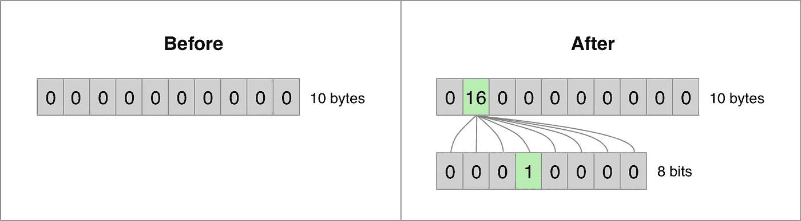

# 实用布鲁姆过滤器

> 原文：<https://blog.devgenius.io/practical-bloom-filters-dc49e3deb335?source=collection_archive---------4----------------------->

答几年前，我想学习更多不同类型的常用数据结构。使用过它们是一回事，但知道它们如何工作或从头开始构建它们是另一回事。在本文中，我们将深入探讨 bloom filters，包括一些代码示例和用例。

# 什么是布鲁姆过滤器？

根据[维基百科](https://en.wikipedia.org/wiki/Bloom_filter)，一个布隆过滤器是:

> 一种节省空间的概率数据结构，由 Burton Howard Bloom 于 1970 年提出，用于测试一个元素是否是一个集合的成员。假阳性匹配是可能的，但假阴性是不可能的。

所以本质上，bloom filter 是一个位数组(1/8 字节),其中最初所有的位都被设置为`0`。为了向布隆过滤器添加元素，需要散列函数来将该元素“映射”到位数组中的特定位置。两个或更多的元素可以被映射到相同的位置，这可能导致误报(这就是为什么它被称为概率性的)。然而，如果元素位置的位是`0`,我们肯定知道它不包含在集合中。

## 简而言之:

布隆过滤器可以用于有效地检查元素**是否是集合中包含的** **而不是**。

# 真实世界的用法

## CRLite

2020 年 [Mozilla 宣布](https://blog.mozilla.org/security/2020/01/09/crlite-part-2-end-to-end-design/)他们正在开发一个名为 CRLite 的替代方案，用于验证 Firefox 中被撤销的证书。当时，所有未过期的吊销证书的集合在磁盘上损害了 6.7GB，这被压缩为大约 1.3MB 的布隆过滤器。对于有效的证书来说，验证证书是否被撤销是很便宜的，因为它只需要散列证书序列号来获得该位的位置，并验证它是否被设置为`0`。

## 卡桑德拉

Apache Cassandra [使用 bloom filters](https://docs.datastax.com/en/cassandra-oss/3.0/cassandra/operations/opsTuningBloomFilters.html) 来确定一个 SSTable 是否有特定分区的数据。验证 SSTable 是否有分区的数据是廉价的，因为它不需要读取其内容(避免 IO 操作)。

# 从头开始建造一个

我们将使用 Rust 来创建我们的 bloom filter。让我们从一个包含位数组的简单结构开始:

```
struct BloomFilter<const N: usize> {
    bytes: [u8; N],
}impl<const N: usize> BloomFilter<N> {
    fn new() -> Self {
        Self { bytes: [0; N] }
    }
}fn main() {
    let filter = BloomFilter::<10>::new();
}
```

现在我们有了一个基本结构，它保存我们的位集，并在创建 bloom filter 时将所有位都设置为`0`。因为没有办法将单个位表示为一种类型，所以我们的位数组被定义为字节数组。因此，本例中的大小`N`是以字节为单位的大小(因为`u8`是 Rust 中一个字节的数据类型)，而不是位。

我们要实现的第一件事是向 bloom filter 添加一个新元素。我们需要对值进行 hash 得到一个数值，得到字节的位置，得到字节内部的位的位置，设置为`1`。我们将使用字符串作为元素，并使用`DefaultHasher`作为散列函数。

```
use std::collections::hash_map::DefaultHasher;
use std::hash::{Hash, Hasher};fn hash(value: &str) -> u64 {
    let mut s = DefaultHasher::new(); value.hash(&mut s);
    s.finish()
}struct BloomFilter<const N: usize> {
    bytes: [u8; N],
}impl<const N: usize> BloomFilter<N> {
    fn new() -> Self {
        Self { bytes: [0; N] }
    } fn add(&mut self, key: &str) {
        let bit_size = N * 8;
        let pos = hash(key) % (bit_size as u64);
        let (byte_idx, bit_idx) = (pos / 8, pos % 8); self.bytes[byte_idx as usize] |= 1 << bit_idx;
    }
}
```

这里有很多东西需要打开。为了获得绝对位位置，对元素进行哈希运算以获得一个数值，并针对位数组的大小使用模运算，以便我们最终得到一个有效的位置。然后我们需要找到字节的位置，并计算相对位的位置。最后，我们通过一个位运算来设置这个位。



在`*pos=20*`处添加一个元素

最后一步是实现一个方法，检查元素**是否不包含在集合中。这个过程类似于添加一个元素，但是我们需要检查它的值，而不是设置这个位。**

```
use std::collections::hash_map::DefaultHasher;
use std::hash::{Hash, Hasher};fn hash(value: &str) -> u64 {
    let mut s = DefaultHasher::new(); value.hash(&mut s);
    s.finish()
}struct BloomFilter<const N: usize> {
    bytes: [u8; N],
}impl<const N: usize> BloomFilter<N> {
    fn new() -> Self {
        Self { bytes: [0; N] }
    } fn get_positions(&self, key: &str) -> (usize, u64) {
        let bit_size = N * 8;
        let pos = hash(key) % (bit_size as u64); ((pos / 8) as usize, pos % 8)
    } fn add(&mut self, key: &str) {
        let (byte_idx, bit_idx) = self.get_positions(key); self.bytes[byte_idx] |= 1 << bit_idx;
    } fn contains(&self, key: &str) -> bool {
        let (byte_idx, bit_idx) = self.get_positions(key); self.bytes[byte_idx] & (1 << bit_idx) != 0
    }
}
```

大部分逻辑转移到计算字节索引和位位置的`get_positions`方法。让我们也添加一些测试代码，看看它是否如预期的那样工作:

```
fn main() {
    let mut filter = BloomFilter::<10>::new(); filter.add("test1");
    filter.add("test2"); println!("test1: {}", filter.contains("test1"));
    println!("test2: {}", filter.contains("test2"));
    println!("test3: {}", filter.contains("test3"));
}
```

在我的机器上，这会产生以下输出:

```
➜ cargo run
   Compiling bloom-filter v0.1.0
    Finished dev [unoptimized + debuginfo] target(s) in 0.14s
     Running `target/debug/bloom-filter`
test1: true
test2: true
test3: false
```

记住我们只能保证`test3`不包含在集合中。我们不能确定`test1`或`test2`是否包含在集合中，因为它们可能是假阳性。源代码可以在 [GitHub](https://github.com/dillendev/bloom-filter-rs) 上找到。

# 结束语

在我们的 bloom filter 实现中，我们选择随机大小的`10`字节(=80 位)。在现实世界中，大小应该基于您的数据集和误报的预期概率。选择太小的大小会对性能产生负面影响，因为会有太多的误报。确定布隆过滤器属性的最佳方式是运行性能测试并使用[布隆过滤器计算器](https://hur.st/bloomfilter/)。