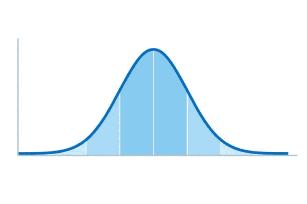
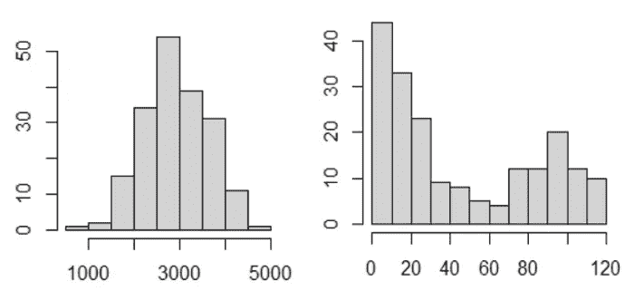
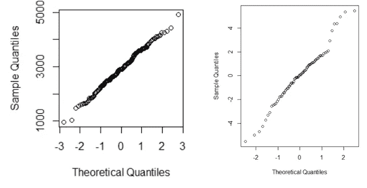
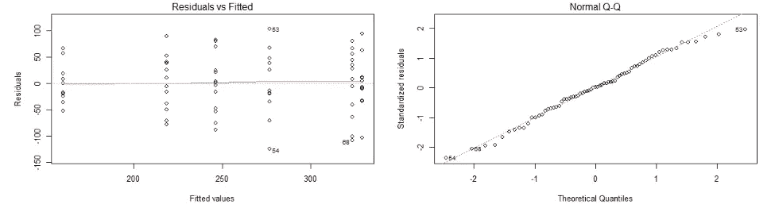

# R 中的实用统计

> 原文：<https://blog.devgenius.io/practical-statistics-in-r-9551089671a4?source=collection_archive---------4----------------------->

## 带有现成代码的概述！


照片由[алексарцибашев](https://unsplash.com/@lxrcbsv?utm_source=medium&utm_medium=referral)在 [Unsplash](https://unsplash.com?utm_source=medium&utm_medium=referral)

经过 5 年的大学生活，我终于学会了如何应用统计学。在我五年级的时候，我参加了一个为期两个月的实用统计课程，在这个课程中，所有的东西都是用编程语言 r 来解释的。我会告诉你包括代码在内的主要概念，这样你就可以只按 CTRL+F，而不必花两个月的时间在课堂上。

这篇文章不会让你学到统计学的所有基本细节。互联网上的其他资源已经在这方面做得很好了(例如，[可汗学院](https://www.khanacademy.org/math/statistics-probability))。

本文旨在快速找到对您的数据使用哪种测试。对于那些忘记了统计学课程内容的人。或者对于那些记得但现在不知道如何使用代码应用测试的人。

题目呈现如下:
1。常态假设
2。单样本检验(单样本 t 检验、符号检验、Wilcoxon 符号秩检验)
3。配对双样本检验(配对 t 检验、皮尔逊相关、Spearman 秩相关)
4。独立双样本检验(不成对 t 检验，曼-惠特尼检验)
5。多组，单因素(单因素方差分析，Kruskal-Wallis)
6。多组，多因素(双向方差分析，弗里德曼)

# 1.正态假设

统计测试对数据有预先的假设。参数测试假设数据是如何分布的(正态或非正态)。非参数检验对总体分布不做或做不太严格的假设，但通常不太有效。因此，测试通常按照正态性的概念来划分:你的数据是否遵循正态密度曲线？我们可以用多种方法来找出答案。



图 1:正常密度曲线。

**直方图**:一个条形图，其中数据沿着水平轴分成多个列。纵轴表示数据中出现的次数。正态分布数据的直方图应该类似于图 1 中的正态密度曲线。在 R 中，绘制直方图很简单:

```
hist(data)
```



图 2:直方图。

在上面的图 2 中，我们绘制了两个数据集的直方图。左边的直方图看起来类似于图 1 中的钟形，因此我们假设正态分布。然而右边的图是不对称的，因此我们怀疑(我们还没有得出结论！)非常态。

**QQ 图**:在该图中，x 轴上正态分布的理论有序概率(理论分位数)与 y 轴上抽样获得的分位数相对照。如果我们选择α = 0.5，分位数值 q_α就是中间值。如果α = 0.25，q_α是
值，这样数据被分成低于 q_α的 25%和高于 q _α的 75%。R 中的函数 qnorm()的目的是求边界值。例如，假设您要寻找平均值为 70 且标准差为 3 的正态分布的第 85 个百分位数。在 R 中，您需要:

```
qnorm(0.85, mean = 70, sd = 3)
```

关于 qqplot，我们可以使用 qqnorm()来绘制。此图中的直线表示数据来自正态分布。

```
qqnorm(data)
```



图 3: QQ 图。

在上面的图 3 中，左图显示了一条直线，而右图偏离了直线。因此，我们怀疑右图中的数据可能来自非正态分布。

**夏皮罗检验:**这是一个专门用来确定数据是否来自正态分布的检验。从这个测试中，我们得到一个 p 值。如果 p 值较高，我们可以假设数据来自正态分布。一般的经验法则是，当 p 值低于 0.05 时，我们可以怀疑数据来自非正态分布。

```
shapiro.test(data)
```

值得注意的是，最好使用上述所有三种方法中的**来测试正态性，并根据所有三种方法的组合来决定正态性。**

总之，当我们决定数据来自正态分布时，我们可以使用参数检验或非参数检验，其中参数检验是首选的，因为它们更有效。当数据来自非正态分布时，我们只能使用非参数检验。

现在我们知道了如何测试正态性，我们可以继续实际的测试了。

# 2.一个样本测试

对于单样本测试(我们的数据均值是否等于/小于/大于某个值？)我们可以用 t 检验，符号检验或者 Wilcoxon 符号秩检验。t 检验假设数据必须来自正态分布，其他两个则不是。值得注意的是，其他两种检验也可用于正态分布的数据，但由于事先对数据进行了假设，t 检验的结果更有说服力。

## 参数的

**单样本 t-检验**:为了应用单样本 t-检验，我们必须给 R 我们的数据，我们的边界值 *mu* ，以及我们是否想知道平均值是否等于、小于或大于边界值。此外，我们需要给出置信度(你对结果有多确定)。一般来说，置信度选择为 0.95:我们希望有 95%的把握。

```
t.test(data, mu = 2800, alternative = “greater”, conf.level = 0.95)
```

## 非参数

**符号测试**:符号测试很简单:如果你认为你的数据的中位数是 *x* ，你计算有多少个数据点在那个之上或之下；这两个数量应该大约各占数据的一半。我们做了一个包括 p 值的二项检验(因为如果数量不同于一半，这仍然是非显著的)。下面，我们先计算一下我们 40 以上的数据量，然后测试这个量是否显著低于我们数据的一半。我们只打印 p 值(使用[[3]])。如果这个值低于 0.05，我们可以说我们数据的中位数明显低于 40。

```
amount = sum(data >= 40)
binom.test(amount, length(data), p=0.5, alternative="less")[[3]]
```

**Wilcoxon 符号秩检验**:虽然这个检验没有假设正态性，但是它假设了一个对称的总体(一个比符号检验更强的假设)。该测试工作如下:我们从所有数据点中减去我们的可疑中值，计算所有数据点的等级顺序，然后对其值大于可疑中值的数据点的等级求和。较大的总和表明真实的中位数高于可疑的中位数。如果您在 R 中使用此测试，您会得到一个相应的 p 值，该值低于 0.05 表示差异显著。

```
wilcox.test(data, mu>=40)
```

# 3.配对两个样本测试

两个样本数据可以分为成对和独立(不成对)数据。配对数据集意味着一个样本中的每个数据点都与第二个样本中的一个数据点唯一配对。

假设我们有一组学生进行 100 米短跑的数据。我们让学生跑两次，让学生在比赛前不喝饮料，或者喝饮料。我们想找出两种情况下运行时间的差异。来自两个样本的数据是唯一配对的，因为相同的人进行跑步测试。对于这类数据，我们可以使用配对 t 检验、皮尔逊相关或斯皮尔曼等级相关，后者是非参数检验。

## 参数的

**配对 t-test** :在 R 中，设置 t.test 的参数 *paired=True* ，告知样本配对。如果 t 检验得出的 p 值低于 0.05，我们可以假设两组之间存在显著差异。

```
data = read.table("run.txt")
data = subset(data, data$drink == 'lemo')
t.test(data$before, data$after, paired = True)
```

我们还可以计算各组之间的差异，并使用单样本 t 检验，以了解差异是否显著高于 0:

```
t.test(data$after - data$before, mu = 0, alternative = “greater”, conf.level = 0.95)
```

**皮尔逊相关检验:**相关检验可以用来检验两个样本之间是否存在关系，或者两个样本是否相互独立。p 值低于 0.05 意味着相关性显著。

```
cor.test(data$before, data$after, method = "pearson")
```

## 非参数

**Spearman 等级相关检验:**该相关检验比较两个样本的等级排序。如果数据是等级相关的，等级序列将并行或相反运行。我们使用与上面相同的命令，只是改变了方法:

```
cor.test(data$before, data$after, method = "spearman")
```

# 4.独立双样本检验

两个样本的数据也可以是独立的。假设我们又有一组学生进行两次 100 米短跑的数据，学生在比赛前不喝饮料，或者喝饮料。只是在这里，学生被分成两组:一组喝软饮料，一组喝能量饮料。

现在，我们想知道哪一组的成绩提高得最多。两组的数据都是独立的，因为两组都由不同的学生组成。

## **参量**

**不成对 t 检验**:

```
data = read.table("run.txt")
data_softdrink = subset(data, data$drink == 'lemo')
data_energydrink = subset(data, data$drink == 'energy')data_softdrink[‘differences’] = data_softdrink$after — data_softdrink$before
data_energydrink[‘differences’] = data_energydrink$after — data_energydrink$beforet.test(data_softdrink$differences, data_energydrink$differences, paired = False)
```

## 非参数

**曼-惠特尼检验**:在这里，我们结合两个样本，计算所有样本的排名。如果两个样本之间没有显著差异，则两个样本的等级之和应该是相似的。如果一个样本的排名之和远远高于另一个样本，这表明该样本明显高于另一个样本。在 R 中，我们称这个测试与前面的 Wilcoxon 测试相同，这次提供 2 个样本。相同命名的原因是 Mann-Whitney U 检验也称为 Wilcoxon 秩和检验(但与以前的 Wilcoxon 符号秩检验不同！).

```
wilcox.test(data_softdrink$differences, data_energydrink$differences)
```

# **5。多组，一个因素**

如果我们在实验中再增加一组学生，例如一组喝咖啡的学生，我们将实验扩展到三组问题，同时测试一个因素:跑步时差。

## 参数的

**单因素方差分析:**方差分析测试假设每组的数据符合正态分布，最好在各组之间使用相同的样本量。

要在 R 中使用 ANOVA 测试，数据应该在两列中:一列包含数据值，另一列包含数据所属的组。

为了更好地检验正态假设，我们可以绘制方差分析残差的 QQ 图，它绘制了所有组组合数据的 QQ 图。第二个图用于通过绘制数据的线性模型与拟合模型的残差来测试等方差。



图 4:残差图与拟合图(左)和残差 QQ 图(右)。

和前面一样，QQ 图应该显示一条直线。第二个图是检验各组之间的方差是否相等。该图应显示水平轴上的均等分布(显示组的位置)。在上面的图 4 中，两个假设都成立。

```
# tell R that this which column contains our factor to test for
data$group = as.factor(data$group)
# design a linear model
data_model = lm(data$differences~data$group)# apply anova 
# and get the summary including p-value and other useful metrics
anova(data_model)
summary(data_model) # check normality
qqnorm(residuals(rataov)); plot(fitted(rataov),residuals(rataov))# if spread doesn’t differ over x-axis, we have equal variance
detach(ratframe)
```

## 非参数

kruskal-Wallis:ANOVA 的非参数对应，它不依赖于正态性，而是依赖于等级。计算总数据中每个组的排名总和(与前面讨论的 Mann-Whitney 检验相同)。该测试假设每组的样本量大于 5。要应用它，我们只需编写一行代码就可以得到包括 p 值在内的输出。

```
kruskal.test(data)
```

# **6。多组，多因素**

假设我们已经建立了 3 个不同的网站，我们想知道哪个网站是最用户友好的。我们想通过测量一个人在网站上搜索和找到相关信息所需的时间来测试这一点。然而，一个人所花费的时间很大程度上取决于他使用计算机的技能。因此，我们想比较 3 个不同的网站，同时确保任何差异都不是由用户的技能水平引起的，也不取决于用户的技能水平。在这种情况下，我们已经预计更熟练的用户需要更少的时间。我们对单个因素的结果不感兴趣，只想确保这个因素不会影响我们对另一个因素的结果。这个因素我们称之为“阻塞因素”。

## **参量**

**双因素方差分析**:要进行双因素方差分析，我们首先要研究两个因素的交互作用。如果交互效应不显著(高于 0.05)，我们可以单独研究这些因素的影响。

首先，我们告诉 R，栏目的网站和技能是我们的因素。然后，我们可以使用*符号应用一个线性模型来测试这两个因素:

```
data = read.table(‘search.txt’)
interface = as.factor(data$website)
skill = as.factor(data$skill)
anova(lm(time~interface*skill))
```

当 p 值大于 0.05 时，我们可以使用+号继续加法模型:

```
addmodel = lm(time~data$website+data$skill)
anova(addmodel)
summary(addmodel)
```

从这个模型中，我们很可能看到一个显著的 p 值为技能(< 0.05), as we already expected this factor to be of influence. What we are interested in, is the p-value of website. If this value is significant, we can conclude that search time differs significantly between the websites.

taking into account the blocking factors (e.g., id). If significant, H0 is rejected: there is a
治疗效果。我们可以将结果与 ANOVA 进行比较，ANOVA 也对药物
因子有显著影响(对 id 也有显著影响，但这是预期的阻断因子，例如每个人都是不同的)。

然而，**在得出最终结论**之前，我们还必须测试方差分析测试的**假设，就像单向方差分析一样！**

```
qqnorm(residuals(addmodel); plot(fitted(addmodel),residuals(addmodel))
```

## 非参数

**弗里德曼检验**:双向方差分析检验的非参数替代方法是弗里德曼检验。为了在考虑技能水平的情况下使用弗里德曼测试来调查网站对搜索时间的影响，我们要求使用弗里德曼测试，变量的顺序为时间(测量变量)、网站(我们感兴趣的因素)、技能(阻塞因素)。同样，我们通过 p 值来确定显著性。

```
friedman.test(time, interface, skill)
```

# 结论

在这篇博文中，我们介绍了用于得出分类结果实验结论的基本统计测试(饮料 A 比饮料 B 好吗？，网站 A 比网站 B 和 C 好吗？).我们涵盖了:

*   统计检验可以依据的最重要的假设:正态性。参数检验假设正态性，而非参数检验则不然。当数据来自正态分布时，我们可以使用参数或非参数检验，由于正态假设，第一种检验的功效更大。当数据不是来自正态分布时，我们**不能**使用参数测试，只能使用非参数测试。
*   然后，我们讨论了参数检验:单样本 t 检验，配对 t 检验，皮尔逊相关，不成对 t 检验，单向方差分析和双向方差分析。
*   此外，我们还讨论了非参数检验:符号检验、Wilcoxon 符号秩检验、Spearman 秩相关、Mann-Whitney 检验、Kruskal-Wallis 和 Friedman 检验。
*   对于每个测试，都提供了 R 代码来帮助您直接将测试应用到您的数据和问题中！

感谢您的阅读。如果这篇文章以任何方式帮助了你，请考虑关注我的帐户，以保持对未来博客文章的更新。