# 用 Apriori 算法发现 R 中的关联规则

> 原文：<https://blog.devgenius.io/practicing-association-rules-in-r-e762de70bcd0?source=collection_archive---------11----------------------->

在本教程中，我将使用 R 包 arules 中的交易收入数据集。这个数据集来自《统计学习的要素》一书的网站。第 14 章有关于关联规则的信息。这是这本书的链接和引文:

https://hastie.su.domains/Papers/ESLII.pdf

Hastie，Tibshirani，r .和 Friedman，J. (2001) *统计学习的要素*。施普林格出版社

我将使用 Income 数据集，但是如果您在加载 arules 包之后在 R 中键入 data()，您将得到一个列表，其中包含其他数据集选项以供练习:

```
Data sets in package ‘arules’:

Adult                    Adult Data Set
AdultUCI                 Adult Data Set
Epub                     The Epub Transactions Data Set
Groceries                The Groceries Transactions Data Set
Income                   The Income Data Set
IncomeESL                The Income Data Set
Mushroom                 The Mushroom Data Set as Transactions
SunBai                   The SunBai Weighted Transactions Data Set
```

收入数据集中的变量包括:
收入、性别、婚姻状况、年龄、教育程度、职业、在湾区的年限、双收入、家庭人数、子女人数、户主身份、家庭类型、种族分类和家庭语言。该数据已经过预处理。缺失值已被移除，有序分类变量已在其中位数处被分割。

RM(list = ls())#清空工作区
库(arules)
数据(“收入”)#上传数据
收入<-收入
汇总(收入)

稀疏格式的事务作为 itemMatrix，具有
6876 行(元素/项目集/事务)和
50 列(项目)，密度为 0.28

密度值是存在的数据集值的比率。当处理人口统计数据时，一个个体在每一行中只会落入几列，所以稀疏密度是有意义的。

支持度量一个项目(或项目集)在数据中出现的频率。

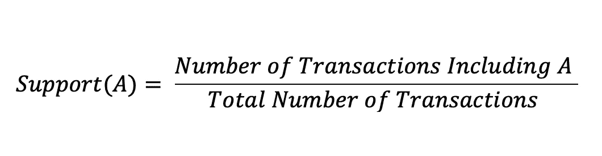

我将只查看最少出现 5%的人口统计信息。cex.names 更改字体大小

quartz()
itemcfrequencyplot(income，support = 0.05，cex.names = .5)

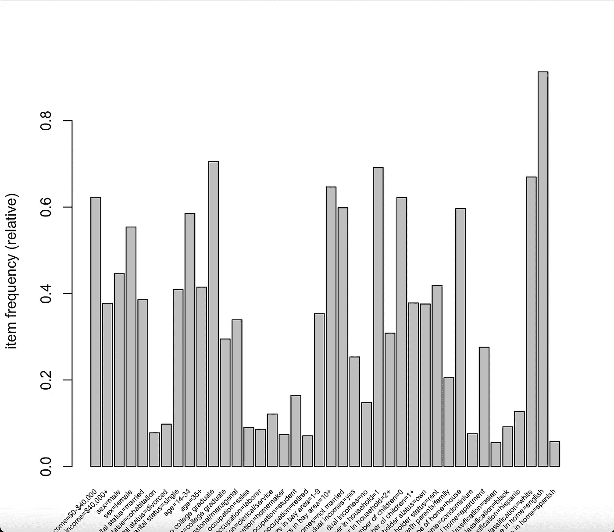

我还可以通过查看前 25 个人口统计学变量来对数据进行排序。

quartz()
itemffrequencyplot(income，topN=25)

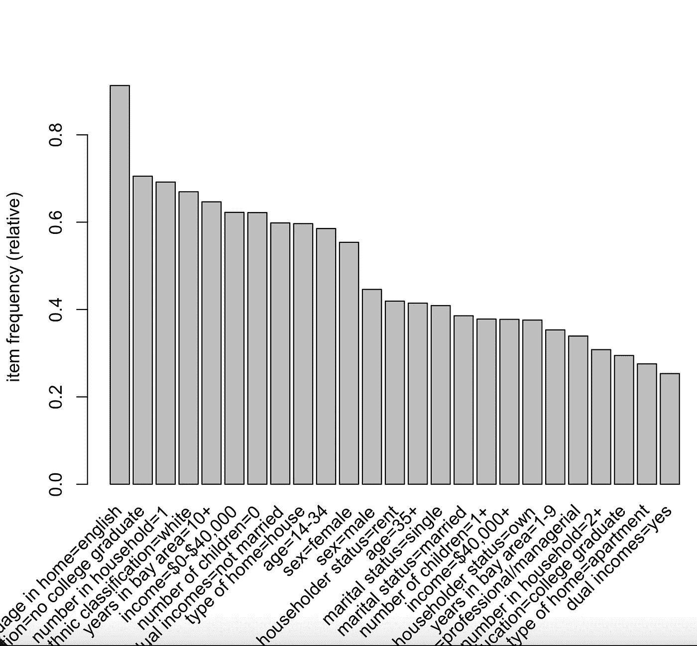

apriori 算法可以用来发现关联规则。根据弗雷德·恩万冈加和迈克·查普尔的《实用机器学习》一书(我强烈推荐这本书)，apriori 算法的工作原理是根据项目是否达到预定的支持阈值来评估项目。如果一个项目没有达到指定的支持级别，它将被认为是不重要的，并从此被算法忽略。另一方面，如果该项目达到支持阈值，则该项目与第二项目配对。这个新项目集在支持级别进行评估。如果项目集没有达到支持级别，则忽略它。达到支持阈值的项目将与第三个项目配对。这个过程一直持续到不再有项目集需要评估为止。

函数 apriori()可用于应用该算法；支持和信心是可以设定的。置信度是精确度的一种度量，可以通过将前件和后件都出现的支持度除以只有前件出现的支持度来计算。

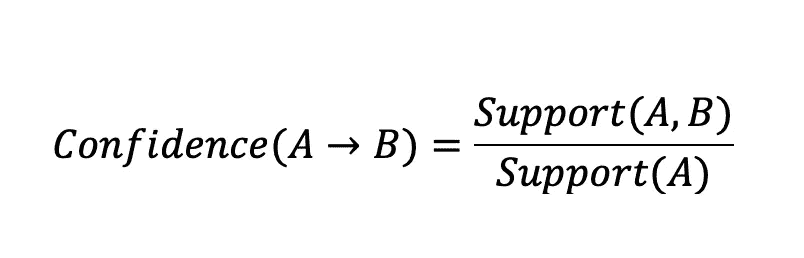

我将最小长度设置为 2，因为我对单个变量不感兴趣。

在 R，中，弗雷德·恩万冈加和迈克·查普尔将提升定义为“与结果单独出现的典型速率相比，前因和结果同时出现的可能性增加或减少”(第 374 页)。通过将包含前件和后件的项目集的置信度除以包含后件的项目集的支持度来计算提升。

检查(收入.规则)

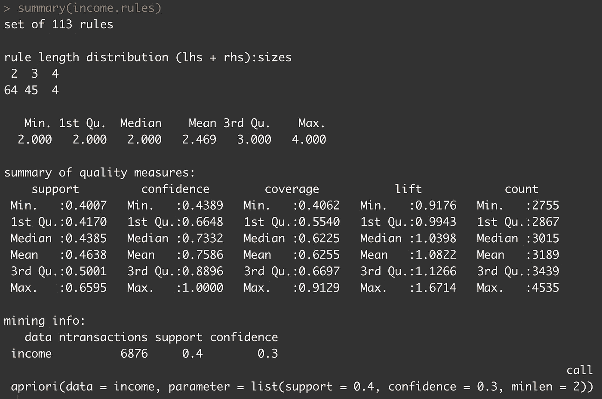

这里列出了前 21 个关联规则。这些都不足为奇，但是理解输出是很重要的。规则 20 可以解释为，当种族分类为白人时，该住宅 60.65%的时间被列为房子。此外，当种族分类为白人时，房屋类型被归类为房屋的可能性是 1.02 倍。这在 40.62%的数据集(2793 个观察值)中被发现是正确的。

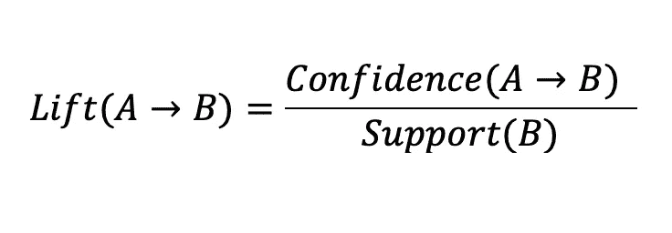

我将通过 lift 按降序进一步研究这些数据。

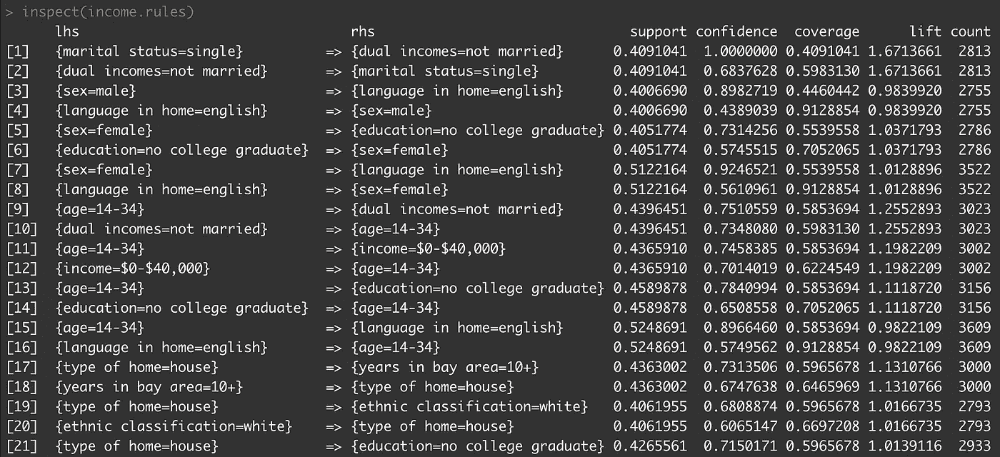

inspect(head(sort(income.rules，by = "lift ")，n = 50))

规则[28]{学历=没有大学毕业，
家中语言=英语} =>{收入= $ 0-$ 40000 }支持度:0.4454625，信心:0.7022008，覆盖率:0.6343805，升力:1.128115，计数:3063

规则 28 告诉我，如果这个人不是大学毕业生，家里的语言是英语，那么收入在 0 美元到 40，000 美元之间的时间占 70.22%。如果这个人不是大学毕业生，家里的语言是英语，那么收入在 0 美元到 4 万美元之间的可能性是 1.13 倍。在 44.55%的数据集(3063 个观察值)中发现了这种模式。

数据也可以按置信度排序。

inspect(head(sort(income.rules，by = "confidence ")，n = 50))

subset()函数为规则中的特定子集搜索提供了途径。

nocollegegegrad

inspect(head(sort(nocollegegegrad，by = "lift)))

通过跑步？arules::transactions 在 R 中，您可以按照说明来构建自己的数据集。

这里有一个例子:

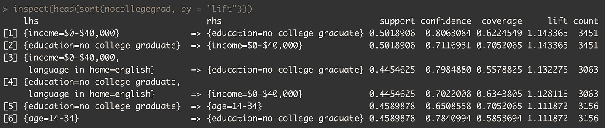

#创建列表
my_list < - list(
c("苹果"、"奶酪"、"狗粮"、"甘蓝")，
c("苹果"、"墨西哥胡椒"、"狗粮")，
c("奶酪"、"葡萄酒")，
c("苹果"、"猫粮")，
c("奶酪"、"葡萄酒"、"猫粮"、"甘蓝")，
c("燕麦奶"、"葡萄酒"、"狗粮")，
c("燕麦奶"、"奶酪")，
c("燕麦奶"、"墨西哥胡椒")

#设置事务名称
names(my _ list)<-paste(" Tr "，c(1:8)，sep = " "
my _ list

#创建交易
trans < -交易(我的列表)
trans

汇总(交易)

图像(trans)

itemcfrequencyplot(trans，support = 0.05，cex.names = .5)

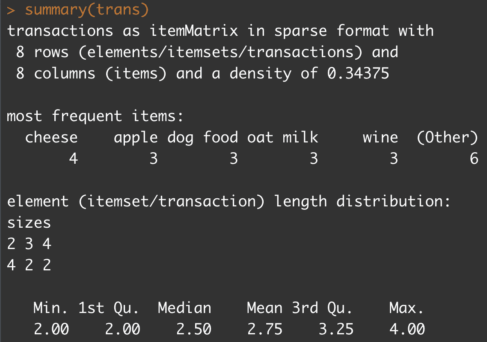

交易规则摘要(交易规则)

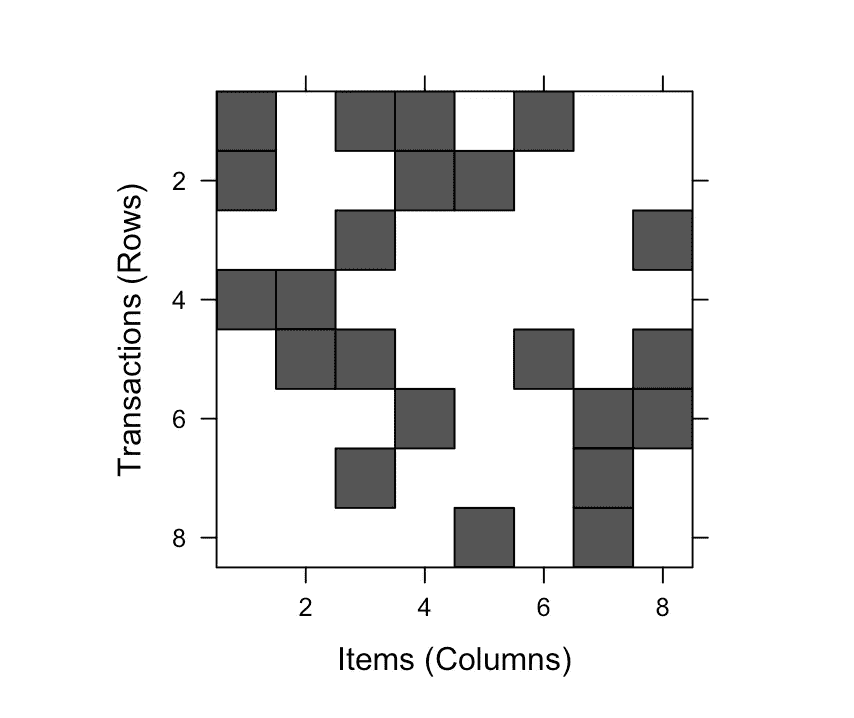

共有 76 条规则；38 条规则长度为 2，30 条规则长度为 3，8 条规则长度为 4。

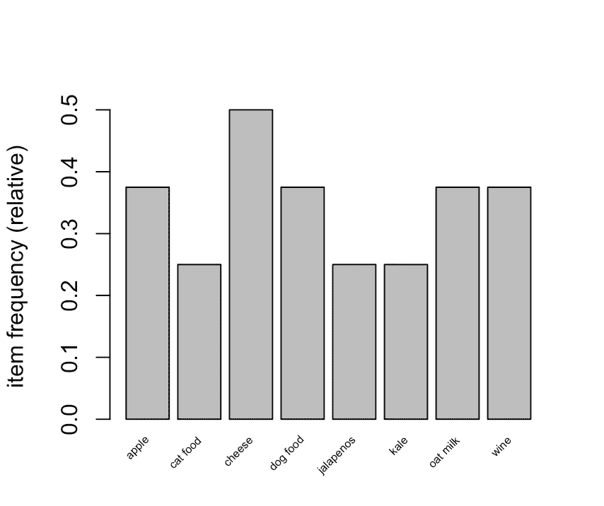

inspect(trans.rules)
以下是前 12 条规则:

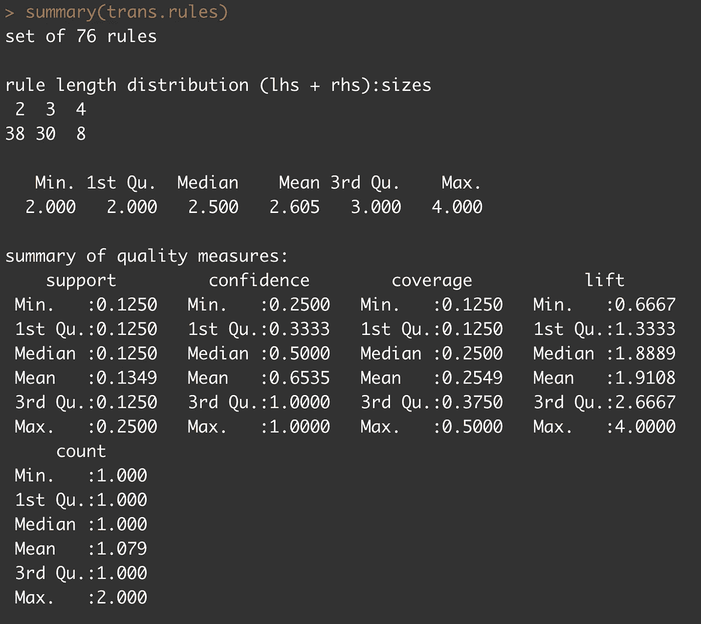

inspect(head(sort(trans.rules，by = "lift ")，n = 76))
以下是按 lift 降序排列的前 27 条规则:

inspect(trans.rules)
Here are the first 12 rules :

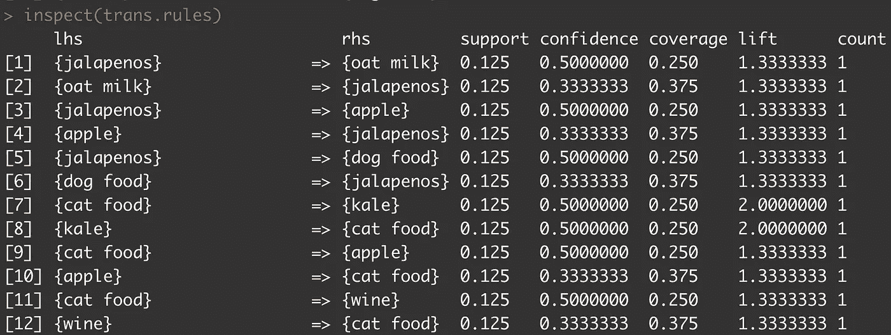

inspect(head(sort(trans.rules, by = “lift”), n = 76))
Here are the first 27 rules sorted in descending order by lift:

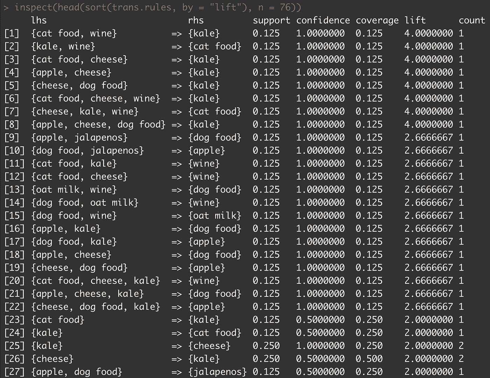