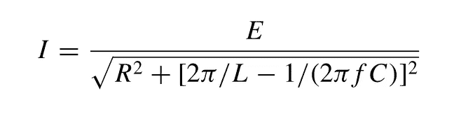

# 练习 fortran —第一讲

> 原文：<https://blog.devgenius.io/practicing-fortran-no-1-d81f268b66d1?source=collection_archive---------11----------------------->

大家好，在这篇文章中，我们将用 fortran 编程语言实现下面的练习。

练习 1:包含电阻、电容和电感的交流电路中的电流由下式给出

其中 I =电流(安培)，E =电压(伏特)，R =电阻(欧姆)，L =电感(亨利)，C =电容，f =频率(赫兹)。

写一个 fortran 程序，对于给定的 E，R，L，C 和 f 值计算 I。

在这个练习中，我们需要计算一个分数。分母中有一个长表达式；在这样的例子中，我们需要从最里面的括号(我指的是 2PIfC)开始计算，然后通过计算外部表达式继续计算。

您可以在下面的代码片段中看到实现:

祝你好运:)