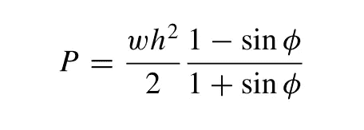

# 练习 fortran —第二讲

> 原文：<https://blog.devgenius.io/practicing-fortran-no-2-d12c54d34c35?source=collection_archive---------12----------------------->

大家好，在这篇文章中，我们将用 fortran 编程语言实现下面的练习。

练习 _02:挡土结构上的土压力(P)由公式给出:

其中，w =填土的单位体积重量= 513 kg/m3，h =填土高度= 3 m，φ=填充材料的休止角= 30°。写一个 fortran 程序来计算 p。

在这个练习中，我们有两个应该相乘的分数。只有一点是我们需要关心的；在 fortran 编程语言中，三角函数的自变量必须以弧度为单位。

您可以在下面的代码片段中看到实现:

祝你好运:)