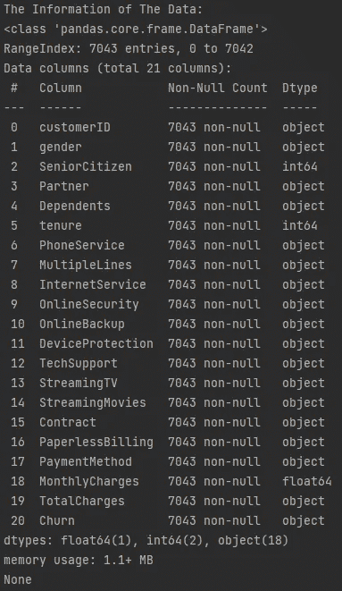
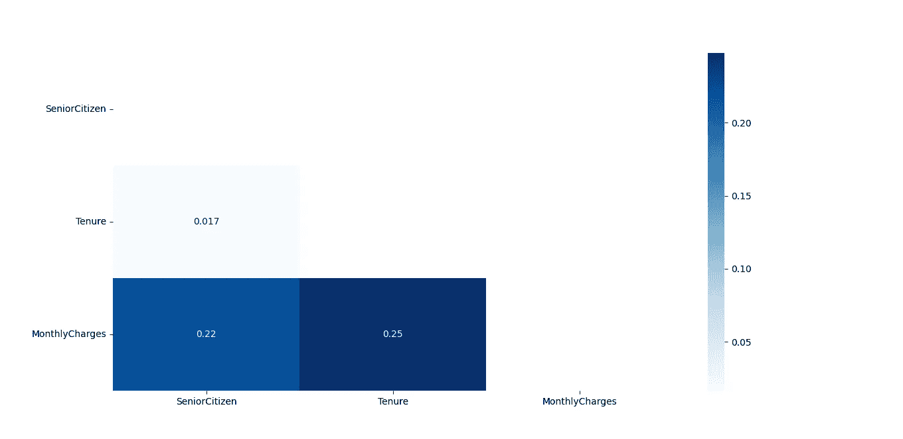

# 使用机器学习预测客户流失

> 原文：<https://blog.devgenius.io/predicting-churn-using-machine-learning-383dcbc8dd67?source=collection_archive---------7----------------------->


客户流失是指客户停止使用一家公司的服务。因此，流失预测可以识别出有可能取消合同的客户。如果公司能够预测到这一点，他们可以在这些服务上提供折扣来留住客户。为了预测客户流失，我将使用机器学习。为了创建一个机器学习模型，我将使用来自 [Kaggle](https://www.kaggle.com/blastchar/telco-customer-churn) 的顾客数据。在此基础上，我将建立一个模型来识别即将流失的现有客户。

# 数据剖析

## 导入数据

```
#DATA PROFILING
#Importing Data
import pandas as pd
pd.set_option('display.max_columns',None)
df = pd.read_csv('Telco Customer Churn.csv')
```

第一步是初始化库，使用**熊猫**、**将数据集导入 Python，并将其赋值为 **df** 。从 Kaggle 下载的数据将被保存为**‘Telco Customer churn . CSV’。****

## 显示数据的长度

```
#Showing The Length of The Data
print("\nThe Length of The Data: ", len(df))
```

第二步是使用 **len()** 显示数据集中有多少数据。结果是这个数据的大小是 **7043** 。

## 显示数据的形状

```
#Showing The Shape of The Data
print("\nThe Shape of The Data: ", df.shape)
```

第三步是使用**显示数据的形状。形状**。结果是该数据有 **7043 行和 21 列**。

## 显示数据的信息

```
#Showing The Information of The Data
print("\nThe Information of The Data: ")
print(df.info())
```



**图一。**数据的信息

第四步是使用**从数据中获取信息。info()**

## 显示统计计算

```
#Showing The Statistical Calculations
print("\nThe Statistical Calculations: ")
print(df.describe().T)
```


**图二。**统计计算的结果

第五步是使用**显示数据的统计分析。**形容()。

## 显示唯一的数据

```
#Showing The Unique Data
print("\nThe Unique Data: ")
print(df.nunique())
```


**图三。**每列中具有唯一值的数据量

数据分析的第六步是使用函数**显示每一列的唯一数据。努尼克()**。

## 更改列名

```
#Changing The Column's Name
df.rename(columns={'customerID': 'CustomerID',
                   'gender': 'Gender',
                   'tenure': 'Tenure'}, inplace=True)
```

## 寻找相关性

```
#Looking For A Correlation
import numpy as np
import seaborn as sns
import matplotlib.pyplot as plt
plt.figure(figsize=(17, 15))
corr_mask = np.triu(df.corr())
h_map = sns.heatmap(df.corr(), mask=corr_mask, annot=True, cmap='Blues')
plt.yticks(rotation=360)
plt.show()
```



**图 4。**热图关联

数据分析的最后一步是通过可视化来寻找每个数据的相关性。这部分我就用 **Seaborn** 、 **Matplotlib** 和 **Numpy** 。

# 数据清理

## 寻找每一列中缺少的值

```
#DATA CLEANSING
#Looking For The Missing Value in Each Column
print("\nLooking For The Missing Value in Each Column: ")
print(df.isnull().sum())
```


**图 5。**每列中缺失值的数量

我正在使用 **isnull()** 和 **sum()** 来找出缺少的值是多少。结果表明该数据集中没有缺失值。

## 删除不必要的列

```
#Removing Unnecessary Column
df = df.drop(['CustomerID'], axis=1)
print("\nThe Shape of The Data: ", df.shape)
```

## 检查性别栏

```
#Checking The Gender Column
print("\nChecking The Gender Column")
sns.countplot(x=df['Gender'], palette='flare')
plt.show()
```


**图 6。**性别栏的可视化

该列包含客户是男性还是女性。

## 检查高级定制列

```
#Checking The SeniorCitizen Column
print("\nChecking The SeniorCitizen Column")
sns.countplot(x=df['SeniorCitizen'], palette='flare')
plt.show()
```


**图 7。**老年人列的可视化

该列包含客户是否是老年人(1 =是，0 =否)。

```
mask_sc = {
    0   :'No',
    1   :'Yes'}
df['SeniorCitizen'] = df['SeniorCitizen'].map(mask_sc)
sns.countplot(x=df['SeniorCitizen'], palette='flare')
plt.show()
```


**图 8。**更改值后高级定制列的可视化

## 检查合作伙伴列

```
#Checking The Partner Column
print("\nChecking The Partner Column")
sns.countplot(x=df['Partner'], palette='flare')
plt.show()
```


**图九。**合作伙伴栏的可视化

此列包含客户是否有合作伙伴(是，否)。

## 检查从属列

```
#Checking The Dependents Column
print("\nChecking The Dependents Column")
sns.countplot(x=df['Dependents'], palette='flare')
plt.show()
```


**图 10。**家属列的可视化

此列包含客户是否有家属(是，否)。

## 检查任期列

```
#Checking The Tenure Column
print("\nChecking The Tenure Column")
sns.countplot(x=df['Tenure'], palette='flare')
plt.show()
```


**图 11。**任期列的可视化

此列包含客户在该公司的月数。

## 检查电话服务列

```
#Checking The PhoneService Column
print("\nChecking The PhoneService Column")
sns.countplot(x=df['PhoneService'], palette='flare')
plt.show()
```


**图 12。**电话服务列的可视化

此列包含客户是否有电话服务(是，否)。

## 检查多行列

```
#Checking The MultipleLines Column
print("\nChecking The MultipleLines Column")
sns.countplot(x=df['MultipleLines'], palette='flare')
plt.show()
```


**图 13。**多线列的可视化

此列包含客户是否有多条线路(是、否、无电话服务)。

## 检查 InternetService 列

```
#Checking The InternetServiceColumn
print("\nChecking The InternetServiceColumn")
sns.countplot(x=df['InternetService'], palette='flare')
plt.show()
```


**图 14。**互联网服务栏目的可视化

此栏包含客户的互联网服务提供商(DSL、光纤、否)。

## 检查 OnlineSecurity 列

```
#Checking The OnlineSecurity Column
print("\nChecking The OnlineSecurity Column")
sns.countplot(x=df['OnlineSecurity'], palette='flare')
plt.show()
```


**图 15。**在线安全列的可视化

此列包含客户是否拥有在线安全(是、否、无互联网服务)。

## 检查 OnlineBackup 列

```
#Checking The OnlineBackup Column
print("\nChecking The OnlineBackup Column")
sns.countplot(x=df['OnlineBackup'], palette='flare')
plt.show()
```


**图 16。**在线备份列的可视化

此列包含客户是否有在线备份(是、否、无互联网服务)。

## 检查设备保护列

```
#Checking The DeviceProtection Column
print("\nChecking The DeviceProtection Column")
sns.countplot(x=df['DeviceProtection'], palette='flare')
plt.show()
```


**图 17。**设备保护栏的可视化

此列包含客户是否有设备保护(是、否、无互联网服务)。

## 检查技术支持栏

```
#Checking The TechSupport Column
print("\nChecking The TechSupport Column")
sns.countplot(x=df['TechSupport'], palette='flare')
plt.show()
```


**图 18。**技术支持专栏的可视化

此列包含客户是否有技术支持(是、否、无互联网服务)。

## 检查 StreamingTV 列

```
#Checking The StreamingTV Column
print("\nChecking The StreamingTV Column")
sns.countplot(x=df['StreamingTV'], palette='flare')
plt.show()
```


**图 19。**流媒体电视栏目的可视化

此列包含客户是否有流媒体电视(是、否、无互联网服务)。

## 检查串流电影栏

```
#Checking The StreamingMovies Column
print("\nChecking The StreamingMovies Column")
sns.countplot(x=df['StreamingMovies'], palette='flare')
plt.show()
```


**图 20。**流电影列的可视化

此列包含客户是否有流媒体电影(是，否，无互联网服务)。

## 检查合同栏

```
#Checking The Contract Column
print("\nChecking The Contract Column")
sns.countplot(x=df['Contract'], palette='flare')
plt.show()
```


**图 21。**合同栏的可视化

此栏包含客户的合同期限(逐月、一年、两年)。

## 检查无纸账单列

```
#Checking The PaperlessBilling Column
print("\nChecking The PaperlessBilling Column")
sns.countplot(x=df['PaperlessBilling'], palette='flare')
plt.show()
```


**图 22。**无纸化账单栏的可视化

本栏包含客户是否有无纸化账单(是，否)。

## 检查 PaymentMethod 列

```
#Checking The PaymentMethod Column
print("\nChecking The PaymentMethod Column")
sns.countplot(x=df['PaymentMethod'], palette='flare')
plt.show()
```


**图 22。**支付方式列的可视化

此栏包含客户的付款方式(电子支票、邮寄支票、银行转账(自动)、信用卡(自动))。

## 检查总费用列

```
#Checking The TotalCharges Column
print("\nChecking The TotalCharges Column")
df["TotalCharges"] = pd.to_numeric(df["TotalCharges"],errors='coerce')
```

在**图 1** 中，TotalCharges 列有一个“对象”类型。同时，TotalCharges 列的内容是向客户收取的总金额。所以我要把这种类型的列转换成数值型。

```
print("\nLooking For The Missing Value in Each Column After Changing The TotalCharges Column: ")
print(df.isnull().sum())
```


**图 23。**更改 TotalCharges 列后，每列中缺少的值的数量

将 TotalCharges 列转换为数字后，我将在每一列中查找缺失值，以确保数据集中没有缺失值。

```
df = df.loc[(df['TotalCharges'].notnull())]
print("\nLooking For The Missing Value in Each Column After Removing Missing Values: ")
print(df.isnull().sum())
```

结果是 TotalCharges 列中缺少 11 个值，正如您在图 23 中看到的。在下一步中，我将从数据集中删除这个缺失的值。


**图 24。**删除缺失值后每列中缺失值的数量

## 检查流失列

```
#Checking The Churn Column
print("\nChecking Label Distribution Using .groupby() And .size() Functions")
mask_churn = {
    'No'    : 0,
    'Yes'   : 1}
df['Churn'] = df['Churn'].map(mask_churn)
print(df.groupby('Churn').size())
sns.countplot(x=df['Churn'], palette='flare')
plt.show()
```


**图 25。**流失列的可视化

此栏包含客户是否搅拌过(是或否)。搅动(1)的客户数是 1869，而未搅动(0)的客户数是 5163。

为什么了解标签分布很重要？如果标签分布不平衡，模型将很难学习模式，并且结果可能具有误导性。如果我仍然使用不平衡的数据集，最有可能的是，模型将倾向于识别新的观察结果为非变动。

## 删除重复数据

```
#Removing Duplicated Data
print("\nRemoving Duplicated Data")
df.drop_duplicates(inplace=True)
print('The Shape of The Data After Removing The Duplicated Data: ', df.shape)
```

在这一部分，我将删除重复的数据。删除重复数据后，该数据有 **7010 行和**20 列。

# 数据集上标签转换

```
#Label Conversion on The Dataset
print("\nLabel Conversion on The Dataset")
Gender = pd.get_dummies(df['Gender'], drop_first=True)
SeniorCitizen = pd.get_dummies(df['SeniorCitizen'], drop_first=True)
Partner = pd.get_dummies(df['Partner'], drop_first=True)
Dependents = pd.get_dummies(df['Dependents'], drop_first=True)
PhoneService = pd.get_dummies(df['PhoneService'], drop_first=True)
MultipleLines = pd.get_dummies(df['MultipleLines'], drop_first=True)
InternetService = pd.get_dummies(df['InternetService'], drop_first=True)
OnlineSecurity = pd.get_dummies(df['OnlineSecurity'], drop_first=True)
OnlineBackup = pd.get_dummies(df['OnlineBackup'], drop_first=True)
DeviceProtection = pd.get_dummies(df['DeviceProtection'], drop_first=True)
TechSupport = pd.get_dummies(df['TechSupport'], drop_first=True)
StreamingTV = pd.get_dummies(df['StreamingTV'], drop_first=True)
StreamingMovies = pd.get_dummies(df['StreamingMovies'], drop_first=True)
Contract = pd.get_dummies(df['Contract'], drop_first=True)
PaperlessBilling = pd.get_dummies(df['PaperlessBilling'], drop_first=True)
PaymentMethod = pd.get_dummies(df['PaymentMethod'], drop_first=True)

df = df.drop(['Gender',
              'SeniorCitizen',
              'Partner',
              'Dependents',
              'PhoneService',
              'MultipleLines',
              'InternetService',
              'OnlineSecurity',
              'OnlineBackup',
              'DeviceProtection',
              'TechSupport',
              'StreamingTV',
              'StreamingMovies',
              'Contract',
              'PaperlessBilling',
              'PaymentMethod'], axis=1)

df = pd.concat([Gender,
                SeniorCitizen,
                Partner,
                Dependents,
                PhoneService,
                MultipleLines,
                InternetService,
                OnlineSecurity,
                OnlineBackup,
                DeviceProtection,
                TechSupport,
                StreamingTV,
                StreamingMovies,
                Contract,
                PaperlessBilling,
                PaymentMethod,
                df], axis=1)
```

# 分离特征和标签

```
#Separating Features and Labels
X = df.drop('Churn', axis=1)
y = df['Churn']
print("\nX Dataset: ", X.shape)
print("y Dataset: ", y.shape)
```

在这一部分中，我将创建两个变量: **X** 只包含特性(7010 行 30 列)和 **y** 只包含标签(7010 行 1 列)。

# 处理不平衡的数据集

```
#Handling The Imbalanced Dataset
#Over-Sampling
from imblearn.over_sampling import RandomOverSampler
upsampling = RandomOverSampler(random_state=42)
X_sampling, y_sampling = upsampling.fit_resample(X, y)
print("\nX Dataset After Resampling: ", X_sampling.shape)
print("y Dataset After Resampling: ", y_sampling.shape)
```

处理不平衡后，该数据集包含 **10306 行和 30 列**。以前，这个数据集有 7010 行和 30 列。数字的增加是因为我在做一个**过采样。**

# 准备培训、测试和验证数据集

```
#Preparing Training, Testing, And Validating Dataset
from sklearn.model_selection import train_test_splitX_train_full, X_test, y_train_full, y_test = train_test_split(X_sampling, y_sampling, test_size=0.2, random_state=42)X_train, X_val, y_train, y_val = train_test_split(X_train_full, y_train_full, test_size=0.2, random_state=42)
```

# 建立一个机器学习模型

下一步是建立一个机器学习模型。我将对**逻辑回归**、**决策树分类器**、**随机森林分类器**和**近邻分类器**进行比较。

## 逻辑回归

```
#Build a Machine Learning Model Logistic Regression
print("\nBuild a Machine Learning Model Logistic Regression")
from sklearn.model_selection import GridSearchCV
from sklearn.linear_model import LogisticRegression
parameter = {
    'solver'    : ['newton-cg', 'lbfgs', 'liblinear', 'sag', 'saga']
}
clf = GridSearchCV(LogisticRegression(random_state=42),
                   param_grid=parameter,
                   cv=5,
                   return_train_score=False)
clf.fit(X_train, y_train)
print(clf.best_estimator_)
model_logreg = clf.best_estimator_
model_logreg = model_logreg.fit(X_train, y_train)
y_pred_logreg = model_logreg.predict(X_test)

#Evaluating Model Performance
from sklearn.metrics import confusion_matrix
from sklearn.metrics import precision_score, recall_score, f1_score, accuracy_score
cm = confusion_matrix(y_test, y_pred_logreg)
fig, ax = plt.subplots(figsize=(5, 5))
ax.matshow(cm, cmap=plt.cm.Oranges, alpha=0.3)
for i in range(cm.shape[0]):
    for j in range(cm.shape[1]):
        ax.text(x=j, y=i, s=cm[i, j], va='center', ha='center', size='xx-large')
plt.xlabel('Predictions', fontsize=18)
plt.ylabel('Actuals', fontsize=18)
plt.title('Confusion Matrix Logistic Regression', fontsize=18)
plt.show()
print('Precision: %.3f' % precision_score(y_test, y_pred_logreg))
print('Recall: %.3f' % recall_score(y_test, y_pred_logreg))
print('Accuracy: %.3f' % accuracy_score(y_test, y_pred_logreg))
print('F1 Score: %.3f' % f1_score(y_test, y_pred_logreg))
```


**图 26。**逻辑回归混淆矩阵的可视化

## 决策树分类器

```
#Build a Machine Learning Model Decision Tree Classifier
print("\nBuild a Machine Learning Model Decision Tree Classifier")
from sklearn.model_selection import GridSearchCV
from sklearn.tree import DecisionTreeClassifier
parameter = {
    'criterion'    : ['gini', 'entropy']
}
clf = GridSearchCV(DecisionTreeClassifier(random_state=42),
                   param_grid=parameter,
                   cv=5,
                   return_train_score=False)
clf.fit(X_train, y_train)
print(clf.best_estimator_)
model_dtc = clf.best_estimator_
model_dtc = model_dtc.fit(X_train, y_train)
y_pred_dtc = model_dtc.predict(X_test)

#Evaluating Model Performance
from sklearn.metrics import confusion_matrix
from sklearn.metrics import precision_score, recall_score, f1_score, accuracy_score
cm = confusion_matrix(y_test, y_pred_dtc)
fig, ax = plt.subplots(figsize=(5, 5))
ax.matshow(cm, cmap=plt.cm.Oranges, alpha=0.3)
for i in range(cm.shape[0]):
    for j in range(cm.shape[1]):
        ax.text(x=j, y=i, s=cm[i, j], va='center', ha='center', size='xx-large')
plt.xlabel('Predictions', fontsize=18)
plt.ylabel('Actuals', fontsize=18)
plt.title('Confusion Matrix Decision Tree Classifier', fontsize=18)
plt.show()
print('Precision: %.3f' % precision_score(y_test, y_pred_dtc))
print('Recall: %.3f' % recall_score(y_test, y_pred_dtc))
print('Accuracy: %.3f' % accuracy_score(y_test, y_pred_dtc))
print('F1 Score: %.3f' % f1_score(y_test, y_pred_dtc))
```


**图 27。**来自决策树分类器的混淆矩阵的可视化

## 随机森林分类器

```
#Build a Machine Learning Model Random Forest Classifier
print("\nBuild a Machine Learning Model Random Forest Classifier")
from sklearn.model_selection import GridSearchCV
from sklearn.ensemble import RandomForestClassifier
parameter = {
    'criterion'    : ['gini', 'entropy']
}
clf = GridSearchCV(RandomForestClassifier(random_state=42),
                   param_grid=parameter,
                   cv=5,
                   return_train_score=False)
clf.fit(X_train, y_train)
print(clf.best_estimator_)
model_rfc = clf.best_estimator_
model_rfc = model_rfc.fit(X_train, y_train)
y_pred_rfc = model_rfc.predict(X_test)

#Evaluating Model Performance
from sklearn.metrics import confusion_matrix
from sklearn.metrics import precision_score, recall_score, f1_score, accuracy_score
cm = confusion_matrix(y_test, y_pred_rfc)
fig, ax = plt.subplots(figsize=(5, 5))
ax.matshow(cm, cmap=plt.cm.Oranges, alpha=0.3)
for i in range(cm.shape[0]):
    for j in range(cm.shape[1]):
        ax.text(x=j, y=i, s=cm[i, j], va='center', ha='center', size='xx-large')
plt.xlabel('Predictions', fontsize=18)
plt.ylabel('Actuals', fontsize=18)
plt.title('Confusion Matrix Random Forest Classifier', fontsize=18)
plt.show()
print('Precision: %.3f' % precision_score(y_test, y_pred_rfc))
print('Recall: %.3f' % recall_score(y_test, y_pred_rfc))
print('Accuracy: %.3f' % accuracy_score(y_test, y_pred_rfc))
print('F1 Score: %.3f' % f1_score(y_test, y_pred_rfc))
```


**图 28。**来自随机森林分类器的混淆矩阵的可视化

## k 近邻分类器

```
#Build a Machine Learning Model K-Neighbors Classifier
print("\nBuild a Machine Learning Model K-Neighbors Classifier")
from sklearn.model_selection import GridSearchCV
from sklearn.neighbors import KNeighborsClassifier
parameter = {
    'algorithm'    : ['ball_tree', 'kd_tree', 'brute']
}
clf = GridSearchCV(KNeighborsClassifier(),
                   param_grid=parameter,
                   cv=5,
                   return_train_score=False)
clf.fit(X_train, y_train)
print(clf.best_estimator_)
model_knc = clf.best_estimator_
model_knc = model_knc.fit(X_train, y_train)
y_pred_knc = model_knc.predict(X_test)

#Evaluating Model Performance
from sklearn.metrics import confusion_matrix
from sklearn.metrics import precision_score, recall_score, f1_score, accuracy_score
cm = confusion_matrix(y_test, y_pred_knc)
fig, ax = plt.subplots(figsize=(5, 5))
ax.matshow(cm, cmap=plt.cm.Oranges, alpha=0.3)
for i in range(cm.shape[0]):
    for j in range(cm.shape[1]):
        ax.text(x=j, y=i, s=cm[i, j], va='center', ha='center', size='xx-large')
plt.xlabel('Predictions', fontsize=18)
plt.ylabel('Actuals', fontsize=18)
plt.title('Confusion Matrix K-Neighbors Classifier', fontsize=18)
plt.show()
print('Precision: %.3f' % precision_score(y_test, y_pred_knc))
print('Recall: %.3f' % recall_score(y_test, y_pred_knc))
print('Accuracy: %.3f' % accuracy_score(y_test, y_pred_knc))
print('F1 Score: %.3f' % f1_score(y_test, y_pred_knc))
```


**图 29。**来自 K 近邻分类器的混淆矩阵的可视化

# 评估机器学习模型

建立机器学习模型后的下一个阶段是评估该模型。我会在这个评估过程中查看**召回分数和 F1-分数**。我将采用**最高回忆分数和 F1 分数**来决定哪个型号更好。我使用回忆分数是因为我宁愿有一个假阳性而不是一个假阴性。在客户流失的情况下，该模型检测客户流失的趋势，即使它没有检测到，也被认为比它没有检测到流失要好，但它确实是流失了。我使用 F1-Score 是因为数据集的假阴性和假阳性数量不相等。

## 逻辑回归

使用逻辑回归的结果是**召回分数是 0.793，F1 分数是 0.769。**

## 决策树分类器

使用决策树分类器的结果是**召回分数是 0.913，F1 分数是 0.864。**

## 随机森林分类器

使用随机森林分类器的结果是**召回分数是 0.917，F1 分数是 0.875。**

## k 近邻分类器

使用 K 近邻分类器的结果是**召回分数是 0.792，F1 分数是 0.757。**

从这个评价来看，使用随机森林分类器的机器学习模型具有最高的召回分数和 F1 分数。

# 验证机器学习模型

```
#Validating The Machine Learning Model
for i in range(10):
    real = y_val.iloc[i]
    pred = model_rfc.predict(X_val.iloc[i].to_frame().T)[0]
    print(f'Real Value      ----->>>>> {real}\n'
          f'Predicted Value ----->>>>> {pred}')
    print()
pred = model_rfc.predict(X_val)
print('Precision: %.3f' % precision_score(y_val, pred))
print('Recall: %.3f' % recall_score(y_val, pred))
print('Accuracy: %.3f' % accuracy_score(y_val, pred))
print('F1 Score: %.3f' % f1_score(y_val, pred))
```


**表 1**验证机器学习模型随机森林分类器的结果

# 结论

使用随机森林分类器的机器学习模型具有更好的结果**测试召回分数= 0.917，测试 F1 分数= 0.875，验证召回分数= 0.918，验证 F1 分数= 0.867**

我说的就是这些。如果你对这个项目有任何批评、建议或问题，可以联系我。谢谢你，我真的很感谢你花时间来阅读这一点。