# 用 Python 预测洪水

> 原文：<https://blog.devgenius.io/predicting-flooding-with-python-276850732516?source=collection_archive---------4----------------------->

[发布于我的网站](http://www.tobiolabode.com/blog/2020/9/23/predicting-flooding-with-python)


韦德·奥斯汀·埃利斯在 [Unsplash](https://unsplash.com?utm_source=medium&utm_medium=referral) 上的照片

# 获取降雨数据和清理

对于这个项目，我将制作一个模型，显示一个地区的长期洪水风险。与气候变化和机器学习有关，我最近写了很多。这个想法是为了预测一个地区在 10 年内是否有更高的洪水风险。解决这个问题的总体思路是获取降雨量数据。然后算出降雨量是否超过了地面高度。之后，该地区可以算作洪水泛滥或没有。

为了开始，我必须找到降雨量数据。幸运的是，这并不太难。但问题是，我想用什么样的降雨量数据。首先，我找到了全国降雨量数据(英国)。这看起来很有帮助。但是由于分析将在地理基础上进行。我决定我将使用[伦敦降雨量数据](https://data.london.gov.uk/dataset/daily-areal-rainfall)。当我得到降雨数据时，它看起来像这样:

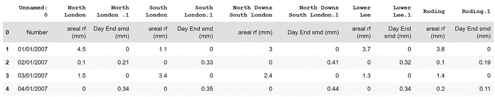

有些栏目提供了与项目无关的土壤湿度信息。所以我必须摆脱他们。同时，因为这是一个地理分析。我决定选择最接近我想要绘制的大致位置的列。所以，我选了下风处的降雨量。因为我将分析东伦敦。

为了完成数据争论，我用了熊猫。这并不奇怪。首先，我必须删除数据帧中的第一行。因为它们是数据帧中的第二个标题。这是有意义的，因为数据是用于 excel 电子表格的。

我用这个去掉了第一行:

`df = df[1:]`

在那之后，我不得不处理掉我不打算使用的位置。因此，我使用 pandas iloc 函数来分割数据帧中的大量列。

`df = df.drop(df.iloc[:, 1:6], axis=1)`


之后，我使用 dataframe drop 函数按名称删除列。

`df = df.drop([‘Roding’, ‘Lower Lee.1’, ‘North Downs South London.1’, ‘Roding.1’], axis=1)`

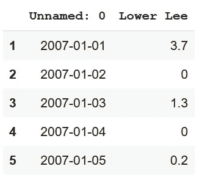

现在，在我给你看我做的其他东西之前。当我试图分析或处理数据框的内容时，我犯了一些错误。来解决我遇到的这些问题。我将 date 列改为 Pandas DateTime，并选择先解析日期。由于熊猫使用美国的日期系统。然后把下背风柱改成了浮子式。这必须作为我之前切片的第一行来完成。将列的数据类型更改为非数字数据类型。完成所有这些之后，我可以继续进行进一步的分析。

为了使分析更易于管理，我决定按月汇总降雨量。而不是每天。因为我将不得不处理许多额外的行。而且每月的降雨量使得一眼就能看出降雨量的变化。为了做到这一点，我必须将数据框架分成月度数据。这是我一度被卡住的事情，但我能够找到解决方案。

最初，我必须创建一个新的 dataframe，按月对 DateTime 列进行分组。这就是为什么我必须改变之前的数据类型。然后我使用 dataframe 聚合函数。对这些值求和。然后在那之后，我使用了旋转索引标签的 unstack 函数。第三，我使用 reset_index(level=[0，1])将多索引恢复为单个索引数据帧。然后删除了 level_0 列。然后将其余的列重命名为日期和雨。

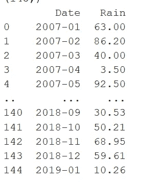

# 分析数据

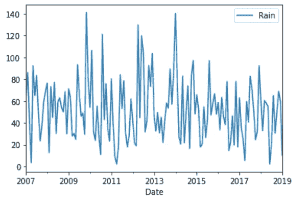

出现的一个主要问题是日期列的数据类型。在深入研究了堆栈溢出之后，我发现解决方案是将其转换成时间戳，然后再转换回日期时间格式。我认为这与将数据帧更改为月度数据帧有关，因此它肯定弄乱了数据类型，这就是我必须再次更改它的原因。

我必须调整的一个小问题是指数，因为当我第一次绘制图表时，预测没有提供日期，只提供了一个增加的数字。所以，我去了导师的笔记本，她的数据框有日期作为索引。因此，我更改了我的数据集，使索引包含日期，以便在绘制预测时，日期显示在 x 轴上。

现在进行分析。这是一个时间序列分析，因为我们正在做预测。我在这里找到了这篇文章。我用了 statsmodels 包。这有助于为统计分析提供模型。首先，我们进行了分解，将数据框架分为趋势、季节和残差部分。

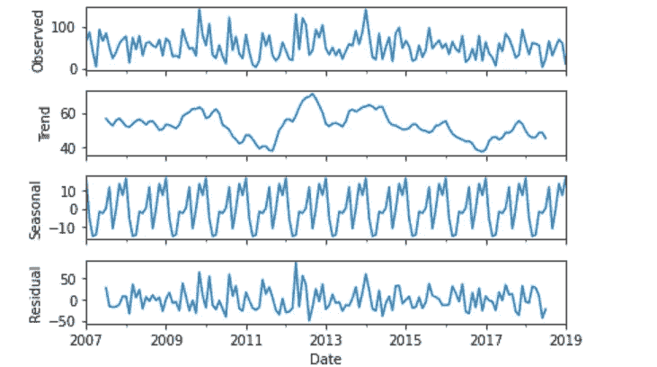

接下来，教程要求我们检查时间序列是否是平稳的。在本文中，它被定义为“当一个时间序列的统计属性(如均值、方差和自相关性)在一段时间内保持不变时，该时间序列就是稳定的。换句话说，当时间序列不依赖于时间并且没有趋势或季节效应时，它就是稳定的。”

为了检查数据是否平稳，我们使用了自相关函数和偏自相关函数图。

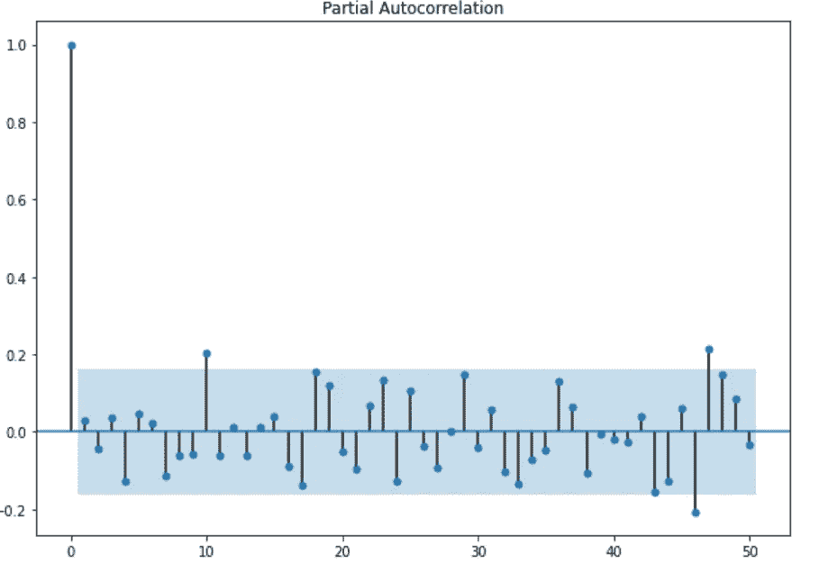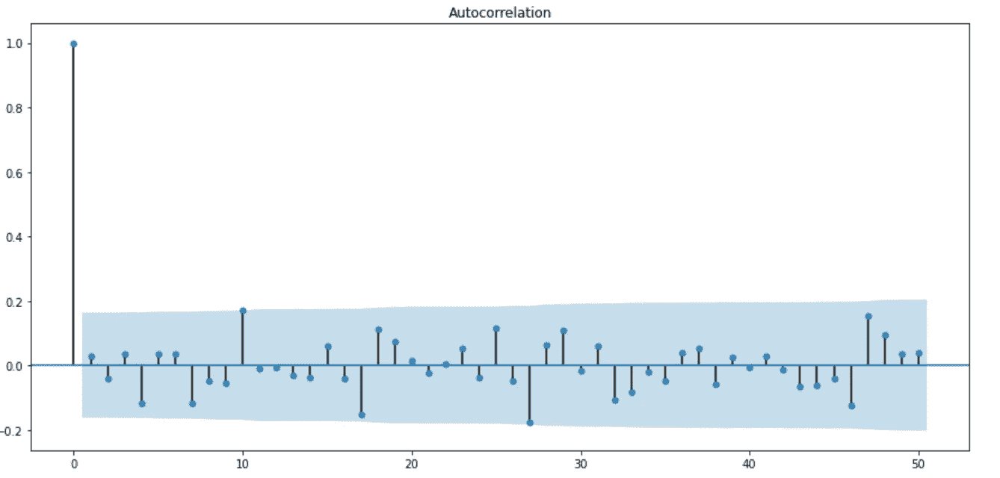

有一个快速截止数据是静止的。自相关和部分自相关函数给出了关于时间序列值的可靠性的信息。

现在我们使用了另一个名为 pmdarima 的 python 包。这将有助于我决定我的模型。

```
import pmdarima as pm model = pm.auto_arima(new_index_df_new_index['Rain'], d=1, D=1, m=12, trend='c', seasonal=True, start_p=0, start_q=0, max_order=6, test='adf', stepwise=True, trace=True)
```

所有的设置都来自教程。我将让教程解释这些数字:

> “在 auto_arima 函数中，我们将指定 d=1 和 D=1，因为我们一次对趋势进行微分，一次对季节性进行微分，m=12，因为我们有月度数据，trend='C '包括常数，seasonal=True 以拟合季节性 arima。此外，我们指定 trace=True 来打印 fits 的状态。这有助于我们通过比较 AIC 分数来确定最佳参数。”

之后，我将数据分成训练和测试批次。

```
train_x = new_index_df_new_index[:int(0.85*(len(new_index_df_new_index)))]test_x = new_index_df_new_index[int(0.85*(len(new_index_df_new_index))):]
```

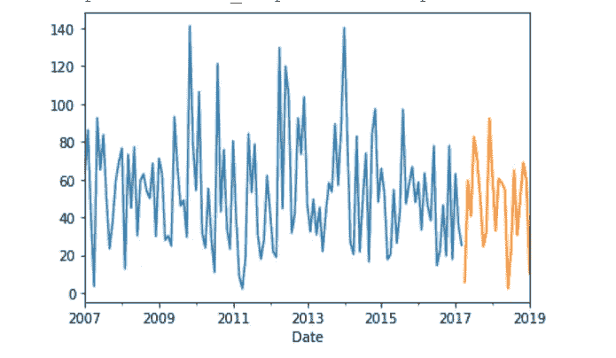

第一次拆分数据时，我使用了 SciKit Learn 的 train_test_split 函数来拆分数据。但是，这导致了一些主要的错误，后来当绘制数据，所以我使用教程的方法。

然后我们根据之前产生的参数训练了一个 SARIMAX。

```
from statsmodels.tsa.statespace.sarimax import SARIMAXmodel = SARIMAX(train_x['Rain'], order=(2,1,0),seasonal_order=(2,1,0,12)) results = model.fit() results.summary()
```

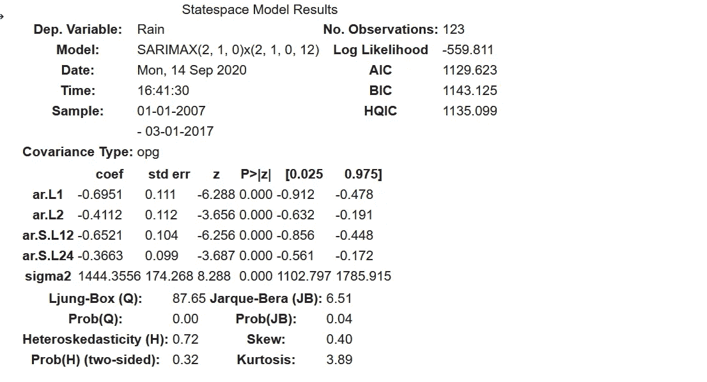

# 绘制预测图

现在我们可以开始预测工作，因为我们现在有一个经过训练的模型。

```
forecast_object = results.get_forecast(steps=len(test_x))mean = forecast_object.predicted_meanconf_int = forecast_object.conf_int()dates = mean.index
```

这些变量用来帮助我们绘制预测图。预测与测试数据集一样长。平均值是平均预测值。置信区间给了我们一个数字所在的范围。日期提供了一个索引，所以我们可以画出日期。

```
plt.figure(figsize=(16,8))df = new_index_df_new_indexplt.plot(df.index, df, label='real')plt.plot(dates, mean, label='predicted')plt.fill_between(dates, conf_int.iloc[:,0], conf_int.iloc[:,1],alpha=0.2)plt.legend()plt.show()
```

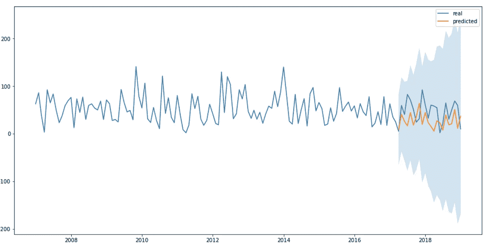

这是样本内预测的示例。现在让我们看看如何进行样本外预测。

```
pred_f = results.get_forecast(steps=60)pred_ci = pred_f.conf_int()ax = df.plot(label='Rain', figsize=(14, 7))pred_f.predicted_mean.plot(ax=ax, label='Forecast')ax.fill_between(pred_ci.index,pred_ci.iloc[:, 0],pred_ci.iloc[:, 1], color='k', alpha=.25)ax.set_xlabel('Date')ax.set_ylabel('Monthly Rain in lower lee')plt.legend()plt.show()
```

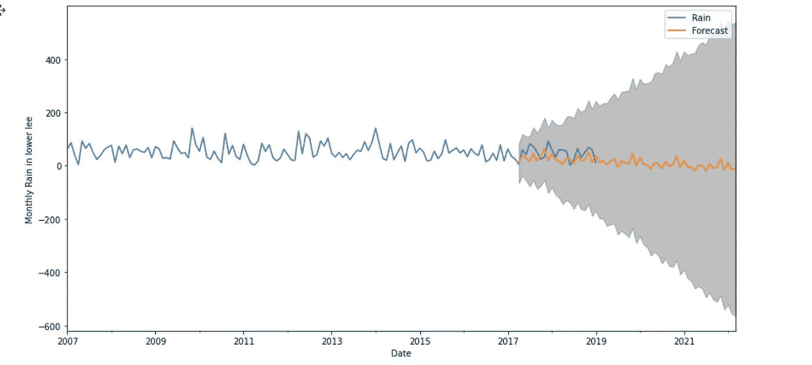

这是对未来 60 个月的预测。

现在我们有了预测数据。我需要研究哪个地区会被淹没。

# 获取高程数据

为了找出面临洪水威胁的地区，我必须找到海拔数据。在谷歌搜索了一下之后。我发现英国政府提供该国的海拔数据。使用激光雷达。当我下载数据的时候。我发现我没有办法在 python 中查看数据。而且我可能要付费学习一个叫 ArcGIS 的新程序。这是我不想做的事。

所以我找到了一个更简单的替代方法，使用谷歌地图 API 高程数据。在那里你可以得到一个地区的海拔数据。使用坐标。我能够使用 Python 包请求访问高程数据。

```
import requestsr = requests.get('https://maps.googleapis.com/maps/api/elevation/json?locations=39.7391536,-104.9847034&key={}'.format(key))r.json(){'results': [{'elevation': 1608.637939453125, 'location': {'lat': 39.7391536, 'lng': -104.9847034}, 'resolution': 4.771975994110107}],'status': 'OK'}
```

现在我们需要计算出这个点什么时候会被淹没。因此，利用降雨数据，我们比较了海拔和降雨量之间的差异。如果雨水超过海拔高度，那么这个地方就在水下。

```
import jsonr = requests.get('https://maps.googleapis.com/maps/api/elevation/json?locations=51.528771,0.155324&key={}'.format(key))r.json()json_data = r.json()print(json_data['results'])elevation = json_data['results'][0]['elevation']print('elevation: ', elevation )rainfall_dates = []for index, values in mean.iteritems():print(index)rainfall_dates.append(index)print(rainfall_dates)for i in mean:# print('Date: ', dates_rain)print('Predicted Rainfall:', i)print('Rainfall vs elevation:', elevation - i)print('\n') Predicted Rainfall: 8.427437412467206Rainfall vs elevation: -5.012201654639448 Predicted Rainfall: 40.91480530998025Rainfall vs elevation: -37.499569552152494Predicted Rainfall: 26.277342698245548Rainfall vs elevation: -22.86210694041779Predicted Rainfall: 16.720892909866357Rainfall vs elevation: -13.305657152038599
```

我们可以看到月降雨量是否在一天内全部下降。那么这个地区将会被淹没。

```
diff_rain_ls = []for f, b in zip(rainfall_dates, mean): print('Date:', f) print('Predicted Rainfall:', b) diff_rain = elevation - b diff_rain_ls.append(diff_rain) print('Rainfall vs elevation:', elevation - b) print('\n')# print(f, b)
```

这让我可以比较降雨量和海拔差异的日期。

```
df = pd.DataFrame(list(zip(rainfall_dates, diff_rain_ls)),columns =['Date', 'diff'])df.plot(kind='line',x='Date',y='diff')plt.show()
```

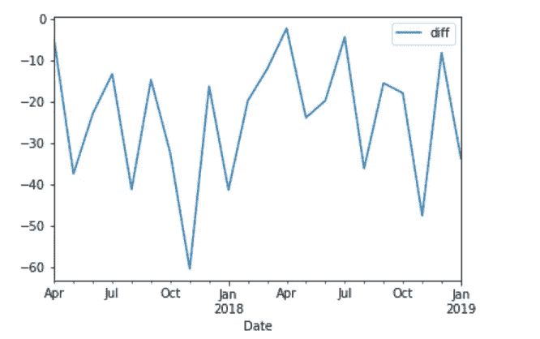

我对 60 个月的预测做了同样的事情

```
rainfall_dates_60 = []for index, values in mean_60.iteritems():print(index)rainfall_dates_60.append(index)diff_rain_ls_60 = []for f, b in zip(rainfall_dates_60, mean_60):print('Date:', f)print('Predicted Rainfall:', b)diff_rain_60 = elevation - bdiff_rain_ls_60.append(diff_rain_60)print('Rainfall vs elevation:', elevation - b)print('\n')
```

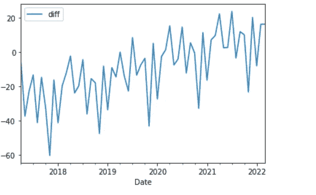

从长远来看，天气预报说洪水将会减少。这可能是由于数据收集方式不完善，时间跨度短。

# 这个项目是如何失败的

我可以计算出淹没一个地区的降雨量。我没有达到把它显示在地图上的目标。我无法计算出之前的激光雷达数据。和其他用于木星笔记本的谷歌地图包都不起作用。所以我只知道坐标和降雨量。

想要做出这样的东西:

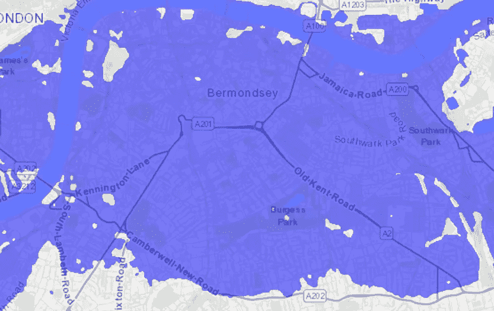

从[https://www.floodmap.net/](https://www.floodmap.net/)

由于我前面提到的原因，我不能做这件事。这个想法是将地图放大到本地区域。同时显示水下属性和陆地。

我认为这是主要的瓶颈。获取可在 python 中操作的高程数据地图。作为其中之一，我可以创建一个脚本，可以用低海拔地区的颜色。

# 为什么不应该使用这种模式

当我从这个项目中学到一些东西的时候。我确实认为他们对我如何决定哪些领域有风险有一些主要的问题。仅仅计算月降雨量并找出与海拔的差异是任意的。如果在一场真正的洪水中降雨量增加 10 倍，月降雨量会产生什么影响？这是我开始经历这个项目时开始注意到的。洪水(在英国)是由骤发洪水引起的。所以一个月的雨量会在一天之内倾泻而下。它们将与正常的降雨量有某种关联。其他的数据点是真正的洪水地图绘制者使用的，比如模拟水的物理特性。来看看水是如何流动并影响这个地区的。(水文)。其他数据点可以包括温度和雪。即使我有的数据也可以做得更好。最长的全国降雨量数据可追溯到 70 年代。我认为我做得很好，从数据集中选择了当地的雨量计。(下李)。我想知道是否最好是取所有量规的平均值或总和来对这个城市的降雨量有一个大致的概念。

所以除了我没有绘制洪水地图。这一风险评估非常不准确。

如果你喜欢读这篇文章，请看看我的其他博文:

[未能实现我的第一篇论文](https://www.tobiolabode.com/blog/2020/9/6/failing-to-implement-my-first-paper)

[我如何创建一个 API 来计算你的运输排放量](https://www.tobiolabode.com/blog/2020/6/25/python-api-for-carbon-emmissions)