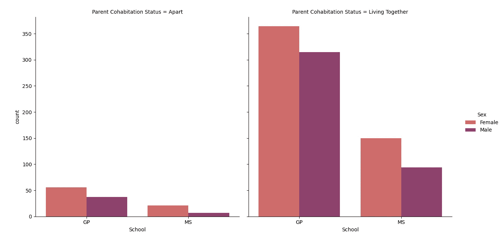
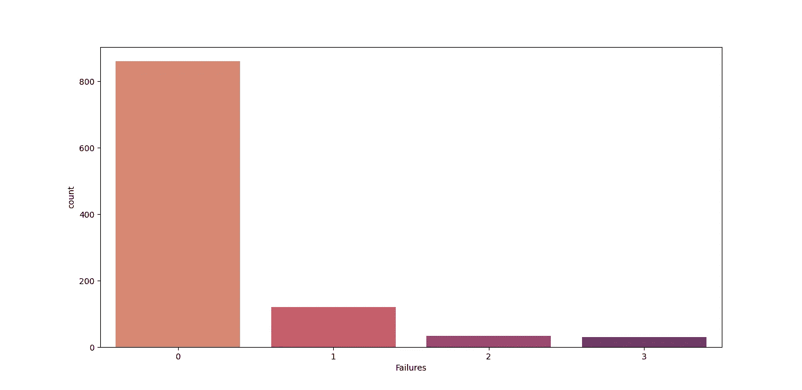

# 使用机器学习预测学生表现

> 原文：<https://blog.devgenius.io/predicting-student-performance-using-machine-learning-f2d05135bfa3?source=collection_archive---------1----------------------->


学业成功至关重要。学业有成的成年人更有可能获得工作机会。此外，学业有成的成年人不太可能从事犯罪活动。

并非所有的学生都有相同的生活背景。有些学生有家庭的全力支持，也有家庭缺乏和谐的学生。许多事情会影响学生在学院的成功。为此，我将创建一个机器学习模型，根据学生的背景来预测数学和葡萄牙语科目的价值。我使用的数据集来自 UCI。

# 数据剖析

## 导入数据

```
#Importing Data
import pandas as pd
pd.set_option('display.max_columns',None)
df_mat = pd.read_csv('student-mat.csv',sep=';')
df_por = pd.read_csv('student-por.csv',sep=';')
```

我将使用两组数据集；第一个资产是包含数学课分数的数据集，第二个资产是包含葡萄牙语课程的数据集。我将第一个数据集命名为 **df_mat** ，而第二个数据集命名为 **df_por** 。从 UCI 下载的数据将保存为**‘student-mat . CSV’和‘student-por . CSV’。**

## 合并两个数据集

```
#Merging Two Datasets
df = pd.concat([df_mat, df_por])
```

导入数据集后，我将使用**将两个数据集合并成一个数据集。从**熊猫**中连接**函数，并将其指定为 **df** 。

## 创建总成绩列

```
#Creating The Total Grade Column
df['total grade'] = (df['G1']+df['G2']+df['G3'])/3
df = df.drop(['G1','G2','G3'],axis=1)
```

下一步，我将创建**总成绩**列。该列包含**G1、G2 和 G3 列**的平均值。制作完“总成绩”列后，我将删除“G1”、“G2”和“G3”列。

## 显示数据的长度

```
#Showing The Length of The Data
print("\nThe Length of The Data: ", len(df))
```


**图一。**数据集的长度

第二步是使用 **len()** 显示数据集中有多少数据。结果是这个数据的大小是 **1044** 。

## 显示数据的形状

```
#Showing The Shape of The Data
print("\nThe Shape of The Data: ", df.shape)
```


**图二。**数据集的形状

第三步是使用**显示数据的形状。形状**。结果是该数据有 **1044 行和 31 列**。

## 显示数据的信息

```
#Showing The Information of The Data
print("\nThe Information of The Data: ")
print(df.info())
```


**图三。**数据的信息(1)


**图 4。**数据的信息(2)

第四步是使用**从数据中获取信息。info()**

## 显示统计计算

```
#Showing The Statistical Calculations
print("\nThe Statistical Calculations: ")
print(df.describe().T)
```


**图 5。**统计计算的结果(1)


**图六。**统计计算的结果(2)

第五步是使用**显示数据的统计分析。**形容()。

## 显示唯一的数据

```
#Showing The Unique Data
print("\nThe Unique Data: ")
print(df.nunique())
```


**图 7。**每列中具有唯一值的数据量(1)


**图 8。**每列中具有唯一值的数据量(2)

数据概要分析的第六步是使用函数**显示来自每一列的唯一数据。努尼克()**。

# 更改列名和列值

```
df.columns = df.columns.str.capitalize()
df.rename(columns={'Famsize': 'Family Size',
                   'Pstatus': 'Parent Cohabitation Status',
                   'Medu': 'Mother Education',
                   'Fedu': 'Father Education',
                   'Mjob': 'Mother Job',
                   'Fjob': 'Father Job',
                   'Traveltime': 'Travel Time',
                   'Studytime': 'Study Time',
                   'Schoolsup': 'Extra Educational Support',
                   'Famsup': 'Family Educational Support',
                   'Paid': 'Extra Paid Course',
                   'Activities': 'Extracurricular Activities',
                   'Nursery': 'Attending Nursery School',
                   'Higher': 'Wants To Take Higher Ed',
                   'Internet': 'Internet Access',
                   'Romantic': 'Romantic Relationship',
                   'Famrel': 'Family Relationship',
                   'Freetime': 'Free Time After School',
                   'Goout': 'Going Out With Friends',
                   'Dalc': 'Workday Alcohol Consumption',
                   'Walc': 'Weekend Alcohol Consumption',
                   'Health': 'Current Health Status',
                   'Absences': 'Number of School Absences',
                   'Total grade': 'Total Grade'}, inplace=True)
```

# 寻找相关性

```
#Looking For A Correlation
import numpy as np
import seaborn as sns
import matplotlib.pyplot as plt
plt.figure(figsize=(17, 15))
corr_mask = np.triu(df.corr())
h_map = sns.heatmap(df.corr(), mask=corr_mask, annot=True, cmap='Blues')
plt.yticks(rotation=360)
plt.xticks(rotation=90)
plt.show()
```


**图九。**热图关联

数据分析的最后一步是通过可视化来寻找每个数据的相关性。在这部分，我将使用 **Seaborn** 、 **Matplotlib** 和 **Numpy** 。

# 数据清理

## 寻找每一列中缺少的值

```
#Looking For The Missing Value in Each Column
print("\nLooking For The Missing Value in Each Column: ")
print(df.isnull().sum())
```


**图 10。**每列中缺失值的数量(1)


**图 11。**每列中缺失值的数量(2)

我将使用 **isnull()** 和 **sum()** 来计算缺少的值是多少。结果表明该数据集中没有缺失值。

## 查看学校专栏

```
#Checking The School Column
sns.countplot(x='School', data=df, palette='flare')
plt.show()
```


**图 12。**学校栏目的可视化

在**图 12** 中，该数据集收集自两所学校，GP as Gabriel Pereira 和 MS as Mousinho da Silveira。在这个数据集中，Gabriel Pereira 的学生比 Mousinho da Silveira 的学生多。

## 查看性别栏

```
#Checking The Sex Column
mask_sex = {'F':'Female',
            'M':'Male'}
df['Sex'] = df['Sex'].map(mask_sex)
sns.countplot(x=df['Sex'], palette='flare')
plt.show() 
```


**图 13。**可视化的性专栏(1)

在**图 13** 中，女生大于男生。

```
sns.countplot(x='School', hue='Sex', data=df, palette='flare')
plt.show()
```


**图 14。**可视化的性专栏(2)

在**图 14** 中，加布里埃尔佩雷拉的女生人数超过了男生。同样，在 Mousinho da Silveira，女生多于男生。

## 检查年龄栏

```
#Checking The Age Column
sns.countplot(x=df['Age'], palette='flare')
plt.show()
```


**图 15。**年龄栏的可视化

```
sns.countplot(x='Sex', hue='Age', data=df, palette='flare')
plt.show()
```


**图十六。**每个性别的年龄栏的可视化

```
sns.catplot(x='School', hue='Sex', col='Age', data=df, kind='count', palette='flare')
plt.show()
```


**图 17。**每个学校每个性别的年龄栏的可视化

## 检查地址栏

```
#Checking The Address Column
mask_address = {'U':'Urban',
                'R':'Rural'}
df['Address'] = df['Address'].map(mask_address)
sns.countplot(x=df['Address'], palette='flare')
plt.show()
```


**图 18。**地址栏的可视化

```
sns.countplot(x='Sex', hue='Address', data=df, palette='flare')
plt.show()
```


**图 19。**每个性别的地址栏的可视化

```
sns.catplot(x='School', hue='Sex', col='Address', data=df, kind='count', palette='flare')
plt.show()
```


**图 20。**每个学校中每个性别的地址栏的可视化

## 检查家庭人数栏

```
#Checking The Family Size Column
mask_famsize = {'LE3':'Less Or Equal To 3',
                'GT3':'Greater Than 3'}
df['Family Size'] = df['Family Size'].map(mask_famsize)
sns.countplot(x=df['Family Size'], palette='flare')
plt.show()
```


**图 21。**可视化的家庭规模栏

```
sns.countplot(x='Sex', hue='Family Size', data=df, palette='flare')
plt.show()
```


**图 22。**每个性别的家庭规模栏的可视化

```
sns.catplot(x='School', hue='Sex', col='Family Size', data=df, kind='count', palette='flare')
plt.show()
```


**图 23。**每个学校每个性别的家庭规模栏的可视化

## 检查父母同居状态列

```
#Checking The Parent Cohabitation Status Colum
mask_pstatus = {'T':'Living Together',
                'A':'Apart'}
df['Parent Cohabitation Status'] = df['Parent Cohabitation Status'].map(mask_pstatus)
sns.countplot(x=df['Parent Cohabitation Status'], palette='flare')
plt.show()
```


**图 24。**父母同居状态栏的可视化

```
sns.countplot(x='Sex', hue='Parent Cohabitation Status', data=df, palette='flare')
plt.show()
```


**图 25。**每个性别的父母同居状态栏的可视化

```
sns.catplot(x='School', hue='Sex', col='Parent Cohabitation Status', data=df, kind='count', palette='flare')
plt.show()
```



**图 26。**每个学校中每个性别的父母同居状态栏的可视化

## 查看母亲教育专栏

```
#Checking The Mother Education Column
sns.countplot(x=df['Mother Education'], palette='flare')
plt.show()
```


**图 27。**妈妈教育栏目可视化

0 =无
1 =初等教育(四年级)
2 =五至九年级
3 =中等教育
4 =高等教育

```
sns.countplot(x='Sex', hue='Mother Education', data=df, palette='flare')
plt.show()
```


**图 28。**每个性别的母亲教育专栏的可视化

```
sns.catplot(x='School', hue='Sex', col='Mother Education', data=df, kind='count', palette='flare')
plt.show()
```


**图 29。**每个学校中每个性别的母亲教育专栏的可视化

## 查看父亲教育专栏

```
#Checking The Father Education Column
sns.countplot(x=df['Father Education'], palette='flare')
plt.show()
```


**图 30。**父亲教育栏目的可视化

0 =无
1 =初等教育(四年级)
2 =五至九年级
3 =中等教育
4 =高等教育

```
sns.countplot(x='Sex', hue='Father Education', data=df, palette='flare')
plt.show()
```


**图 31。**每个性别的父亲教育专栏形象化

```
sns.catplot(x='School', hue='Sex', col='Father Education', data=df, kind='count', palette='flare')
plt.show()
```


**图 32。**每个学校中每个性别的父亲教育专栏的可视化

## 检查母职务列

```
#Checking The Mother Job Column
mask_mjob = {'teacher':'Teacher',
             'health':'Health',
             'services':'Services',
             'at_home':'At Home',
             'other':'Other'}
df['Mother Job'] = df['Mother Job'].map(mask_mjob)
sns.countplot(x=df['Mother Job'], palette='flare')
plt.show()
```


**图 33。**母职列的可视化

```
sns.countplot(x='Sex', hue='Mother Job', data=df, palette='flare')
plt.show()
```


**图 34。**每个性别的母亲职位栏的可视化

```
sns.catplot(x='School', hue='Sex', col='Mother Job', data=df, kind='count', palette='flare')
plt.show()
```


**图 35。**每个学校中每个性别的母亲职位栏的可视化

## 检查父职务列

```
#Checking The Father Job Column
mask_fjob = {'teacher':'Teacher',
             'health':'Health',
             'services':'Services',
             'at_home':'At Home',
             'other':'Other'}
df['Father Job'] = df['Father Job'].map(mask_fjob)
sns.countplot(x=df['Father Job'], palette='flare')
plt.show()
```


**图 36。**父作业栏的可视化

```
sns.countplot(x='Sex', hue='Father Job', data=df, palette='flare')
plt.show()
```


**图 37。**每个性别的父亲职位栏的可视化

```
sns.catplot(x='School', hue='Sex', col='Father Job', data=df, kind='count', palette='flare')
plt.show()
```


**图 38。**每个学校中每个性别的父亲工作栏的可视化

## 检查原因列

```
#Checking The Reason Column
mask_reason = {'home':'Home',
               'reputation':'Reputation',
               'course':'Course',
               'other':'Other'}
df['Reason'] = df['Reason'].map(mask_reason)
sns.countplot(x=df['Reason'], palette='flare')
plt.show()
```


**图 39。**原因列的可视化

这一栏包含了学生选择学校的原因，要么是离'**家**'、学校'**声誉**'、对'**课程**'的偏好，要么是'**其他**'。

## 查看卫报专栏

```
#Checking The Guardian Column
mask_guardian = {'mother':'Mother',
                 'father':'Father',
                 'other':'Other'}
df['Guardian'] = df['Guardian'].map(mask_guardian)
sns.countplot(x=df['Guardian'], palette='flare')
plt.show()
```


**图 40。**守护列的可视化

此栏包含谁是学生的监护人的信息，可以是'**母亲**'、**父亲**或'**其他**'。

## 检查行驶时间列

```
#Checking The Travel Time Column
sns.countplot(x=df['Travel Time'], palette='flare')
plt.show()
```


**图 41。**行程时间栏的可视化

这一列包含学生去学校要花多长时间的信息，1 = <15 min, 2 = 15 to 30 min, 3 = 30 min to 1 hour, or 4 = > 1 小时。

## 检查学习时间栏

```
#Checking The Study Time Column
sns.countplot(x=df['Study Time'], palette='flare')
plt.show()
```


**图 42。**研究时间栏的可视化

此栏包含每周学习时间的信息，1 = <2 小时，2 = 2 至 5 小时，3 = 5 至 10 小时，或 4 = 10 小时。

## 检查失败列

```
#Checking The Failures Column
sns.countplot(x=df['Failures'], palette='flare')
plt.show()
```



**图 43。**故障栏的可视化

此栏包含过去课程失败次数的信息。

## 查看额外教育支持栏

```
#Checking The Extra Educational Support Column
mask_shoolsup = {'yes':'Yes',
                 'no':'No'}
df['Extra Educational Support'] = df['Extra Educational Support'].map(mask_shoolsup)
sns.countplot(x=df['Extra Educational Support'], palette='flare')
plt.show()
```


**图 44。**额外教育支持栏的可视化

此栏包含关于学生是否获得额外教育支持的信息。

## 查看家庭教育支持栏

```
#Checking The Family Educational Support Column
mask_famsup = {'yes':'Yes',
               'no':'No'}
df['Family Educational Support'] = df['Family Educational Support'].map(mask_famsup)
sns.countplot(x=df['Family Educational Support'], palette='flare')
plt.show()
```


**图 45。**家庭教育支持栏目可视化

此栏包含有关学生是否获得家庭教育支持的信息。

## 查看额外付费课程栏

```
#Checking The Extra Paid Course Column
mask_paid = {'yes':'Yes',
             'no':'No'}
df['Extra Paid Course'] = df['Extra Paid Course'].map(mask_paid)
sns.countplot(x=df['Extra Paid Course'], palette='flare')
plt.show()
```


**图 46。**额外付费课程栏的可视化

此栏包含有关学生是否正在学习付费课程的信息。

## 查看课外活动栏

```
#Checking The Extracurricular Activities Column
mask_activities = {'yes':'Yes',
                   'no':'No'}
df['Extracurricular Activities'] = df['Extracurricular Activities'].map(mask_activities)
sns.countplot(x=df['Extracurricular Activities'], palette='flare')
plt.show()
```


**图 47。**课外活动栏的可视化

此栏包含学生是否有课外活动的信息。

## 查看“参加幼儿园”栏

```
#Checking The Attending Nursery School Column
mask_nursery = {'yes':'Yes',
                'no':'No'}
df['Attending Nursery School'] = df['Attending Nursery School'].map(mask_nursery)
sns.countplot(x=df['Attending Nursery School'], palette='flare')
plt.show()
```


**图 48。**参加幼儿园列的可视化

此栏包含学生是否上过幼儿园的信息。

## 勾选想要接受高等教育一栏

```
#Checking The Wants To Take Higher Ed Column
mask_higher = {'yes':'Yes',
               'no':'No'}
df['Wants To Take Higher Ed'] = df['Wants To Take Higher Ed'].map(mask_higher)
sns.countplot(x=df['Wants To Take Higher Ed'], palette='flare')
plt.show()
```


**图 49。**希望获得更高 Ed 列的可视化

此栏包含关于学生是否想接受高等教育的信息。

## 检查互联网接入栏

```
#Checking The Internet Access Column
mask_internet = {'yes':'Yes',
                 'no':'No'}
df['Internet Access'] = df['Internet Access'].map(mask_internet)
sns.countplot(x=df['Internet Access'], palette='flare')
plt.show()
```


**图 50。**互联网接入栏的可视化

此栏包含有关学生在家是否可以访问互联网的信息。

## 查看浪漫关系栏

```
#Checking The Romantic Relationship Column
mask_romantic = {'yes':'Yes',
                 'no':'No'}
df['Romantic Relationship'] = df['Romantic Relationship'].map(mask_romantic)
sns.countplot(x=df['Romantic Relationship'], palette='flare')
plt.show()
```


**图 51。**浪漫关系栏的可视化

此栏包含关于学生是否有恋爱关系的信息。

## 检查家庭关系列

```
#Checking The Family Relationship Column
sns.countplot(x=df['Family Relationship'], palette='flare')
plt.show()
```


**图 52。**家庭关系栏的可视化

此栏包含有关家庭关系质量的信息，1 表示非常差，5 表示非常好。

## 查看课余时间专栏

```
#Checking The Free Time After School Column
sns.countplot(x=df['Free Time After School'], palette='flare')
plt.show()
```


**图 53。**课余时间可视化专栏

此栏包含有关学生放学后有多少空闲时间的信息；1 很低，5 很高。

## 查看“和朋友出去”一栏

```
#Checking The Going Out With Friends Column
sns.countplot(x=df['Going Out With Friends'], palette='flare')
plt.show()
```


**图 54。**与朋友外出栏目的可视化

该列包含有关学生花了多少时间与朋友外出的信息；1 很低，5 很高。

## 检查工作日酒精消耗量栏

```
#Checking The Workday Alcohol Consumption Column
sns.countplot(x=df['Workday Alcohol Consumption'], palette='flare')
plt.show()
```


**图 55。**工作日酒精消耗量栏的可视化

此列包含关于学生在工作日饮酒量的信息；1 很低，5 很高。

## 查看周末饮酒量一栏

```
#Checking The Weekend Alcohol Consumption Column
sns.countplot(x=df['Weekend Alcohol Consumption'], palette='flare')
plt.show()
```


**图 56。**周末饮酒量栏的可视化

此列包含有关学生周末饮酒量的信息；1 很低，5 很高。

## 检查当前运行状况列

```
#Checking The Current Health Status Column
sns.countplot(x=df['Current Health Status'], palette='flare')
plt.show()
```


**图 57。**当前健康状态栏的可视化

此列包含有关当前运行状况的信息；1 很差，5 很好。

# 数据集上的标签转换

```
#Label Conversion on The Dataset
print("\nLabel Conversion on The Dataset")
school = pd.get_dummies(df['School'], drop_first=True)
sex = pd.get_dummies(df['Sex'], drop_first=True)
address = pd.get_dummies(df['Address'], drop_first=True)
famsize = pd.get_dummies(df['Family Size'], drop_first=True)
pstatus = pd.get_dummies(df['Parent Cohabitation Status'], drop_first=True)
mjob = pd.get_dummies(df['Mother Job'], drop_first=True)
fjob = pd.get_dummies(df['Father Job'], drop_first=True)
reason = pd.get_dummies(df['Reason'], drop_first=True)
guardian = pd.get_dummies(df['Guardian'], drop_first=True)
schoolsup = pd.get_dummies(df['Extra Educational Support'], drop_first=True)
famsup = pd.get_dummies(df['Family Educational Support'], drop_first=True)
paid = pd.get_dummies(df['Extra Paid Course'], drop_first=True)
activities = pd.get_dummies(df['Extracurricular Activities'], drop_first=True)
nursery = pd.get_dummies(df['Attending Nursery School'], drop_first=True)
higher = pd.get_dummies(df['Wants To Take Higher Ed'], drop_first=True)
internet = pd.get_dummies(df['Internet Access'], drop_first=True)
romantic = pd.get_dummies(df['Romantic Relationship'], drop_first=True)

df = df.drop(['School',
              'Sex',
              'Address',
              'Family Size',
              'Parent Cohabitation Status',
              'Mother Job',
              'Father Job',
              'Reason',
              'Guardian',
              'Extra Educational Support',
              'Family Educational Support',
              'Extra Paid Course',
              'Extracurricular Activities',
              'Attending Nursery School',
              'Wants To Take Higher Ed',
              'Internet Access',
              'Romantic Relationship'], axis=1)

df = pd.concat([school,
                sex,
                address,
                famsize,
                pstatus,
                mjob,
                fjob,
                reason,
                guardian,
                schoolsup,
                famsup,
                paid,
                activities,
                nursery,
                higher,
                internet,
                romantic,
                df], axis=1)
```

# 分离特征和标签

```
#Separating Features and Labels
X = df.drop('Total Grade', axis=1)
y = df['Total Grade'].astype(int)
```

在这一部分，我将制造两个变量；第一个变量是只有特性的 **X** 和只有标签的 **y** 。

# 准备培训、测试和验证数据集

```
#Preparing Training, Testing, And Validating Dataset
from sklearn.model_selection import train_test_splitX_train_full, X_test, y_train_full, y_test = train_test_split(X, y, test_size=0.2, random_state=42)X_train, X_val, y_train, y_val = train_test_split(X_train_full, y_train_full, test_size=0.2, random_state=42)
```

# 建立一个机器学习模型

下一步是建立一个机器学习模型。我将在**线性回归**、**决策回归**、**随机森林回归**、**套索**和**山脊**之间进行比较。

## 线性回归

```
#Build a Machine Learning Model LinearRegression
from sklearn.linear_model import LinearRegression
model_linreg = LinearRegression()
model_linreg = model_linreg.fit(X_train, y_train)
y_pred_linreg = model_linreg.predict(X_test)

#Evaluating The Machine Learning Model
from sklearn.metrics import mean_squared_error, mean_absolute_error
import numpy as np

#Mean Squared Error
mse = mean_squared_error(y_test, y_pred_linreg)
print('\nMean squared error dari Testing Set:', round(mse, 2))

#Mean Absolute Error
mae = mean_absolute_error(y_test, y_pred_linreg)
print('Mean absolute error dari Testing Set:', round(mae, 2))

#Root Mean Squared Error
rmse = np.sqrt(mse)
print('Root Mean Squared Error dari Testing Set:', round(rmse, 2))
```

## 决策树回归器

```
#Build a Machine Learning Model DecisionTree
from sklearn.tree import DecisionTreeRegressor
model_dtr = DecisionTreeRegressor(random_state=42)
model_dtr = model_dtr.fit(X_train, y_train)
y_pred_dtr = model_dtr.predict(X_test)

#Evaluating The Machine Learning Model
from sklearn.metrics import mean_squared_error, mean_absolute_error
import numpy as np

#Mean Squared Error
mse = mean_squared_error(y_test, y_pred_dtr)
print('\nMean squared error dari Testing Set:', round(mse, 2))

#Mean Absolute Error
mae = mean_absolute_error(y_test, y_pred_dtr)
print('Mean absolute error dari Testing Set:', round(mae, 2))

#Root Mean Squared Error
rmse = np.sqrt(mse)
print('Root Mean Squared Error dari Testing Set:', round(rmse, 2))
```

## 随机森林回归量

```
#Build a Machine Learning Model RandomForest
from sklearn.ensemble import RandomForestRegressor
model_rfr = RandomForestRegressor(random_state=42)
model_rfr = model_rfr.fit(X_train, y_train)
y_pred_rfr = model_rfr.predict(X_test)

#Evaluating The Machine Learning Model
from sklearn.metrics import mean_squared_error, mean_absolute_error
import numpy as np

#Mean Squared Error
mse = mean_squared_error(y_test, y_pred_rfr)
print('\nMean squared error dari Testing Set:', round(mse, 2))

#Mean Absolute Error
mae = mean_absolute_error(y_test, y_pred_rfr)
print('Mean absolute error dari Testing Set:', round(mae, 2))

#Root Mean Squared Error
rmse = np.sqrt(mse)
print('Root Mean Squared Error dari Testing Set:', round(rmse, 2))
```

## 套索

```
#Build a Machine Learning Model Lasso
from sklearn.linear_model import Lasso
model_lasso = Lasso(random_state=42)
model_lasso = model_lasso.fit(X_train, y_train)
y_pred_lasso = model_lasso.predict(X_test)

#Evaluating The Machine Learning Model
from sklearn.metrics import mean_squared_error, mean_absolute_error
import numpy as np

#Mean Squared Error
mse = mean_squared_error(y_test, y_pred_lasso)
print('\nMean squared error dari Testing Set:', round(mse, 2))

#Mean Absolute Error
mae = mean_absolute_error(y_test, y_pred_lasso)
print('Mean absolute error dari Testing Set:', round(mae, 2))

#Root Mean Squared Error
rmse = np.sqrt(mse)
print('Root Mean Squared Error dari Testing Set:', round(rmse, 2))
```

## 山脉

```
#Build a Machine Learning Model Ridge
from sklearn.linear_model import Ridge
model_ridge = Ridge(random_state=42)
model_ridge = model_ridge.fit(X_train, y_train)
y_pred_ridge = model_ridge.predict(X_test)

#Evaluating The Machine Learning Model
from sklearn.metrics import mean_squared_error, mean_absolute_error
import numpy as np

#Mean Squared Error
mse = mean_squared_error(y_test, y_pred_ridge)
print('\nMean squared error dari Testing Set:', round(mse, 2))

#Mean Absolute Error
mae = mean_absolute_error(y_test, y_pred_ridge)
print('Mean absolute error dari Testing Set:', round(mae, 2))

#Root Mean Squared Error
rmse = np.sqrt(mse)
print('Root Mean Squared Error dari Testing Set:', round(rmse, 2))
```

# 评估机器学习模型

建立机器学习模型后的下一个阶段是评估该模型。在这个评估过程中，我将查看**均方误差**、**平均绝对误差**和**均方根误差**值。我将采用**最小的 RMSE 值**来决定哪一个更好。

## 线性回归

使用线性回归的结果是 **5.302784 MSE、1.862362 MAE 和 2.302777 RMSE。**

## 决策树回归器

使用决策树回归器的结果是 **13.40311 MSE，2.796651 MAE，3.661026 RMSE。**

## 随机森林回归量

使用随机森林回归量的结果是 **5.381274 MSE、1.817679 MAE 和 2.319757 RMSE。**

## 套索

使用套索的结果是 **7.84599 MSE、2.238661 MAE 和 2.801069 RMSE。**

## 山脉

使用脊的结果是 **5.299022 MSE、1.862247 MAE 和 2.301961 RMSE。**

从这个评价来看，使用岭方法的机器学习模型的 RMSE 最小。

# 可视化机器学习模型

```
#Visualize The Machine Learning Model
fig = plt.figure(figsize=(17, 10))
df = df.sort_values(by=['Total Grade'])
X = df.drop('Total Grade', axis=1)
y = df['Total Grade']
plt.scatter(range(X.shape[0]), model_ridge.predict(X), marker='.', label='Predict')
plt.scatter(range(X.shape[0]), y, color='red', label='Real')
plt.legend(loc='best', prop={'size': 10})
plt.show()
```


**图 58。**使用岭方法的机器学习模型的可视化

# 验证机器学习模型

```
#Validating The Machine Learning Model
for i in range(10):
    real = y_val.iloc[i]
    pred = int(model_ridge.predict(X_val.iloc[i].to_frame().T)[0])
    print(f'Real Value      ----->>>>> {real}\n'
          f'Predicted Value ----->>>>> {pred}')
    print()
```


**表 1。**验证机器学习模型的结果

我说的就是这些。如果你对这个项目有任何批评、建议或问题，可以联系我。谢谢你，我真的很感谢你花时间来阅读这一点。