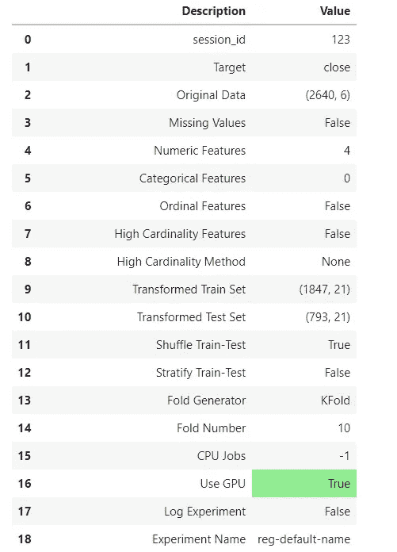

# 使用 Python 和 PyCaret 预测特斯拉股票(TSLA)

> 原文：<https://blog.devgenius.io/predicting-tesla-stocks-tsla-using-python-pycaret-45af9ed47de9?source=collection_archive---------0----------------------->

你有没有想过，如果你可以继续下去，训练你自己的股票预测模型，那将是多么惊人。今天，我们将通过使用 Python 和 PyCaret 创建一个 AutoML(自动机器学习)模型来讨论这个问题。

# 自动化机器学习

自动化机器学习是数据科学家和机器学习工程师使用的一种全新技术，用于优化他们的工作流程，并在几分之一的时间内创建机器学习模型。这使我们能够轻松地构建原型，并专注于开发我们确信会产生更准确结果的模型。


## PyCaret

> PyCaret 是 Python 中一个成熟的 AutoML 框架，帮助我们轻松地在数据集上进行训练，并自动提出最佳预测模型。通过一种聪明的强力策略，它运行数据，并在所有主要的回归模型上训练它，得出最佳拟合(意味着对我们来说具有最佳准确性的模型)。

它使整个工作流程变得如此简单，甚至我的狗都可以创建自己的模型，不用说，它已被证明是全球各地公司的无价框架，他们可以使用它来快速原型化和创建模型。

# 数据准备介绍

为了开始训练我们的 Tesla 股票预测 AI，我们首先需要继续前进，获取数据以访问从开始到现在的 TSLA 股票价格，然后自动选择我们的测试/训练划分，以便训练和优化机器学习模型。

**支持的格式**

为了使数据准备工作变得更加简单和标准化，PyCaret 支持 Pandas d *ataframe* 作为输入法。简而言之，我们可以拥有任何熊猫 *dataframe* 对象，并将其传递给 PyCaret，它将自动为我们执行所有的数据准备转换。

**依赖关系**

为了继续安装用于读取 pandas dataframe 和 PyCaret 的依赖项，请在您的环境中运行以下命令。

我在 [Paperspace](https://console.paperspace.com) 上使用的是 Jupyter 笔记本，你也可以创建一个免费的账户并访问 GPU。

**安装步骤**

```
!pip install pycaret!pip install pandas-datareader
```

一旦我们在启用 GPU 的 [Paperspace](https://console.paperspace.com) 环境中安装了 Pandas 和 PyCaret。然后，我们可以使用下面的代码片段获取任何股票的历史数据。

**获取所需的历史库存**

为了获取任何股票的历史股票数据，您可以使用下面的代码片段获取最新的数据框架，根据您想要遵循的方法获取每天、每月和每年的股票市场开盘价和收盘价。

在这里你可以继续下去，并取代 **TSLA w/ APPL 等。**以便将其纳入您的预测工作流程。


希望您能理解，我们正通过使用`datetime.datetime`标准化方法`%Y-%m-%d`,即 2022–03–09，将日期时间格式标准化为年/月/日格式。

**分离用于训练和预测的数据**

分割数据集以创建所需的测试/训练分割。正如你可以在`dataset.sample`函数中看到的，我们正在进行，并将其分成 90%的训练和 10%的测试比率。这段代码非常适合您可以训练的几乎所有模型，因此无论您在 PyCaret 中的模型是什么，您都可以使用它。


**修复我们 *pandas.dataframe*** 中的问题

在这里，您可以看到，我们将数据保存到名为 output2.csv 的 csv 文件中，然后将 date 作为列名添加到我们的 dates 列中，并将该文件重新上传为 output.csv，然后继续。

**代码片段**

```
data = dataset.sample(frac=0.9)
data_unseen = dataset.drop(data.index)data.reset_index(drop=True, inplace=True)
data_unseen.reset_index(drop=True, inplace=True)print('Data for Modeling: ' + str(data.shape))
print('Unseen Data For Predictions: ' + str(data_unseen.shape))
```

**创建 PyCaret 设置实例以开始训练**


在这里，您可以看到我们正在从 PyCaret 中的回归工作台导入所有模型，然后在 PyCaret 中设置回归的输入数据。

*您可能想知道这将做什么，简单地说，这一步告诉 PyCaret 它需要知道的关于训练模型的所有信息，例如它的形状和我们想要预测的标签(值)，在这种情况下，这是特斯拉股票的收盘价。*

**理解论点**

在`setup( )`函数中，`data`是带有我们训练数据的熊猫数据帧，其中`target`是我们想要预测的值，它可以是日期、数字或任何东西，被 PyCaret 称为*标签(常用词预测输出)*。

在这里，我选择了当天股票的**收盘价**，在我们的 pandas 数据框中，该收盘价位于**收盘价**栏下，我们还可以让它预测特斯拉股票的开盘价。然后，您必须将目标设为`target='open'`,因为在我们的数据框架中，我们的开盘价为开放栏。

如果您使用的是 GPU，它可以极大地提高支持它的模型的性能，您可以选择 *use_gpu=True。*

**智能数据处理**

PyCaret 有一个智能的数据处理方法，可以自动理解传递的值的类型。因此，我们也不需要担心日期的规范化，因为这些日期已经被 pandas dataframe 对象和 PyCaret 规范化并准备好处理。

**输出**

在这里，您可以看到我们模型的信息矩阵，PyCaret 将使用它来智能地改进 train 并自动优化我们的模型，因此命名为 AutoML。



# 最后，有趣的部分是训练我们的模型！

现在，如果你已经做到了这一点，你可以继续下去，看看对于没有机器学习知识的最基本的程序员来说准备数据是多么容易，但你会震惊地发现训练模型和选择最佳模型是多么容易。

```
compare_models()
```

就是这样！这将继续在所有模型上进行训练，并向您显示最适合您训练和调整的模型。


训练有素的模特！这里黄色的显示了每种精度计算方法各自的最佳模型，第一个是最好的，以此类推！

这里，MAE 表示我们可以预测特斯拉股票每天的损失，我们的预测将是-/+ 4 美元。R2 代表我们的准确率为 99.89%。这还是在没有调整模型的情况下！

**创建模型**

现在，我们已经选择了我们的模型，我正在使用标签中显示的 **en** 或 **ElasticNet** 来训练我的机器学习模型进行特斯拉股票预测，因为它支持 GPU 训练，你也可以使用 **gbr(梯度增强回归器)**或其他。

所以，为了训练模型，这又会让你大吃一惊，你运行这行代码。


在这里，黄色的线表示模型在训练集上的预测精度！

但这绝不是完美的，我们需要更进一步，通过调整我们的模型来改进我们的设计，以表现得更好。

**调整模型**

为了继续并调整模型，您可以使用下面的代码行来这样做，


训练过程中，与 10K 迭代数据集，以提高准确性！

这里 n-iter 表示迭代次数，但不要做太多，因为这会花很长时间，确保你的模型支持 PyCaret 中的 GPU 训练，如果你有一个的话。

**调好型号，结果！**


虽然有所改进，但还是稍微好一点，你也可以尝试其他型号！

# **最后，预测特斯拉股票！**

为了继续预测 TSLA 股票，价格，我们将通过一些看不见的数据运行我们的模型，并向你们展示预测的产量。

为了继续并开始使用该模型进行预测，您可以继续并运行下面的代码行来这样做；

*PS:注意到趋势只有一条线做这么复杂的任务！太神奇了！*


在这里，你终于可以看到特斯拉股票预测的行动。在“我的数据集中的最后一个日期”，您可以看到，在 2022 年 2 月 18 日，该股收于 856 美元，我们预测它将收于 859 美元。即使它关闭了，通过几美元，我们仍然可以盈利，它可以很容易地预测何时作出行动或不。

# 结论

我希望这能帮助你理解训练和调整模型是多么容易，用不到 10 行代码就能在效率方面击败所有其他框架。您可以相对轻松地在任何数据集上继续训练自己的机器学习模型。希望你们喜欢！