# 预测 Google play 商店中的最佳应用

> 原文：<https://blog.devgenius.io/predicting-the-best-apps-on-the-google-play-store-8a3e05379c6f?source=collection_archive---------12----------------------->

Google play 商店的另一个机器学习项目(第 1 部分)

**简介**

google play 商店是一个著名的平台，被认为是应用程序和游戏内容的中心。今天，它是世界上最重要的应用市场之一，在数百万人当中相当受欢迎。为了让应用程序在 google play 商店获得成功，开发人员需要单独或集体工作，然而，流行的应用程序通常是根据其安装率、评论数和评级数来评估的。随着应用商店市场的增长，对 Android 应用创作者的需求也在增加。

google play 商店允许用户根据自己的兴趣安装不同类型的应用程序，这些应用程序是用 Android 软件开发工具包创建的，用户可以根据自己的体验对应用程序进行评级和评论。客户可以发现应用程序的类型，例如 google play 商店平台上可用的付费或未付费程序。移动应用市场的突出增长对当今一代和数字技术产生了巨大影响。在创建任何软件时以及在平台上发布之前，软件开发人员面临许多挑战和问题，例如客户对应用程序的接受以及赢得他们的满意。

而数据科学是一个包含“来自数据的一组基本原则和信息”的领域，它有助于解决和预测几个问题。许多问题可以通过使用机器学习技术的数据科学方法来解决。机器学习是一种帮助对一组特定事件或数据进行预测的技术。最大似然算法可以分为有监督学习、无监督学习和强化学习，但是在预测和训练过程中使用了专门的方法。监督学习方法是使用必须由用户标记的标记数据集，创建这些数据集是为了精确地训练或预测结果。然而，无监督学习是分析未标记的数据集，这通常有助于发现数据中隐藏的模式。强化学习决定了主体的行为和对周围环境的解释，并惩罚负面行为，例如游戏能够实现超人的行为表现。

数据科学家使用几种机器学习算法和技术来实现最佳结果。为了有效地获取和分析大量的数据，应用多种不同的算法将有利于从给定的数据集中预测和检验最佳结果。为了预测 google play 商店上的最佳软件，主要因素将被认为是应用评论、安装数量、内容评级、互动元素和应用名称。

此外，本研究旨在建立一个机器学习模型，用于对 google play 商店的最佳应用进行分类。监督机器学习分类将实现预测最佳结果，但是，随着模型的准确性结果，将讨论比较。

**简短的文献综述**

互联网上有各种各样的信息，并且在世界上蓬勃发展，包括文本来源、人们在评论网站上的想法、博客和其他社交媒体平台。基于评估的预测系统通过公众意见使非结构化数据自动转换为结构化信息。许多论文研究了应用程序相关的数据集，主要关注安全问题、客户反应、软件性能及其版本能力。然而，很少有研究基于评论和评级来预测 google play 商店的最佳应用程序。在这篇文献综述中，我们将尽可能多地进行讨论。

Narayan Singh 和其他研究人员已经完成了机器学习情感分析和分类器，以表示消极、积极和中立的观点。他们的研究提取产品可能会受到意见挖掘的影响。电子商务提供了不同于情感分析的各种应用和激发。然而，Shruti Pandey 和 Chhabra 提出了使用软件的问题，例如，有时由于缺乏应用程序开发，客户无法对应用程序提供反馈。论文的主要目的是基于机器学习技术的谷歌应用评论。其中，监督机器学习技术(SMLT)已经用于将情绪分类为积极、消极和中性。Tabianan，Arputharaj 等人代表了软件的价格和下载量之间的相关性和相似性。强调假设“开发人员了解下一个要求苛刻的应用程序是否重要？”根据分析，回答“否”的人数仍然大大低于回答“是”的人数。根据结果，研究预测了需求最高的应用类别，包括游戏、教育、约会和旅行。此外，为了说明性分析，研究人员选择了 tableau，并像决策树在 R studio 中所做的那样对性能进行建模。

其他作者强调开发者不能分析应用程序的个体特征。在研究论文中，通过数据废弃技术删除了 282，231 条用户评论。基于用户评论数据的文本分类实现。其他算法也适用于寻找准确性和最佳模型。他们的研究显示，逻辑回归算法是确定任何谷歌软件评论的语义分析的最佳技术之一。另一方面，Frie，Albury 和其他人讨论了移动应用对人们健康的影响，例如减肥应用。通过对评论和研究的分析，大多数用户认为下载减肥应用程序很重要。该软件为客户提供自我监控、保持目标和动机一致性的服务。而在相关性分析中，更复杂的应用程序被检测到具有更高的评级、下载和更多的反馈。作者还提到了一些关于创建应用程序的声明。例如，开发人员确保客户数据存储准确，以便用户可以长期使用应用程序。其次，应该提供关于目标进度的适当反馈，以便吸引更多用户安装应用程序。

对客户评论和评论进行了大量的情感分析。作者重点介绍了各种技术，并提供了一个在调查和分析报告上创建意见挖掘应用程序的总体图像。然而，为了解决问题，不同的方法使用，统计和数学，但作者提出了一个模型，没有实施。最近的一项研究考察了基于软件特性的应用评级预测。其中很少有实验提到 blackberry world 和 Samsung android 应用程序商店有 89%的评级表明 100%的准确率可以在这些应用程序上完成。用于抽取的自然语言处理技术。结果显示，从开发者对应用程序的需求来看，应用程序的评级是非常可预测的。这些特征被编码成用于推理的数字向量。其他作者推荐使用基于旋转模型的统计分析来确定单词的语义取向。自旋模型中的近似概率用平均场计算。该模型在英语词汇的基础上表现出高度的语义倾向。

在论文中，作者从 play store 中抓取数据，并尝试提取尽可能多的特征以获得成功的结果。作者使用了安装数量和平均用户评级，其中线性模型训练和线性回归算法应用于检查应用程序的成功。该研究得出结论，35%的完整软件在解释中有“照片”一词，而其他软件显示 31%的“分享”一词。总的来说，这项研究有助于让人们了解不同的功能如何在预测最佳应用程序方面发挥重要作用。该研究试图用两种不同的机器学习方法的实施来解释评论评级的不匹配。为了证明这种不匹配，像朴素贝叶斯、决策树、决策表和其他一些技术这样的分类器都专注于深度学习算法。这项调查的结果是可以预测的；android 应用开发者和最终用户都承认应用评级和相关评论应该一致。由于时间限制，三名团队成员分别从 199763 条评论中手动分析了 2000 条评论。数据集中 20%的评分与客户的评论不一致。由于重大差异，项目被放弃，没有得到准确的结果。然而，论文表明，这个问题在应用程序中非常普遍，深度学习技术表现良好，准确率为 87%。Shashank 和 Brahma 在应用机器学习模型时表现出不同的属性。从 Kaggle 收集的数据和一个关于预测的假设。其中，可以预测应用评级，但在回归或分类之前需要一些预处理。然而，数据是复杂的，用户评论仅限于检测受欢迎程度。确定最佳应用是一项挑战。但是作者尽力表现了几个属性之间的说明性关系。Dave 和其他人提出了一种检索产品用户评论极性的方法。解释了比传统的机器学习更有效的方法。此外，开发一种技术来区分积极和消极的客户观点，使用的分类器是天真的。通过这项研究，在审查分类时发现了几个问题，如评级一致性、矛盾和比较、稀疏数据和偏斜分布。作者陈述了机器学习表现不佳背后的原因是这些问题。提取表示使分类不成功的难度更大。最后一条语句建议提高模型的效率，因为即使是一个小的测试用例也要花费几分钟的时间。

在发布新应用程序之前，这项研究是由 Muradul Bashir 和其他作者完成的。在本文中，应用程序的成功是通过其主要功能来预测的，如安装次数评级。讨论了原始评级和预测评级之间的比较，其中使用了不同的机器学习技术，但是只有支持向量机(SVM)算法在给定的数据集上工作良好。主要目标是让开发人员更容易假设他们是否在正确的道路上前进。接下来，作者使用回归模型来解决评论评分不匹配问题。该文件还揭示了公众对新软件更新的不满。John X. Qiu 对应用购买的定量研究表明了应用购买在智能手机应用市场中的关键作用。作者讨论了开发如何影响客户对应用程序的感知的商业策略。apple store 和 google play store 应用程序都被考虑进行分析，论文显示 IAP(应用程序购买)在安装应用程序方面起着至关重要的作用，例如客户愿意支付更多的溢价以更长时间地享受产品。IAPs 是一种长期保持应用价值的方式，但财务成功的优势是负面的，这意味着收入战略的高度破坏性变化。与其他策略相比，整体共享软件模型被认为是获得高收入的最有效策略。

Sanket Mantri 谈到了数据科学的作用，他提到了数据科学当前和未来的希望及其在日常生活中的重要作用。本文描述了帮助人们开发新解决方案的数据科学研究，人们可以通过其技术存储大量数据。接下来，研究表明，为了数据分析的成功，获得数据集中的 p 值是很重要的。像数据提取和网页清理这样的策略不会给出准确的结果。科学家们不断创造新的数据科学技术，帮助企业取得成功。例如，BDS 是由 Russell Newman 等人开发的模型之一。这项技术包括数据集的收集、操作分析和结果比较。

上面提到的所有论文都有助于我们深入了解这个主题，了解什么东西可以使一个项目变得最好和最差，以及什么是以前已经在类似数据集上运行良好的最佳技术。在此文献回顾之后，我们可以对数据集上可用的不同特征进行更好的分析，这使得我们的项目更有组织性。

**方法论**

为什么讨论方法论很重要？

方法论是一种解决问题的方法。使用该方法背后有许多原因，它是多种行为的一种形式，如业务理解、分析识别、数据收集或需求、数据评估、信息理解、建模和部署。要解决业务中的任何问题，需要领域知识，因为对业务的理解可以轻松解决问题。分析理解和数据需求是了解信息的过程，比如正在发生什么以及为什么发生？如何解决问题？对趋势或事件概率的预测，如何基于领域知识表示数据，可以使用什么格式和方法，提出这些问题是数据科学方法论的重要作用。

数据收集及其理解是一个对查询答案进行去神秘化的过程，其中信息已经被收集，或者如果需要添加更多的数据，人们可以在必要时提取。然而，承认信息是获得所有答案的主要关键，可视化技术有助于理解内容、其质量和关于数据集的初始信息。方法论的主要步骤是准备数据、训练模型和评估。举例来说，数据准备任务包括建模阶段所需的数据集的所有程序。更多的是从多种来源中进行清理、提取、添加和组合。

然而，建模过程是重复的，取决于问题的情况，数据科学家使用训练数据集来评估预测或描述性模型。评估步骤验证解决问题的正确方式。它决定了模型的质量，就好像它遇到了确切的问题一样。最后一步是部署，一旦模型准备和开发，它将被实施到实践或测试环境中。部署阶段也要评估模型能够承受外部行为的能力，以及比竞争对手更好的表现。图 3.1 解释了整个步骤。

**图 3.1 数据科学方法论解释**

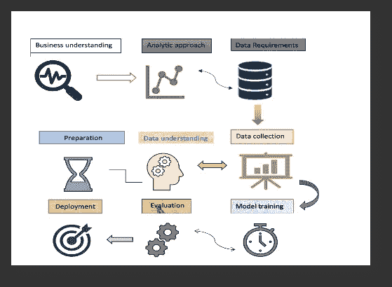

关于数据集和技术:

Google play store 数据集由 android 应用程序信息组成，已从 Kaggle 网站[https://www . ka ggle . com/datasets/gauthamp 10/Google-play store-apps](https://www.kaggle.com/datasets/gauthamp10/google-playstore-apps)收集。数据集大约有 29，999 条记录，其中所有数据变量都是独立变量，除了' Installs '元素。安装视为因变量。然而，为了从数据集获得最佳结果，应变量可以改变，例如，我们可以测试所有自变量，如果需要，可以根据情况改变不同的应变量。有 23 个变量，29，999 个观察值。

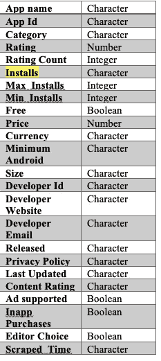

变量表

方法学工作是从在线平台上废弃数据集之后的一个过程。大多数信息都带有垃圾值，在这种情况下，清理任务是必要的。真正需要的是从数据集中清理和丢弃所选的值。为了实现本文的主要目标“预测 Google play store 上的最佳应用程序”,将执行一些技术和任务。可以实现编程平台的组合来执行不同的算法或技术，例如在 R、Python 和 SQL 或 GIS 中。在查看 Google play 商店数据集后，出现了许多挑战，机器学习是解决或预测即将到来的挑衅的最佳结果的方法。ML 是一种在没有明确指示的情况下，通过开发训练算法来发现数据趋势和行为，从而预测未来的技术。在本节中，将讨论以下步骤:

预处理 Google play 商店数据集(Excel)

通过一些数据科学工具(R，Python)实现数据可视化

应用定量研究和 ML 算法(R，Python)

分割成训练和测试信息(R，Python)

提出假设并检查 p 值(如果需要)

区分基于预测的模型，以获得最佳精度结果。

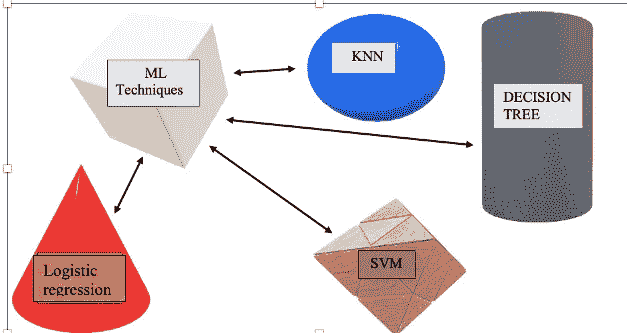

**图 3.2 机器学习技术概述**

对于 Google play 商店数据集，将利用监督学习方法等 ML 技术。即决策树、支持向量机、K-最近邻和逻辑回归，如图 3.2 所示。这描述了最大似然算法的概况。然而，在互联网上有许多机器学习算法可用，但是在文献回顾和先前的研究之后，它指出这些选择的技术在 Google play 商店数据集上表现良好。因此，实现和分析最佳结果，上述算法对于给定的信息将是最有效的。

此外，决策树是非常有效的算法，它可以用于两种类型的数据集，如连续和分类变量。决策树起作用；首先假设整个训练集为根，其他数据元素被认为是连续的或分类的。在创建决策树时，数据集分成更小的子集，其中叶节点表示一个类标签或一个决策。决策节点有两个以上的分支。它可以使用树状决策算法，以及数据挖掘中众所周知的工具。然而，K-最近邻技术(KNN)通常跟踪 n 维空间中与训练数据集的点匹配的所有出现。它是一个比较强大的分类器，它假设相似的事物彼此靠近。换句话说，相似的物体彼此靠近。基本上，K-NN 分析了用距离来度量相似性的思想。要为 K 选择正确的值，多次运行 K-NN 算法对于不同的 K 值非常有用。K-NN 是一种最简单、最容易理解和实现的机器学习技术。

另一方面，支持向量机模型主要用于分类挑战。在这种技术中，每个数据元素被绘制为 n 维空间中的一个点，其中 n 表示数据集具有的特征的数量，接下来，基于找到超平面来生成分类。超平面代表两个阶级的区别。对于高维空间的空白边分离，它非常有效。当维数大于样本数时，SVM 执行有效。选择这种方法是因为它可以产生高准确度的分数，并且在可以利用的各种核函数的数量方面具有很强的适应性。因此，逻辑回归是对类别数据集最好的机器学习技术之一，也称为逻辑模型。使用逻辑回归的主要目的，是作为统计工具被普遍使用和考虑。该算法主要用于研究事件发生的情况。然而，存在三种类型的逻辑回归，其根据数据集的类型而变化，例如二元逻辑回归、多项式逻辑回归和有序逻辑回归。二元逻辑回归适用于二元数据集，即 0 或 1 结果，而多项逻辑回归是二元逻辑回归的简单扩展。它基本上用于根据独立变量预测目标变量的类别成员，独立变量可以是二分的，如二进制或连续的(区间或比例),所选数据集包含类别记录。有序逻辑回归是一种统计分析方法，有助于找出一个有序变量和多个解释变量之间的关系。

因此，已经选择了最佳可能的机器学习算法来在 Google play 商店数据集上执行。所有上述技术都可以用于分类和回归任务。

**讨论及结果:**

用 R 和 PYTHON 进行探索性数据分析

EDA 是数据分析的一个重要部分，它有助于发现变量和研究数据，以检测模式、识别问题、测试假设和验证假设。考虑到统计学，R 是结构化统计模型的最佳选择。然而，为了获得数据集的深度洞察力，数据科学家大多实施统计模型。为了进行探索性的数据分析，本研究使用了 Python 和 R 语言。这两个平台都被认为是数据分析的好平台，但 EDA 通常通过可视化来实现，其中一部分侧重于统计，R 是最好的选择。

因此，R 更多地用于探索部分，所有的机器学习算法都是用 Python 实现的。

**检查缺失值**

google play 商店数据集有超过 23，000，000 条记录，用 R 或 python 来处理这个庞大的数据集是最大的挑战。因此，为了从数据信息中获得最佳结果，数据集记录减少到 29，999 条。

在检查丢失的数据之前。执行目标值和非目标值的选择。然而，安装变量被选为因变量(目标)，其他变量是独立的。

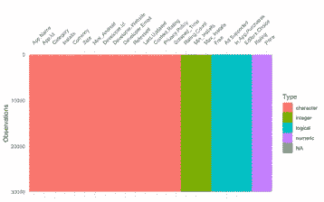

缺少数据可视化

解释:-

根据上面的可视化，已经执行了 visdat 函数来确定数据集中缺失的数据。它提供了在 R 中读取整个数据集的自定义绘图。然而，R 语言有许多函数来检查数据集中缺少的值，但这里实现了 visdat 包。从上图中可以看出，google play 商店数据集不包含任何空值。

**创建因变量箱线图(安装):-**

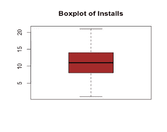

因变量箱线图

解释:-

箱线图将数据分成两个部分，每个部分包含大约 25%的数据。它给出了识别平均值的视觉信息。然而，上面的箱线图是为因变量创建的，它显示数据信息的分布。人们可以观察到，四分位数范围代表中等平均分数。其中，medium 位于盒子的中间，胡须的长度相同。此外，没有检测到异常值，如果比较分布，它显示接近正态分布。

**发布的新应用饼状图:-**

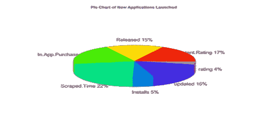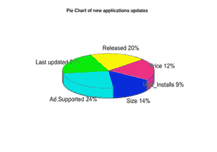

饼图可视化

解释:-

饼图可视化以切片的形式显示不同颜色的值。以上两个数字代表了 google play 商店应用的推出和更新信息。

从上面的分析可以预测，在应用程序启动期间，开发者获得了大量的抓取次数和很高的内容评级。但是，由于 20%的应用程序购买，下载率很低，只有 4%的评级。

然而，其他饼状图显示，开发者最近更新了 google play 商店中 21%的软件，并在市场上推出了其中的 20%。其中应用程序仅用 12%的价格比率支持广告收入。然而，4%的安装增量是在应用程序现代化后实现的。

**两个变量的柱状图和地图可视化**

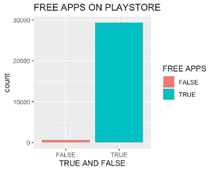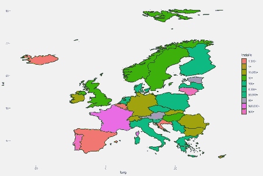

安装和免费应用程序变量的地图和条形图

解释:-

自由变量的条形图描述了软件的订阅状态。据观察，google play 商店中有超过 25，000 个免费应用程序，与免费应用程序相比，付费应用程序很少。

另一方面，地图代表了全世界的应用下载率，不同的颜色描述了安装率。但是，地图可视化有助于按地理位置显示数据。ggplot2 包用于在 r 中执行上面的映射。

这里，执行 map 的重要原因是估计全局的安装数量。举例来说，世界上哪个地区的大多数人都在安装 google play store 应用程序？根据上面的地图，人们可以预测大多数应用程序安装在亚洲和非洲部分。

**评级与最大和最小安装变量的相关性检验:**

**斯皮尔曼秩相关ρ**

数据:Play$Rating 和 Play$Max_Installs

S = 1.8393e+12， **p 值< 2.2e-16**

替代假设:真实ρ不等于 0

样本估计:

希腊字母的第 17 字

**0.5912225**

**斯皮尔曼秩相关ρ**

数据:播放$评级和播放$最小安装

S = 1.8648e+12， **p 值< 2.2e-16**

替代假设:真实ρ不等于 0

样本估计:

希腊字母的第 17 字

**0.5855143**

解释:-

相关性检验用于确认两个或多个变量之间的关系强度，也有助于估计数据元素之间的关联。在本研究中，以评分为变量，对最大和最小安装元素进行了非参数检验。上述分析表明，两个结果都具有小于 0.05 的 p 值，这意味着数据在统计上是显著的，显示了真实的关系。然而，在这种情况下，零假设被拒绝。此外，两者都有 rho 值

**基于价格的安装比例:**

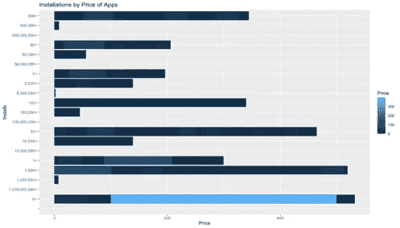

按价格可视化安装

解释:-

上图描述了基于 app 价格的安装比例。似乎价格较高的应用程序最少被客户下载。这表明，价格对人们安装应用程序起着很大的作用。人们可以注意到，比起付费软件，用户通常更喜欢安装平台上的免费软件。根据之前的分析，它观察到免费应用程序更受广告支持，并非所有应用程序都是为了从购买者那里赚钱而创建的，而是将用户引向其他收入来源。上图显示，没有用户愿意在软件上支付超过 100 美元。因此，免费应用在 google play 商店平台上更受欢迎。

**价格会影响人们下载应用吗？**

是的，它确实对消费者行为有很大的影响，人们认为产品的价格越高，售出的数量就越少。人们通常认为下载免费软件比下载付费软件更划算，直到不值得他们花钱为止。

法尔茅斯大学的研究发现，在创建一个付费应用程序时，创作者总是试图确保他们提供的是优秀的内容、优秀的功能和最好的客户服务，以获得用户的好评。然而，论文显示，在没有风险的情况下，与付费软件相比，用户更有可能下载免费软件。免费应用程序允许更快和更有效的下载程序，因为不需要支付信息。正因为如此，如果免费应用程序比付费应用程序多，开发者就会在应用程序商店中经历更激烈的争夺客户注意力的竞争。

**通过内容评级分析安装并预测最高评级应用:**

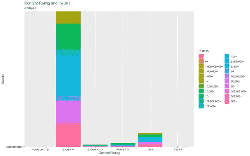

用安装率表示内容分级

解释:-

上图显示了 google play 商店中按内容评级排列的软件安装数量。每种颜色显示六个内容类别下载的安装数量，包括每个人、17 岁以上的成人、10 岁以上的成人、青少年、仅成人和未分级。数据分析观察到，软件的等级评估大部分是由青少年和每个群体完成的。然而，17 岁以上的成熟用户使用的应用程序比其他人少，这是成熟类别内容评级下降的结果。此外，调查显示，客户不会安装任何包含 0 级(未评级)的软件程序，这表明如果内容评级较低，用户不会信任应用程序。因此，内容分级向下载者显示应用程序的质量，并被认为是决定用户是否安装的主要因素。

**两大类顶级应用:**

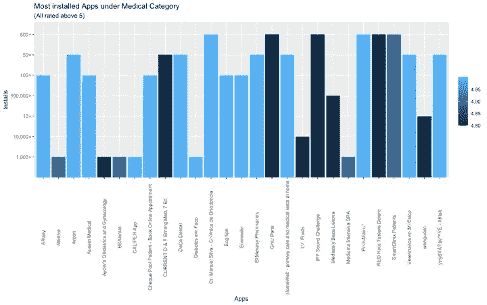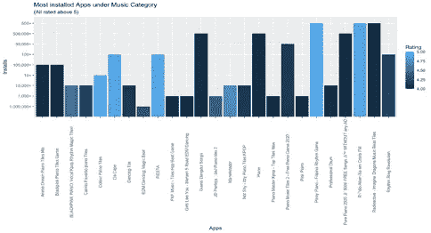

最佳应用柱状图

解释:-

以上两个柱状图说明了 google play 商店医疗和音乐类最佳应用的汇总情况。在医疗类别中，所有应用程序都获得了用户的高度评价，其中最好的是 Manuel silva 博士和 mediately baza，两者都受到了客户的欢迎。

Manuel silva 博士是一款正畸医生应用程序，客户可以在线预约，它具有 5 星级评级，而 baza 立即被认为是医学院学生中最好的应用程序，超过 100，000 人安装了该应用程序。

另一方面，在音乐类别中，没有广告的免费音乐、钢琴和 guess dangdut 歌曲以 4 星评级广受欢迎。然而，其他一些不受欢迎的音乐应用程序注意到了高评级。这些是 cristo FM，pinoy piano 和 color piano tiles，这些软件应用程序得到了 500 多个用户的好评。对两个类别的数据观察显示，一些评分最高的应用并不影响用户安装。客户下载中度评级的应用程序比下载完全星级评级的应用程序多。

**不同变量的相关矩阵:-**

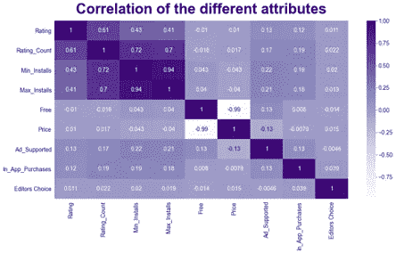

九变量相关矩阵

解释:-

上述相关矩阵表示九个变量之间的相关系数，包括从属元素，如 Rating_Count、Free、Min_Installs、Max_Installs、Ad_Supported、In_App_Purchases、Editors Choice、Rating 和 Price。以下各项之间存在正线性关系和负线性关系

最小安装数和评级数，0.72(中度正相关)

最小安装数和最大安装数，0.94(中度正相关)

评级计数和评级，0.61(中度正相关)

Mix _ Installs 和 Free，0.04(弱正相关)

应用内购买和广告支持，0.13(弱正相关)

In_App_purchases 和编辑选择，0.039(弱正相关)

免费和价格，-0.99(变量之间强负相关)

Rating_Count 和 Max _ Installs 0.7(弱负相关)

价格和广告。支持，-0.13(弱负相关)

然而，许多数据科学家认为，在执行机器学习模型之前，相关矩阵是要实施的主要程序。这样做的重要原因是，它有助于确定最重要的变量以备进一步处理。因为如果一个人可以知道，哪个变量与哪个高度相关，这就给出了一个概念，对于 ML 建模来说，哪个元素更重要。

此外，我已经将机器学习技术应用于给定的数据集，请[点击此处](https://medium.com/@mehraanshita03/machine-learning-technique-on-google-play-store-dataset-python-e02197386f13)获取 ML 方法。