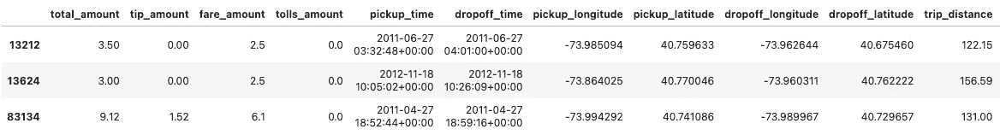

# 用 BigQuery 预测 10 亿次出租车旅行的费用

> 原文：<https://blog.devgenius.io/predicting-the-fare-on-a-billion-taxi-trips-with-bigquery-108135c8697d?source=collection_archive---------5----------------------->

在云端分析和训练 10 亿次出租车旅行的模型需要多长时间和多少成本？大多数旅行发生在什么时候，什么对总票价影响最大，我们可以预测它的准确性如何？

如果你已经达到了你的极限，你也可以在这里阅读文章。没有付费墙。

谷歌的 BigQuery 使得在应用机器学习之前分析数据变得简单明了。我们将使用纽约市公开的[出租车乘车数据集](https://console.cloud.google.com/marketplace/browse?q=nyc%20tlc%20trips&filter=solution-type:dataset)，其中包括 2009 年至 2015 年间超过 11 亿次乘车。由于数据集的大小，我们将首先处理其中的一小部分，以便于可视化和节省查询成本。一旦对数据有了很好的理解，我们将对所有 10 亿个样本训练一个模型。最后，在分析误差之前，我们将使用该模型进行预测。

我将主要在谷歌云平台上托管的 [Jupyter 笔记本环境中工作，以方便每个步骤的文档化。有更多细节的完整笔记本可以在 GitHub](https://cloud.google.com/vertex-ai-workbench) 上[访问。](https://github.com/JakobLS/billion_taxi_trips)

十亿次出租车旅行

**这篇文章比我最初预期的要长，所以这里有一个非常简短的总结:**

> 在完整的数据集上训练一个模型大约需要 21 分钟，总成本不到 20 美元。

# 探索性数据分析

首先使用 BigQuery 查询 10，000 行数据中的 1 行，只保留列的子集。由于数据集包含的记录略多于 10 亿条，因此我们最终会得到 100，000 多行。这个站点将足够小以方便数据可视化，同时足够大以很好地表示整个数据集。查询如下所示:

100k 样本的随机对照查询

我们现在可以计算一些描述性统计数据，以便更好地理解数据。

描述统计学

除其他事项外，我们了解到以下内容

*   我们目前正在处理的子集包括 109，122 次旅行
*   `pickup_longitude`、`pickup_latitude`、`pickup_latitude`、`dropoff_longitude`、`dropoff_latitude`中有值得商榷的高低值。
*   `rate_code`在超过 15，000 次旅行中缺失(92，225 次出现)。
*   有零距离旅行。
*   `fare_amount`和`total_amount`中有负值。
*   平均`total_amount`是 13.2 美元

让我们继续从`pickup_time`列中提取小时、日、月和年，并计算旅行持续时间，以便于进一步分析。

## 分类变量

现在，当我们对数据有了一个总体的了解后，我们可以对每一列进行更深入的挖掘。

列`passenger_count`、`pickup_hour`、`day_of_week`、`pickup_month`和`pickup_year`都是离散的顺序变量(即，14:00 在 15:00 之前，等等，这些值有一个自然的顺序)。然而，就`rate_code`而言，例如，组 1(标准票价)和组 2 (JFK)之间没有这种相互关系；说标准票价先于机场票价是没有意义的。

分类变量及其各自的计数

以上情节的一些要点:

*   超过 80%的行程使用标准费率(1)。②和③分别指 JFK 和纽瓦克。虽然机场数量低得惊人，但我们可以保留它们。由于相同的信息映射在`passenger_count`栏中，因此可以排除价格代码(6)，即团体乘坐。如前所述，该列中缺少 15，000 多行。虽然有几种方法可以解决这个问题，但我们将采用最简单的解决方案，即排除缺少值的行。我们只包括费率代码 1-5。
*   70%的行程只有一名乘客，而有些行程没有乘客。对没有乘客的旅行收费是不合理的，因此我们将排除这些旅行。此外，为了安全起见，我们可以将变量限制为最多 6 名乘客。
*   最繁忙的取件时间是在傍晚时分。然而，它在 11:00 和 22:59 之间相当一致，偶尔在 13 和 16 左右有所下降。最不繁忙的时间是凌晨 03:00 到 05:59。这看起来很合理，也很符合工作时间。
*   一周中最忙的日子是星期四和星期五。但这与周日低点和周五高点之间 10%多一点的差异相当一致。
*   从全年平均来看，五月、七月和十月似乎是最忙的月份，而六月和八月最不忙。这似乎是正确的，即使我们额外按月划分，如下所示。
*   2013 年登记的旅行最多，2015 年最少。然而，如下图所示，2015 年仅包含上半年的旅行(浅绿色条)。

检查辛普森悖论

## 连续变量

接下来，我们将通过使用直方图绘制连续变量来进一步了解它们。

连续变量。既有不合理的负值，也有高值。

其中，我们从上面的图中了解到以下内容:

*   `total_amount`包含负值，相当违反直觉。请参见下文，了解我们是如何做到这一点的。
*   大约 55%的旅行没有小费。给小费时，1 美元和 2 美元的小费金额是最常见的。但是，由于其本质是由骑手做出的决定，我们将排除此列，并将`total_amount`计算为`fare_amount` + `tolls_amount`。
*   `fare_amount`中有负价值。我们排除所有为零或更低的值，并将阈值上限设置为 500 美元。
*   大多数旅行(96%)不包括通行费。我们可以将`tolls_amount`限制在范围【0，25】内。

100 公里以上的长途旅行，但总票价低于 10 美元

*   一些长途旅行(> 100 公里)的总票价不合理地低(＄10)，旅行持续时间值得怀疑。让我们排除那些。我们还可以设置一个限制，只包括 160 公里以下的行程，以确保我们停留在市区内。

有许多零的旅行

*   有许多行程的`trip_duration`为 0 或负值(总共 521 次)，而其他行程花费的时间非常长。有些地区几乎长达 24 小时。我在下面显示超过 3 小时(180 分钟)的旅程。大部分都短于 5 公里。也许他们遇到了交通堵塞，但是否有人会被困近 24 小时还很难说。尽管乘坐出租车花费数小时并非不合理(也许有人乘坐出租车去了芝加哥)，但我们将关注纽约市附近的出行，因此将排除这些数据点。我们将指定可接受的范围为[0，180]。

超过 3 小时的旅行。大多数都短得令人质疑。

## 计算特征和总行程量之间的相关性

为了更好地理解目标变量和数据集中的要素之间的关系，我们将计算各列之间的皮尔逊相关，并将结果显示在相关矩阵中。

皮尔逊相关矩阵。总金额与车费、过路费和小费金额以及旅行距离和持续时间高度相关。

*   我们注意到`total_amount`与`fare_amount`、`trip_distance`、`tolls_amount`、`tip_amount`和`trip_duration`高度相关。这似乎是合理的，因为我们预计时间和距离都更长的旅行会花费更多。
*   与`pickup_year`存在弱相关性。这似乎也相当合理，因为我们可以预计票价会随着时间的推移略有变化。
*   对于大多数其他特征，例如拾取和放下坐标，相关性可以忽略不计。孤立来看，这是合理的。然而，当结合经度和纬度来形成准确的上车和下车地点时，我们预计这会影响总票价。上面的相关矩阵不能计算成对的相关性，我们必须自己设计这种关系。我们将在后面的步骤中完成这项工作。根据出租车公司的定价方式，我们可能还会认为`pickup_hour`会对车费产生更大的影响(例如，高峰时段的车费可能会更贵)。

## 在地图上显示上车地点和下车地点

在纽约市地图上标出上车和下车的位置，以便更好地了解他们的位置。

上车和下车地点。大多数行程都位于市区附近。蓝色和红色阴影区域内的数据点将被排除。

我们可以确认大多数出行都集中在市区内。

然而，在海洋中的装载和/或卸载位置似乎也有错误的数据点。解决这一问题的一种方法是排除位于纬度 40.55 以下，同时位于经度-73.9 以东(蓝色和红色阴影区域)的行程。我们可以将总纬度限制为[40，42]，经度限制为[-76，-73]。这也排除了以前确定的一些不合理的高坐标(拾取坐标高于 1，500)和低坐标(拾取经度在-2，600 和 0)。

# 使用 BigQuery ML 的机器学习

现在最激动人心的部分来了；应用机器学习对总票价进行预测。为了节省开发成本和加快速度，我们将像以前一样处理这个问题；从一个较小的数据集开始实验，一旦获得满意的结果，我们就在整个数据集上训练一个模型。尽管在 BigQuery 中它的大部分可以完全自动化，但我们将一步一步来，因为这样更容易理解。

BigQuery 使得对数据应用各种不同的[模型](https://cloud.google.com/bigquery-ml/docs/introduction#supported_models_in)变得简单。尽管试验几种不同的模型是最佳实践，但出于本文的目的，我们将只使用线性回归。尽管模型之间在数据准备和超参数方面存在差异，但一般步骤是相同的。线性回归训练起来很快，但是需要更多的工作来映射特征之间的相互关系以获得最佳性能。我们将在下面的*车型 4* 中对此进行更深入的探讨。

我们可以将基准设定在 9.8 美元，相当于标准差。然而，我们希望比这更有雄心，将目标定在 3 美元以下。

> 目标:低于 3 美元

## 为机器学习创建数据表，排除无关值

基于我们之前从探索性数据分析中了解到的内容，我们现在可以继续创建一个培训数据表。我们还将确保在`dropoff_time`之前对数据进行排序。通过这种方式，我们可以对未来的旅行做出更接近真实世界的预测。由于交通状况等原因，同一天的旅行也有相互关联的风险。按日期排序可能有助于缓解这种情况。使用我们在 EDA 期间决定的约束创建数据表的查询，同时保持数据大小不变，如下所示:

在继续之前，我们将确认所有值都在可接受的范围内。

确认所有变量都在可接受的范围内。

## 模型 1:只有三个特征

我们将从仅包括三个特征开始:

*   `trip_distance`
*   `rate_code`
*   `passenger_count`

目标变量是总行程量，`total_amount`，而我们将使用`dropoff_time`按顺序分割数据，以保持行程日期排序。BigQuery 自动将数据分为训练集和评估集，因此我们不必担心这一点。

训练第一个模型

我们使用下面的 SQL 来评估训练集上的模型。

下面在测试集上对它进行评估。

在第一次尝试中，我们在测试集上获得了 3.34 的 RMSE，在训练集上获得了 3.26——明显优于 9.8 的基线，非常接近 3.0 的目标！默认情况下，BigQuery 还为我们提供了其他评估指标，以及完全定制它们的可能性。然而，RMSE 的优势在于提供了被测量的误差单位(在这种情况下是美元),因此人眼更容易理解。

## 型号 2–4

型号 2–4 采取了相同的步骤，我们增加了以下功能:

**型号 2** :

*   `trip_distance`
*   `rate_code`
*   `passenger_count`
*   `trip_duration`
*   `pickup_longitude`和`pickup_latitude`
*   `dropoff_longitude`和`dropoff_latitude`

**模型 3** :从`pickup_datetime`列中提取小时、星期、月、年:

*   `pickup_hour`:行程白天接车时间(24 小时)
*   一周中的提货日(周一至周日)
*   `pickup_month`:提货月(1 月—12 月)
*   `pickup_year`:皮卡年份(2009 — 2015)

不像我们用熊猫提取工作日时，一周从周一开始，BigQuery 的`DAYOFWEEK`假设周日是一周的开始。然而，为了这个分析的目的，它不应该有什么不同。

**模式 4** :通过将两个或更多的当前特性组合成新特性来设计新特性。这个想法是为了更好地映射数据中的信息，以便模型可以更好地从中学习。但是，如果不解决这个问题，会带来额外的过度拟合风险和随后的模型性能下降。

*   `euclidean`:计算地图上两点间的最短距离。
*   `day_hour`:工作日和小时的组合，映射一周中的小时。一周中的早晨可能有其他特征，比如比周末的早晨更忙。
*   `month_hour`:月份和小时的组合，为旅行映射一个月中的小时。

这导致我们对模型 4 的以下查询:

额外的特征允许模型更好地拟合数据，在测试集和训练集上产生 2.27 和 2.38 的 RMSE。

**模型 5** :虽然这个模型并没有过度拟合，但是我们可以尝试正则化，看看我们是否可以将测试 RMSE 推得更接近 RMSE 列车。这是一种常见的方法，线性回归有两种主要的方法。L1 和 L2。除了提到 L1 降低(甚至消除)最不重要的特征的重要性，而 L2 缩小所有特征的重要性之外，我们不会进入它们如何工作的细节。这项工作的完成程度是可以调整的，具体取决于每个用例及数据集。

出于这篇博文的目的，我们将关注 L1，并尝试价值观`[0, 0.1, 1, 10]`。并行执行它会加快速度。默认情况下，在超参数调优期间，BigQuery 将数据分割成`80:10:10`训练-评估-测试集，我们不会对此进行干预。在四次运行(四次，因为我们将评估 L1 的四个值)的每一次期间，在评估集上评估之前，在训练集上训练模型。最后，通过在该模型以前没有见过的测试集上测试来计算最终的模型性能。所有这些都是由 BigQuery 自动完成的。

通过将特性包装在`TRANSFORM`子句中，我们确保了在评估和模型部署期间应用了在培训期间采用的相同预处理步骤。应用上面的所有步骤，查询如下所示:

没有正则化(`L1 = 0.0`)产生的最佳模型在测试集上的 RMSE 为 2.33，在评估集上的为 2.22(见下文)。请注意，由于在超参数调整过程中数据被分成三组，而不是之前的两组，即使正则化参数没有改变，结果也不会与模型 4 完全相同。

火车上的 RMSE(2.38)和评价(2.22)集。

测试台上的 RMSE 是 2.33 秒。

# 根据所有数据进行训练

我们已经找到了最佳的超参数集，设计了额外的功能，在小数据集上节省了时间和金钱，现在可以通过在完整的 10 亿次旅行数据集上进行训练来前进。

首先，查询原始数据集以创建一个包含所有行的新表，同时仍然应用与以前相同的约束。

使用完整数据集创建数据表

在开始模型定型之前，请验证这些列都在预期值范围内。

验证数据的查询

这给了我们以下的结果。

所有数据似乎都在预期值范围内

## 最终模型

我们对这些见解非常满意，现在可以继续对全部数据进行模型训练了。该查询看起来与我们在模型 5 中使用的几乎相同，唯一的区别是我们在最底部查询的数据源。因此，我不会再次写出整个查询，而是参考包含所有步骤的 [GitHub repo](https://github.com/JakobLS/billion_taxi_trips/blob/main/NYC-taxi-cabs.ipynb) 。

> 在 10 亿次旅行中训练该模型需要大约 21 分钟，成本不到 20 美元。

在 10 亿次旅行中训练该模型需要大约 21 分钟，成本不到 20 美元。我们最终在训练集上得到 2.36 的最终 RMSE，在测试集上得到 2.59 的最终。这比我们用仅在 100k 个样本上训练的模型 5 所实现的稍差。有一些过度拟合的轻微迹象(因为训练集和测试集之间的 RMSE 差异增加了)，也许在对完整数据集进行训练时添加正则化终究是有益的。除了指出这一点之外，我们在这里不再赘述。

下面是我们训练的所有模型的训练和测试集的总结。考虑到模型 3 和模型 4 仅针对数据的子集进行了训练，因此模型 3 和模型 4 实现了最佳性能。我们注意到最终模型的过度拟合略有增加。

RMSE 模式总结。模型 1-5 在 10 万个样本上训练，而最终模型在 10 亿个样本上训练。

# 模型预测和分析

如果我们不用模型来做预测，模型还有什么意义呢？查询 100 万个样本，并使用模型对其进行预测。此外，通过计算预测和真实标签之间的差异来计算预测误差。该查询如下所示:

查询一百万个样本，并使用模型对它们进行预测。

然后，我们可以显示预测误差分布，并对模型性能进行一些基本分析。

95%的预测误差低于 2.5 美元

95%的预测误差低于 2.5 美元，这符合测试集上的 RMSE。然而，如下图所示，有些预测在两个方向上的误差都超过了 100 美元。

误差非常大的预测(> 100 美元)

让我们仔细看看其中的一些:

*   *行程#27411* (见上图):尽管在 90 公里的距离上花费了近 2 小时(112 分钟)，此行程的总行程金额仍为 0.02 美元。很奇怪。因此，这些数据似乎在某种程度上是不准确的，这可以解释 173 美元的预测误差。
*   *行程#33913* :非常低的总票价(9 美元)，尽管时间和距离都很长。我们可能也有一个数据问题。
*   *行程#10087* :这是误差最大(低估)的行程，为-321 美元。标签上的总金额是 495 美元。这可能是一个准确的数据点，因为它被标记为协商费用(`rate_code` = 5)，这意味着司机和乘客就费用达成了一致。也许骑手很匆忙，也需要沿途做一些差事，并乐意为此支付额外费用。然而，行程距离和持续时间都与行程#27411 非常相似，因此认为它们应该有大致相同的价格是合理的。不是三倍多。该模型当然也沿着这些路线进行估计。

在误差较大的行程中，约有 30%的行程(见下图)采用了协商票价。这与数据集的总体分布形成了鲜明对比，其中协议票价仅占 0.2%。也许协议票价更随机，或者有其他一些特点，使他们更难预测。如果我们想改善极端情况下的模型性能，我们应该找到更好的映射方法。

在误差较大的预测中，协商票价所占比例过高。

因此，有几个数据点，我们可以质疑数据的有效性。也许不是模型做得不好，而是我们至少在一些旅行中经历的大量预测误差背后的糟糕数据。

我们也可以通过在地图上标出的方式来证实大多数旅行都发生在纽约及其周边地区，或者非常接近纽约及其周边地区。这样，我们可以直观地确认它们中的大多数距离较短。

在纽约市的地图上显示高预测误差的行程。

# 摘要

我们使用 BigQuery 加载了一个包含超过 10 亿个样本的数据集，将其可视化并训练了一些模型来预测出租车的总费用。我们从数据集的一小部分开始，以更好地可视化它，并节省查询和模型迭代成本。我们还证实了我们的直觉，即旅行距离和持续时间与总费用高度相关，并表明*在整个数据集上训练模型花费不超过 21 分钟，成本不到 20 美元*。最后，我们还探讨了预测误差及其特征，我们可能会发现额外的数据不准确。

虽然这篇文章的结尾比我最初预期的要长，但是还有很多潜在的途径可以探索。添加其他外部数据源，如天气状况或事件(如节日、假期)可能有助于提高模型性能，因为可以设计更多功能来更好地映射总票价。我们花了很少的时间调整超参数，这可能会增加重要的改进。此外，在更好地解释和理解结果方面，还有进行更多分析的空间。

只使用线性回归，因为它的训练速度相当快。但是有更多的模型可供选择(其中许多可以通过 BigQuery ML 获得)，其中一些可能会减少错误。事实上，我用 XGBoost 在较小的数据集上做了一个快速检查，它将现成的错误减少了大约 25%。然而，它的缺点是训练时间要长 10 倍左右。

## 有反馈或者想联系？

这是我的第一篇媒体文章，所以我非常欢迎任何形式的反馈。请在下方留言或在 [LinkedIn](https://www.linkedin.com/in/jakob-salomonsson-my-profile/) 或我的[个人网站](https://www.jakobsalomonsson.com/)上与我联系。