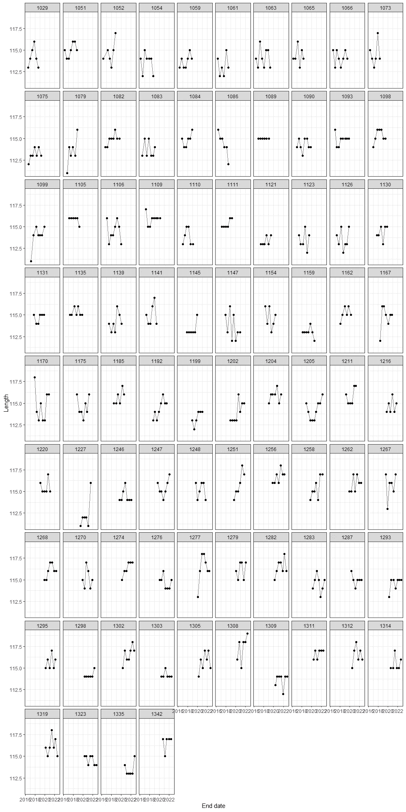
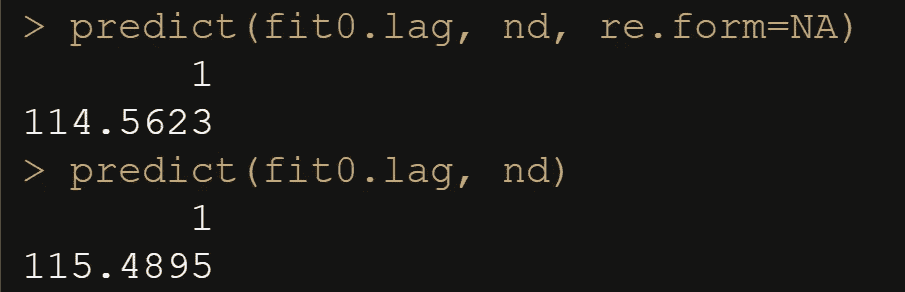
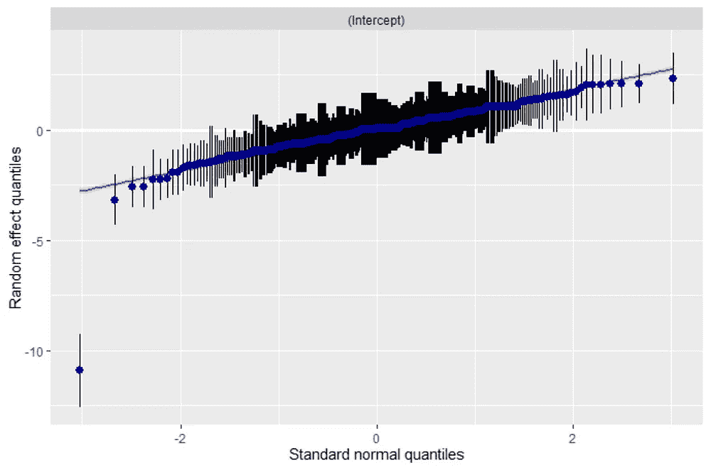
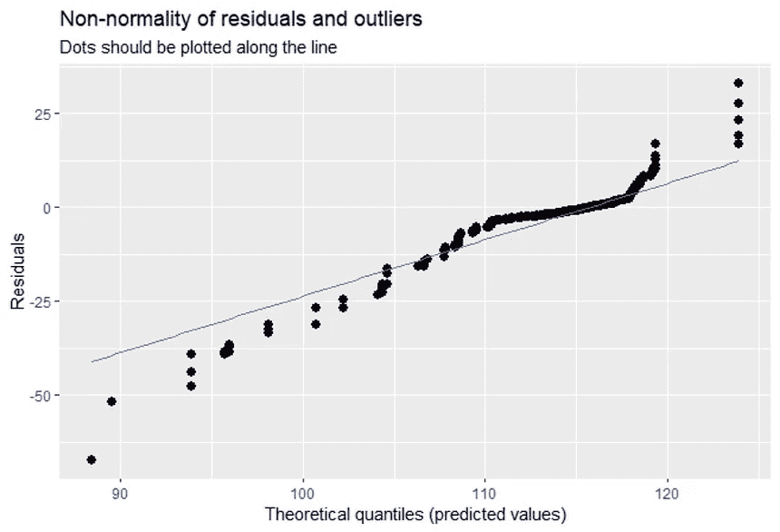

# 预测母猪的妊娠长度

> 原文：<https://blog.devgenius.io/predicting-the-gestation-length-of-sows-301be7947ece?source=collection_archive---------9----------------------->

## 另一个关于模型中数据重要性的故事

在这篇博文中，我将重点介绍另一个模型如何极度依赖数据的例子。从商业角度来看，手头的问题是可靠的，我用来建模的数据质量也很好。但我将向您展示这是如何不够的，这对我来说是一个完美的案例，我喜欢称之为“肮脏数据科学”——一个真实的商业问题，有一个真实的案例，看起来不像互联网上所有可用的培训材料那么漂亮。这是真正的交易。

由于这是商业数据，我不能分享数据，但我会尽我所能展示这个项目。

商业问题是我是否能够预测母猪的怀孕期。知道准确的怀孕时间很重要，因为它允许农民将母猪放在谷仓的正确位置，从而确保小猪和母猪在正确的时间得到正确的照顾。

然而，预测妊娠长度并不容易，因为这种分布是非常重尾的。我马上会给你们看。

让我们开始吧。

```
rm(list = ls())
library(dplyr)
library(ggplot2)
library(tidyr)
library(brms)
library(tidybayes)
library(lubridate)
library(plm)
```

首先，它的数据角力时间。该数据集包括与母猪不同阶段(怀孕、分娩、哺乳等)相关的数据。).每头母猪的繁殖周期及其特征都不一样，而且很可能因为公猪的遗传基因而不同。繁殖周期的质量最有力的评估方法是活产小猪的数量，以及断奶小猪的数量。因此，我的猜测是，试图预测妊娠长度(从受精到分娩)的模型，将不得不包含生殖周期的先前方面。另一种猜测是，这在很大程度上取决于母猪本身。

```
df <- read.csv("~/FR Analytics/Leads/2022/Topigs/Drachtlengte/cycli met gewicht.csv")%>%
  filter(ITE_SOORT=="EERSTE")%>%
  group_by(zeugnr, CCS_NUMMER)%>%
  filter(row_number()==1)%>%
  ungroup()%>%
  distinct()
dim(df)
str(df)
colnames(df)
length(unique(df$zeugnr))
table(df$BER_CODE) 
length(unique(df$BER_CODE))
table(df$ITE_BER_CODE)
length(unique(df$ITE_BER_CODE))
table(df$BER_OMSCHRIJVING)
table(df$ITE_SOORT)
df%>%
  filter(zeugnr==1051)%>%
  arrange(CCS_NUMMER)%>%
  filter(CCS_NUMMER==3)
df$CCS_BEGINDATUM<-as.Date(df$CCS_BEGINDATUM)
df$CCS_EINDDATUM<-as.Date(df$CCS_EINDDATUM)
df$CCS_INSEMINATIEDATUM<-as.Date(df$CCS_INSEMINATIEDATUM)
df$CCS_WORPDATUM<-as.Date(df$CCS_WORPDATUM)
df$CCS_SPEENDATUM<-as.Date(df$CCS_SPEENDATUM)
df$drachtlengte<-as.numeric(df$CCS_WORPDATUM-df$CCS_INSEMINATIEDATUM)
df$lactatielengte<-as.numeric(df$CCS_SPEENDATUM-df$CCS_WORPDATUM)
df$reproductiecyclus<-as.numeric(df$CCS_EINDDATUM-df$CCS_BEGINDATUM)
str(df)
```


该数据集以荷兰语显示了繁殖周期的各个方面，以及出生(存活)的小猪数量。

让我们来看看 1015 号母猪和她已经经历的各种妊娠周期。我对妊娠时间、哺乳时间、繁殖时间和分娩时母猪的体重特别感兴趣。

```
df%>%
  filter(zeugnr==1015)%>%
  group_by(CCS_NUMMER)%>%
  arrange(CCS_NUMMER)%>%
  dplyr::select(drachtlengte,
                lactatielengte, 
                reproductiecyclus, 
                gewicht)
```


您可以看到，我们在第 4 到第 9 周期有这个特定 sow 的数据。对于每个周期，您可以看到妊娠期长度、哺乳期长度、繁殖周期和体重。

我认为一个相关的预测因素是母猪的周期数。每头母猪和母猪之间的繁殖周期有很大的差异，而且不是每头母猪都能经历相同数量的周期。

为了更好地创建数据，我将怀孕期限制为 119 天。此外，你会看到，我们不是真的在计算经历的周期数，而是我们有数据的周期数。实际上周期本身将在以后发挥作用，但我怀疑对母猪更容易预测，因为我有更多的历史数据。

```
df<-df%>%
  dplyr::filter(drachtlengte<120)
totalcycles<-df%>%
  group_by(zeugnr)%>%
  count()
table(totalcycles$n)
df<-merge(df,totalcycles, id="zeugnr")
table(df$n)
dim(df)
```


我们有每头母猪多达九个周期的数据。

让我们开始绘制一些数据。下面您可以看到我每个 sow 的数据量。

```
df%>%ggplot(.)+
  geom_bar(aes(x=zeugnr))+
  theme_bw()
```


让我们也来看看孕期长度的分布。

```
df%>%ggplot(., aes(x=drachtlengte))+
  geom_histogram(aes(y = ..density..),
                 colour = 1, fill = "white", bins=50)+
  geom_density(lwd = 1,
               linetype = 2,
               colour = 2)+
  xlim(90,150)
```


如你所见，非常重的尾巴。因为这些尾巴会打乱分析，我把最长时间限制在 119 天左右。不完美，但是现在，它会更有助于我稳定模型。

```
df%>%ggplot(.)+
  geom_bar(aes(x=reproductiecyclus))+
  theme_bw()
df%>%ggplot(.)+
  geom_bar(aes(x=lactatielengte))+
  theme_bw()
```


你还可以看到繁殖周期(左)和泌乳周期(右)的分布。复制周期可能有点长，但我们还是要用它。泌乳周期具有很好的厚尾分布。

让我们看看每个周期的情况。

```
df%>%ggplot(.)+
  geom_density(aes(x=drachtlengte, 
                   fill=factor(CCS_NUMMER)), 
                   alpha=0.5)+
  theme_bw()+
  theme(legend.position = "none")
```


怀孕的长度现在是倾斜的，因为我只切掉了正确的部分。每个周期都有差异，但老实说，一个周期内的变化更多。

```
df%>%ggplot(.)+
  geom_boxplot(aes(y=drachtlengte, 
                   x=factor(CCS_NUMMER)), 
               alpha=0.5)+
  theme_bw()+
  theme(legend.position = "none")
```


每个周期的妊娠长度。在群体中相当稳定。

```
df%>%filter(n>5)%>%
  ggplot(.,
         aes(group=factor(zeugnr), 
             x=CCS_EINDDATUM, 
             y=drachtlengte))+
  geom_point()+
  geom_line(alpha=0.5)+
  theme_bw()+
  facet_wrap(~zeugnr)+
  labs(x="End date", 
       y="Length")
```



几头母猪的妊娠长度在同一头母猪中表现出相当大的差异。因此，如果母猪本身不能解释至少 40-60%的变异，我会感到非常惊讶。

让我们看看我们拥有的特定 sow (1051)的所有数据。

```
df%>%
  filter(zeugnr==1051)%>%
  arrange(CCS_NUMMER)
```


在这里，我们可以看到所有繁殖周期的日期，每个周期，以及仔猪出生、死亡和死产的产量。

让我们更深入地看看重量。

```
ggplot(df, aes(x=gewicht, fill=factor(CCS_NUMMER)))+
  geom_density(alpha=0.5)+
  theme_bw()ggplot(df, aes(y=gewicht, x=factor(CCS_NUMMER)))+
  geom_boxplot(alpha=0.5)+
  theme_bw()
```


左侧和右侧的图显示了每次循环的重量，可以清楚地看到，随着循环次数的增加，重量越来越轻。

```
df%>%ggplot(.,
            aes(group=zeugnr, 
                x=factor(CCS_NUMMER), 
                y=drachtlengte))+
  geom_point()+
  geom_line(alpha=0.5)+
  theme_bw()+
  labs(x="Cycle", 
       y="Length")df%>%ggplot(.,
            aes(group=zeugnr, 
                x=factor(CCS_NUMMER), 
                y=reproductiecyclus))+
  geom_point()+
  geom_line(alpha=0.5)+
  theme_bw()+
  labs(x="Cycle", 
       y="Length")
```


在这里你可以看到每头母猪和每个周期的妊娠期长度(左)和繁殖期长度(右)。特别是繁殖周期显示出相当大的变化。

```
df%>%ggplot(.,
            aes(group=zeugnr, 
                x=factor(CCS_NUMMER), 
                y=lactatielengte))+
  geom_point()+
  geom_line(alpha=0.5)+
  theme_bw()+
  labs(x="Cycle", 
       y="Length")df%>%ggplot(.)+
  geom_tile(aes(y=factor(zeugnr), 
                x=factor(CCS_NUMMER), 
                fill=drachtlengte))+
  theme_bw()+
  theme(axis.title.y=element_blank(),
        axis.text.y=element_blank(),
        axis.ticks.y=element_blank())+
  scale_fill_viridis_c(option="magma")+
  labs(x="Cycle", 
       fill="Length")df%>%ggplot(.)+
  geom_tile(aes(y=factor(zeugnr), 
                x=factor(CCS_NUMMER), 
                fill=reproductiecyclus))+
  theme_bw()+
  theme(axis.title.y=element_blank(),
        axis.text.y=element_blank(),
        axis.ticks.y=element_blank())+
  scale_fill_viridis_c(option="magma")+
  labs(x="Cycle", 
       fill="Length")
```


在这里，我试图通过各种方法来绘制妊娠期长度。肯定有变异，但我也缺乏一些母猪的周期信息。这无助于创造一个完整的历史画面，但就像这篇博文的副标题所说的:这将是关于不完美数据的建模。情况总是如此。

```
g1<-df%>%ggplot(.)+
  geom_bar(aes(x=factor(CCS_NUMMER)))+
  theme_bw()
g2<-df%>%ggplot(.)+
  geom_bar(aes(x=factor(WRP_LEVEND_GEBOREN)))+
  theme_bw()
g3<-df%>%ggplot(.)+
  geom_bar(aes(x=factor(WRP_LEVEND_GEBOREN)))+
  theme_bw()
g4<-df%>%ggplot(.)+
  geom_bar(aes(x=factor(WRP_LEVEND_GEBOREN), fill="alive"), alpha=0.5)+
  geom_bar(aes(x=factor(WRP_GEREGISTREERDE_BIGGEN), fill="registered"), alpha=0.5)+
  theme_bw()
g5<-df%>%ggplot(.)+
  geom_bar(aes(x=factor(WRP_DOOD_GEBOREN)))+
  theme_bw()
g6<-df%>%ggplot(.)+
  geom_bar(aes(x=factor(WRP_MUMMIES)))+
  theme_bw()
gridExtra::grid.arrange(g1,g2,g3,g4,g5,g6,ncol=2)
```


还有几幅图显示了活产、死产或木乃伊化的小猪数量。

```
ggplot(df, 
       aes(x=reproductiecyclus, 
           y=drachtlengte,
           col=factor(CCS_NUMMER)))+
  geom_point()+
  theme_bw()+
  ylim(80,155)+
  xlim(100,250)
```


在这里，我试图将每个周期的妊娠长度(y 轴)与生殖长度(x 轴)联系起来。这并不容易，我根本看不出有什么规律。

让我们移动到建模部分。第一个模型是最简单的，我试图将妊娠长度建模为周期本身和母猪的函数。低于线性混合模型的输出和预测能力。

```
fit0<-lme4::lmer(drachtlengte~
                   CCS_NUMMER+
                   (1 | zeugnr), 
                 data=df)
predplot<-df%>%
  mutate(predfit = round(fitted(fit0)))%>%
  dplyr::select(drachtlengte, predfit)%>%
  drop_na()%>%
  group_by(drachtlengte, predfit)%>%
  count()%>%
  dplyr::filter(predfit<=drachtlengte)
ggplot(predplot, aes(x=factor(drachtlengte),
                y=factor(predfit),
                fill=factor(n)))+
  geom_tile()+
  geom_text(aes(label=n)) +
  scale_fill_viridis_d(option = "mako", begin = 0.2, end = 1)+
  theme_bw()+
  labs(x="Drachtlengte", 
       y="Voorspelling",
       title = paste("Percentage Correct or Less than Observed = ", 
                     round(sum(predplot$n)/(length(fitted(fit0))),2),"%"))+
  theme(legend.position = "none")
```


我在这里显示的是我准确预测妊娠长度的次数，或者我预测的妊娠长度小于实际发生的妊娠长度的次数。在这里，准确度数字是这些时间的累积除以所有的预测。对于一个农民来说，如果母猪太早被转移到苗圃还不算太坏，但如果她转移得太晚就非常糟糕了。

上面的模型非常简单，也不会增加多少价值，因为来自模型的预测将要求我只填写周期数和母猪数。但是我们也有以前周期各方面的数据。所以我想做的是在之前的基础上建立一个模型。

首先，我需要创建一个包含滞后值的新数据集，因此，基于每个特定的 sow 和每个特定的周期，我知道前一个周期发生了什么。我怀疑前一个周期是任何下一个周期的最佳预测器。

```
data_mod <- df %>%
  arrange(zeugnr, CCS_NUMMER)%>%
  group_by(zeugnr) %>%
  dplyr::mutate(dracht_lag  = Hmisc::Lag(drachtlengte, -1),
                dracht_lag2 = Hmisc::Lag(drachtlengte, -2),
                lact_lag    = Hmisc::Lag(lactatielengte, -1),
                repro_lag   = Hmisc::Lag(reproductiecyclus, -1),
                weight_lag  = Hmisc::Lag(gewicht, -1),
                alive_lag   = Hmisc::Lag(WRP_LEVEND_GEBOREN, -1),
                month = month(CCS_WORPDATUM))%>%
  dplyr::select(CCS_NUMMER,
                drachtlengte,
                dracht_lag,
                dracht_lag2,
                lact_lag,
                repro_lag, 
                weight_lag,
                alive_lag,
                BER_OMSCHRIJVING, 
                month, 
                n)
data_mod
```


包含每个 sow 每个周期的滞后值的数据集。

现在，我们可以建立一个更复杂的模型，它包括线性混合模型中滞后值和每个母猪周期数之间的相互作用。

```
fit0.lag<-lme4::lmer(drachtlengte~
                       factor(CCS_NUMMER)+
                       factor(month)+
                       dracht_lag+
                       CCS_NUMMER:dracht_lag+
                       lact_lag+
                       CCS_NUMMER:lact_lag+
                       repro_lag+
                       CCS_NUMMER:repro_lag+
                       weight_lag+
                       CCS_NUMMER:weight_lag+
                       alive_lag+
                       CCS_NUMMER:alive_lag+
                       BER_OMSCHRIJVING+
                   (1 | zeugnr), 
                 data=data_mod)
summary(fit0.lag)
plot(fit0.lag)
sjPlot::plot_model(fit0.lag)
sjPlot::plot_model(fit0.lag, type="diag")
```


对于我们当中的聪明人来说，你现在可以清楚地看到(右图),我正在使用正态分布来模拟一个明显的分类结果。然而，妊娠长度的分布并不真正符合任何特定的离散数据，也许除了贝塔分布。泊松和负二项式肯定会遇到问题。

让我们看看这个模型是如何预测的。

```
predplot<-broom.mixed::augment(fit0.lag)%>%
  mutate(predfit = round(.fitted))%>%
  dplyr::select(drachtlengte, predfit)%>%
  group_by(drachtlengte, predfit)%>%
  count()%>%
  dplyr::filter(predfit<=drachtlengte)ggplot(predplot, aes(x=factor(drachtlengte),
                y=factor(predfit),
                fill=factor(n)))+
  geom_tile()+
  geom_text(aes(label=n)) +
  scale_fill_viridis_d(option = "mako", begin = 0.2, end = 1)+
  theme_bw()+
  labs(x="Drachtlengte", 
       y="Voorspelling",
       title = paste("Percentage Correct or Less than Observed = ",              round(sum(predplot$n)/(length(fitted(fit0.lag))),2),"%"))+
  theme(legend.position = "none")
```


几乎相同的精度数字，但是，预测比以前的模型更接近实际值。

让我们做一些额外的扩充。例如，让我们一致地排列周期和月份。最后，正如你将看到的，它什么也没有改变。我猜模型从一开始就知道如何处理这些因素。

```
data_mod<-df %>%
  arrange(zeugnr, CCS_NUMMER)%>%
  group_by(zeugnr) %>%
  dplyr::mutate(dracht_lag  = Hmisc::Lag(drachtlengte, -1),
                dracht_lag2 = Hmisc::Lag(drachtlengte, -2),
                lact_lag    = Hmisc::Lag(lactatielengte, -1),
                repro_lag   = Hmisc::Lag(reproductiecyclus, -1),
                weight_lag  = Hmisc::Lag(gewicht, -1),
                alive_lag   = Hmisc::Lag(WRP_LEVEND_GEBOREN, -1),
                month       = factor(month(CCS_WORPDATUM),
levels  = c(1,2,3,4,5,6,7,8,9,10,11,12), 
ordered = is.ordered(CCS_WORPDATUM)), 
                CCS_NUMMER  = factor(CCS_NUMMER, 
levels = c(1,2,3,4,5,6,7,8,9,10), 
ordered = is.ordered(CCS_NUMMER)))%>%
  dplyr::select(CCS_NUMMER,
                drachtlengte,
                dracht_lag,
                dracht_lag2,
                lact_lag,
                repro_lag, 
                weight_lag,
                alive_lag,
                BER_OMSCHRIJVING, 
                month, 
                n)%>%
  dplyr::filter(n>=1 & n<9)%>%
  dplyr::select(-n)
str(data_mod)
data_mod$CCS_NUMMER
data_mod$monthfit0.lag<-lme4::lmer(drachtlengte~
               CCS_NUMMER+
               month+
               dracht_lag+
               CCS_NUMMER:dracht_lag+
               lact_lag+
               CCS_NUMMER:lact_lag+
               repro_lag+
               CCS_NUMMER:repro_lag+
               weight_lag+
               CCS_NUMMER:weight_lag+
               alive_lag+
               CCS_NUMMER:alive_lag+
               BER_OMSCHRIJVING+
               (1 | zeugnr), 
             data=data_mod)
predplot<-broom.mixed::augment(fit0.lag)%>%
  mutate(predfit = round(.fitted))%>%
  dplyr::select(drachtlengte, predfit)%>%
  group_by(drachtlengte, predfit)%>%
  count()%>%
  dplyr::filter(predfit<=drachtlengte)
ggplot(predplot, aes(x=factor(drachtlengte),
                     y=factor(predfit),
                     fill=factor(n)))+
  geom_tile()+
  geom_text(aes(label=n)) +
  scale_fill_viridis_d(option = "mako", begin = 0.2, end = 1)+
  theme_bw()+
  labs(x="Drachtlengte", 
       y="Voorspelling",
       title = paste("Percentage Correct or Less than Observed = ", 
                     round(sum(predplot$n)/(length(fitted(fit0.lag))),2),"%"))+
  theme(legend.position = "none")
```


让我们使用这个模型，创建一个新的数据集，并从该模型中获得一个预测。由于它是一个线性混合模型，我可以得到一个只包括固定效应的预测，或者也可以加上随机播种效应。

```
nd<-expand.grid(CCS_NUMMER=5, 
                month = 12,
                dracht_lag = 116,
                lact_lag = 20,
                repro_lag = 152,
                weight_lag = 126,
                alive_lag = 15, 
                BER_OMSCHRIJVING ="NULL", 
                zeugnr=1393)
nd$CCS_NUMMER<-factor(nd$CCS_NUMMER)
nd$month<-factor(nd$month)
predict(fit0.lag, nd, re.form=NA)
predict(fit0.lag, nd)
```



如你所见，预测确实依赖于随机效应。这是应该的。仅仅使用固定效应意味着预测不是特定的。

到目前为止，我使用整个数据集来建立一个模型。让我们使用训练和测试来更好地了解模型的准确性。

```
trainIndex <- caret::createDataPartition(data_mod$zeugnr, 
                                         p = .6, 
                                         list = FALSE, 
                                         times = 1)
data_modTrain <- data_mod[ trainIndex,];dim(data_modTrain)
data_modTest  <- data_mod[-trainIndex,];dim(data_modTest)
table(data_modTrain$CCS_NUMMER)
table(data_modTest$CCS_NUMMER)ggplot()+
  geom_boxplot(data=data_modTrain, 
               aes(x=CCS_NUMMER, 
                   y=drachtlengte, 
                   fill="Train"), alpha=0.5) + 
  geom_boxplot(data=data_modTest, 
               aes(x=CCS_NUMMER, 
                   y=drachtlengte,
                   fill="Test"), 
               alpha=0.5)+ 
  theme_bw()
```


检查数据的训练和测试部分的周期是否不同——我不希望看到严重的类别不平衡。

```
ggplot()+
  geom_boxplot(data=data_modTrain, 
               aes(x=CCS_NUMMER, 
                   y=drachtlengte, 
                   fill="Train"), alpha=0.5) + 
  geom_boxplot(data=data_modTest, 
               aes(x=CCS_NUMMER, 
                   y=drachtlengte,
                   fill="Test"), 
               alpha=0.5)+ 
  theme_bw()
```


没有真正的阶级不平衡。

让我们在训练集上建立数据模型，并应用于测试集。

```
fit0.lag<-lme4::lmer(drachtlengte~ -1+
                       CCS_NUMMER+
                       month+
                       dracht_lag+
                       CCS_NUMMER:dracht_lag+
                       lact_lag+
                       CCS_NUMMER:lact_lag+
                       repro_lag+
                       CCS_NUMMER:repro_lag+
                       weight_lag+
                       CCS_NUMMER:weight_lag+
                       alive_lag+
                       CCS_NUMMER:alive_lag+
                       BER_OMSCHRIJVING+
                       (1 | zeugnr), 
                     data=data_modTrain)
data_modTest<-data_modTest%>%dplyr::filter(!CCS_NUMMER == 9)
predfit<-predict(fit0.lag, data_modTest,re.form=NA)
predplot<-data_modTest%>%
  ungroup()%>%
  dplyr::mutate(predfit = round(predict(fit0.lag, data_modTest,re.form=NA)))%>%
  dplyr::select(drachtlengte, predfit)%>%
  drop_na()%>%
  group_by(drachtlengte, predfit)%>%
  count()%>%
  dplyr::filter(predfit<=drachtlengte)
ggplot(predplot, aes(x=factor(drachtlengte),
                     y=factor(predfit),
                     fill=factor(n)))+
  geom_tile()+
  geom_text(aes(label=n)) +
  scale_fill_viridis_d(option = "mako", begin = 0.2, end = 1)+
  theme_bw()+
  labs(x="Drachtlengte", 
       y="Voorspelling",
       title = paste("Percentage Correct or Less than Observed = ", 
                     round(sum(predplot$n)/(length(na.omit(predfit))),2),"%"))+
  theme(legend.position = "none")
```


正如预料的那样，它的精确度要低得多。

现在，训练和测试是检查模型准确性的好方法，但最好的方法是使用外部数据。幸运的是，我有这样的[数据](https://medium.com/mlearning-ai/predicting-the-number-of-piglets-born-to-a-sow-6d6b43630772)，我现在就可以使用它。

让我们加载它，使它与训练的模型兼容。

```
external <- readr::read_csv("C:/Users/marcj/xxxxxxxxxx.csv")
colnames(external)
external$CCS_INSEMINATIEDATUM<-as.Date(external$mating_date,format = "%m/%d/%Y")
external$CCS_WORPDATUM<-as.Date(external$farrowing_date,format = "%m/%d/%Y")
external$CCS_SPEENDATUM<-as.Date(external$weaning_date,format = "%m/%d/%Y")
external$CCS_NUMMER<-external$cycle
external$WRP_LEVEND_GEBOREN<-external$born_alive
external$drachtlengte<-as.numeric(external$CCS_WORPDATUM-external$CCS_INSEMINATIEDATUM)
external$lactatielengte<-as.numeric(external$CCS_SPEENDATUM-external$CCS_WORPDATUM)
external$reproductiecyclus<-as.numeric(external$CCS_SPEENDATUM-external$CCS_INSEMINATIEDATUM)
external$zeugnr<-external$sow_number
totalcycles<-external%>%
  group_by(zeugnr)%>%
  count()
table(totalcycles$n)
external<-merge(external,totalcycles, id="zeugnr")
table(external$n)
dim(external)
```


正如您所看到的，这个模型比以前的数据源有更多的周期。新数据也大得多。

问题是，我训练我的模型处理周期，直到周期 9。这意味着我不能使用第 9 周期及以后的数据来测试我的模型。这是一个相当大的限制，但是如果我想使用外部数据检查和测试我的模型，我必须使数据与模型兼容。

```
nonWantedLevels<-c(9,10,11,12,13,14,15,16)
external_mod<-external %>%
  arrange(zeugnr, CCS_NUMMER)%>%
  group_by(zeugnr) %>%
  dplyr::mutate(dracht_lag  = Hmisc::Lag(drachtlengte, -1),
                dracht_lag2 = Hmisc::Lag(drachtlengte, -2),
                lact_lag    = Hmisc::Lag(lactatielengte, -1),
                repro_lag   = Hmisc::Lag(reproductiecyclus, -1),
                alive_lag   = Hmisc::Lag(WRP_LEVEND_GEBOREN, -1),
                month = factor(month(CCS_WORPDATUM),
                               levels  = c(1,2,3,4,5,6,7,8,9,10,11,12), 
                               ordered = is.ordered(CCS_WORPDATUM)), 
                CCS_NUMMER = factor(CCS_NUMMER, 
                                    levels = c(1,2,3,4,5,6,7,8,9,10,11,12,13,14,15,16), 
                                    ordered = is.ordered(CCS_NUMMER)))%>%
  dplyr::select(CCS_NUMMER,
                drachtlengte,
                dracht_lag,
                dracht_lag2,
                lact_lag,
                repro_lag, 
                alive_lag,
                month, 
                n)%>%
  dplyr::filter(n>=1 & n<9)%>%
  dplyr::filter(!(CCS_NUMMER) %in% nonWantedLevels)%>%
  dplyr::select(-n)
dim(external_mod)
droplevels(external_mod$CCS_NUMMER)
table(external_mod$CCS_NUMMER)
table(data_mod$CCS_NUMMER)
external_mod$CCS_NUMMER<-droplevels(external_mod$CCS_NUMMER)
data_mod$CCS_NUMMER<-droplevels(data_mod$CCS_NUMMER)
table(data_mod$CCS_NUMMER)
table(external_mod$CCS_NUMMER)
dim(external_mod)
```


在这里，您可以看到我为旧数据( **data_mod** )和新数据( **external_mod** )创建了相同的分类。

现在，我们可以在整个先前的数据集(不仅仅是训练部分)上训练模型，然后用外部数据集测试它。

```
fit<-lme4::lmer(drachtlengte~ -1+
                       CCS_NUMMER+
                       month+
                       dracht_lag+
                       CCS_NUMMER:dracht_lag+
                       lact_lag+
                       CCS_NUMMER:lact_lag+
                       repro_lag+
                       CCS_NUMMER:repro_lag+
                       alive_lag+
                       CCS_NUMMER:alive_lag+
                       (1 | zeugnr), 
                     data=data_mod)
predfit<-predict(fit, external_mod, re.form=NA)
predplot<-external_mod%>%
  ungroup()%>%
  dplyr::mutate(predfit = round(predict(fit, external_mod,re.form=NA)))%>%
  dplyr::select(drachtlengte, predfit)%>%
  drop_na()%>%
  group_by(drachtlengte, predfit)%>%
  count()%>%
  dplyr::filter(predfit<=drachtlengte)
ggplot(predplot, aes(x=factor(drachtlengte),
                     y=factor(predfit),
                     fill=factor(n)))+
  geom_tile()+
  geom_text(aes(label=n)) +
  scale_fill_viridis_d(option = "mako", begin = 0.2, end = 1)+
  theme_bw()+
  labs(x="Drachtlengte", 
       y="Voorspelling",
       title = paste("Percentage Correct or Less than Observed = ", 
                     round(sum(predplot$n)/(length(na.omit(predfit))),2),"%"))+
  theme(legend.position = "none")
```


准确性提高了，但传播也增加了。正如你所看到的，我的模型(y 轴)的预测集中在 115 天左右，即使真正的怀孕时间(x 轴)长达 12 天。

上面显示了一个可用的，但肯定不是完美的模型。最大的问题是，我有很多周期的数据，但没有一个周期内的真实数据。每次我想预测一个周期的妊娠长度，我只能使用前一个周期的数据，这发生在(平均)150 天前。如果我能添加我试图预测的周期内发生的标记，该模型的预测能力将大大提高。不幸的是，到目前为止，还没有这方面的数据。这正是现实案例研究中发生的情况。

最后但同样重要的是，让我们检查 sow 部分的两个数据集的类内相关性。我最初的猜测是，数据中大约 40-60%的变异可归因于母猪之间的变异。

```
data_mod<-df %>%
  arrange(zeugnr, CCS_NUMMER)%>%
  group_by(zeugnr) %>%
  dplyr::select(CCS_NUMMER,
                drachtlengte)
dim(data_mod)
fitlmer_datamod<-data_mod%>%
  drop_na()%>%
  lme4::lmer(drachtlengte ~ 1 + (1|zeugnr), data=.)
summary(fitlmer_datamod)
performance::icc(fitlmer_datamod)
sjPlot::plot_model(fitlmer_datamod, type="diag")
```


这是训练数据集中的 50%。



```
external_mod<-external %>%
  arrange(zeugnr, CCS_NUMMER)%>%
  group_by(zeugnr) %>%
  dplyr::select(CCS_NUMMER,
                drachtlengte)
dim(external_mod)
fitlmer_externalmod<-external_mod%>%
  drop_na()%>%
  lme4::lmer(drachtlengte ~ 1 + (1|zeugnr), data=.)
summary(fitlmer_externalmod)
performance::icc(fitlmer_externalmod)
sjPlot::plot_model(fitlmer_externalmod, type="diag")
```


40%在外部数据集中。



现在，在我制作上述模型之前，我犯了一个新手的错误，我想与你分享。我在数据集上应用了随机森林模型，该模型没有考虑预测因子的自然顺序。这意味着我不能根据同一个周期的生殖长度来预测妊娠长度。当我想做一个新的预测时，我没有这些数据。

但是，在模特界，我想做的一切我都能做到。所以我做了一个非常好的模型，它在现实生活中没有任何适用性。

```
library(doParallel)
cl <- makePSOCKcluster(5)
registerDoParallel(cl)
df_select<-df%>%dplyr::select(drachtlengte,
                                reproductiecyclus,
                                gewicht,
                                lactatielengte,
                                BER_OMSCHRIJVING,
                                WRP_LEVEND_GEBOREN,
                                WRP_DOOD_GEBOREN,
                                CCS_NUMMER,
                                zeugnr)%>%
  drop_na()folds <- caret::groupKFold(df_select$CCS_NUMMER, k = 10) 
fitControl <- caret::trainControl(
  method = "repeatedcv",
  number = 20,
  repeats = 20, 
  index=folds)rbmFit1 <- caret::train(drachtlengte ~ ., 
                        data = df_select, 
                        method = "rf", 
                        metric = "RMSE",
                        tuneLength = 20,
                        trControl = fitControl,
                        verbose = FALSE)
plot(rbmFit1)
df_select%>%
  mutate(predfit = round(fitted(rbmFit1)))%>%
  dplyr::select(drachtlengte, predfit)%>%
  group_by(drachtlengte, predfit)%>%
  count()%>%
  ggplot(., aes(x=factor(drachtlengte),
                y=factor(predfit),
                fill=factor(n)))+
  geom_tile()+
  geom_text(aes(label=n)) +
  scale_fill_viridis_d(option = "mako", begin = 0.2, end = 1)+
  theme_bw()+
  labs(x="Drachtlengte", 
       y="Voorspelling")+
  theme(legend.position = "none")
```


非常好又没用的模型。

最后我想分享的是我在面板建模方面的尝试。面板模型是一种时间序列的方法来处理集群截面数据。

```
pdf<-pdata.frame(df, index=c("zeugnr","CCS_NUMMER"), 
                 drop.index=TRUE, row.names=TRUE)
pdim(pdf)
class(pdf$drachtlengte)
lag(pdf$drachtlengte)
head(attr(pdf, "index"))
summary(pdf$drachtlengte)
head(as.matrix(pdf$drachtlengte))
```


在这里，您可以看到训练数据有 397 头母猪，从 1 到 9 个周期，总共 1446 次观察。


数据帧由 sow 和周期号索引。

我们现在可以建立与我在前面的线性混合模型中使用的相同的模型设置。

```
model <- plm::plm(drachtlengte~
                    dracht_lag+
                    dracht_lag2+
                    lact_lag+
                    repro_lag+
                    weight_lag+
                    alive_lag,
                 data = pdf,
                 model = "random")
summary(model)
length(predict(model))
broom.mixed::augment(model)%>%
  dplyr::mutate(predfit = round(.fitted))%>%
  dplyr::select(drachtlengte, predfit)%>%
  group_by(drachtlengte, predfit)%>%
  count()%>%
  ggplot(., aes(x=factor(drachtlengte),
                y=factor(predfit),
                fill=factor(n)))+
  geom_tile()+
  geom_text(aes(label=n)) +
  scale_fill_viridis_d(option = "mako", begin = 0.2, end = 1)+
  theme_bw()+
  labs(x="Drachtlengte", 
       y="Voorspelling")+
  theme(legend.position = "none")
```


没那么糟，但也没那么好。

现在是一个不包含任何滞后变量的模型。

```
pdf<-pdata.frame(df, index=c("zeugnr","CCS_NUMMER"), 
                 drop.index=TRUE, row.names=TRUE)
model = plm::plm(drachtlengte~
                   lactatielengte +
                   reproductiecyclus + 
                   gewicht + 
                   WRP_LEVEND_GEBOREN+
                   WRP_DOOD_GEBOREN, 
              data = df, 
              model = "random", 
              random.method="swar")
summary(model)
df%>%
  drop_na()%>%
  mutate(predfit = round(predict(model)))%>%
  dplyr::select(drachtlengte, predfit)%>%
  group_by(drachtlengte, predfit)%>%
  count()%>%
  ggplot(., aes(x=factor(drachtlengte),
                y=factor(predfit),
                fill=factor(n)))+
  geom_tile()+
  geom_text(aes(label=n)) +
  scale_fill_viridis_d(option = "mako", begin = 0.2, end = 1)+
  theme_bw()+
  labs(x="Drachtlengte", 
       y="Voorspelling")+
  theme(legend.position = "none")
```


再次，115 天的妊娠长度预测占主导地位。不是很好的模式。

所以，我希望我再次向你展示了，数据是关键，没有可靠的数据，我们可以永远建模，但在准确性或适用性方面不会有任何大的飞跃。

最终，所有的模型都倾向于相同类型的解决方案，在我们获得有助于我们从一个周期内进行预测的数据之前，这可能是我们能获得的最好的结果。这并非毫无用处，但也有其局限性。

如果你有任何问题，或有什么不对劲，请让我知道！