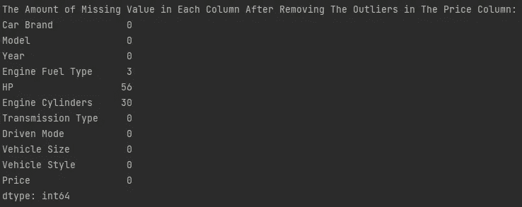
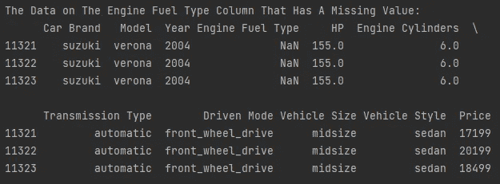

# 使用机器学习预测汽车价格

> 原文：<https://blog.devgenius.io/predicting-the-price-of-a-car-using-machine-learning-eefbf19fda26?source=collection_archive---------5----------------------->


汽车是人们拥有的交通工具之一。有些人买车是为了日常使用。有些人买车是因为他们对过去有美好的回忆。有些人甚至买了一辆车来完成他的收藏。买车需要花很多心思，比如价格。"一辆汽车的合适价格是多少？"为了回答这个问题，我试图通过建立一个预测汽车价格的机器学习模型来提供帮助。在制造这个机器学习模型时，我使用了来自 [Kaggle](https://www.kaggle.com/CooperUnion/cardataset) 的数据集。

# 数据剖析

在建立机器学习模型之前，我会做数据剖析。什么是数据分析？

> 数据分析是使用描述性统计对数据进行汇总。创建数据概要旨在对数据有很强的理解，以编译框架分析和可视化数据。

## 导入数据

```
#DATA PROFILING
#Importing Data
import pandas as pd
pd.set_option('display.max_columns',None)
df = pd.read_csv('Data Harga Mobil Sesuai Spesifikasi.csv')
```

第一步是初始化库，使用**熊猫**将数据集导入 python，并将其指定为 **df** 。从 Kaggle 下载的数据将保存为**' Data Harga Mobil Sesuai spesifikasi . CSV '。**

## 显示数据的长度

```
#Showing The Length of The Data
print("\nThe Length of The Data: ", len(df))
```

第二步是使用 **len()** 显示数据集中有多少数据。结果是这个数据的大小是 11914。

## 显示数据的形状

```
#Showing The Shape of The Data
print("\nThe Shape of The Data: ", df.shape)
```

第三步是使用**显示数据的形状。形状**。结果是该数据有 11914 行和 16 列。

## 显示数据的信息

```
#Showing The Information of The Data
print("\nThe Information of The Data: ")
print(df.info())
```


**图一。**数据的信息

第四步是使用**从数据中获取信息。info()**

## 显示统计计算

```
#Showing The Statistical Calculations
print("\nThe The Statistical Calculations: ")
print(df.describe().T)
```


**图二。**统计计算的结果

第五步是使用**显示数据的统计分析。**形容()。

## 显示唯一的数据

```
#Showing The Unique Data
print("\nThe The Unique Data: ")
print(df.nunique())
```


**图三。**每列中具有唯一值的数据量

数据分析的第六步是使用函数**显示每一列的唯一数据。努尼克()**。

## 更改列名和列值

```
#Changing The Column's Name And The Column's Value
kolom_string = list(df.dtypes[df.dtypes == 'object'].index)
for col in kolom_string:
    df[col] = df[col].str.lower().str.replace(' ', '_')

df.rename(columns ={'MSRP': 'Price',
                    'Make': 'Car Brand',
                    'Engine HP': 'HP',
                    'Driven_Wheels':'Driven Mode',
                    'highway MPG':'KML-H',
                    'city mpg':'KML-C'}, inplace=True)
```

如**图 1** 所示，数据集上的列名不明确。例如，MSRP 列包含汽车的价格。因此，我将更改该列的名称。对于列的值，我将把它改为小写，并使用下划线。

## 寻找相关性

```
#Looking For A Correlation
import numpy as np
import seaborn as sns
import matplotlib.pyplot as plt
plt.figure(figsize=(17, 15))
corr_mask = np.triu(df.corr())
h_map = sns.heatmap(df.corr(), mask=corr_mask, annot=True, cmap='Blues')
plt.yticks(rotation=360)
plt.show()
```


**图 4。**热图关联

数据分析的最后一步是寻找每个数据的相关性。这部分我就用 **Seaborn** 、 **Matplotlib** 和 **Numpy** 。

# 数据清理

在数据分析之后，我将进行数据清理。什么是数据清理？

> 数据清理是指识别不正确、不完整、不准确、不相关或丢失的数据，然后根据需要对其进行修改、替换或删除的过程。

在进行数据清理之前，我将创建一个名为**hapus _ 离群值**的函数，接收参数**数据**和 **x** 。该函数的目的是更容易去除异常值。我将解释什么是异常值？

> 异常值是在数据集或图形的整体值模式中显著突出的极值。

这里有一个去除异常值的函数。

```
#DATA CLEANSING
#Create a function to remove the outliers
def hapus_outliers(data, x):
    Q1 = data[x].quantile(0.25)
    Q3 = data[x].quantile(0.75)
    IQR = Q3 - Q1
    data = data[~((data[x] < (Q1 - 1.5 * IQR)) | (data[x] > (Q3 + 1.5 * IQR)))]
    return data
```

在数据清理中，需要做的步骤是处理每一列中的缺失值，移除每一列中的异常值，并擦除重复的数据。

## 查找每一列中缺失的值

```
#Looking For The Missing Value in Each Column
print("\nLooking For The Missing Value in Each Column: ")
print(df.isnull().sum())
```


**图 5。**各栏缺失值金额

我使用 **isnull()** 和 **sum()** 来找出缺失的值有多少。**发动机燃油类型**有 3 个缺失值、 **69 个**缺失值、 **HP** 有 3 个 **30 个**缺失值、**发动机气缸**有 4 个**缺失值、**门数**有 6 个**缺失值、**市场类别**有 **3742** 缺失值。

## 删除不必要的列

```
#Removing Unnecessary Column
df = df.drop(['Popularity','Number of Doors','KML-H','KML-C','Market Category'], axis=1)
```

## 检查价格栏

```
#Checking The Price Column
print("\nChecking The Price Column")
sns.histplot(df['Price'])
plt.show()
```


**图 6。**价格栏可视化

第一步是通过使用 **seaborn** 和 **matplotlib** 可视化数据来检查价格栏。如**图 6** 所示，**价格**栏有异常值。为了克服这些异常值，我将使用我之前创建的名为**的函数删除它们。**

```
df = hapus_outliers(df, 'Price')
```

在移除价格列中的异常值后，我将在每一列中查找缺失的值。

```
print("\nThe Amount of Missing Value in Each Column After Removing The Outliers in The Price Column:")
print(df.isnull().sum())
```



**图 7。**剔除价格栏异常值后各栏缺失值金额

在**图 7** 中，剔除异常值后 **HP** 栏中的缺失值变为 **56** 。

```
print("\nThe Shape of The Data After Removing The Outliers: ", df.shape)
```

剔除价格列中的异常值后，该数据有 **10918 行**和 **11 列**。

## 查看汽车品牌专栏

```
#Checking The Car Brand Column
print("\nChecking The Car Brand Column")
sns.catplot(x='Car Brand', y='Price', data=df, height=5, aspect=2)
plt.xticks(rotation=90)
plt.show()
```


**图 8。**汽车品牌栏目可视化

## 检查年度列

```
#Checking The Year Column
print("\nChecking The Year Column")
sns.catplot(x='Year', y='Price', data=df, height=5, aspect=2)
plt.xticks(rotation=90)
plt.show()
```


**图 9。**年度栏目可视化

## 检查发动机燃料类型栏

```
#Checking The Engine Fuel Type Column
print("\nChecking The Engine Fuel Type Column")
sns.catplot(x='Engine Fuel Type', y='Price', data=df, height=5, aspect=2)
plt.xticks(rotation=90)
plt.show()
```


**图 10。**可视化发动机燃料类型栏

发动机燃料类型栏中缺少的值的数量是三个。在**图 10** 中，在发动机燃料类型一栏中，有 10 种数据:
-【高级 _ 无铅 _(必需)’
-【普通 _ 无铅】-
-【高级 _ 无铅 _(推荐)’
-【灵活燃料 _(无铅/e85)’
-【柴油】-
-【电动】-
-【灵活燃料 _(高级 _ 无铅 _ 推荐/e85)’
-【天然气】-
-【灵活燃料 _】

在我找到发动机类型燃料列中填充的是哪种数据之后，我将查看这一列中缺少的值。

```
print("\nThe Data on The Engine Fuel Type Column That Has A Missing Value:")
print(df.loc[(df['Engine Fuel Type'].isnull())])
```



**图 11。**发动机燃料类型栏中的数据缺少值

在**图 11** 中，价值缺失的汽车是铃木维罗纳。铃木维罗纳使用普通无铅汽油。所以我要把这个丢失的值变成一个**‘regular _ 无铅’**。

```
df['Engine Fuel Type'] = df['Engine Fuel Type'].fillna('regular_unleaded')
```

在用**‘普通 _ 无铅’**替换了丢失的值之后，我将在每一列中查找丢失的值。

```
print("\nThe Amount of Missing Value in Each Column After Handling Missing Value in The Engine Fuel Type Column: ")
print(df.isnull().sum())
```


**图 12。**处理发动机燃料类型栏中的缺失值后，每栏中缺失值的数量

在**图 12** 中，对缺失值进行处理后，**发动机燃料类型**栏中的缺失值变为 **0** 。

## 检查发动机气缸列

```
#Checking The Engine Cylinders Column
print("\nChecking The Engine Cylinders Column")
sns.catplot(x='Engine Cylinders', y='Price', data=df, height=5, aspect=2)
plt.show()
```


**图十三。**发动机气缸列的可视化

在我发现发动机气缸列中填充的是哪种数据之后，我将查看这一列中缺少的值。

```
print("\nThe Data on The Engine Cylinders Column That Has A Missing Value:")
print(df.loc[(df['Engine Cylinders'].isnull())])
```

从上面的代码来看，价值缺失的车分别是**雪佛兰 Bolt EV** 、**大众 E-Golf** 、**丰田 Rav4 EV** 、**马自达 RX-7** 、**马自达 RX-8** 。**雪佛兰 Bolt EV，大众 E-Golf，丰田 Rav4 EV** 都是电动车，所以它没有汽缸。**马自达 RX-7** 和**马自达 RX-8** 不使用发动机气缸而是使用转子发动机。所以我要把这个丢失的值变成 **0** 。

```
df['Engine Cylinders'] = df['Engine Cylinders'].fillna(0)
```

在用 **0** 替换丢失的值后，我将在每一列中查找丢失的值。

```
print("\nThe Amount of Missing Value in Each Column After Handling Missing Value in The Engine Cylinders Column:")
print(df.isnull().sum())
```


**图 14。**处理发动机气缸列中的缺失值后，每列中缺失值的数量

在**图 14** 中，处理缺失值后**发动机气缸**栏中的缺失值变为 **0** 。

## 检查高压柱

HP 列中有 56 个缺失值；我会调查丢失的价值。

```
#Checking the HP Column
print("\nChecking the HP Column")
print(df.loc[(df['HP'].isnull())])
```


**表 1。**HP 列上有缺失值的数据

已经在**表 1** 中提到的汽车有一个马力(HP) 如下:
- [菲亚特 500e](https://www.edmunds.com/fiat/500e/2015/features-specs/) 的马力是 111
- [林肯欧陆](https://www.edmunds.com/lincoln/continental/2017/features-specs/)的马力是 305
- [林肯 MKZ](https://www.edmunds.com/lincoln/mkz/2017/features-specs/) 的马力是 245
- [福特逸动](https://www.edmunds.com/ford/escape/2017/suv/features-specs/)的马力是 179
- [福特自由之星](https://www.auto123.com/en/new-cars/technical-specs/ford/freestar/2005/base/se/)的马力是 201
- [福特福克斯](https://www.edmunds.com/ford/focus/2015/features-specs/) 150
- [特斯拉 Model S](https://www.oto.com/en/mobil-baru/tesla/model-s/performance) 的马力是 1020
- [起亚 Soul EV](https://www.kiamedia.com/us/en/models/soul-ev/2018/specifications) 的马力是 109
- [丰田 Rav4 EV](https://evcompare.io/cars/toyota/toyota_rav4_ev_2012-2014/) 的马力是 154
- [本田飞度 EV](https://www.caranddriver.com/honda/fit-ev/specs) 的马力是 123
- [三菱 I-Miev](https://www.caranddriver.com/mitsubishi/i-miev/specs) 的马力是 66
-

```
df.loc[(df['Car Brand'] == 'fiat') & (df['Model'] == '500e')] = df.loc[(df['Car Brand'] == 'fiat') & (df['Model'] == '500e')].fillna(111)
df.loc[(df['Car Brand'] == 'lincoln') & (df['Model'] == 'continental')] = df.loc[(df['Car Brand'] == 'lincoln') & (df['Model'] == 'continental')].fillna(305)
df.loc[(df['Car Brand'] == 'lincoln') & (df['Model'] == 'mkz')] = df.loc[(df['Car Brand'] == 'lincoln') & (df['Model'] == 'mkz')].fillna(245)
df.loc[(df['Car Brand'] == 'ford') & (df['Model'] == 'escape')] = df.loc[(df['Car Brand'] == 'ford') & (df['Model'] == 'escape')].fillna(179)
df.loc[(df['Car Brand'] == 'ford') & (df['Model'] == 'freestar')] = df.loc[(df['Car Brand'] == 'ford') & (df['Model'] == 'freestar')].fillna(201)
df.loc[(df['Car Brand'] == 'ford') & (df['Model'] == 'focus')] = df.loc[(df['Car Brand'] == 'ford') & (df['Model'] == 'focus')].fillna(160)
df.loc[(df['Car Brand'] == 'chevrolet') & (df['Model'] == 'impala')] = df.loc[(df['Car Brand'] == 'chevrolet') & (df['Model'] == 'impala')].fillna(305)
df.loc[(df['Car Brand'] == 'nissan') & (df['Model'] == 'leaf')] = df.loc[(df['Car Brand'] == 'nissan') & (df['Model'] == 'leaf')].fillna(150)
df.loc[(df['Car Brand'] == 'tesla') & (df['Model'] == 'model_s')] = df.loc[(df['Car Brand'] == 'tesla') & (df['Model'] == 'model_s')].fillna(1020)
df.loc[(df['Car Brand'] == 'kia') & (df['Model'] == 'soul_ev')] = df.loc[(df['Car Brand'] == 'kia') & (df['Model'] == 'soul_ev')].fillna(109)
df.loc[(df['Car Brand'] == 'toyota') & (df['Model'] == 'rav4_ev')] = df.loc[(df['Car Brand'] == 'toyota') & (df['Model'] == 'rav4_ev')].fillna(154)
df.loc[(df['Car Brand'] == 'honda') & (df['Model'] == 'fit_ev')] = df.loc[(df['Car Brand'] == 'honda') & (df['Model'] == 'fit_ev')].fillna(123)
df.loc[(df['Car Brand'] == 'mitsubishi') & (df['Model'] == 'i-miev')] = df.loc[(df['Car Brand'] == 'mitsubishi') & (df['Model'] == 'i-miev')].fillna(66)
df.loc[(df['Car Brand'] == 'mercedes-benz') & (df['Model'] == 'm-class')] = df.loc[(df['Car Brand'] == 'mercedes-benz') & (df['Model'] == 'm-class')].fillna(200)
```

替换丢失的值后，我将在每一列中查找丢失的值。

```
print("\nThe Amount of Missing Value in Each Column After Handling Missing Value in The HP Column:")
print(df.isnull().sum())
```


**图 15。**处理 HP 列中缺失值后每列中缺失值的数量

在**图 15** 中，对缺失值进行处理后，**惠普**栏中的缺失值变为 **0** 。

## 删除重复数据

```
#Removing Duplicated Data
print("\nRemoving Duplicated Data")
df.drop_duplicates(inplace=True)
print('\nThe Shape of The Data After Removing The Duplicated Data: ', df.shape)
```

在本节中，我将删除重复的数据。删除重复数据后，该数据有 **10189 行**和 **11 列**。

# 数据集上的标签转换

```
print("\nLabel Encoding on The Dataset")
car_brand = pd.get_dummies(df['Car Brand'], drop_first=True)
model = pd.get_dummies(df['Model'], drop_first=True)
engine_fuel_type = pd.get_dummies(df['Engine Fuel Type'], drop_first=True)
transmission_type = pd.get_dummies(df['Transmission Type'], drop_first=True)
driven_mode = pd.get_dummies(df['Driven Mode'], drop_first=True)
vehicle_size = pd.get_dummies(df['Vehicle Size'], drop_first=True)
vehicle_style = pd.get_dummies(df['Vehicle Style'], drop_first=True)df = df.drop(['Car Brand',
              'Model',
              'Engine Fuel Type',
              'Transmission Type',
              'Driven Mode',
              'Vehicle Size',
              'Vehicle Style'], axis=1)df = pd.concat([car_brand,
                model,
                engine_fuel_type,
                transmission_type,
                driven_mode,
                vehicle_size,
                vehicle_style,
                df], axis=1)
```

# 分离要素和标签

```
#Separating Features and Labels
X = df.drop('Price', axis=1)
y = df['Price'].astype(int)
```

特征是描述性的属性，而标签是您试图预测或预测的内容。所以我会做两个变量；第一个变量是只有特征的 X 和只有标签的 y。

# 准备培训、测试和验证数据集

```
#Preparing Training, Testing, And Validating Dataset
from sklearn.model_selection import train_test_split
X_train_full, X_test, y_train_full, y_test = train_test_split(X, y, test_size=0.2, random_state=42)
X_train, X_val, y_train, y_val = train_test_split(X_train_full, y_train_full, test_size=0.2, random_state=42)
```

# 构建机器学习模型

下一步是建立一个机器学习模型。在这一部分，我将进行 A/B 测试。什么是 A/B 测试？

> 根据《哈佛商业评论》，A/B 测试是一种比较两个版本的东西以找出哪个更好的方法。

我将比较**线性回归**、**决策回归器**、**随机森林回归器**、**套索**和**岭**。

## 线性回归

```
#Build a Machine Learning Model LinearRegression
from sklearn.linear_model import LinearRegression
model_linreg = LinearRegression()
model_linreg = model_linreg.fit(X_train, y_train)
y_pred_linreg = model_linreg.predict(X_test)

#Evaluating The Machine Learning Model
from sklearn.metrics import mean_squared_error, mean_absolute_error
import numpy as np

#Mean Squared Error
mse = mean_squared_error(y_test, y_pred_linreg)
print('\nMean squared error dari Testing Set:', round(mse))

#Mean Absolute Error
mae = mean_absolute_error(y_test, y_pred_linreg)
print('Mean absolute error dari Testing Set:', round(mae))

#Root Mean Squared Error
rmse = np.sqrt(mse)
print('Root Mean Squared Error dari Testing Set:', round(rmse))
```

## 决策树

```
#Build a Machine Learning Model DecisionTree
from sklearn.tree import DecisionTreeRegressor
model_dtr = DecisionTreeRegressor(random_state=42)
model_dtr = model_dtr.fit(X_train, y_train)
y_pred_dtr = model_dtr.predict(X_test)

#Evaluating The Machine Learning Model
from sklearn.metrics import mean_squared_error, mean_absolute_error
import numpy as np

#Mean Squared Error
mse = mean_squared_error(y_test, y_pred_dtr)
print('\nMean squared error dari Testing Set:', round(mse))

#Mean Absolute Error
mae = mean_absolute_error(y_test, y_pred_dtr)
print('Mean absolute error dari Testing Set:', round(mae))

#Root Mean Squared Error
rmse = np.sqrt(mse)
print('Root Mean Squared Error dari Testing Set:', round(rmse))
```

## 随机森林

```
#Build a Machine Learning Model RandomForest
from sklearn.ensemble import RandomForestRegressor
model_rfr = RandomForestRegressor(random_state=42)
model_rfr = model_rfr.fit(X_train, y_train)
y_pred_rfr = model_rfr.predict(X_test)

#Evaluating The Machine Learning Model
from sklearn.metrics import mean_squared_error, mean_absolute_error
import numpy as np

#Mean Squared Error
mse = mean_squared_error(y_test, y_pred_rfr)
print('\nMean squared error dari Testing Set:', round(mse))

#Mean Absolute Error
mae = mean_absolute_error(y_test, y_pred_rfr)
print('Mean absolute error dari Testing Set:', round(mae))

#Root Mean Squared Error
rmse = np.sqrt(mse)
print('Root Mean Squared Error dari Testing Set:', round(rmse))
```

## 套索

```
#Build a Machine Learning Model Lasso
from sklearn.linear_model import Lasso
model_lasso = Lasso(random_state=42)
model_lasso = model_lasso.fit(X_train, y_train)
y_pred_lasso = model_lasso.predict(X_test)

#Evaluating The Machine Learning Model
from sklearn.metrics import mean_squared_error, mean_absolute_error
import numpy as np

#Mean Squared Error
mse = mean_squared_error(y_test, y_pred_lasso)
print('\nMean squared error dari Testing Set:', round(mse))

#Mean Absolute Error
mae = mean_absolute_error(y_test, y_pred_lasso)
print('Mean absolute error dari Testing Set:', round(mae))

#Root Mean Squared Error
rmse = np.sqrt(mse)
print('Root Mean Squared Error dari Testing Set:', round(rmse))
```

## 山脉

```
#Build a Machine Learning Model Ridge
from sklearn.linear_model import Ridge
model_ridge = Ridge(random_state=42)
model_ridge = model_ridge.fit(X_train, y_train)
y_pred_ridge = model_ridge.predict(X_test)

#Evaluating The Machine Learning Model
from sklearn.metrics import mean_squared_error, mean_absolute_error
import numpy as np

#Mean Squared Error
mse = mean_squared_error(y_test, y_pred_ridge)
print('\nMean squared error dari Testing Set:', round(mse))

#Mean Absolute Error
mae = mean_absolute_error(y_test, y_pred_ridge)
print('Mean absolute error dari Testing Set:', round(mae))

#Root Mean Squared Error
rmse = np.sqrt(mse)
print('Root Mean Squared Error dari Testing Set:', round(rmse))
```

# 机器学习模型的评价

构建机器学习模型后的下一个阶段是评估该模型。在这个评估过程中，我会查看**均方误差**、**平均绝对误差**、**均方根误差**值。我会用**最小 RMSE 值**来决定哪个更好。

## 线性回归

采用线性回归的结果为 **12227717 MSE，2495 MAE，3497 RMSE。**

## 决策树回归器

使用决策树回归器的结果为 **16094808 MSE、2667 MAE 和 4012 RMSE。**

## 随机森林回归器

使用随机森林回归器的结果是 **12398483 MSE、2380 MAE 和 3521 RMSE。**

## 套索

使用套索的结果是 **13948854 MSE、2789 MAE 和 3735 RMSE。**

## 山脉

使用 Ridge 的结果是 **13800444 MSE、2763 MAE 和 3715 RMSE。**

从这个评估中，我得出结论:使用线性回归的机器学习模型具有最小的 RMSE。

# 机器学习模型的可视化

```
#Visualize The Machine Learning Model
fig = plt.figure(figsize=(17, 10))
df = df.sort_values(by=['Price'])
plt.scatter(range(X.shape[0]), y, color='red', label='Real')
plt.scatter(range(X.shape[0]), model.predict(X), marker='.', label='Predict')
plt.legend(loc='best', prop={'size': 8})
plt.show()
```


**图 16。**机器学习模型线性回归的可视化

# 机器学习模型的验证

```
#Validating The Machine Learning Model
for i in range(5):
    real = y_val.iloc[i]
    pred = int(model_linreg.predict(X_val.iloc[i].to_frame().T)[0])
    print(f'Real Value      ----->>>>> {real} $\n'
          f'Predicted Value ----->>>>> {pred} $')
    print()
```


表 2。线性回归机器学习模型的验证

这就是我给你的；如果你对这个项目有意见、建议或疑问，你可以联系我。谢谢，非常感谢你花时间阅读这篇文章。