# 利用机器学习预测房价

> 原文：<https://blog.devgenius.io/predicting-the-price-of-a-house-using-machine-learning-6288f21c891e?source=collection_archive---------4----------------------->

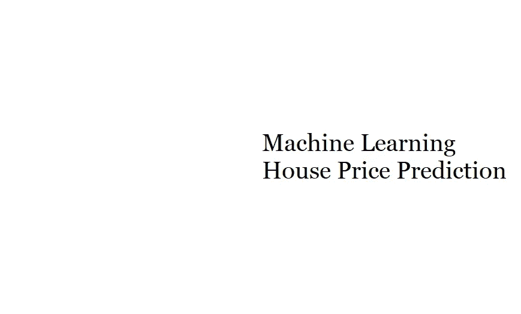

什么是房子？

> 根据[维基百科](https://en.wikipedia.org/wiki/House)的说法，房子是一个单元的住宅建筑。它的复杂程度不一，从简陋的小屋到复杂的木头、砖石、混凝土或其他材料的结构，配备有管道、电气、供暖、通风和空调系统。

有些房子仅限于一个或多个相同数量的家庭或社会团体。人们通常外出工作、上学或从事其他日常活动中需要社交的活动。房子里最频繁的活动就是休息和睡觉。

现代住宅由几个房间组成，每个房间都有特定的功能:卧室、浴室、厨房、起居室、餐厅、地下室等等。

根据上面的解释，许多人想拥有自己的房子。为了拥有一栋房子，他们中的一些人在空地上建造了它。同时，其他人直接从另一个人那里买。当谈到买房时，许多考虑因素需要注意，如有多少卧室和浴室，房子的条件如何，房子是什么时候建造的，以及最重要的问题是房子的合适价格是多少。

有些人觉得很难决定这个价格是否合适。为了回答这个问题，我试图通过建立一个预测房屋价格的机器学习模型来提供帮助。在创建这个机器学习模型时，我使用了来自 [Kaggle](https://www.kaggle.com/shree1992/housedata) 的数据集。

# 数据剖析

在创建机器学习模型之前，我需要先了解数据集。因此，我将进行数据分析，以便更好地理解数据。

## 导入数据

```
#Importing Data
import pandas as pd
pd.set_option('display.max_columns',None)
df = pd.read_csv('Data Rumah.csv')
```

第一步是初始化库，使用**熊猫**、将数据集导入 Python，并将其指定为 **df** 。从 Kaggle 下载的数据将被保存为**‘Data rumah . CSV’。**

## 显示数据的长度

```
#Showing The Length of The Data
print("\nThe Length of The Data: ", len(df))
```

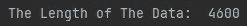

**图一。**数据集的长度

第二步是使用 **len()** 显示数据集中有多少数据。结果是这个数据的大小是 **4600** 。

## 显示数据的形状

```
#Showing The Shape of The Data
print("\nThe Shape of The Data: ", df.shape)
```

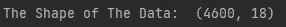

**图二。**数据集的形状

第三步是使用**显示数据的形状。形状**。结果是这个数据有 **4600 行和**18 列。

## 显示数据的信息

```
#Showing The Information of The Data
print("\nThe Information of The Data: ")
print(df.info())
```

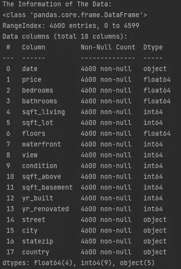

**图三。**数据的信息

第四步是使用**从数据中获取信息。info()**

## 显示统计计算

```
#Showing The Statistical Calculations
print("\nThe Statistical Calculations: ")
print(df.describe().T)
```

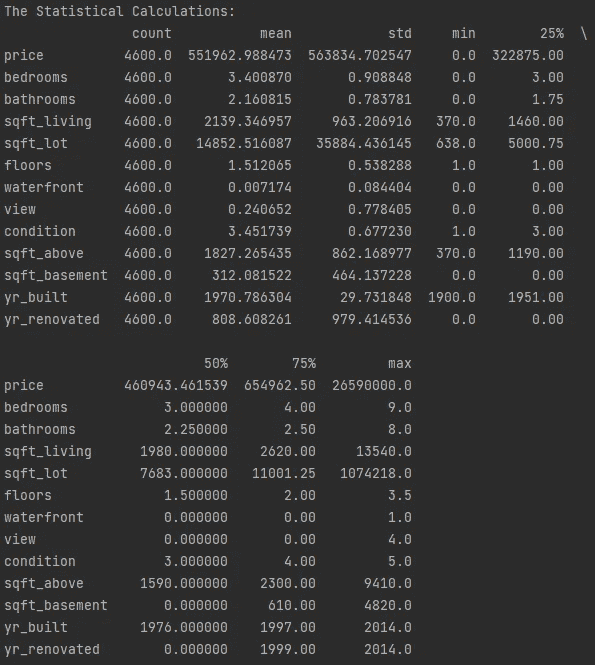

**图 4。**统计计算的结果

第五步是使用**显示数据的统计分析。**形容()。

## 显示唯一的数据

```
#Showing The Unique Data
print("\nThe Unique Data: ")
print(df.nunique())
```

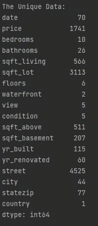

**图五。**每列中具有唯一值的数据量

数据分析的第六步是使用函数**显示来自每一列的唯一数据。努尼克()**。

## 更改列名和列值

```
#Changing The Column's Name And The Column's Value
kolom_string = list(df.dtypes[df.dtypes == 'object'].index)
for col in kolom_string:
    df[col] = df[col].str.lower().str.replace(' ', '_')

df.columns = df.columns.str.capitalize().str.replace('_', ' ')

df.rename(columns ={'Bedrooms': 'Bedroom(s)',
                    'Bathrooms': 'Bathroom(s)',
                    'Sqft living': 'Square Meter Living',
                    'Sqft lot': 'Square Meter Lot',
                    'Floors': 'Floor(s)',
                    'Sqft above': 'Square Meter Above',
                    'Sqft basement': 'Basement',
                    'Yr built': 'Year Built',
                    'Yr renovated': 'Renovated',
                    'Statezip': 'State ZIP'}, inplace=True)
```

## 寻找相关性

```
#Looking For A Correlation
import numpy as np
import seaborn as sns
import matplotlib.pyplot as plt
plt.figure(figsize=(17, 15))
corr_mask = np.triu(df.corr())
h_map = sns.heatmap(df.corr(), mask=corr_mask, cmap='Blues')
plt.yticks(rotation=360)
plt.show()
```

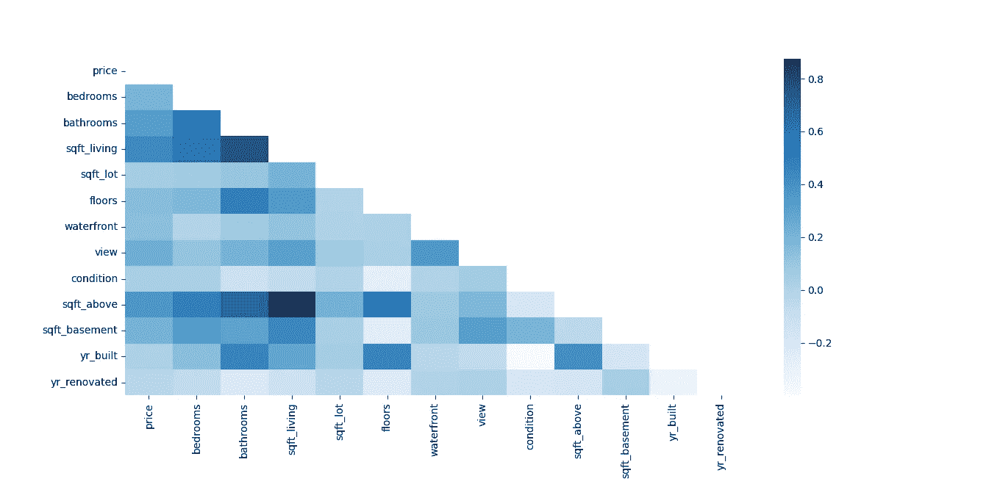

**图六。**热图关联

数据分析的最后一步是通过可视化来寻找每个数据的相关性。在这部分，我将使用 **Seaborn** 、 **Matplotlib** 和 **Numpy** 。

# 数据清理

```
#Create a function to remove the outliers
def hapus_outliers(data, col):
    Q1 = data[col].quantile(0.25)
    Q3 = data[col].quantile(0.75)
    IQR = Q3 - Q1
    data = data[~((data[col] < (Q1 - 1.5 * IQR)) | (data[col] > (Q3 + 1.5 * IQR)))]
    return data
```

在进行数据清理之前，我将创建一个名为 **hapus_outliers** 的函数，它接收参数**数据**和**列**。

## 寻找每一列中缺少的值

```
print(df.isnull().sum())
```

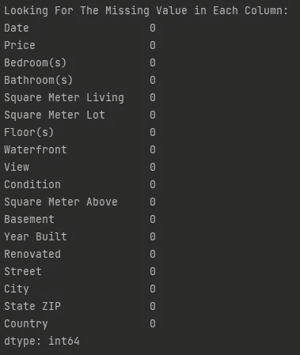

**图 7** 。每列中缺失值的数量

我使用 **isnull()** 和 **sum()** 来计算缺少的值是多少。结果表明该数据集中没有缺失值。

## 删除不必要的列

```
#Removing Unnecessary Column
df = df.drop(['Date'], axis=1)
df = df.drop(['Country'], axis=1)
df = df.drop(['Street'], axis=1)
df = df.drop(['State ZIP'], axis=1)
```

删除的栏目有**日期**、**国家**、**街道**、**州邮政编码**。删除日期列的原因是它只给出关于日期的信息。删除国家列的原因是该列只有一个值:美国。至于街道列和州邮政编码列被删除，因为每所房子都有自己的街道和州邮政编码。

## 检查价格栏

```
#Checking The Price Column
print("\nChecking The Price Column")
sns.histplot(df['Price'])
plt.show()
```

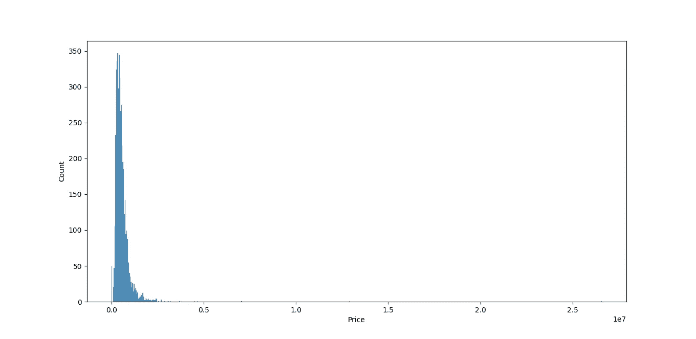

**图 8。**价格列的可视化

第一步是通过使用 **seaborn** 和 **matplotlib** 可视化数据来检查价格列。正如您在**图 8** 中看到的，**价格**列有异常值。为了克服这些异常值，我将使用我之前创建的名为 **hapus_outliers** 的函数删除它们。

```
df = hapus_outliers(df, 'Price')
print(df.shape)
sns.histplot(df['Price'])
plt.show()
```

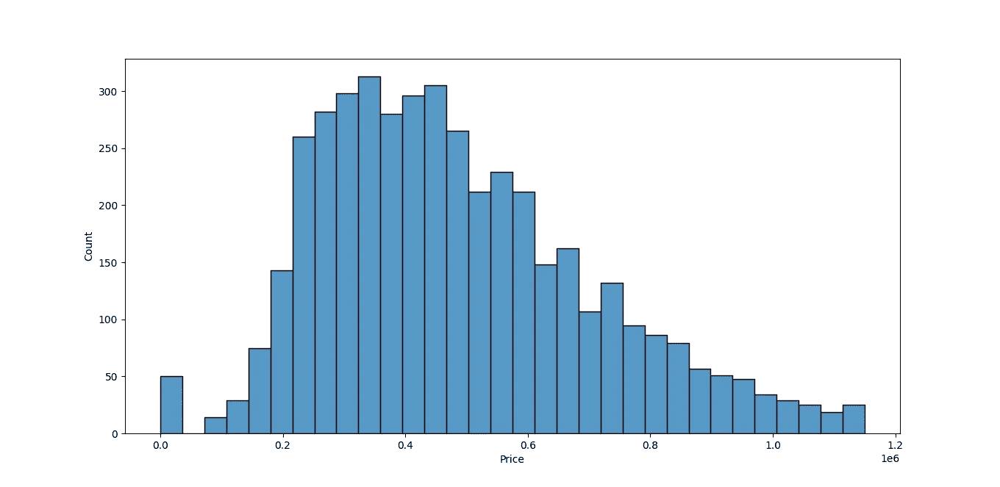

**图九。**去除异常值后价格列的可视化

在去除价格列中的异常值后，该数据有 **4360 行和 14 列**。

## 检查卧室栏

```
#Checking The Bedroom(s) Column
print("\nChecking The Bedroom(s) Column")
sns.catplot(x='Bedroom(s)', y='Price', data=df, height=5, aspect=2)
plt.show()
```

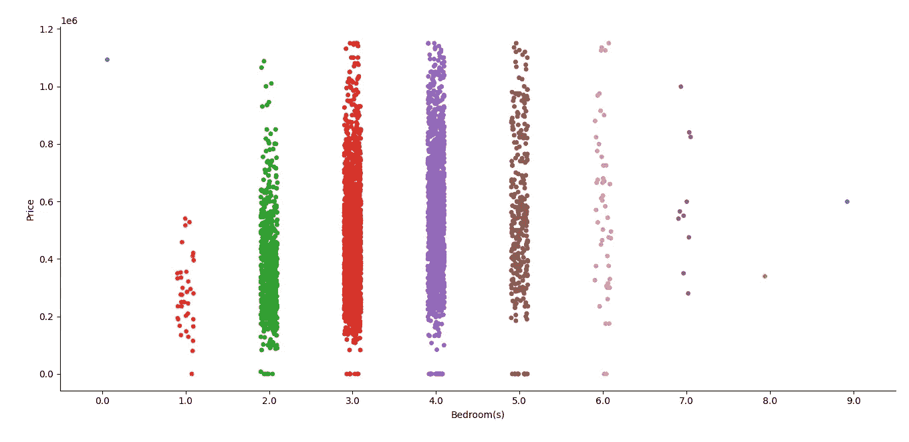

**图 10。**卧室的可视化列

从**图 10** 可以看出，卧室(s)一栏有十种数据:0、1、2、3、4、5、6、7、8、9。

```
mask_bedroom = {0:1, 1:1, 2:2, 3:3, 4:4, 5:5, 6:6, 7:7, 8:8, 9:9}
df['Bedroom(s)'] = df['Bedroom(s)'].map(mask_bedroom)
sns.catplot(x='Bedroom(s)', y='Price', data=df, height=5, aspect=2)
plt.show()
```

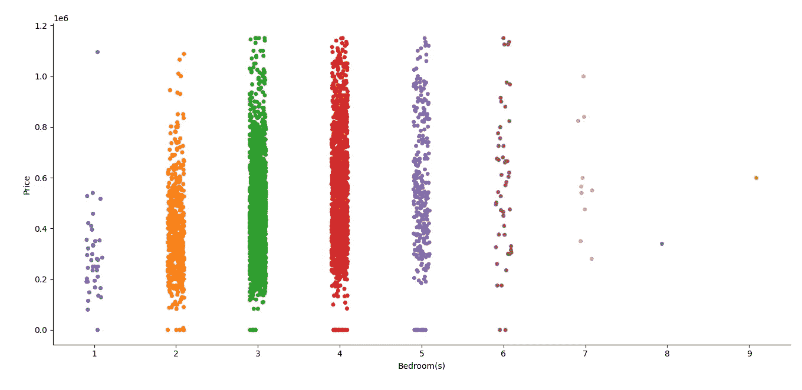

**图 11。**改变数值后卧室栏的可视化

这些数字表示房子里卧室的数量。我会假设价值为 0 的房子是 1 居室的房子。所以我把 0 值变成 1。

## 检查浴室栏

```
#Checking The Bathroom(s) Column
print("\nChecking The Bathroom(s) Column")
sns.catplot(x='Bathroom(s)', y='Price', data=df, height=5, aspect=2)
plt.show()
```

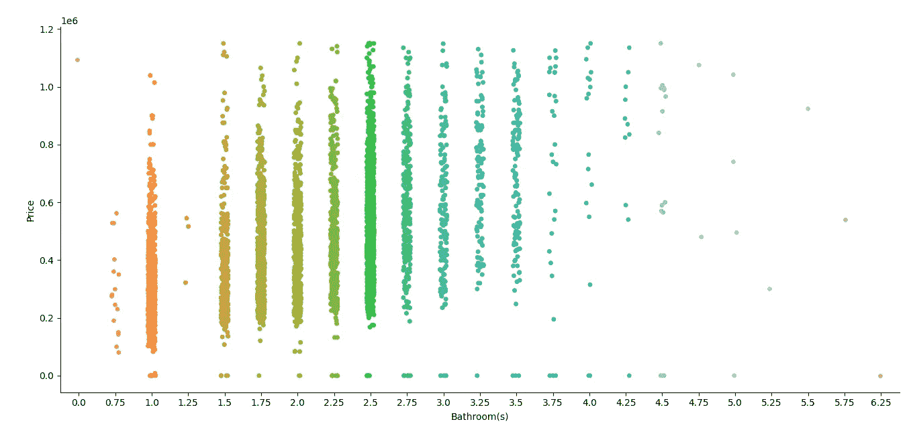

**图 12。**浴室列的可视化

从**图 12** 中可以看到，浴室(s)一栏有 20 种数据。

```
mask_bathroom = {0:1, 0.75: 1, 1: 1, 1.25:1,
                 1.5:2, 1.75:2, 2:2, 2.25:2,
                 2.5:3, 2.75:3, 3:3, 3.25:3,
                 3.5:4, 3.75:4, 4:4, 4.25:4,
                 4.5:5, 4.75:5, 5:5, 5.25:5,
                 5.5:6, 5.75:6, 6:6, 6.25:6,}
df['Bathroom(s)'] = df['Bathroom(s)'].map(mask_bathroom)
sns.catplot(x='Bathroom(s)', y='Price', data=df, height=5, aspect=2)
plt.show()
```

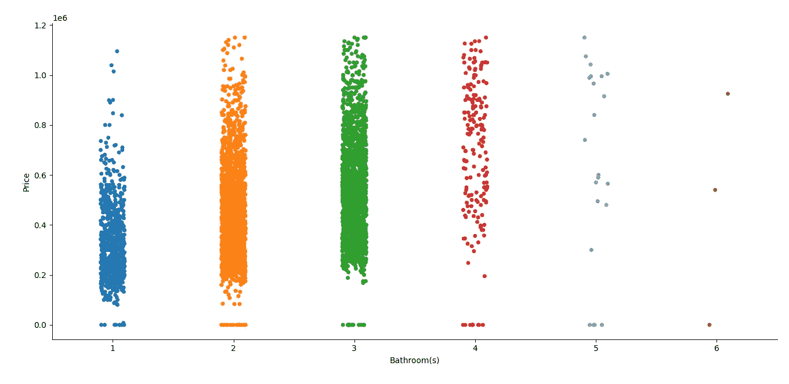

**图十三。**更改值后浴室列的可视化

这些数字表示房子里浴室的数量。我会把这些值改成 **1，2，3，4，5，6** 。

## 检查居住、地段和以上栏的平方米

```
#Checking The Square Meter Living, Lot, And Above Column
print("\nChecking The Square Meter Column")
kolom_square_meter = df.columns[df.columns.str.contains('Square Meter')]
```

我要做的第一步是创建一个名为 **kolom_square_meter** 的变量，将包含“Square Meter”的列与另一列分开。

```
df[kolom_square_meter] = df[kolom_square_meter].apply(lambda x: x*0.09290304)
```

接下来，我将更改 kolom_square_meter 中的值。之前本栏目用**平方英尺**；现在我把它换算成**平方米**。

```
from matplotlib.gridspec import GridSpec
fig = plt.figure(figsize=(10, 5))
grid = GridSpec(ncols=3, nrows=1, figure=fig)
for i, name in enumerate(kolom_square_meter):
    ax = fig.add_subplot(grid[i])
    sns.histplot(df[name], ax=ax)
plt.show()
```

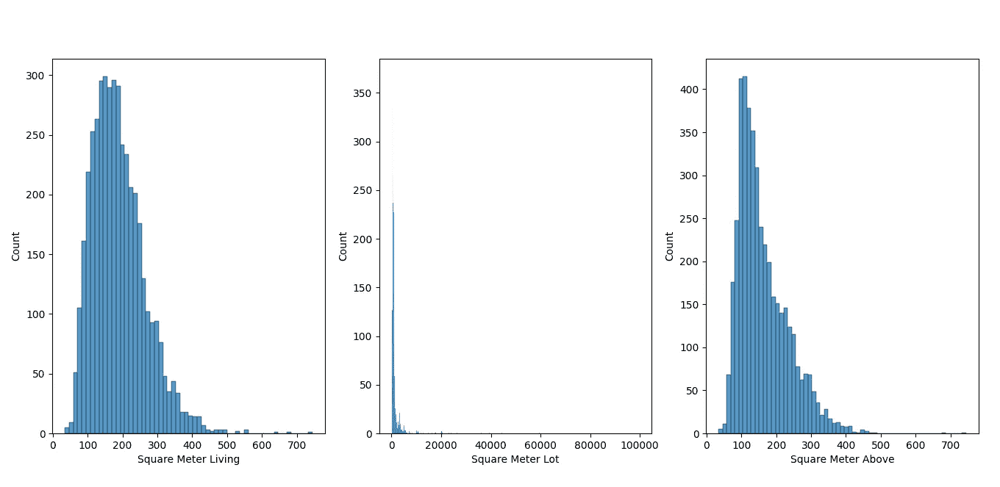

**图 14。**可视化的平方米居住、地段及以上栏目

正如您在**图 14** 中看到的，平方米居住、地段和以上列有异常值。为了克服这些异常值，我将删除它们。

```
df = hapus_outliers(df, 'Square Meter Living')
df = hapus_outliers(df, 'Square Meter Lot')
df = hapus_outliers(df, 'Square Meter Above')
print("\nThe Shape of The Data After Removing The Outliers: ", df.shape)
fig = plt.figure(figsize=(10, 5))
grid = GridSpec(ncols=3, nrows=1, figure=fig)
for i, name in enumerate(kolom_square_meter):
    ax = fig.add_subplot(grid[i])
    sns.histplot(df[name], ax=ax)
plt.show()
```

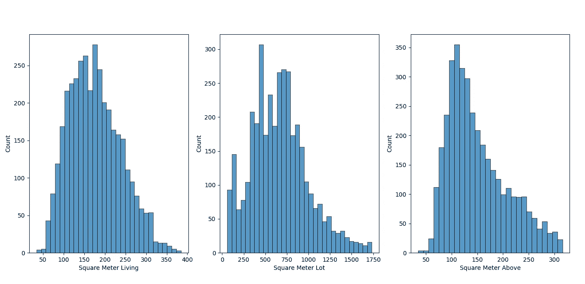

**图 15。**去除异常值后的居住、地段和以上面积栏的可视化

除去价格列中的异常值后，这个数据有 **3725 行和 14 列**。

## 检查楼层列

```
#Checking The Floor(s) Column
print("\nChecking The Floor(s) Column")
sns.catplot(x='Floor(s)', y='Price', data=df, height=5, aspect=2)
plt.show()
```

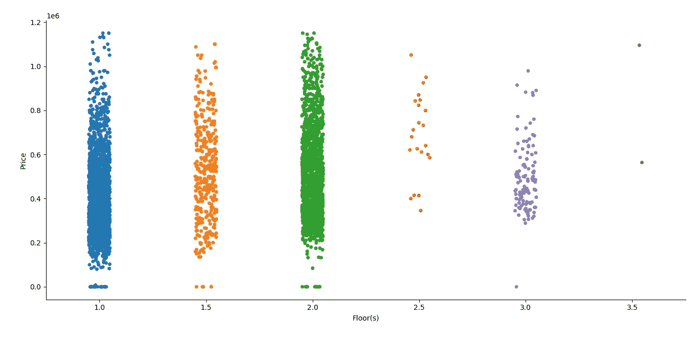

**图 16。**楼层列的可视化

在**图 16** 中，楼层(s)栏有六种数据: **1、1.5、2、2.5、3、3.5** 。

```
mask_floors = {1: 1, 1.5:1, 2:2, 2.5:3, 3:3, 3.5:4}
df['Floor(s)'] = df['Floor(s)'].map(mask_floors)
sns.catplot(x='Floor(s)', y='Price', data=df, height=5, aspect=2)
plt.show()
```

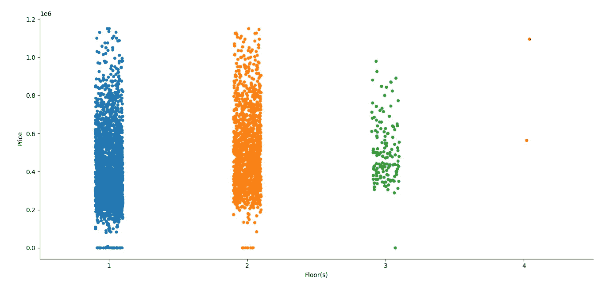

**图 17。**更改值后楼层列的可视化

我会将这些值从 **1、1.5、2、2.5、3 和 3.5** 更改为 **1、2、3 和 4** 。

## 检查滨水专栏

```
#Checking The Waterfront Column
print("\nChecking The Waterfront Column")
sns.catplot(x='Waterfront', y='Price', data=df, height=5, aspect=2)
plt.show()
```

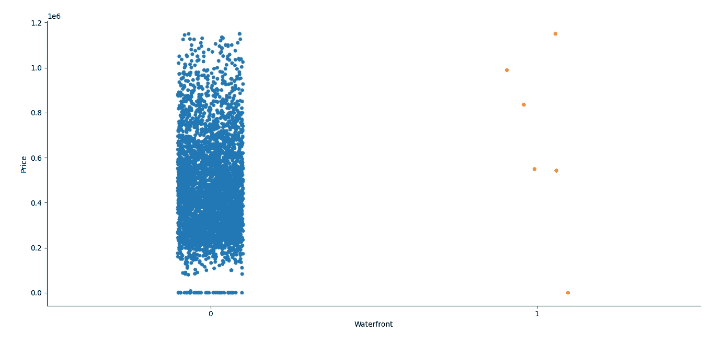

**图 18。**滨水圆柱的可视化

## 检查视图列

```
#Checking The View Column
print("\nChecking The View Column")
sns.catplot(x='View', y='Price', data=df, height=5, aspect=2)
plt.show()
```

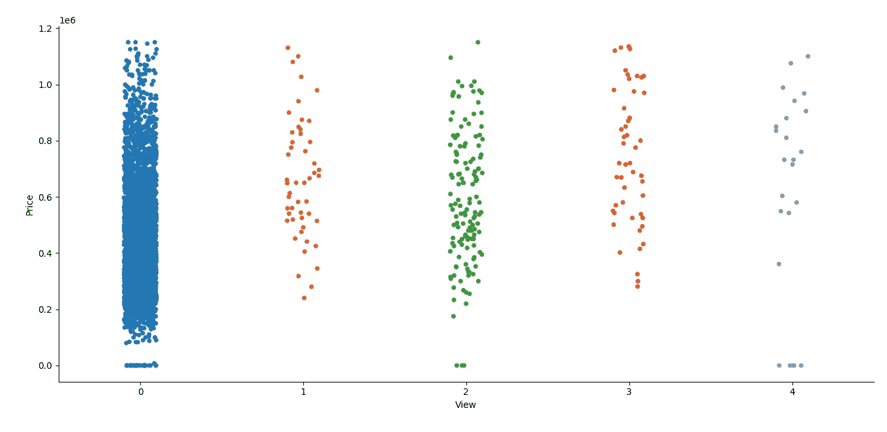

**图 19。**视图列的可视化

在**图 19** 中，楼层(s)栏有五种数据: **0、1、2、3、4** 。

```
mask_view = {0: 1, 1:2, 2:3, 3:4, 4:5}
df['View'] = df['View'].map(mask_view)
sns.catplot(x='View', y='Price', data=df, height=5, aspect=2)
plt.show()
```

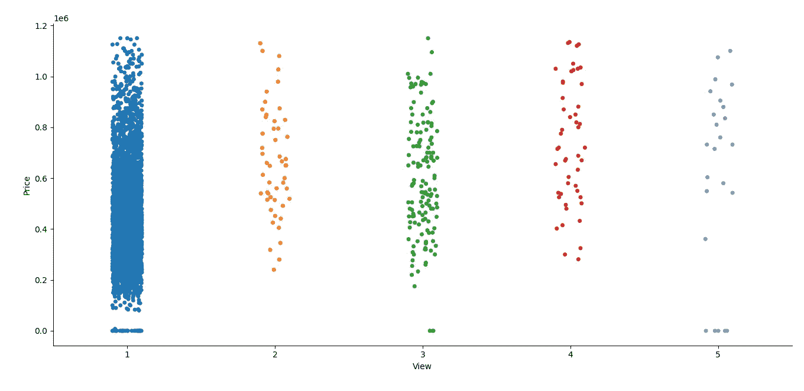

**图 20。**改变值后视图列的可视化

我会将这些值从 **0、1、2、3 和 4** 更改为 **1、2、3、4 和 5** 。

## 检查条件列

```
#Checking The Condition Column
print("\nChecking The Condition Column")
sns.catplot(x='Condition', y='Price', data=df, height=5, aspect=2)
plt.show()
```

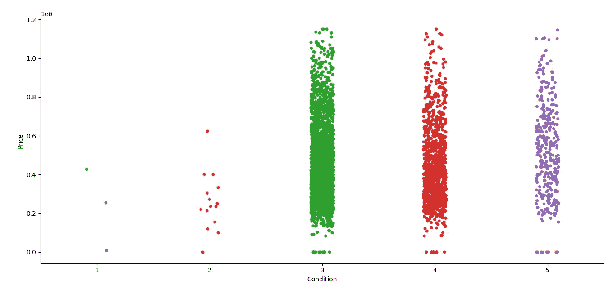

**图 21。**条件栏的可视化

## 检查地下室的柱子

```
#Checking The Basement Column
print("\nChecking The Basement Column")
sns.histplot(df['Basement'])
plt.show()
```

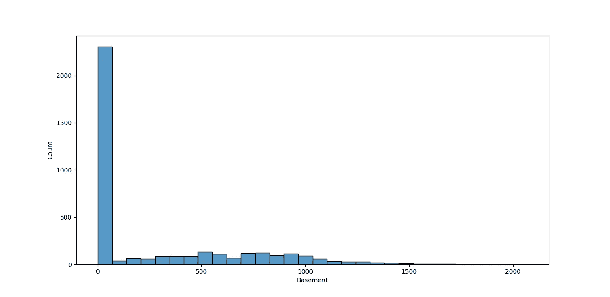

**图 22。**地下室柱的可视化

最初，这个专栏提供了地下室有多大的信息。但是我决定把这个栏目改一下，给出这个房子有没有地下室的信息。

```
df['Basement'] = df['Basement'].apply(lambda x: 0 if x == 0 else 1)
sns.catplot(x='Basement', y='Price', data=df, height=5, aspect=2)
plt.show()
```

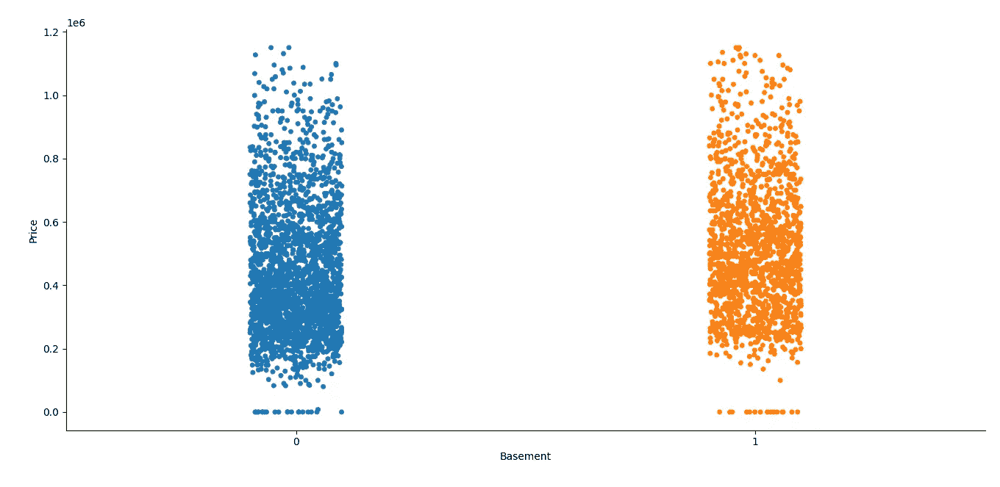

**图 23。**改变值后基底柱的可视化

所以，如果地下室一栏里的值是 0，就说明房子没有地下室。

## 检查“年份”栏

```
#Checking The Year Built Column
print("\nChecking The Year Column")
sns.histplot(df['Year Built'])
plt.show()
```

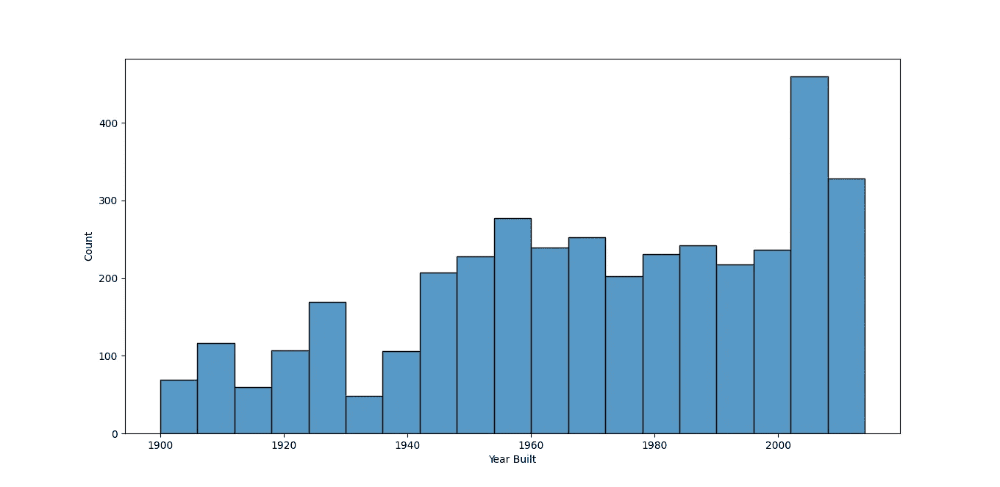

**图 24。**可视化的年建栏目

## 检查翻新的柱子

```
#Checking The Renovated Column
print("\nChecking The Renovated Column")
sns.histplot(df['Renovated'])
plt.show()
```

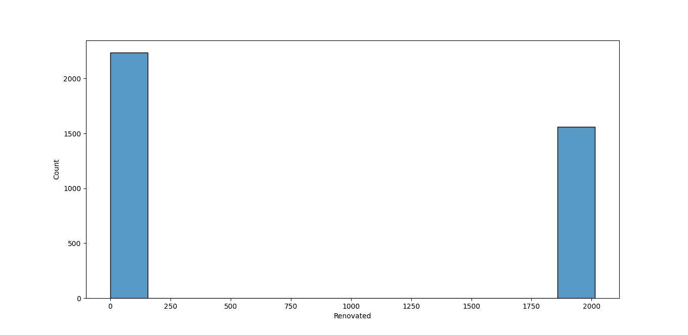

**图 25。**改造后柱子的可视化

最初，这个专栏提供了这所房子最后一次装修的信息。我决定改变这个专栏来提供关于这个房子是否被翻新过的信息。

```
df['Renovated'] = df['Renovated'].apply(lambda x: 0 if x == 0 else 1)
sns.catplot(x='Renovated', y='Price', data=df, height=5, aspect=2)
plt.show()
```

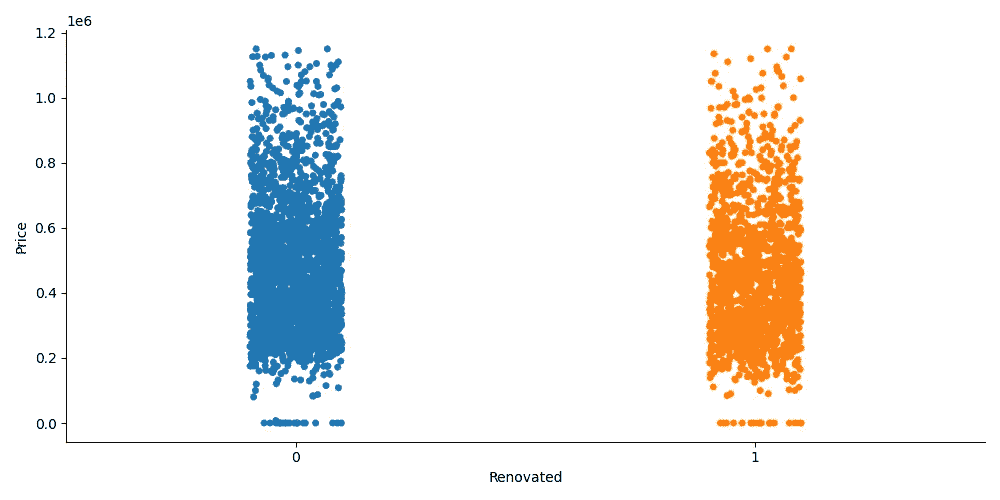

**图 26。**更改值后更新后的柱的可视化

所以，如果装修一栏里的值是 0，说明房子从来没有装修过。

## 删除重复数据

```
#Removing Duplicated Data
print("\nRemoving Duplicated Data")
df.drop_duplicates(inplace=True)
print('\nThe Shape of The Data After Removing The Duplicated Data: ', df.shape)
```

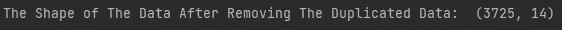

**图 27。**删除重复数据后的数据形状

在这一部分，我将删除重复的数据。删除重复数据后，该数据有 **3725 行和**14 列。

# 分离特征和标签

```
#Separating Features and Labels
X = df.drop('Price', axis=1)
y = df['Price'].astype(int)
```

在这一部分，我将制造两个变量；第一个变量是仅具有特征的 **X** 和仅具有标签的 **y** 。

# 数据集的缩放和标注转换

```
#Scaling and Labels Conversion on The Dataset
from sklearn.impute import SimpleImputer
from sklearn.preprocessing import OneHotEncoder, StandardScaler
from sklearn.compose import make_column_selector,make_column_transformer

impute_angka = SimpleImputer(strategy='most_frequent', add_indicator=True)
scaler = StandardScaler()

impute_kategori = SimpleImputer(strategy='constant')
ohe = OneHotEncoder(handle_unknown='ignore')

kolom_angka = make_column_selector(dtype_include='number')
kolom_kategori = make_column_selector(dtype_exclude='number')

from sklearn.pipeline import make_pipeline
preprocessor = make_column_transformer((make_pipeline(impute_angka, scaler), kolom_angka),
                                       (make_pipeline(impute_kategori, ohe), kolom_kategori))
```

接下来，我将使用 **StandardScaler** 、 **OneHotEncoder** 、 **make_pipeline** 、 **make_column_selector** 和**make _ column _ transformer**对数据集进行缩放和标签转换。

# 准备培训、测试和验证数据集

```
#Preparing Training, Testing, And Validating Dataset
from sklearn.model_selection import train_test_splitX_train_full, X_test, y_train_full, y_test = train_test_split(X, y, test_size=0.2, random_state=4)X_train, X_val, y_train, y_val = train_test_split(X_train_full, y_train_full, test_size=0.2, random_state=3)
```

# 建立一个机器学习模型

下一步是建立一个机器学习模型。我将对**线性回归**、**决策树回归量**、**随机森林回归量**、**套索**和**山脊**进行比较。

## 线性回归

```
#Build A Machine Learning Model
from sklearn.linear_model import LinearRegression
model_linreg = make_pipeline(preprocessor, LinearRegression())
model_linreg = model_linreg.fit(X_train, y_train)
y_pred_linreg = model_linreg.predict(X_test)

#Evaluating The Machine Learning Model
from sklearn.metrics import mean_squared_error, mean_absolute_error
import numpy as np

#Mean Squared Error
mse = mean_squared_error(y_test, y_pred_linreg)
print('\nMean squared error dari Testing Set:', round(mse))

#Mean Absolute Error
mae = mean_absolute_error(y_test, y_pred_linreg)
print('Mean absolute error dari Testing Set:', round(mae))

#Root Mean Squared Error
rmse = np.sqrt(mse)
print('Root Mean Squared Error dari Testing Set:', round(rmse))
```

## 决策树回归器

```
#Build a Machine Learning Model DecisionTree
from sklearn.tree import DecisionTreeRegressor
model_dtr = make_pipeline(preprocessor, DecisionTreeRegressor(random_state=42))
model_dtr = model_dtr.fit(X_train, y_train)
y_pred_dtr = model_dtr.predict(X_test)

#Evaluating The Machine Learning Model
from sklearn.metrics import mean_squared_error, mean_absolute_error
import numpy as np

#Mean Squared Error
mse = mean_squared_error(y_test, y_pred_dtr)
print('\nMean squared error dari Testing Set:', round(mse))

#Mean Absolute Error
mae = mean_absolute_error(y_test, y_pred_dtr)
print('Mean absolute error dari Testing Set:', round(mae))

#Root Mean Squared Error
rmse = np.sqrt(mse)
print('Root Mean Squared Error dari Testing Set:', round(rmse))
```

## 随机森林回归量

```
#Build a Machine Learning Model RandomForest
from sklearn.ensemble import RandomForestRegressor
model_rfr = make_pipeline(preprocessor, RandomForestRegressor(random_state=42))
model_rfr = model_rfr.fit(X_train, y_train)
y_pred_rfr = model_rfr.predict(X_test)

#Evaluating The Machine Learning Model
from sklearn.metrics import mean_squared_error, mean_absolute_error
import numpy as np

#Mean Squared Error
mse = mean_squared_error(y_test, y_pred_rfr)
print('\nMean squared error dari Testing Set:', round(mse))

#Mean Absolute Error
mae = mean_absolute_error(y_test, y_pred_rfr)
print('Mean absolute error dari Testing Set:', round(mae))

#Root Mean Squared Error
rmse = np.sqrt(mse)
print('Root Mean Squared Error dari Testing Set:', round(rmse))
```

## 套索

```
#Build a Machine Learning Model Lasso
from sklearn.linear_model import Lasso
model_lasso = make_pipeline(preprocessor, Lasso(random_state=42))
model_lasso = model_lasso.fit(X_train, y_train)
y_pred_lasso = model_lasso.predict(X_test)

#Evaluating The Machine Learning Model
from sklearn.metrics import mean_squared_error, mean_absolute_error
import numpy as np

#Mean Squared Error
mse = mean_squared_error(y_test, y_pred_lasso)
print('\nMean squared error dari Testing Set:', round(mse))

#Mean Absolute Error
mae = mean_absolute_error(y_test, y_pred_lasso)
print('Mean absolute error dari Testing Set:', round(mae))

#Root Mean Squared Error
rmse = np.sqrt(mse)
print('Root Mean Squared Error dari Testing Set:', round(rmse))
```

## 山脉

```
#Build a Machine Learning Model Ridge
from sklearn.linear_model import Ridge
model_ridge = make_pipeline(preprocessor, Ridge(random_state=42))
model_ridge = model_ridge.fit(X_train, y_train)
y_pred_ridge = model_ridge.predict(X_test)

#Evaluating The Machine Learning Model
from sklearn.metrics import mean_squared_error, mean_absolute_error
import numpy as np

#Mean Squared Error
mse = mean_squared_error(y_test, y_pred_ridge)
print('\nMean squared error dari Testing Set:', round(mse))

#Mean Absolute Error
mae = mean_absolute_error(y_test, y_pred_ridge)
print('Mean absolute error dari Testing Set:', round(mae))

#Root Mean Squared Error
rmse = np.sqrt(mse)
print('Root Mean Squared Error dari Testing Set:', round(rmse))
```

# 评估机器学习模型

建立机器学习模型后的下一个阶段是评估该模型。在这个评估过程中，我将查看**均方误差**、**平均绝对误差**和**均方根误差**值。我将采用**最小的 RMSE 值**来决定哪一个更好。

## 线性回归

使用线性回归的结果是 **13978053502 MSE，81551 MAE 和 118229 RMSE。**

## 决策树回归器

使用决策树回归器的结果是 **30269819377 MSE，117398 MAE，173982 RMSE。**

## 随机森林回归量

使用随机森林回归量的结果是 **15404909596 MSE，84112 MAE 和 124117 RMSE。**

## 套索

使用套索的结果是 **13967964699 MSE，81518 MAE 和 118186 RMSE。**

## 山脉

使用脊的结果是 **13213872570 MSE，80624 MAE，114952 RMSE。**

从这个评价来看，使用岭的机器学习模型具有最小的 RMSE。

# 可视化机器学习模型

```
#Visualize The Machine Learning Model
fig = plt.figure(figsize=(17, 10))
df = df.sort_values(by=['Price'])
X = df.drop('Price', axis=1)
y = df['Price']
plt.scatter(range(X.shape[0]), model_ridge.predict(X), marker='.', label='Predict')
plt.scatter(range(X.shape[0]), y, color='red', label='Real')
plt.legend(loc='best', prop={'size': 10})
plt.show()
```

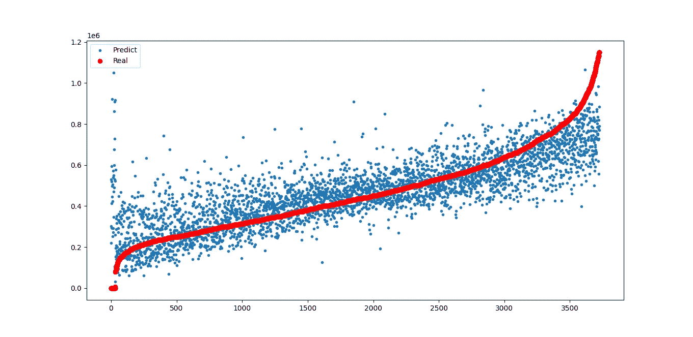

**图 28。**使用岭方法的机器学习模型的可视化

# 验证机器学习模型

```
#Validating The Machine Learning Model
for i in range(5):
    real = y_val.iloc[i]
    pred = int(model_ridge.predict(X_val.iloc[i].to_frame().T)[0])
    print(f'Real Value      ----->>>>> {real} $\n'
          f'Predicted Value ----->>>>> {pred} $')
    print()
```

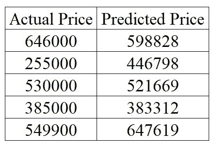

**表 1。**验证机器学习模型的结果

我说的就是这些。如果你对这个项目有任何批评、建议或问题，可以联系我。谢谢你，我真的很感谢你花时间来阅读这一点。