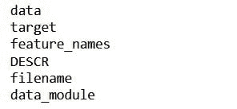
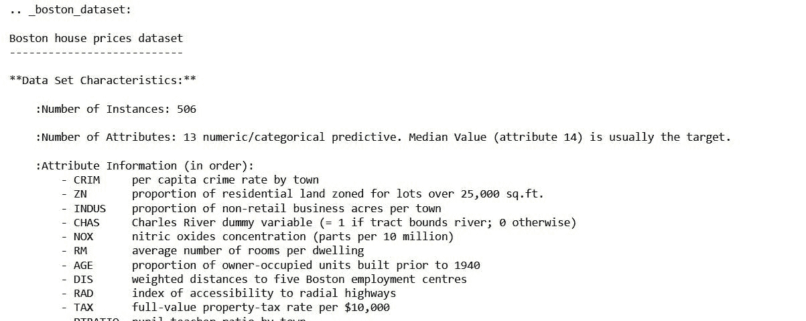
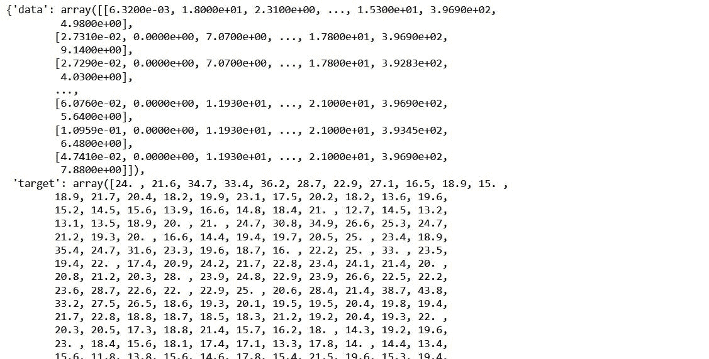
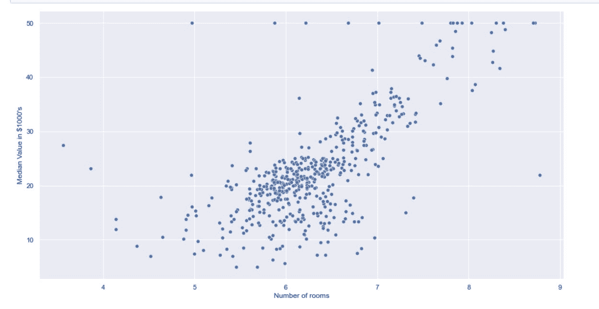
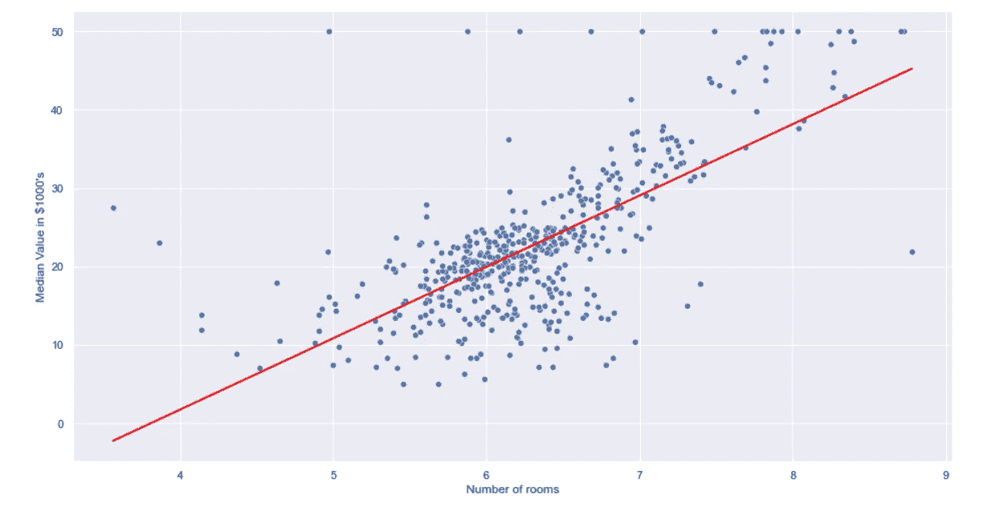
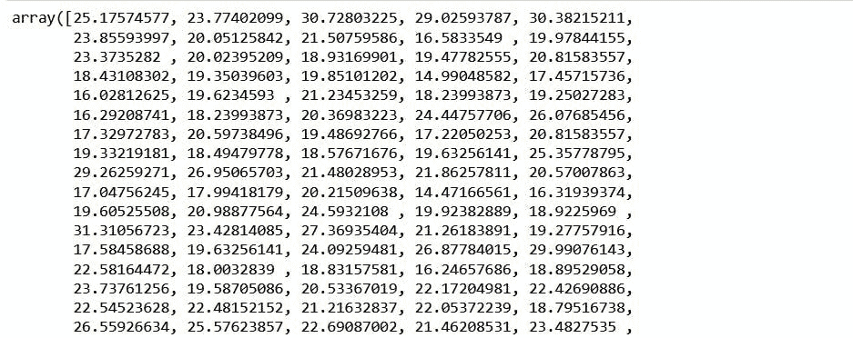
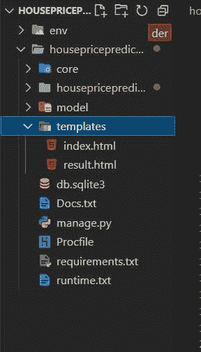
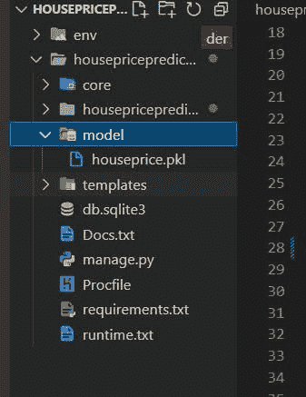
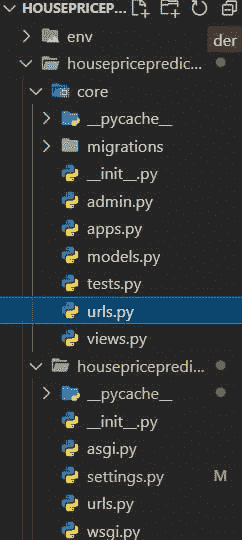

# 用机器学习预测房价

> 原文：<https://blog.devgenius.io/prediction-of-house-price-using-machine-learning-and-host-a-django-website-on-heroku-52d47e0425ca?source=collection_archive---------5----------------------->


在 [Unsplash](https://unsplash.com/?utm_source=Hashnode&utm_medium=referral) 上由 [Kostiantyn Li](https://unsplash.com/@leekos?utm_source=Hashnode&utm_medium=referral) 拍摄

你将学习如何使用机器学习来预测房价，并主持一个 Django 网站。

对于模型，我们将使用 sklearn 的线性回归来创建一个基本模型，我们不会专注于提高模型的准确性，因为这篇文章主要是为了展示一个简单的端到端项目，从构建模型到部署。

该数据集包含由美国人口普查局收集的有关马萨诸塞州波士顿地区住房的信息。它是从 StatLib 档案(【lib.stat.cmu.edu/datasets/boston】T4)中获得的，并在整个文献中被广泛用于基准算法。然而，这些比较主要是在 Delve 之外进行的，因此有些可疑。数据集很小，只有 506 个案例。

该数据最初由 Harrison d .和 Rubin feld d . l .发表于《享乐价格和对清洁空气的需求》，J. Environ。经济学与管理学，第 5 卷，81–102 页，1978 年。

**变量**

在数据集的每个案例中有 14 个属性。它们是:

```
CRIM - per capita crime rate by town

ZN - proportion of residential land zoned for lots over 25,000 sq.ft.

INDUS - proportion of non-retail business acres per town.

CHAS - Charles River dummy variable (1 if tract bounds river; 0 otherwise)

NOX - nitric oxides concentration (parts per 10 million)

RM - average number of rooms per dwelling

AGE - proportion of owner-occupied units built prior to 1940

DIS - weighted distances to five Boston employment centres

RAD - index of accessibility to radial highways

TAX - full-value property-tax rate per $10,000

PTRATIO - pupil-teacher ratio by town

B - 1000(Bk - 0.63)^2 where Bk is the proportion of blacks by town

LSTAT - % lower status of the population

MEDV - Median value of owner-occupied homes in $1000's (TARGET)
```

1.  **型号**

**导入库**

```
import numpy as np 
import matplotlib.pyplot as plt 
import pandas as pd 
from sklearn.linear_model import LinearRegression 
from sklearn.datasets import load_boston
```

**用熊猫加载和清理数据**

```
data = load_boston()
for keys in data:
    print(keys)
```



查看数据集的完整描述

```
print(data.DESCR)
```



为了看到这些数据

```
data
```



将数据转换成 pandas 数据框架，以便我们更容易理解并使用该数据框架进行数据操作

```
df = pd.DataFrame(data.data,columns = data.feature_names)
df.head()
```

来检查我们数据的形状

```
df.shape
```

现在为我们的数据添加目标列

```
df['MEDV'] = data.target
df.head()
```

**EDA**

选择任何特征来探索与目标变量的关系。

```
import seaborn as sns
sns.set(rc={'figure.figsize':(15.7,8.27)})
sns.scatterplot(data = df,x = 'RM',y = 'MEDV')
plt.xlabel("Number of rooms")
plt.ylabel("Median Value in $1000's")
plt.show()
```



**创建模型**

```
model = LinearRegression() model
model
```

**训练我们的模型**

```
model.fit(np.array(df.RM).reshape(-1,1),df.MEDV)

model
```

来看看我们的线性函数的系数

```
model.coef_
```

打印函数的截距

```
model.intercept_
```



**预测**

```
x = np.array([6.25]).reshape(-1,1)

model.predict(x)
```

**检查 MSE**

```
x = np.array(df.RM).reshape(-1,1)

from sklearn.metrics import mean_squared_error

y_pred = model.predict(x)

y_pred
```



```
MSE = mean_squared_error(df.MEDV,y_pred) MSE
```

尝试绘制拟合线

```
sns.set(rc={'figure.figsize':(15.7,8.27)})
sns.scatterplot(data = df,x = 'RM',y = 'MEDV')
plt.plot(x, y_pred,color='red')
plt.xlabel("Number of rooms")
plt.ylabel("Median Value in $1000's")
plt.show()
```

**预测精度**

```
#accuracy score for fitted line 
model.score(df.MEDV,y_pred)
```

使用 pickle 作为 houseprice.pkl 保存模型

```
import joblib

# Save the model as a pickle in a file
joblib.dump(model, 'houseprice.pkl')

# Load the model from the file
model_from_joblib = joblib.load('houseprice.pkl')

# Use the loaded model to make predictions
model_from_joblib.predict(x)
```

**2。网站**

现在我们已经保存了我们的模型，我们可以在我们的网站中使用这个模型来预测房子的价格。我们将使用 Django，简单的 HTML，CSS 和 bootstrap 创建一个简单的网站。

我们需要创建一个虚拟环境，以便我们可以在这个特定的环境中安装和存储软件包。

```
py -3 -m venv env
```

激活环境并安装软件包

```
.\env\Scripts\activatepip install djangopip install sklearnpip install joblib
```

我们将首先使用以下代码在 django 中创建我们的项目。在下文中，我们将项目名称保留为“房价预测”

```
django-admin startproject housepriceprediction
```

cd 到项目目录中

```
cd housepriceprediction
```

现在，在这个项目中，我们将创建一个名为“核心”的应用程序

```
python manage.py startapp core
```

将应用添加到 [settings.py](http://settings.py) 文件的 INSTALLED_APPS 列表中:

```
INSTALLED_APPS = [ 
'django.contrib.admin', 
'django.contrib.auth', 
'django.contrib.contenttypes', 
'django.contrib.sessions', 
'django.contrib.messages', 
'django.contrib.staticfiles', 
'core', 
]
```

**创建模板**

在项目目录(根目录)中创建 templates 文件夹，并创建两个 html 文件:



index.html ':

```
<!DOCTYPE html>
<html lang="en"><head>
    <meta charset="UTF-8">
    <meta http-equiv="X-UA-Compatible" content="IE=edge">
    <meta name="viewport" content="width=device-width, initial-scale=1.0">
    <title>Home</title>
    <link href="https://cdn.jsdelivr.net/npm/bootstrap@5.1.3/dist/css/bootstrap.min.css" rel="stylesheet" integrity="sha384-1BmE4kWBq78iYhFldvKuhfTAU6auU8tT94WrHftjDbrCEXSU1oBoqyl2QvZ6jIW3" crossorigin="anonymous">
</head><body>
    <div class="card text-center" style="padding: 2rem; width: 60%; margin: 20%;background-color: #D9AFD9;
    background-image: linear-gradient(0deg, #D9AFD9 0%, #97D9E1 100%);
    "> <h2 style="font-weight: 700;">Prediction of Boston House Prices</h2> <div class="card-body">
            
            <p>{{ error }}</p>
            
            <form action="" class="rmForm" method="POST">
                
                <label for="rminput">Number of Rooms: </label>
                <input type="text" id="rminput" name="rminput">
                <input type="submit" class="btn btn-primary" value="Predict">
            </form> </div> </div> </body></html>
```

result.html ':

```
<!DOCTYPE html>
<html lang="en"><head>
    <meta charset="UTF-8">
    <meta http-equiv="X-UA-Compatible" content="IE=edge">
    <meta name="viewport" content="width=device-width, initial-scale=1.0">
    <title>Result</title>
    <link href="https://cdn.jsdelivr.net/npm/bootstrap@5.1.3/dist/css/bootstrap.min.css" rel="stylesheet" integrity="sha384-1BmE4kWBq78iYhFldvKuhfTAU6auU8tT94WrHftjDbrCEXSU1oBoqyl2QvZ6jIW3" crossorigin="anonymous"></head><body> <div class="card text-center" style="padding: 22.2%; background-color: #8EC5FC;
    background-image: linear-gradient(62deg, #8EC5FC 0%, #E0C3FC 100%);
    "> <h2 style="font-weight: 800;">Result: ${{result}} thousands</h2> <span><a href="" class="btn">Go back</a></span> </div> </body></html>
```

接下来，通过在模板列表中添加“TEMPLATE_DIR ”,在 [settings.py](http://settings.py) 中添加模板的路径:

```
TEMPLATES = [
    {
        'BACKEND': 'django.template.backends.django.DjangoTemplates',
        'DIRS': [TEMPLATE_DIR],
        'APP_DIRS': True,
        'OPTIONS': {
            'context_processors': [
                'django.template.context_processors.debug',
                'django.template.context_processors.request',
                'django.contrib.auth.context_processors.auth',
                'django.contrib.messages.context_processors.messages',
            ],
        },
    },
]
```

**加载模型并将其用于预测**

如下所示，在项目根文件夹中创建一个“模型”目录，并将您在上述步骤中保存的模型放入该文件夹中:



在' [views.py](http://views.py) '文件中创建视图。在这里，我们使用 joblib 加载我们的模型，然后使用该模型进行预测:

```
from django.shortcuts import render# Create your views here.
import joblib
import numpy as np model_from_joblib = joblib.load('model/houseprice.pkl') def index(request):
    return render(request,'index.html')def predict(request):
    try:
        nosrm = [request.POST.get('rminput')]
        # print(nosrm)
        # print(type(nosrm))                  #get the sentence 
        x = np.array([nosrm], dtype=float).reshape(-1,1)  #convert the number of rooms to float # Use the loaded model to make predictions
        prediction = model_from_joblib.predict(x)
        prediction = format(prediction[0], '.3f')  # format to 3 decimals context = {'result': prediction, 'rooms': x}
    except:
        context = {'error': 'Please enter the number of rooms'}
        return render(request, 'index.html', context) return render(request,'result.html',context)
```

在应用程序目录内，即我们示例中的“核心”文件夹，创建一个名为“ [urls.py](http://urls.py) ”的文件，并粘贴以下代码以创建预测视图的 url:



```
from django.urls import path
from .views import index, predictapp_name = 'core'urlpatterns = [
    path('',index,name='index'),
    path('predict/', predict, name='predict'),
]
```

转到项目目录的' [urls.py](http://urls.py) '文件，并包含我们在核心中创建的 url:

```
from django.contrib import admin
from django.urls import path, includeurlpatterns = [
    path('admin/', admin.site.urls),
    path('', include('core.urls')),
]
```

**部署在 Heroku**

首先安装以下模块

```
pip install gunicornpip install whitenoisepip install dj-database-urlpip install psycopg2
```

将 env 中安装的所有依赖项添加到 requirements.txt 中，

```
pip freeze > requirements.txt
```

创建 Procfile

在 Procfile 中:housepriceprediction 是一个项目名称

```
web: gunicorn housepriceprediction.wsgi —log-file -
```

Make runtime.txt，所有这些文件(requirements.txt、Procfile 和 runtime.txt)应该在根目录中(在 housepriceprediction 中)

runtime.txt:

```
python-3.9.11
```

在[devcenter.heroku.com](https://devcenter.heroku.com/)中检查支持的版本

为了在 heroku 上托管一个网站，我们需要在 heroku 上创建一个帐户，并下载和设置 heroku CLI

做一个 heroku 账户。下载 Heroku CLI iii。配置 Django Heroku:

我们将使用 git 在 heroku 上添加文件

```
git initgit add .git commit -m "First commit"
```

通过输入命令行登录 heroku

```
heroku login
```

创建网站名称

```
heroku create houseppredictionheroku config:set DISABLE_COLLECTSTATIC=1
```

在 [settings.py](http://settings.py) 中:

添加到中间件的 [settings.py](http://settings.py) 文件中

```
DEBUG = False
ALLOWED_HOSTS = ['housepprediction.herokuapp.com', 'localhost', '127.0.0.1'] 

MIDDLEWARE = [
  # 'django.middleware.security.SecurityMiddleware',
  'whitenoise.middleware.WhiteNoiseMiddleware',

]
```

如果用户想要使用 heroku 中的数据库，在 [settings.py](http://settings.py) 中指定以下内容，表示您将使用默认的 heroku 数据库。

heroku 的数据库更新

```
import dj_database_url

db_from_env = dj_database_url.config(conn_max_age=600)
DATABASES['default'].update(db_from_env)
```

使用以下命令在 heroku 上进行迁移(如果我们不想在我们的网站上进行更改或使用数据库，这是不必要的)

```
heroku run python manage.py makemigrationsheroku run python manage.py migrate
```

现在最后把文件推给 heroku

```
git push heroku master
```

从终端打开网站如下，你也可以直接从你的 heroku 帐户仪表板打开。

```
heroku open
```

我们的机器学习项目终于完成了。

如果你想更新你的网站或者改进你的模型，你可以先修改本地文件，然后再推送到 heroku。这将更新 heroku 上的文件，并显示更新的网站。

为此，我们将再次使用 git 来推送我们编辑过的文件:

```
git add .git commit -m "edited "git push heroku master
```

点击这里查看我在 heroku 上的最终结果。

我的 github [链接](https://github.com/Ugyenwangdi/BostonHousePredicton)

*原发布于*[*https://wulfi . hash node . dev*](https://wulfi.hashnode.dev/prediction-of-house-price-using-machine-learning-and-host-a-django-website-on-heroku)*。*