# Python 预测分析:保险业案例研究

> 原文：<https://blog.devgenius.io/predictive-analytics-with-python-case-study-of-the-insurance-industry-6e2938c2e6fd?source=collection_archive---------0----------------------->

**简介**

Python 作为一种编程语言有很多用途，例如 web 开发、人工智能、操作系统、web 和移动应用、游戏开发等。然而，最近，它在人工智能，机器学习和数据分析/分析中的使用是它最受欢迎的地方，可以说。其庞大的库和软件包集合不断被数据分析师和数据科学家用来解决复杂的业务问题，制定数据驱动的策略、风险分析和灾难管理计划等，这些都是跨各种行业的。

来源[https://thesceneclub . co . uk/WP-content/uploads/2018/05/building-insurance-umbrella . jpg](https://thesceneclub.co.uk/wp-content/uploads/2018/05/building-insurance-umbrella.jpg)

我们将探索它的一个普遍用途；保险行业的预测分析，使用虚构的公司数据作为案例研究。此外，保险业由以保险合同形式提供风险管理的公司组成。公司的类别可以从事故和健康保险，财产和意外保险，或金融担保人。

保险的基本概念是，一方，即保险人(承担风险的一方)，将为不确定的未来事件担保付款。而另一方，即被保险人，向保险人支付较少的保险费(金额),以换取不确定的未来事件。鉴于承担风险是保险公司的主要业务之一，基于数据对保单进行准确的风险分析对其生存至关重要。

# 个案研究

一家名为 Olusola Insurance Company 的保险公司提供建筑保险政策，保护建筑物免受火灾或故意破坏、洪水或风暴造成的损害。

目标

能不能分析一下公司的投保建筑清单，预测一下在建筑的投保期内，哪个建筑会提出索赔？该公司如何利用这一点来计划迫在眉睫的索赔，并采取新的建筑物？

给出的案例解决方案将遵循 CRISP-DM 方法，包括:

1.  商业理解
2.  数据理解
3.  数据准备和分析
4.  数据建模/验证
5.  结果
6.  部署

**商业理解**

案例研究的目标是建立一个预测模型，以确定某一建筑在某一时期是否会有保险索赔。我们将不得不预测在建筑物的保险期内至少有一次索赔的概率。

**数据理解**

提供了一个 CSV 数据集，其中包含关于其投资组合中建筑物的所有必要信息。该数据集被加载到如下所示的数据框中；

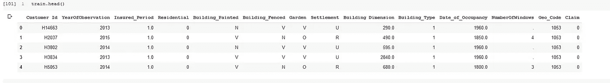

投保建筑数据

**数据准备&分析**

*   数据准备

我们必须确保数据是合适的，并为我们想要使用它的任何分析或模型做好充分准备。让我们快速浏览一下数据摘要，了解一下需要多少预处理。只是作为旁注，一般说'*数据科学家通常在这里花费 70%的项目时间，对数据进行预处理和探索'。*幸运的是，我们选择的数据集并不像众多数据科学项目中通常的那样肮脏。

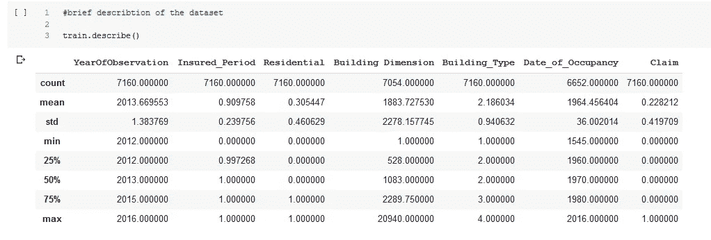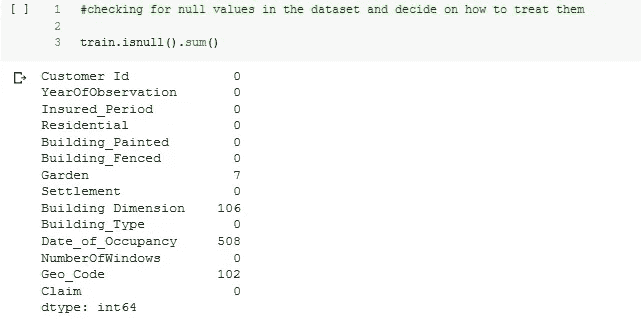

从上面我们可以看到，我们有几列缺少数据。在许多情况下，这些缺失值可能对模型有任何显著影响，也可能没有，因此对它们的处理取决于数据科学家的判断，以及随后的模型性能。然而，在本案例研究中，我们将在绘制模型之前处理空值。

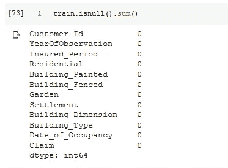

数据描述

正如我们从上面看到的，任何列中都不再有空值(*请查看我的 git 存储库，查看如何处理空值的完整分解*

*   探索性数据分析

EDA 是在数据被清理之后执行的，以获得可能有助于改进我们的模型性能的见解。

*有多少客户提出索赔？*

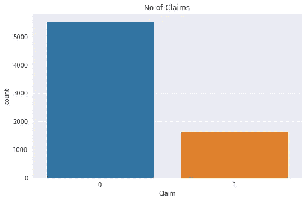

从上面的图表可以看出，提出索赔的客户数量与没有提出索赔的客户数量相比很少。大约不到 2000 名顾客提出索赔。超过 5000 名顾客尚未认领。这通常是保险行业的预期，因为即使是投保人也希望事故减少。然而，通常每份保单都有一个索赔门槛，这可能会让公司感到担忧。

*公司投资组合中建筑类型的分布？*

建筑类型

从上面我们可以看到公司投资组合中的大多数建筑都是*建筑类型 2。*我们还可以看到，非住宅建筑占其投资组合的大部分。

*这些建筑位于哪里？*

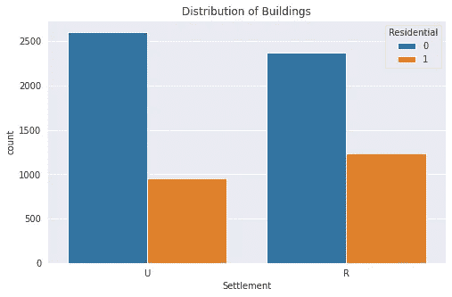

建筑物的位置

如上图所示，虽然距离很近，但与城市相比，Olusola 保险公司在农村地区拥有更多建筑。这两个定居点的大部分建筑都是非住宅建筑，这并不奇怪，因为如以前的图表所示，大部分建筑都是非住宅建筑。

*它的建筑面积有多大？*

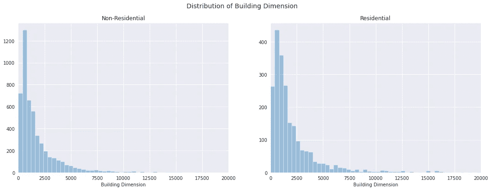

从上面的图表中我们可以看到，住宅和非住宅建筑的大小或面积分布相似，大多数建筑的面积在 0 到 5000 平方米之间。

*哪一年建筑被占领？*

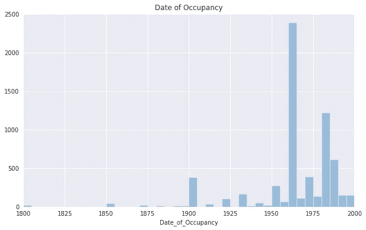

建筑物被占领的年份

上面的图表向我们展示了该公司投资组合中的大多数建筑从 20 世纪 50 年代起就被占用了。值得注意的是，图表显示的是这些建筑首次被占用的时间，而不一定是它们建造的时间。

*保单的观察年份*

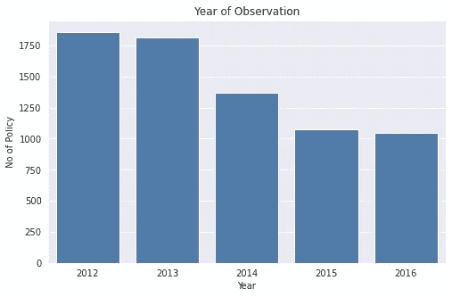

观察到建筑物的年份

从上面的图表中，我们可以清楚地看到，2012 年至 2014 年期间，大多数建筑都接受了政策观察和/或检查，其中 2012 年记录的观察次数最多，略高于第二高的 2013 年。2015 年和 2016 年的记录是 2012 年的一半多一点。

**数据建模**

在这一阶段，我们将使用逻辑回归(机器学习)算法来预测哪栋建筑会提出索赔。这里的第一步将是在进行预测之前(用我们的数据集)训练我们的模型。这里需要重申的是，我们的目标标签(在我们做出预测之后)是使用数据集中所有解释性特征(即所有其他列)的*声明*。在根据数据拟合模型之前，对数据进行必要的特征转换，包括以下内容:

1.  填补缺失信息(如前所述)
2.  分类变量的编码
3.  我们认为删除特征(或列)不会对我们的模型产生影响

建模包括以下阶段:

*   导入所需的必要库

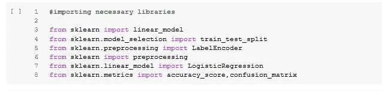

*   编码我们的数据

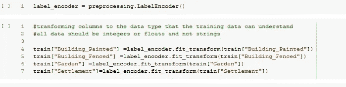

*   将数据集分为训练集和测试集

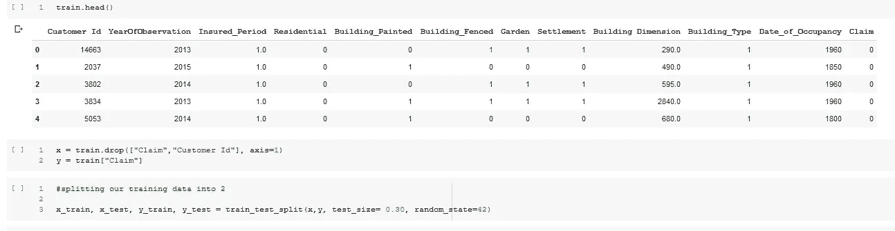

*   执行预测并评估模型性能

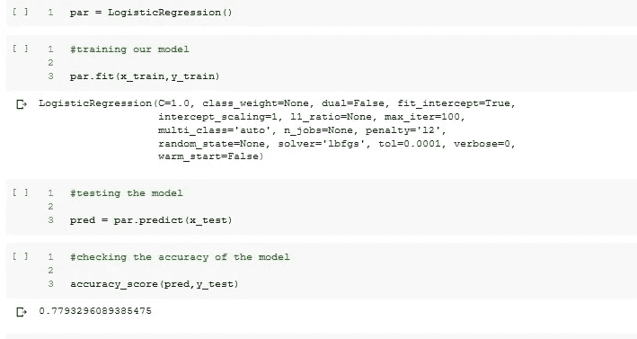

从上图可以看出，我们的模型的性能得分为 78%。该模型的性能是使用混淆矩阵和准确度分数的组合来获得的，这两者都是使用 sklearn 库来实现的。根据每个公司设定的绩效阈值，该绩效分数可能被接受或拒绝。然而，尽管如此，关于机器学习需要注意的一点是，它是一个迭代过程。因此，在许多情况下，第一个模型的性能不是通常被接受或部署的。

在模型性能低于阈值的情况下，以我们的案例研究为例。可以采用一些策略来提高模型性能。这些策略包括但不限于:

1.  要素工程/标准化-在将所有要素放入我们的模型之前，将它们标准化到相同的比例。或者找到不同的方式来设计我们的功能，以影响模型
2.  超参数调整-通过执行网格搜索来调整模型的超参数，可以提高模型的准确性。超参数只是我们在训练模型之前挑选或初始化的参数。
3.  探索更多分类器-
4.  尝试另一种算法-在某些情况下，新算法是获得所需模型性能的答案。对于我们的案例研究，如果任何早期的策略没有给出设计的改进，可以尝试其他类型的分类算法，如支持向量机(SMV)或决策树。

我们将尝试本文第二部分中提到的一些策略。

**部署**

机器学习或数据科学解决方案的部署可以从 web 应用程序、移动应用程序、以数据可视化形式为利益相关者讲述故事，或者为经理或上级提供技术报告，因此部署将取决于如何利用它。

谢谢你们的时间，别忘了鼓掌。

要了解更多关于这个分析的内容，请点击这里查看我的 GitHub [的链接](https://github.com/e-ayeni/Regression_in_Insurance)

您可以在上与我联系；

[领英](https://www.linkedin.com/in/emmanuel-ayeni-49baaab2/)

[推特](https://twitter.com/EmmanuelAyeni5)