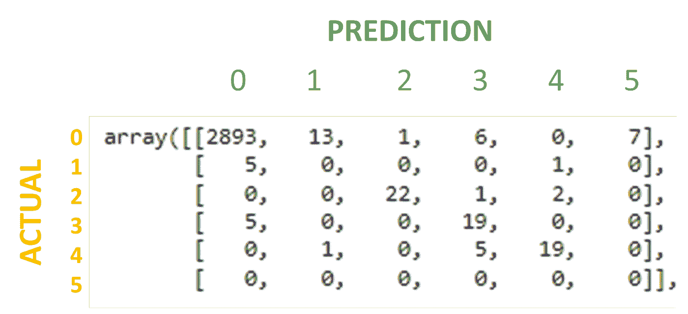
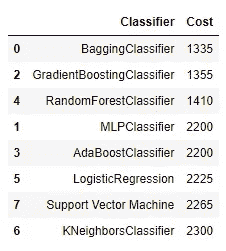

# 预测性维护分类，第二部分—构建您自己的指标

> 原文：<https://blog.devgenius.io/predictive-maintenance-classification-part-ii-building-your-own-metric-803a0981a631?source=collection_archive---------4----------------------->

本文由[阿尔帕斯兰·梅斯里](https://medium.com/u/fe99f0a4a612?source=post_page-----803a0981a631--------------------------------)和[杰姆·özçeli̇k](https://medium.com/u/e7aec74cd6ed?source=post_page-----803a0981a631--------------------------------)撰写。

[https://www . pexels . com/photo/photo-of-an-industrial-factory-emitting-smoke-247763/](https://www.pexels.com/photo/photo-of-an-industrial-factory-emitting-smoke-247763/)

[在我们之前的工作](/data-science-project-predictive-maintenance-classification-part-i-70dcc2c7a516)中，我们使用机器学习来最小化工厂中的生产错误。在研究的最后，我们找到了 7 个不同模型的准确率分数，无论是否会有误差，我们都分享给大家。然而，在现实生活中的问题，我们可能需要更详细的发现。在这种情况下，准确性分数对我们来说是不够的。在这篇文章中，我们已经下降到一个更详细的层。

在本文中，我们自己生成了误差度量。我们认为，在展示机器学习算法如何在实践中为企业做出贡献方面，误差度量适应实际问题的场景也很重要。到目前为止，标准度量一直用于机器学习问题。例如，准确度、精确度、召回率、f1 分数。您可以通过链接获得我们关于指标[的文章。但是，如果我们需要使用我们在业务中创建的这些指标之外的指标呢？也许标准度量并不总是现实生活中问题的最佳选择。如果你准备好了，我们开始吧。](https://alpmesri.medium.com/data-science-machine-learning-models-metrics-26e90cc96349)

首先，我们把问题从二元类分类问题变成了多类问题。因为在现实中，机器错误的类型以及这些错误给企业带来的成本可能大不相同。
其次，考虑到我们假想的业务，我们为每个错误做了一些成本分配。
第三，我们根据我们创建的新指标对模型的成功状态进行排名。

这个问题的目的是，在过去，当生产线出现错误，并且错误发生后，我们停止生产线。现在我们已经更新了工厂的系统。我们在生产线上放置了可以看到实时数据的传感器。我们将这些传感器连接到计算机和数据库，并在计算机上加载了机器学习算法。现在，如果计算机在错误发生前认为有必要，它会主动停线，并会在错误发生前告知将要发生的错误类型。当然，并不是每个估计都是正确的，但目标是使成本最小化。我们将尝试看看人工智能管理下的线使用哪种模型给出最佳结果。
在我们继续讨论代码之前，我们需要给出最后一条信息。在我们开始编码之前，我们应该知道错误类型和这些类型的代价。

## 错误类型

对于所有错误类型，预测和采取行动的成本是固定的，为 5 个单位。除此之外；

电源故障= 45 台
此错误是由电气元件问题引起的。如果事先没有解决，需要机器翻新

刀具磨损故障= 30 个单位
该错误是由机器尖端的不正确插入引起的。由于齿尖破损，我们不得不再次订购新齿尖。

过度应变故障= 20 个单位
它导致机器的一部分断裂或破裂。在这种情况下，有必要在旧机器上安装机器的相关模块。

随机故障= 15 个单位
它指的是 4-5 种不同类型的故障，这些故障是由于机器在一个班中工作过度而发生的。

散热故障= 5 台
由于机器过热，导致生产故障。

首先，我们导入了必要的库。

然后，我们加载数据文件，用 head()命令查看前五行。

我们删除了 df 数据文件中的 UDI 和产品 ID 列，并由 feature engineering 创建了一个名为 nf 的新列。

然后我们创建了一个名为 df_target 的新变量。因为我们希望我们的更改不会影响 df 文件。我们已经将列失败类型(我们将要猜测的列)分配给了一个不同的变量。

然后一些列有字符串值。我们把它们数字化了。

在清理了必要的数据之后，我们将数据分成两部分:训练数据和验证数据。

在本节中，我们创建了上面提到的误差度量。我们在 calculate_cost 函数中定义了这个指标。假设第一部分会有错误，我们定义了采取行动的成本。我们已经定义了不能预测将要发生的错误的单位成本。我们使用混淆矩阵结构计算了我将对第二段中的错误类型采取行动的次数。因此，我们找到了对每个错误采取行动的总成本。在第三段中，我们计算了预测错误的失败次数及其成本。最后，我们通过收集所有这些成本找到了总成本值，并将其返回。

在本节中，我们导入了我们将尝试的每个机器学习算法的库，并调用了我们的 calculate_cost()函数，该函数是我们根据该模型做出的预测在上面定义的。

混淆矩阵输出示例

我们将上面定义的“分类器”变量转换成一个数据框架，并从最少到最多对其进行排序。

根据我们产生的新度量，最成功的模型被视为乞讨分类器。

